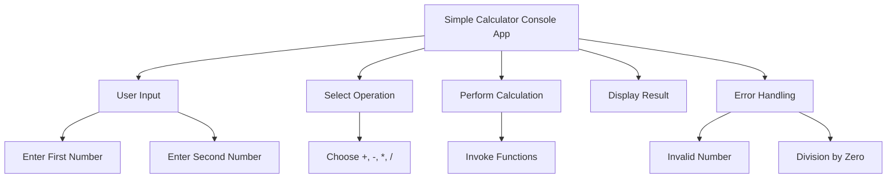

## 3.4.1 Project Overview

In this section, we embark on an exciting journey to build a simple yet functional console-based calculator using Dart. This project serves as a practical application of the foundational concepts covered in the previous sections, such as variables, data types, control flow statements, and functions. By the end of this project, you'll have a deeper understanding of how to structure a Dart program, handle user input and output, and manage basic error scenarios.

### Project Description

The Simple Calculator Console App is designed to perform basic arithmetic operations: addition, subtraction, multiplication, and division. This project is an excellent opportunity to apply your knowledge of Dart programming in a real-world scenario. The calculator will prompt users to enter two numbers and select an operation. It will then display the result of the computation, ensuring that invalid inputs and division by zero are handled gracefully.

### Objectives

The primary objectives of this project are:

- **Apply Dart Basics:** Utilize your understanding of variables, data types, control flow statements, and functions to build a functional application.
- **Program Structuring:** Gain experience in structuring a Dart program effectively, ensuring readability and maintainability.
- **User Input/Output Handling:** Learn how to interact with users through the console, capturing input and displaying output.
- **Error Management:** Implement basic error handling to manage invalid inputs and division by zero scenarios.

### Expected Features

The Simple Calculator Console App will include the following features:

- **User Input:** Prompt the user to enter two numbers. This involves capturing input from the console and converting it to a suitable data type for arithmetic operations.
- **Operation Selection:** Allow the user to select an arithmetic operation (addition, subtraction, multiplication, or division) to perform on the entered numbers.
- **Result Display:** Compute the result of the selected operation and display it to the user.
- **Error Handling:** Implement mechanisms to handle invalid inputs, such as non-numeric entries, and manage division by zero gracefully.

### Project Workflow

To provide a clear understanding of the project's workflow, let's visualize the process using a Mermaid.js diagram:



### Detailed Breakdown

#### User Input

The first step in our calculator app is to capture user input. This involves prompting the user to enter two numbers. In Dart, we can use the `stdin.readLineSync()` method to read input from the console. Here's a simple example:

```dart
import 'dart:io';

void main() {
  print('Enter the first number:');
  String? input1 = stdin.readLineSync();
  double number1 = double.parse(input1!);

  print('Enter the second number:');
  String? input2 = stdin.readLineSync();
  double number2 = double.parse(input2!);
}
```

**Key Points:**

- The `stdin.readLineSync()` method reads a line of text from the console.
- We use `double.parse()` to convert the string input into a double for arithmetic operations.
- Error handling for invalid inputs will be discussed later.

#### Selecting an Operation

Once we have the two numbers, the next step is to allow the user to select an arithmetic operation. We can achieve this using a simple menu system:

```dart
print('Select an operation:');
print('1. Addition (+)');
print('2. Subtraction (-)');
print('3. Multiplication (*)');
print('4. Division (/)');

String? operation = stdin.readLineSync();
```

**Key Points:**

- We present a menu of operations to the user.
- The user's choice is captured as a string, which we will use to determine the operation to perform.

#### Performing the Calculation

With the numbers and operation selected, we can perform the calculation. This involves using control flow statements to determine which operation to execute:

```dart
double result;

switch (operation) {
  case '1':
    result = number1 + number2;
    break;
  case '2':
    result = number1 - number2;
    break;
  case '3':
    result = number1 * number2;
    break;
  case '4':
    if (number2 != 0) {
      result = number1 / number2;
    } else {
      print('Error: Division by zero is not allowed.');
      return;
    }
    break;
  default:
    print('Invalid operation selected.');
    return;
}

print('The result is: $result');
```

**Key Points:**

- We use a `switch` statement to determine the operation based on the user's choice.
- Division by zero is handled explicitly by checking if the second number is zero before performing the division.
- If an invalid operation is selected, an error message is displayed.

#### Error Handling

Error handling is a crucial part of any application. In our calculator app, we need to manage two primary error scenarios: invalid number inputs and division by zero.

- **Invalid Number Input:** We can use a `try-catch` block to handle exceptions that occur when parsing the input:

  ```dart
  try {
    double number1 = double.parse(input1!);
  } catch (e) {
    print('Invalid input. Please enter a valid number.');
    return;
  }
  ```

- **Division by Zero:** As shown in the calculation section, we check if the divisor is zero before performing the division.

### Practical Code Example

Here's the complete code for the Simple Calculator Console App:

```dart
import 'dart:io';

void main() {
  print('Enter the first number:');
  String? input1 = stdin.readLineSync();
  double number1;

  try {
    number1 = double.parse(input1!);
  } catch (e) {
    print('Invalid input. Please enter a valid number.');
    return;
  }

  print('Enter the second number:');
  String? input2 = stdin.readLineSync();
  double number2;

  try {
    number2 = double.parse(input2!);
  } catch (e) {
    print('Invalid input. Please enter a valid number.');
    return;
  }

  print('Select an operation:');
  print('1. Addition (+)');
  print('2. Subtraction (-)');
  print('3. Multiplication (*)');
  print('4. Division (/)');

  String? operation = stdin.readLineSync();
  double result;

  switch (operation) {
    case '1':
      result = number1 + number2;
      break;
    case '2':
      result = number1 - number2;
      break;
    case '3':
      result = number1 * number2;
      break;
    case '4':
      if (number2 != 0) {
        result = number1 / number2;
      } else {
        print('Error: Division by zero is not allowed.');
        return;
      }
      break;
    default:
      print('Invalid operation selected.');
      return;
  }

  print('The result is: $result');
}
```

### Best Practices and Common Pitfalls

- **Input Validation:** Always validate user input to prevent runtime errors and ensure the program behaves as expected.
- **Error Messages:** Provide clear and informative error messages to guide users in correcting their input.
- **Code Readability:** Use meaningful variable names and comments to enhance code readability and maintainability.

### Further Exploration

To deepen your understanding of Dart and console applications, consider exploring the following resources:

- [Dart Language Tour](https://dart.dev/guides/language/language-tour)
- [Dart Packages](https://pub.dev/)
- [Effective Dart: Style](https://dart.dev/guides/language/effective-dart/style)

### Conclusion

The Simple Calculator Console App is a foundational project that consolidates your understanding of Dart basics. By building this application, you gain practical experience in program structuring, user interaction, and error management. As you continue your journey in Flutter development, these skills will serve as a solid foundation for more complex projects.

## Quiz Time!



### What is the primary purpose of the Simple Calculator Console App project?

- [x] To apply Dart basics in a practical scenario
- [ ] To learn advanced Flutter UI design
- [ ] To explore complex data structures
- [ ] To implement machine learning algorithms

> **Explanation:** The project is designed to apply foundational Dart concepts such as variables, data types, and control flow in a practical application.

### Which method is used to read user input from the console in Dart?

- [x] `stdin.readLineSync()`
- [ ] `console.read()`
- [ ] `input.readLine()`
- [ ] `read.input()`

> **Explanation:** `stdin.readLineSync()` is the method used in Dart to read a line of text from the console.

### How does the calculator handle division by zero?

- [x] It checks if the divisor is zero before performing the division
- [ ] It automatically returns zero
- [ ] It throws an exception without handling
- [ ] It skips the operation and continues

> **Explanation:** The calculator explicitly checks if the divisor is zero and displays an error message if so, preventing the division operation.

### What control flow statement is used to determine the operation to perform?

- [x] `switch` statement
- [ ] `if` statement
- [ ] `for` loop
- [ ] `while` loop

> **Explanation:** A `switch` statement is used to select the operation based on the user's input.

### What happens if an invalid operation is selected?

- [x] An error message is displayed
- [ ] The program crashes
- [ ] The first operation is performed by default
- [ ] The program restarts

> **Explanation:** If an invalid operation is selected, the program displays an error message and exits.

### Which Dart function is used to convert a string input to a double?

- [x] `double.parse()`
- [ ] `int.parse()`
- [ ] `string.toDouble()`
- [ ] `convert.toDouble()`

> **Explanation:** `double.parse()` is used to convert a string to a double in Dart.

### What is a common pitfall when handling user input in console applications?

- [x] Not validating input, leading to runtime errors
- [ ] Using too many comments
- [ ] Overusing variables
- [ ] Writing too many functions

> **Explanation:** Not validating user input can lead to runtime errors and unexpected behavior.

### What is the role of error messages in the calculator app?

- [x] To guide users in correcting their input
- [ ] To make the program more complex
- [ ] To reduce the number of functions
- [ ] To increase the execution speed

> **Explanation:** Error messages provide feedback to users, helping them correct their input and understand what went wrong.

### What is the benefit of using meaningful variable names and comments?

- [x] Enhances code readability and maintainability
- [ ] Increases code execution speed
- [ ] Reduces memory usage
- [ ] Decreases the number of lines of code

> **Explanation:** Meaningful variable names and comments make the code easier to read and maintain.

### True or False: The Simple Calculator Console App is designed to handle complex mathematical operations.

- [ ] True
- [x] False

> **Explanation:** The app is designed to handle basic arithmetic operations, not complex mathematical calculations.


