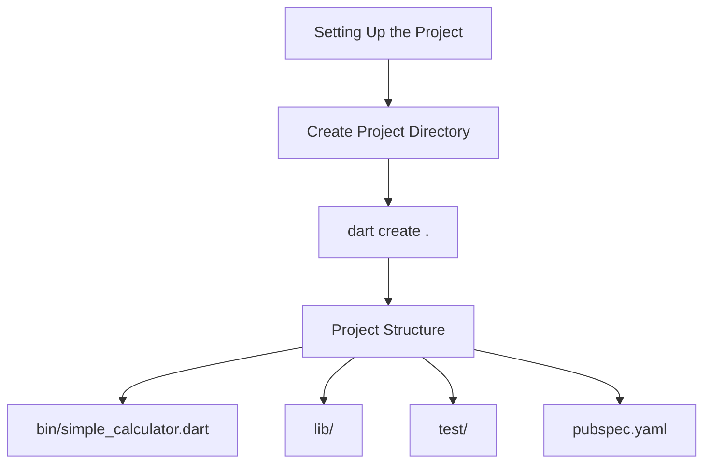

## 3.4.2 Setting Up the Project

In this section, we will guide you through setting up a new Dart project for a simple calculator console application. This hands-on project will help you understand the foundational aspects of Dart programming and prepare you for more complex Flutter applications. We'll cover creating a new Dart project using both the command line and popular Integrated Development Environments (IDEs) like Visual Studio Code and Android Studio/IntelliJ IDEA. Additionally, we'll explore the project structure and provide a visual representation using a Mermaid.js diagram.

### Creating a New Dart Project

Setting up a new Dart project is the first step in building your simple calculator console app. You can create a Dart project using either the command line or an IDE. Both methods are effective, and your choice may depend on your personal preference or the tools you are most comfortable with.

#### Using the Command Line

The command line is a powerful tool for developers, offering flexibility and speed. Here's how you can set up your Dart project using the command line:

1. **Create a Project Directory:**
   Begin by creating a new directory for your project. This directory will contain all the files and folders related to your calculator app.

   ```bash
   mkdir simple_calculator
   cd simple_calculator
   ```

   - `mkdir simple_calculator`: This command creates a new directory named `simple_calculator`.
   - `cd simple_calculator`: This command changes the current directory to `simple_calculator`.

2. **Initialize the Dart Project:**
   Use the Dart command-line tool to create a new Dart project within the directory.

   ```bash
   dart create .
   ```

   - `dart create .`: This command initializes a new Dart project in the current directory. The `.` indicates that the project should be created in the current directory.

#### Using an IDE

Integrated Development Environments (IDEs) provide a graphical interface for managing your projects, making them a popular choice for many developers. Here's how you can set up your Dart project using Visual Studio Code and Android Studio/IntelliJ IDEA.

##### Visual Studio Code

Visual Studio Code is a lightweight and versatile IDE that supports Dart development. Follow these steps to create your project:

1. **Open Visual Studio Code:**
   Launch Visual Studio Code on your computer.

2. **Open the Terminal:**
   Open the integrated terminal in Visual Studio Code by pressing `Ctrl + ` (Windows/Linux) or `Cmd + ` (Mac).

3. **Navigate to the Desired Directory:**
   Use the terminal to navigate to the directory where you want to create your project.

   ```bash
   cd path/to/simple_calculator
   ```

4. **Initialize the Dart Project:**
   Run the following command in the terminal to create a new Dart project.

   ```bash
   dart create .
   ```

##### Android Studio/IntelliJ IDEA

Android Studio and IntelliJ IDEA are robust IDEs that offer extensive support for Dart and Flutter development. Here's how to set up your project:

1. **Create a New Dart Project:**
   Open Android Studio or IntelliJ IDEA and select "Create New Project."

2. **Select the Project Directory:**
   Choose the directory where you want to create your project and initialize it.

3. **Initialize the Dart Project:**
   Follow the prompts to set up a new Dart project, ensuring that the project is initialized correctly.

### Project Structure

Once you've created your Dart project, it's essential to understand its structure. A well-organized project structure makes it easier to manage and develop your application. Here's an example of what your project directory should look like:

```
simple_calculator/
├── bin/
│   └── simple_calculator.dart
├── lib/
├── test/
├── pubspec.yaml
└── README.md
```

- **`bin/`:** This directory contains the main Dart file for your application. In this case, `simple_calculator.dart` will be the entry point of your console app.
- **`lib/`:** This directory is typically used for storing reusable Dart libraries and code that can be shared across different parts of your application.
- **`test/`:** This directory is used for writing and organizing test cases for your application. Testing is crucial for ensuring the reliability and correctness of your code.
- **`pubspec.yaml`:** This file is the configuration file for your Dart project. It specifies dependencies, metadata, and other settings for your application.
- **`README.md`:** This file is used for documenting your project. It's a good practice to include a README file that explains the purpose and usage of your application.

### Visualizing the Setup Process

To help you visualize the setup process, we've included a Mermaid.js diagram that outlines the steps involved in setting up your Dart project.



- **A:** The starting point of setting up your project.
- **B:** Creating the project directory where all files will reside.
- **C:** Initializing the Dart project using the `dart create .` command.
- **D:** The resulting project structure, including key directories and files.

### Best Practices and Tips

- **Consistent Naming Conventions:** Use consistent and meaningful naming conventions for your files and directories. This practice improves readability and maintainability.
- **Version Control:** Consider using a version control system like Git to track changes and collaborate with others. Initialize a Git repository in your project directory with `git init`.
- **Documentation:** Keep your `README.md` file updated with relevant information about your project. This file serves as a guide for others who may use or contribute to your project.
- **Testing:** Regularly write and run tests to ensure your code functions as expected. Place your test files in the `test/` directory and use Dart's built-in testing framework.

### Conclusion

Setting up a new Dart project is a crucial step in developing your simple calculator console app. Whether you choose to use the command line or an IDE, understanding the project structure and following best practices will set a strong foundation for your development journey. As you progress, remember to document your work, write tests, and maintain a clean and organized codebase.

By completing this setup, you're now ready to dive into coding your calculator app. In the next section, we'll explore implementing the calculator functions, where you'll apply your Dart knowledge to build a functional console application.

## Quiz Time!



### What is the purpose of the `bin/` directory in a Dart project?

- [x] It contains the main Dart file for the application.
- [ ] It stores reusable Dart libraries.
- [ ] It is used for writing test cases.
- [ ] It contains configuration files.

> **Explanation:** The `bin/` directory is where the main Dart file, which serves as the entry point of the application, is located.

### Which command is used to create a new Dart project in the current directory using the command line?

- [x] `dart create .`
- [ ] `dart new project`
- [ ] `dart init`
- [ ] `dart setup`

> **Explanation:** The `dart create .` command initializes a new Dart project in the current directory.

### What is the role of the `pubspec.yaml` file in a Dart project?

- [x] It specifies dependencies and project metadata.
- [ ] It contains the main application code.
- [ ] It is used for writing test cases.
- [ ] It stores reusable Dart libraries.

> **Explanation:** The `pubspec.yaml` file is the configuration file that specifies dependencies, metadata, and other settings for the Dart project.

### How can you open the integrated terminal in Visual Studio Code?

- [x] Press `Ctrl + ` (Windows/Linux) or `Cmd + ` (Mac).
- [ ] Press `Alt + T`.
- [ ] Use the `File` menu and select `Open Terminal`.
- [ ] Click on the `Terminal` tab in the sidebar.

> **Explanation:** The integrated terminal in Visual Studio Code can be opened using the shortcut `Ctrl + ` (Windows/Linux) or `Cmd + ` (Mac).

### What is the purpose of the `test/` directory in a Dart project?

- [x] It is used for writing and organizing test cases.
- [ ] It contains the main Dart file for the application.
- [ ] It stores reusable Dart libraries.
- [ ] It contains configuration files.

> **Explanation:** The `test/` directory is designated for writing and organizing test cases to ensure the application's reliability and correctness.

### Which IDE is known for being lightweight and versatile, supporting Dart development?

- [x] Visual Studio Code
- [ ] Android Studio
- [ ] IntelliJ IDEA
- [ ] Eclipse

> **Explanation:** Visual Studio Code is known for being a lightweight and versatile IDE that supports Dart development.

### What is the first step in setting up a new Dart project using the command line?

- [x] Create a project directory using `mkdir`.
- [ ] Initialize the Dart project using `dart create .`.
- [ ] Open the terminal.
- [ ] Write the main Dart file.

> **Explanation:** The first step is to create a project directory using the `mkdir` command, which will contain all the files for the project.

### What is a recommended practice for managing changes and collaboration in a Dart project?

- [x] Use a version control system like Git.
- [ ] Write all code in a single file.
- [ ] Avoid using an IDE.
- [ ] Use only command-line tools.

> **Explanation:** Using a version control system like Git is recommended for tracking changes and collaborating with others in a project.

### Which file is commonly used for documenting a Dart project?

- [x] README.md
- [ ] pubspec.yaml
- [ ] main.dart
- [ ] config.yaml

> **Explanation:** The `README.md` file is commonly used for documenting a Dart project, providing information about its purpose and usage.

### True or False: The `lib/` directory is typically used for storing test cases in a Dart project.

- [ ] True
- [x] False

> **Explanation:** False. The `lib/` directory is typically used for storing reusable Dart libraries and code, not test cases.


