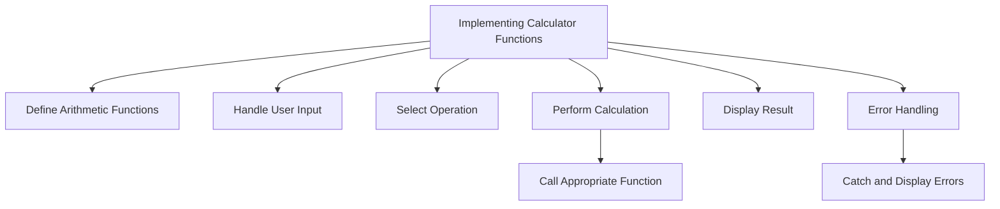

## 3.4.3 Implementing Calculator Functions

In this section, we will delve into the implementation of a simple calculator console application using Dart. This project will help you understand how to define arithmetic functions, handle user input, select operations based on user input, and display results. Additionally, we will cover error handling to ensure robust application behavior.

### Defining Arithmetic Functions

Arithmetic operations form the core of any calculator application. In Dart, we can define functions for each arithmetic operation: addition, subtraction, multiplication, and division. These functions will take two `double` parameters and return a `double` result.

#### Code Example: Arithmetic Functions

```dart
double add(double a, double b) => a + b;
double subtract(double a, double b) => a - b;
double multiply(double a, double b) => a * b;
double divide(double a, double b) {
  if (b == 0) {
    throw ArgumentError('Cannot divide by zero');
  }
  return a / b;
}
```

**Explanation:**

- **Addition (`add`)**: Returns the sum of two numbers.
- **Subtraction (`subtract`)**: Returns the difference between two numbers.
- **Multiplication (`multiply`)**: Returns the product of two numbers.
- **Division (`divide`)**: Checks if the divisor is zero to prevent division by zero errors, then returns the quotient.

### Handling User Input

To perform calculations, we need to capture user input for the numbers and the desired operation. Dart's `stdin.readLineSync()` function allows us to read input from the console.

#### Code Example: Capturing User Input

```dart
import 'dart:io';

void main() {
  print('Enter first number:');
  double num1 = double.parse(stdin.readLineSync()!);
  
  print('Enter second number:');
  double num2 = double.parse(stdin.readLineSync()!);
  
  print('Choose operation (+, -, *, /):');
  String? operation = stdin.readLineSync();
  
  // Perform calculation based on the operation
}
```

**Explanation:**

- **`stdin.readLineSync()`**: Reads a line of input from the console.
- **`double.parse()`**: Converts the input string to a `double`.
- **Null Safety**: The `!` operator is used to assert that the input is non-null.

### Implementing Operation Selection

Once we have the user inputs, we need to determine which arithmetic function to call. This can be achieved using conditional statements or a `switch-case` structure.

#### Code Example: Operation Selection with `switch`

```dart
switch (operation) {
  case '+':
    result = add(num1, num2);
    break;
  case '-':
    result = subtract(num1, num2);
    break;
  case '*':
    result = multiply(num1, num2);
    break;
  case '/':
    try {
      result = divide(num1, num2);
    } catch (e) {
      print(e);
      return;
    }
    break;
  default:
    print('Invalid operation selected.');
    return;
}
```

**Explanation:**

- **`switch-case`**: Evaluates the `operation` and executes the corresponding arithmetic function.
- **Error Handling**: The division operation is enclosed in a `try-catch` block to handle division by zero errors.

### Displaying the Result

After performing the calculation, the result is displayed to the user.

#### Code Example: Displaying the Result

```dart
print('Result: $result');
```

**Explanation:**

- **Output**: The result of the arithmetic operation is printed to the console.

### Complete Function Implementation

Let's combine all the elements to form a cohesive function that performs the entire calculation process.

#### Complete Code Example

```dart
import 'dart:io';

double add(double a, double b) => a + b;
double subtract(double a, double b) => a - b;
double multiply(double a, double b) => a * b;
double divide(double a, double b) {
  if (b == 0) {
    throw ArgumentError('Cannot divide by zero');
  }
  return a / b;
}

void main() {
  try {
    print('Enter first number:');
    double num1 = double.parse(stdin.readLineSync()!);
    
    print('Enter second number:');
    double num2 = double.parse(stdin.readLineSync()!);
    
    print('Choose operation (+, -, *, /):');
    String? operation = stdin.readLineSync();
    
    double result;
    
    switch (operation) {
      case '+':
        result = add(num1, num2);
        break;
      case '-':
        result = subtract(num1, num2);
        break;
      case '*':
        result = multiply(num1, num2);
        break;
      case '/':
        result = divide(num1, num2);
        break;
      default:
        print('Invalid operation selected.');
        return;
    }
    
    print('Result: $result');
  } catch (e) {
    print('Error: ${e.toString()}');
  }
}
```

**Explanation:**

- **Error Handling**: The entire input and calculation process is wrapped in a `try-catch` block to handle any unexpected errors gracefully.
- **User Feedback**: Provides clear messages for invalid operations and errors.

### Visualizing the Process with Mermaid.js

To better understand the flow of our calculator application, let's visualize the process using a Mermaid.js diagram.



**Diagram Explanation:**

- **Define Arithmetic Functions**: The starting point where functions for each operation are defined.
- **Handle User Input**: Captures the numbers and operation from the user.
- **Select Operation**: Determines which arithmetic function to call.
- **Perform Calculation**: Executes the selected function.
- **Display Result**: Outputs the result to the user.
- **Error Handling**: Catches and displays any errors that occur during execution.

### Best Practices and Common Pitfalls

- **Error Handling**: Always handle potential errors, such as division by zero, to prevent application crashes.
- **Input Validation**: Consider adding input validation to ensure that the user enters valid numbers and operations.
- **Code Readability**: Use clear and descriptive function names and comments to enhance code readability and maintainability.

### Further Exploration

- **Official Dart Documentation**: [Dart Language Tour](https://dart.dev/guides/language/language-tour)
- **Open-Source Projects**: Explore GitHub for Dart projects to see how others implement similar functionality.
- **Online Courses**: Consider taking courses on platforms like Udemy or Coursera to deepen your understanding of Dart and Flutter.

### Summary

In this section, we implemented a simple calculator console application in Dart. We defined arithmetic functions, handled user input, selected operations, and displayed results with error handling. This project serves as a foundational exercise in understanding Dart's capabilities and preparing for more complex Flutter applications.

---

## Quiz Time!



### What is the purpose of the `add` function in the calculator app?

- [x] To return the sum of two numbers.
- [ ] To subtract two numbers.
- [ ] To multiply two numbers.
- [ ] To divide two numbers.

> **Explanation:** The `add` function takes two numbers as input and returns their sum.

### How does the `divide` function handle division by zero?

- [x] It throws an `ArgumentError`.
- [ ] It returns zero.
- [ ] It returns `null`.
- [ ] It prints an error message.

> **Explanation:** The `divide` function checks if the divisor is zero and throws an `ArgumentError` to prevent division by zero.

### Which Dart function is used to read user input from the console?

- [x] `stdin.readLineSync()`
- [ ] `print()`
- [ ] `double.parse()`
- [ ] `readInput()`

> **Explanation:** `stdin.readLineSync()` is used to read a line of input from the console in Dart.

### What is the role of the `switch-case` structure in the calculator app?

- [x] To determine which arithmetic function to call based on user input.
- [ ] To handle errors in the application.
- [ ] To display the result to the user.
- [ ] To read user input from the console.

> **Explanation:** The `switch-case` structure evaluates the user's operation input and calls the corresponding arithmetic function.

### What does the `try-catch` block do in the calculator app?

- [x] It handles errors that occur during execution.
- [ ] It performs arithmetic operations.
- [ ] It reads user input.
- [ ] It displays the result.

> **Explanation:** The `try-catch` block is used to catch and handle errors, such as division by zero, during execution.

### Which function is used to convert a string input to a `double`?

- [x] `double.parse()`
- [ ] `int.parse()`
- [ ] `toDouble()`
- [ ] `parseDouble()`

> **Explanation:** `double.parse()` is used to convert a string input to a `double` in Dart.

### What happens if an invalid operation is selected by the user?

- [x] The program prints 'Invalid operation selected.' and returns.
- [ ] The program crashes.
- [ ] The program performs addition by default.
- [ ] The program asks for input again.

> **Explanation:** If an invalid operation is selected, the program prints a message and returns without performing any calculation.

### How can you prevent division by zero in the calculator app?

- [x] By checking if the divisor is zero and throwing an error.
- [ ] By returning zero when the divisor is zero.
- [ ] By ignoring the division operation.
- [ ] By using a different arithmetic function.

> **Explanation:** The `divide` function checks if the divisor is zero and throws an `ArgumentError` to prevent division by zero.

### What is the output of the calculator app if the user inputs 5, 0, and selects division?

- [ ] 0
- [ ] Infinity
- [x] An error message
- [ ] 5

> **Explanation:** The `divide` function will throw an `ArgumentError` because division by zero is not allowed, resulting in an error message.

### True or False: The calculator app can handle multiple operations in a single execution.

- [ ] True
- [x] False

> **Explanation:** The calculator app, as implemented, handles one operation per execution. To perform another operation, the app must be restarted.


