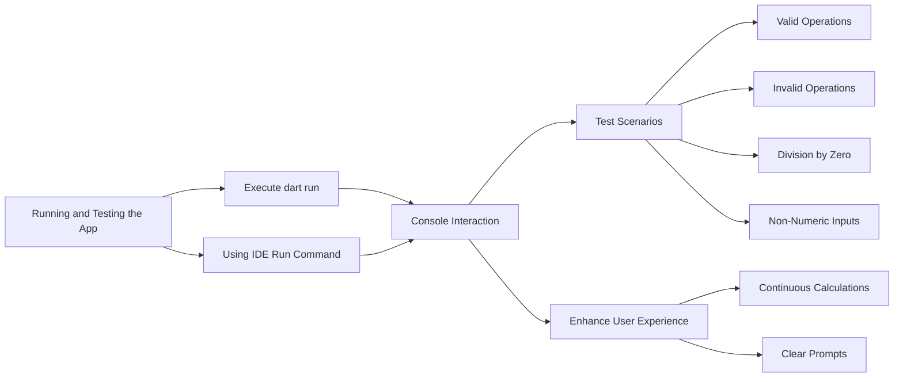

## 3.4.4 Running and Testing the Simple Calculator Console App

In this section, we will explore how to run and test your Simple Calculator Console App, ensuring it functions correctly and provides a smooth user experience. This involves executing the app, interacting with it, testing various scenarios, and enhancing the user experience with continuous calculations and clear prompts.

### Running the Calculator App

Running your Dart application can be done through the command line or an Integrated Development Environment (IDE). Both methods have their advantages, and you can choose based on your preference and setup.

#### Using Command Line

Running your app from the command line is straightforward and allows you to quickly test changes without the overhead of an IDE. Here’s how you can do it:

1. Open your terminal or command prompt.
2. Navigate to the directory containing your Dart project.
3. Execute the following command:

   ```bash
   dart run bin/simple_calculator.dart
   ```

This command compiles and runs your Dart application, allowing you to interact with it directly in the terminal.

#### Using IDE

If you prefer a graphical interface, running your app through an IDE like Visual Studio Code, Android Studio, or IntelliJ IDEA can be more convenient. Here’s how to do it:

- **Visual Studio Code/Android Studio/IntelliJ IDEA:**
  1. Open the `simple_calculator.dart` file in your IDE.
  2. Locate the **Run** button, typically represented by a green triangle, or use the IDE’s run command (often accessible via a menu or keyboard shortcut).
  3. Click the **Run** button to execute the app.

Running the app through an IDE provides additional benefits such as debugging tools, code suggestions, and a more integrated development experience.

### Sample Interaction

Once your app is running, you can interact with it through the console. Here’s an example of what a typical session might look like:

```
Enter first number:
10
Enter second number:
5
Choose operation (+, -, *, /):
/
Result: 2.0
```

This interaction demonstrates the basic functionality of your calculator app, allowing users to perform arithmetic operations and receive immediate feedback.

### Testing Different Scenarios

Testing is a crucial step in ensuring your app handles various inputs and edge cases gracefully. Here are some scenarios to consider:

#### Valid Operations

Test each arithmetic operation with different numbers to ensure accuracy:

- **Addition:** Try adding two positive numbers, a positive and a negative number, and two negative numbers.
- **Subtraction:** Test subtracting smaller numbers from larger ones and vice versa.
- **Multiplication:** Multiply numbers of varying magnitudes.
- **Division:** Divide numbers and verify the result, especially with decimals.

#### Invalid Operations

Input an unsupported operator (e.g., `%`) to test how your app handles unexpected inputs. Ensure it provides a meaningful error message or default behavior.

#### Division by Zero

Attempt to divide a number by zero to ensure your app handles this scenario without crashing. Implement error handling to display an appropriate message.

#### Non-Numeric Inputs

Enter non-numeric values to test input parsing and error catching. Your app should prompt the user to enter valid numbers.

### Enhancing User Experience

Improving the user experience involves making the app more intuitive and user-friendly. Here are some enhancements you can implement:

#### Looping for Continuous Calculations

Allow users to perform multiple calculations without restarting the app. This can be achieved by wrapping the main logic in a loop:

```dart
import 'dart:io';

void main() {
  while (true) {
    // Existing calculator code
    print('Enter first number:');
    double? num1 = double.tryParse(stdin.readLineSync()!);

    print('Enter second number:');
    double? num2 = double.tryParse(stdin.readLineSync()!);

    print('Choose operation (+, -, *, /):');
    String? operation = stdin.readLineSync();

    if (num1 != null && num2 != null && operation != null) {
      double result;
      switch (operation) {
        case '+':
          result = num1 + num2;
          break;
        case '-':
          result = num1 - num2;
          break;
        case '*':
          result = num1 * num2;
          break;
        case '/':
          if (num2 != 0) {
            result = num1 / num2;
          } else {
            print('Error: Division by zero is not allowed.');
            continue;
          }
          break;
        default:
          print('Invalid operation. Please try again.');
          continue;
      }
      print('Result: $result');
    } else {
      print('Invalid input. Please enter numeric values.');
    }

    print('Do you want to perform another calculation? (y/n):');
    String? choice = stdin.readLineSync();
    if (choice == null || choice.toLowerCase() != 'y') {
      print('Goodbye!');
      break;
    }
  }
}
```

This code snippet allows users to continue performing calculations until they choose to exit.

#### Clear Instructions and Prompts

Ensure that prompts are clear and informative to guide user input. For example, specify the expected input format and provide examples where necessary.

### Mermaid.js Diagram

To visualize the process of running and testing your app, consider the following flowchart:



This diagram outlines the steps involved in running and testing your app, from execution to user interaction and testing various scenarios.

### Best Practices and Common Pitfalls

- **Best Practices:**
  - Validate user input to prevent errors and crashes.
  - Provide clear and concise error messages.
  - Use loops to enhance usability by allowing repeated operations.

- **Common Pitfalls:**
  - Failing to handle division by zero can lead to runtime errors.
  - Not validating numeric input can result in unexpected behavior.
  - Overlooking edge cases in arithmetic operations might produce incorrect results.

### References and Further Reading

- [Dart Language Tour](https://dart.dev/guides/language/language-tour): Official documentation for understanding Dart syntax and features.
- [Effective Dart](https://dart.dev/guides/language/effective-dart): Best practices for writing clean and efficient Dart code.
- [Flutter & Dart: The Complete Guide](https://www.udemy.com/course/learn-flutter-dart-to-build-ios-android-apps/): A comprehensive course on Flutter and Dart development.

By following these guidelines and testing thoroughly, you can ensure your Simple Calculator Console App is robust, user-friendly, and ready for real-world use.

## Quiz Time!



### What command is used to run a Dart application from the command line?

- [x] `dart run`
- [ ] `dart execute`
- [ ] `dart compile`
- [ ] `dart start`

> **Explanation:** The `dart run` command is used to execute a Dart application from the command line.

### Which IDEs can be used to run a Dart application?

- [x] Visual Studio Code
- [x] Android Studio
- [x] IntelliJ IDEA
- [ ] Eclipse

> **Explanation:** Visual Studio Code, Android Studio, and IntelliJ IDEA are popular IDEs for running Dart applications. Eclipse is not commonly used for Dart.

### What should be tested to ensure the calculator app handles invalid operations?

- [x] Unsupported operators
- [ ] Only addition
- [ ] Only subtraction
- [ ] Only multiplication

> **Explanation:** Testing unsupported operators ensures the app handles invalid operations gracefully.

### How can you handle division by zero in the calculator app?

- [x] Implement error handling to display a message
- [ ] Ignore the error
- [ ] Allow the app to crash
- [ ] Use a try-catch block without a message

> **Explanation:** Implementing error handling to display a message prevents the app from crashing and informs the user of the issue.

### What is the purpose of looping in the calculator app?

- [x] To allow continuous calculations
- [ ] To stop the app after one calculation
- [ ] To make the app slower
- [ ] To complicate the code

> **Explanation:** Looping allows users to perform multiple calculations without restarting the app.

### What should be included in prompts to enhance user experience?

- [x] Clear instructions
- [ ] Complex language
- [ ] Technical jargon
- [ ] Ambiguous messages

> **Explanation:** Clear instructions guide the user and improve the overall experience.

### Which of the following is a common pitfall in calculator app development?

- [x] Not handling division by zero
- [ ] Providing clear error messages
- [ ] Validating user input
- [ ] Using loops for repeated operations

> **Explanation:** Not handling division by zero can lead to runtime errors and crashes.

### What is the role of the `stdin.readLineSync()` function in the app?

- [x] To read user input from the console
- [ ] To write output to the console
- [ ] To perform calculations
- [ ] To handle errors

> **Explanation:** The `stdin.readLineSync()` function reads user input from the console.

### How can you test non-numeric inputs in the calculator app?

- [x] Enter letters or symbols instead of numbers
- [ ] Only enter numbers
- [ ] Use only the '+' operator
- [ ] Avoid testing non-numeric inputs

> **Explanation:** Entering letters or symbols tests how the app handles non-numeric inputs.

### True or False: The `dart run` command is used to compile Dart code.

- [ ] True
- [x] False

> **Explanation:** The `dart run` command is used to execute Dart code, not compile it.


