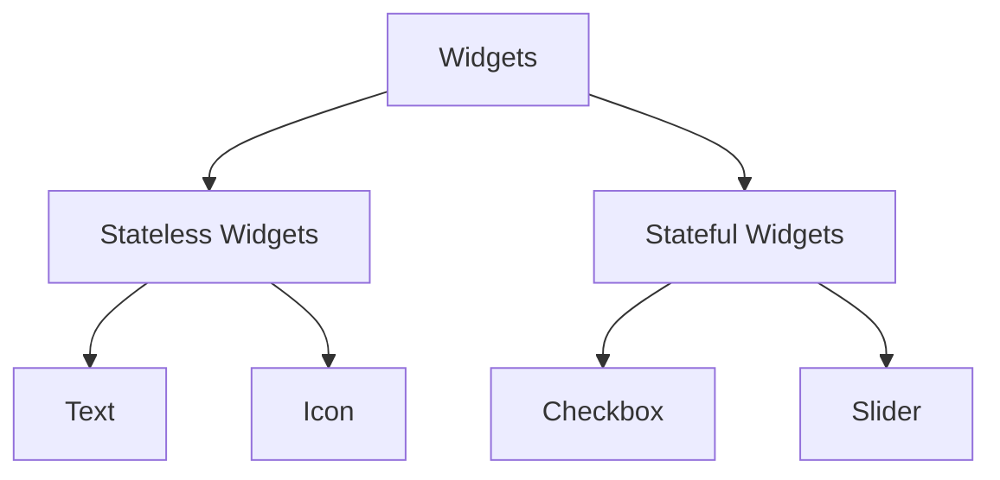

## 4.1.1 What Are Widgets?

In the world of Flutter, widgets are the fundamental building blocks of your application's user interface (UI). Just as a house is constructed from bricks, a Flutter app is built from widgets. Every visual element you interact with on the screen—be it a button, a piece of text, or an image—is a widget. Understanding widgets is crucial for anyone looking to master Flutter development, as they define both the structure and the appearance of your app's UI.

### Definition of Widgets

Widgets in Flutter are the essential components that make up the UI. They are immutable, meaning once a widget is created, its properties cannot change. This immutability is a core concept in Flutter, ensuring that the UI remains consistent and predictable. When you need to change a widget's properties, you create a new widget with the updated properties.

Think of widgets as the Lego blocks of your app. Just as you can build complex structures by combining simple Lego pieces, you can create intricate UIs by composing simple widgets. This modular approach allows developers to build reusable and maintainable code.

### Role of Widgets

Widgets play a dual role in Flutter:

- **Structure**: Widgets define the layout and organization of the UI. They determine how elements are arranged on the screen, how they interact with each other, and how they respond to user input.
  
- **Appearance**: Widgets also define the visual aspects of the UI, such as color, shape, and typography. They control how elements look and feel, ensuring a cohesive and aesthetically pleasing design.

Because widgets are immutable, Flutter uses a reactive framework to update the UI. When the state of an app changes, Flutter rebuilds the widget tree, creating new widgets with the updated properties. This process is efficient and ensures that the UI is always in sync with the app's state.

### Composition Over Inheritance

Flutter embraces the principle of composition over inheritance. Instead of creating complex widgets through deep inheritance hierarchies, Flutter encourages developers to build UIs by composing smaller, reusable widgets. This approach leads to more flexible and maintainable code.

For example, instead of creating a custom button class that inherits from a base button class, you can compose a button using existing widgets like `Text`, `Icon`, and `GestureDetector`. This composition allows you to mix and match widgets to create unique UI elements without the constraints of inheritance.

### Tree Structure

The concept of the **widget tree** is central to Flutter's architecture. Widgets are organized in a hierarchical tree structure, where each widget can have one or more child widgets. This tree structure allows you to nest widgets within each other, creating complex UIs from simple components.

The widget tree starts with a root widget, typically the `MaterialApp` or `CupertinoApp`, which provides the basic structure for the app. From there, you can add widgets to build the UI, with each widget defining its own subtree.

Here's a simple representation of a widget tree:



In this diagram, you can see how widgets are categorized into stateless and stateful widgets, each with their own specific roles and characteristics.

### Basic Widget Examples

To better understand widgets, let's look at some common examples:

- **Text**: Displays a string of text with a specific style.
- **Container**: A versatile widget that can be used for layout, styling, and positioning.
- **Row** and **Column**: Arrange child widgets in horizontal and vertical layouts, respectively.
- **Icon**: Displays a graphical icon from the Material or Cupertino icon sets.

### Code Example: Basic Widget Usage

Let's explore a simple Flutter app that demonstrates the use of basic widgets:

```dart
import 'package:flutter/material.dart';

void main() {
  runApp(MyApp());
}

class MyApp extends StatelessWidget {
  @override
  Widget build(BuildContext context) {
    return MaterialApp(
      home: Scaffold(
        appBar: AppBar(title: Text('Basic Widgets')),
        body: Center(
          child: Column(
            mainAxisAlignment: MainAxisAlignment.center,
            children: <Widget>[
              Text('Hello, Flutter!'),
              Icon(Icons.flutter_dash, size: 50),
            ],
          ),
        ),
      ),
    );
  }
}
```

In this example, we create a simple app with a `Text` widget and an `Icon` widget arranged vertically using a `Column`. The `Center` widget centers the column within the available space, and the `AppBar` provides a title for the app.

### Practical Insights and Best Practices

- **Start Simple**: Begin with basic widgets and gradually build more complex UIs by composing them. This approach helps you understand the fundamental concepts before tackling advanced topics.
  
- **Reuse Widgets**: Create reusable widgets for common UI patterns. This practice reduces code duplication and makes your app easier to maintain.
  
- **Leverage the Widget Tree**: Use the widget tree to organize your UI logically. Group related widgets together and use containers to manage layout and styling.

- **Experiment and Iterate**: Don't be afraid to experiment with different widget combinations. Flutter's hot reload feature allows you to see changes instantly, making it easy to iterate on your designs.

### Conclusion

Widgets are the cornerstone of Flutter development. By understanding their role, structure, and composition, you can create powerful and flexible UIs that enhance the user experience. As you continue your journey with Flutter, remember to embrace the principles of composition, reuse, and experimentation. These practices will help you build robust and maintainable apps that delight users.

For further exploration, consider diving into the official Flutter documentation, exploring open-source projects on GitHub, or enrolling in online courses that offer deeper insights into Flutter development.

## Quiz Time!



### What is the primary role of widgets in Flutter?

- [x] They define both the structure and appearance of the app's UI.
- [ ] They are used only for styling the app.
- [ ] They handle backend logic.
- [ ] They are responsible for network requests.

> **Explanation:** Widgets in Flutter define both the structure and appearance of the app's UI, making them essential for building user interfaces.

### What does it mean that widgets in Flutter are immutable?

- [x] Once created, their properties cannot change.
- [ ] They can be modified at any time.
- [ ] They are stored in a database.
- [ ] They are only used for static content.

> **Explanation:** Widgets are immutable, meaning their properties cannot change once they are created. To update a widget, a new instance must be created.

### What is the advantage of composition over inheritance in Flutter?

- [x] It allows for more flexible and maintainable code.
- [ ] It makes the code run faster.
- [ ] It reduces the number of files in a project.
- [ ] It simplifies network requests.

> **Explanation:** Composition over inheritance allows developers to build flexible and maintainable code by composing smaller, reusable widgets instead of relying on complex inheritance hierarchies.

### What is a widget tree?

- [x] A hierarchical structure where widgets are nested within each other.
- [ ] A list of all widgets in the app.
- [ ] A database of widget properties.
- [ ] A tool for debugging widgets.

> **Explanation:** The widget tree is a hierarchical structure where widgets are nested within each other to form the complete UI of an app.

### Which of the following is a common widget in Flutter?

- [x] Text
- [x] Container
- [ ] Database
- [ ] API

> **Explanation:** Text and Container are common widgets in Flutter used for displaying text and managing layout, respectively.

### How does Flutter update the UI when the state changes?

- [x] It rebuilds the widget tree with new widget instances.
- [ ] It modifies the existing widgets directly.
- [ ] It uses a database to store changes.
- [ ] It sends a network request to update the UI.

> **Explanation:** Flutter updates the UI by rebuilding the widget tree with new widget instances, ensuring the UI is in sync with the app's state.

### What is the purpose of the `Center` widget in the provided code example?

- [x] To center its child widgets within the available space.
- [ ] To change the color of the background.
- [ ] To handle user input.
- [ ] To make network requests.

> **Explanation:** The `Center` widget centers its child widgets within the available space, ensuring they are positioned in the middle of the screen.

### Which widget is used to arrange child widgets vertically?

- [x] Column
- [ ] Row
- [ ] Container
- [ ] Stack

> **Explanation:** The `Column` widget is used to arrange child widgets vertically in Flutter.

### What is the main benefit of using reusable widgets?

- [x] They reduce code duplication and make the app easier to maintain.
- [ ] They increase the app's performance.
- [ ] They simplify network requests.
- [ ] They are only used for styling.

> **Explanation:** Reusable widgets reduce code duplication and make the app easier to maintain by providing common UI patterns that can be used throughout the app.

### True or False: The `Icon` widget can only display icons from the Material icon set.

- [ ] True
- [x] False

> **Explanation:** The `Icon` widget can display icons from both the Material and Cupertino icon sets, providing flexibility in design.


