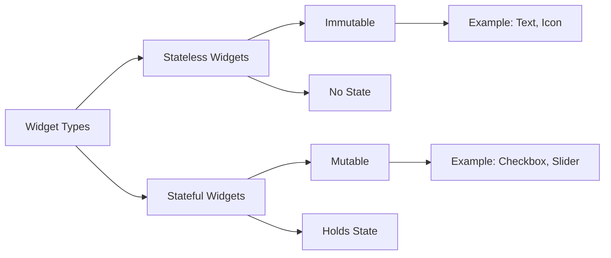

## 4.1.2 Stateless vs. Stateful Widgets

In the world of Flutter, understanding the distinction between stateless and stateful widgets is crucial for building efficient and responsive applications. These two types of widgets form the backbone of Flutter's UI framework, each serving distinct purposes and offering unique capabilities. This section will delve into the characteristics, use cases, and implementation of both stateless and stateful widgets, providing you with the knowledge to make informed decisions in your app development journey.

### Introduction to Widget Types

Flutter categorizes its widgets into two primary types: **stateless** and **stateful**. This classification is based on whether a widget can change its state over time. Understanding these types is essential for creating dynamic and interactive user interfaces.

### Stateless Widgets

#### Definition

Stateless widgets are immutable widgets that do not hold any state. Once they are built, they do not change. They are designed to display static content that does not require any interaction or updates.

#### Characteristics

- **Immutable:** Stateless widgets are immutable, meaning their properties cannot change after they are initialized.
- **Easier to Manage:** Due to their immutability, stateless widgets are simpler to manage and understand.
- **Faster Performance:** They generally offer better performance because they do not require the overhead of managing state changes.

#### Use Cases

Stateless widgets are ideal for displaying static content such as:

- Icons
- Images
- Simple text labels

These widgets are perfect for parts of the UI that do not need to change dynamically based on user interaction or other events.

#### Code Example

Here is a simple example of a stateless widget that displays a greeting message:

```dart
class Greeting extends StatelessWidget {
  final String name;

  Greeting({required this.name});

  @override
  Widget build(BuildContext context) {
    return Text('Hello, $name!');
  }
}
```

In this example, the `Greeting` widget takes a `name` as a parameter and displays a static text message. The widget does not change once it is built, making it a perfect candidate for a stateless widget.

### Stateful Widgets

#### Definition

Stateful widgets, on the other hand, are mutable and can maintain state that might change during the widget’s lifetime. They are designed to handle dynamic content and interactions.

#### Characteristics

- **Mutable:** Stateful widgets can change their state, allowing for dynamic updates to the UI.
- **Require More Resources:** Due to their ability to manage state, they require more resources compared to stateless widgets.
- **Capable of Dynamic Content:** They can handle user interactions and update the UI accordingly.

#### Use Cases

Stateful widgets are suitable for interactive elements such as:

- Forms
- Checkboxes
- Sliders
- Any UI component that updates based on user interaction

These widgets are essential for parts of the UI that need to respond to user input or other changes.

#### Code Example

Here is an example of a stateful widget that implements a simple counter:

```dart
class Counter extends StatefulWidget {
  @override
  _CounterState createState() => _CounterState();
}

class _CounterState extends State<Counter> {
  int _count = 0;

  void _increment() {
    setState(() {
      _count++;
    });
  }

  @override
  Widget build(BuildContext context) {
    return Column(
      mainAxisAlignment: MainAxisAlignment.center,
      children: <Widget>[
        Text('Count: $_count'),
        ElevatedButton(
          onPressed: _increment,
          child: Text('Increment'),
        ),
      ],
    );
  }
}
```

In this example, the `Counter` widget maintains a count that can be incremented by pressing a button. The `setState` method is used to update the UI whenever the count changes.

### Key Differences

Understanding the differences between stateless and stateful widgets is crucial for choosing the right widget type for your needs:

- **Immutability:** Stateless widgets are immutable, while stateful widgets maintain mutable state.
- **Lifecycle:** Stateful widgets have a more complex lifecycle with additional methods like `initState`, `dispose`, and `setState`.
- **Performance:** Stateless widgets are generally more performant due to their immutability.

### Visual Comparison

To better understand the differences between these widget types, let's look at a visual representation:



This diagram illustrates the core characteristics and examples of each widget type, providing a clear visual distinction.

### Practical Implications

When deciding between stateless and stateful widgets, consider the following:

- **Use Stateless Widgets** when your UI does not need to change dynamically. They are simpler to implement and offer better performance.
- **Use Stateful Widgets** when your UI needs to respond to user interactions or other dynamic changes. They provide the flexibility to update the UI as needed.

### Conclusion

Understanding the differences between stateless and stateful widgets is fundamental to building effective Flutter applications. By choosing the appropriate widget type for your needs, you can create efficient, responsive, and interactive user interfaces.

### Further Exploration

For more information on Flutter widgets, consider exploring the following resources:

- [Flutter Documentation on Widgets](https://flutter.dev/docs/development/ui/widgets)
- [Official Flutter Widget Catalog](https://flutter.dev/docs/development/ui/widgets/catalog)
- [Flutter by Example](https://flutterbyexample.com/)

These resources provide additional insights and examples to deepen your understanding of Flutter widgets.

## Quiz Time!



### What is a key characteristic of stateless widgets?

- [x] They are immutable.
- [ ] They maintain state.
- [ ] They require more resources.
- [ ] They are always interactive.

> **Explanation:** Stateless widgets are immutable, meaning their properties cannot change once they are initialized.

### Which widget type is best suited for displaying static content?

- [x] Stateless widgets
- [ ] Stateful widgets
- [ ] Both
- [ ] Neither

> **Explanation:** Stateless widgets are ideal for displaying static content as they do not change once built.

### What method is used to update the UI in a stateful widget?

- [x] setState
- [ ] build
- [ ] initState
- [ ] dispose

> **Explanation:** The `setState` method is used to update the UI in a stateful widget.

### Which of the following is a use case for stateful widgets?

- [x] Interactive forms
- [ ] Static images
- [ ] Simple text labels
- [ ] Icons

> **Explanation:** Stateful widgets are suitable for interactive elements like forms that require dynamic updates.

### What is the main advantage of stateless widgets over stateful widgets?

- [x] Better performance
- [ ] More interactive
- [ ] Easier to update
- [ ] Longer lifecycle

> **Explanation:** Stateless widgets generally offer better performance due to their immutability.

### Which lifecycle method is unique to stateful widgets?

- [x] initState
- [ ] build
- [ ] dispose
- [ ] createState

> **Explanation:** The `initState` method is unique to stateful widgets and is used to initialize state.

### What is the purpose of the `dispose` method in stateful widgets?

- [x] To clean up resources
- [ ] To build the UI
- [ ] To initialize state
- [ ] To update the UI

> **Explanation:** The `dispose` method is used to clean up resources when a stateful widget is removed from the widget tree.

### Which widget type is generally easier to manage?

- [x] Stateless widgets
- [ ] Stateful widgets
- [ ] Both are equally easy
- [ ] Neither

> **Explanation:** Stateless widgets are generally easier to manage due to their simplicity and immutability.

### Can a stateless widget hold state that changes over time?

- [ ] Yes
- [x] No

> **Explanation:** Stateless widgets cannot hold state that changes over time; they are immutable.

### True or False: Stateful widgets are always more performant than stateless widgets.

- [ ] True
- [x] False

> **Explanation:** Stateless widgets are generally more performant than stateful widgets due to their immutability.


