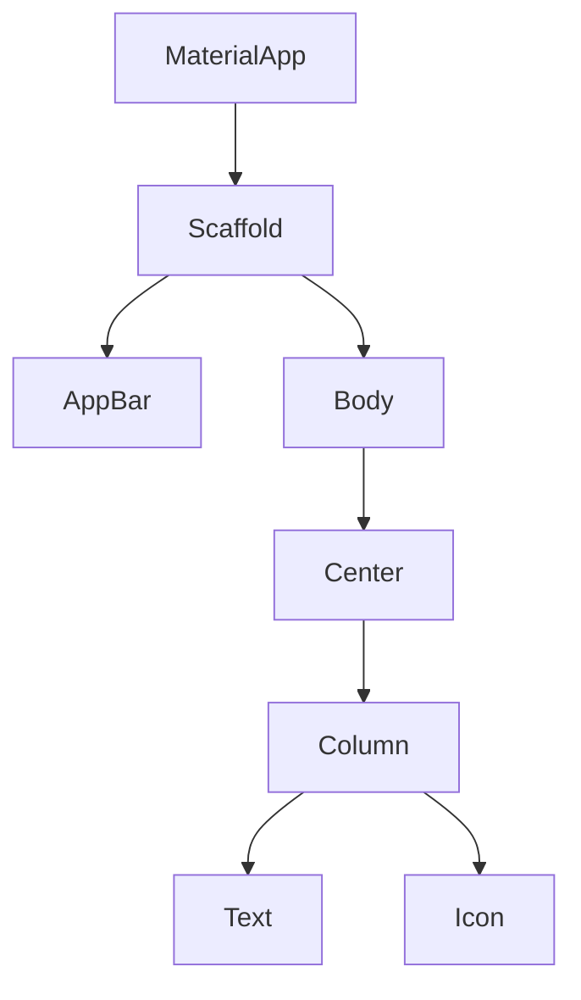
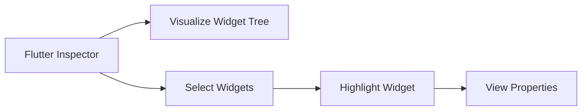

## 4.1.3 Widget Tree Hierarchy

In the world of Flutter development, understanding the widget tree hierarchy is crucial for building efficient and effective user interfaces. This section delves into the concept of the widget tree, exploring parent-child relationships, the distinction between leaf and parent widgets, and the tools available to visualize and manage these hierarchies.

### Introduction to Widget Tree

Flutter's UI is constructed by composing widgets into a **widget tree**. This tree-like structure is fundamental to how Flutter renders and manages the user interface. Each widget in Flutter is a node in this tree, and these nodes are organized in a hierarchical manner. This hierarchy allows developers to build complex UIs by nesting widgets within one another.

The widget tree starts with a root widget, typically a `MaterialApp` or `CupertinoApp`, which serves as the entry point for the application. From there, the tree branches out into various child widgets, each responsible for a portion of the UI.

### Parent-Child Relationships

In a widget tree, widgets have parents and children, establishing a hierarchical structure. This relationship is pivotal because:

- **Parent Widgets**: These are widgets that contain other widgets. They manage the layout and positioning of their child widgets. Examples include `Row`, `Column`, and `Container`.
- **Child Widgets**: These are nested within parent widgets and are often the elements that display content or interact with the user.

Changes in a parent widget can propagate down the tree to affect child widgets. For instance, altering the alignment or padding of a parent widget like `Column` can change how its children are displayed.

### Leaf Widgets vs. Parent Widgets

Understanding the distinction between leaf and parent widgets is essential:

- **Leaf Widgets**: These are widgets that do not have any children. They are the end nodes of the widget tree. Examples include `Text`, `Icon`, and `Image`. Leaf widgets are typically used to display content or perform specific functions without containing other widgets.

- **Parent Widgets**: These are widgets that can contain other widgets, forming branches in the widget tree. They are responsible for layout and can have multiple children. Examples include `Row`, `Column`, and `Stack`.

### Deeply Nested Trees

Complex UIs often involve deeply nested widget trees. This nesting allows for intricate designs and layouts, enabling developers to create sophisticated interfaces. However, deeply nested trees can also lead to performance issues if not managed properly. It's important to balance complexity with performance, using tools like the Flutter Inspector to optimize the widget tree.

### Code Example: Visualizing a Widget Tree

Let's explore a simple widget tree with a practical code example:

```dart
class MyApp extends StatelessWidget {
  @override
  Widget build(BuildContext context) {
    return MaterialApp(
      home: Scaffold(
        appBar: AppBar(title: Text('Widget Tree')),
        body: Center(
          child: Column(
            mainAxisAlignment: MainAxisAlignment.center,
            children: <Widget>[
              Text('Hello, Flutter!'),
              Icon(Icons.flutter_dash, size: 50),
            ],
          ),
        ),
      ),
    );
  }
}
```

**Explanation:**

- `MaterialApp` is the root of the widget tree, providing the basic structure for the app.
- `Scaffold` is a child of `MaterialApp`, offering a framework for implementing the basic material design layout.
- `AppBar` and `body` are children of `Scaffold`, with `AppBar` providing a top navigation bar and `body` containing the main content.
- `Center` is a child of `body`, centering its child widgets within the available space.
- `Column` is a child of `Center`, organizing its children vertically.
- `Text` and `Icon` are children of `Column`, displaying a message and an icon, respectively.

### Visualizing the Widget Tree with Mermaid.js

To better understand the hierarchical relationships, let's visualize the widget tree using a Mermaid.js diagram:



This diagram illustrates how each widget is connected, forming a tree structure that represents the UI.

### Flutter Inspector Tool

The **Flutter Inspector** is an invaluable tool for developers, allowing them to visualize and interact with the widget tree. Available in IDEs like Android Studio and VS Code, the Flutter Inspector provides a graphical representation of the widget hierarchy, making it easier to understand and debug the UI.

#### Usage Instructions:

- **Launch the Flutter Inspector**: Open your IDE and run your Flutter application. Access the Flutter Inspector from the IDE's toolbar or menu.
- **Select and Highlight Widgets**: Use the inspector to select widgets within the running app. This highlights the selected widget in both the inspector and the app, helping you identify its position in the widget tree.
- **View Hierarchical Structure and Properties**: The inspector displays the hierarchical structure of the widget tree, along with properties for each widget. This information is crucial for debugging and optimizing the UI.

### Visualizing the Inspector's Workflow with Mermaid.js

To understand how the Flutter Inspector operates, consider the following Mermaid.js diagram:



This diagram outlines the steps involved in using the Flutter Inspector to interact with the widget tree.

### Best Practices and Common Pitfalls

- **Best Practices**:
  - Keep the widget tree as shallow as possible to enhance performance.
  - Use `const` constructors for widgets that do not change, reducing rebuilds.
  - Leverage the Flutter Inspector to identify and resolve layout issues.

- **Common Pitfalls**:
  - Over-nesting widgets can lead to performance degradation.
  - Failing to use `const` where applicable can result in unnecessary widget rebuilds.
  - Ignoring the widget tree's structure can lead to layout and performance issues.

### Conclusion

Understanding the widget tree hierarchy is fundamental to mastering Flutter development. By comprehending parent-child relationships, distinguishing between leaf and parent widgets, and utilizing tools like the Flutter Inspector, developers can create efficient and effective UIs. As you continue your journey in Flutter development, remember to balance complexity with performance, leveraging the widget tree to build sophisticated and responsive applications.

### Further Reading and Resources

- [Flutter Documentation: Widget Catalog](https://flutter.dev/docs/development/ui/widgets)
- [Flutter Inspector Guide](https://flutter.dev/docs/development/tools/devtools/inspector)
- [Effective Dart: Usage](https://dart.dev/guides/language/effective-dart/usage)

By exploring these resources, you can deepen your understanding of Flutter's widget tree and enhance your development skills.

## Quiz Time!



### What is a widget tree in Flutter?

- [x] A hierarchical structure of widgets that compose the UI.
- [ ] A list of all available widgets in Flutter.
- [ ] A tool for debugging Flutter applications.
- [ ] A method for managing state in Flutter apps.

> **Explanation:** A widget tree is a hierarchical structure where each widget nests within its parent, forming the UI of a Flutter application.

### Which of the following is a leaf widget?

- [x] Text
- [ ] Column
- [ ] Row
- [ ] Container

> **Explanation:** Leaf widgets, like `Text`, do not have any children, unlike parent widgets such as `Column` or `Row`.

### What role does a parent widget play in a widget tree?

- [x] It contains and manages the layout of child widgets.
- [ ] It performs animations in the app.
- [ ] It handles user input directly.
- [ ] It provides network connectivity.

> **Explanation:** Parent widgets contain other widgets and manage their layout and positioning within the UI.

### How can changes in a parent widget affect child widgets?

- [x] Changes in layout or properties of a parent widget can propagate to its children.
- [ ] Child widgets are independent and unaffected by parent changes.
- [ ] Parent widgets cannot affect child widgets.
- [ ] Only color changes in parent widgets affect children.

> **Explanation:** Changes in a parent widget, such as alignment or padding, can affect how child widgets are displayed.

### What tool can be used to visualize and interact with the widget tree?

- [x] Flutter Inspector
- [ ] Dart Analyzer
- [ ] Android Emulator
- [ ] Xcode

> **Explanation:** The Flutter Inspector is a tool within IDEs that allows developers to visualize and interact with the widget tree.

### What is the root widget in a typical Flutter application?

- [x] MaterialApp
- [ ] Scaffold
- [ ] AppBar
- [ ] Center

> **Explanation:** `MaterialApp` is typically the root widget in a Flutter application, providing the basic structure for the app.

### Which widget is responsible for centering its child widgets?

- [x] Center
- [ ] Column
- [ ] Row
- [ ] Container

> **Explanation:** The `Center` widget centers its child widgets within the available space.

### What is a common pitfall when working with widget trees?

- [x] Over-nesting widgets, leading to performance issues.
- [ ] Using too many leaf widgets.
- [ ] Avoiding the use of parent widgets.
- [ ] Not using enough child widgets.

> **Explanation:** Over-nesting widgets can lead to performance degradation, making it a common pitfall in Flutter development.

### How can you optimize widget rebuilds in Flutter?

- [x] Use `const` constructors for widgets that do not change.
- [ ] Avoid using parent widgets.
- [ ] Use only leaf widgets.
- [ ] Rebuild the entire widget tree frequently.

> **Explanation:** Using `const` constructors for immutable widgets reduces unnecessary rebuilds, optimizing performance.

### True or False: The Flutter Inspector can highlight widgets in the running app.

- [x] True
- [ ] False

> **Explanation:** The Flutter Inspector can highlight widgets in the running app, helping developers identify their position in the widget tree.


