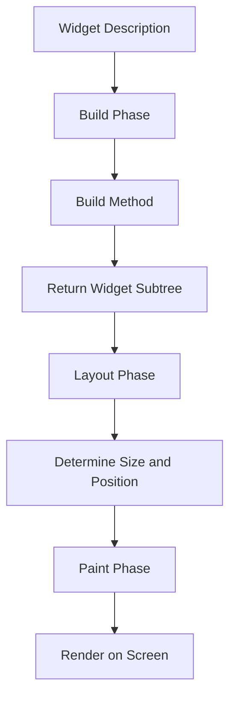
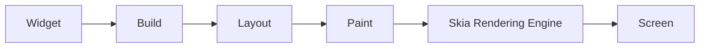

## 4.1.4 Rendering Widgets

In the world of Flutter, widgets are the fundamental building blocks of your app's user interface. However, understanding how these widgets are transformed into the pixels you see on your screen is crucial for creating efficient and high-performance applications. This section delves into the rendering process, explaining how Flutter takes widget descriptions and turns them into visual elements using its powerful rendering engine, Skia.

### Understanding the Rendering Process

Rendering in Flutter is the process by which the framework takes widget descriptions and converts them into pixels on the screen. This transformation is crucial for displaying the user interface as intended. Flutter's rendering engine, Skia, plays a vital role in this process, ensuring that graphics are rendered smoothly and efficiently.

- **Skia Rendering Engine:**
  - Skia is a 2D graphics library that provides the underlying graphics engine for Flutter. It is responsible for rendering all the visual elements on the screen, ensuring high-performance graphics and smooth animations.
  - Skia's capabilities allow Flutter to render at 60 frames per second (fps) or higher, providing a seamless user experience.

### Widget Lifecycle

The lifecycle of a widget in Flutter involves several phases, each contributing to the final rendering on the screen. Understanding these phases helps developers optimize their apps and manage resources effectively.

#### Build Phase

The build phase is where widgets describe their part of the user interface. This is done through the `build()` method, which returns a subtree of widgets.

- **`build()` Method:**
  - Every widget in Flutter has a `build()` method that describes how to display the widget. This method is called whenever the widget needs to be rendered or re-rendered.
  - The `build()` method returns a widget tree, which is a hierarchical structure of widgets that defines the UI.

#### Layout Phase

During the layout phase, widgets determine their size and position based on constraints provided by their parent widgets. This phase ensures that each widget is correctly sized and positioned within the app's UI.

- **Constraints:**
  - Widgets receive constraints from their parent, which dictate the maximum and minimum size they can occupy.
  - Based on these constraints, widgets calculate their size and position themselves accordingly.

#### Paint Phase

Once the layout is complete, the paint phase begins. In this phase, widgets paint themselves on the screen, rendering the visual elements as specified in the widget descriptions.

- **Painting:**
  - Widgets use the `paint()` method to draw themselves on the screen. This method is responsible for rendering the visual aspects of the widget, such as colors, shapes, and text.

### Render Objects

Render objects are the lower-level primitives in Flutter that handle the layout and painting for widgets. They are responsible for the actual rendering process, managing the transformation from widget descriptions to pixels.

- **Difference Between Widgets and Render Objects:**
  - Widgets are immutable descriptions of the UI, defining what should be displayed.
  - Render objects, on the other hand, are mutable and manage the actual rendering, including layout and painting.

### Performance Optimization

Understanding the rendering process is key to optimizing app performance. By minimizing unnecessary rebuilds and repaints, developers can ensure their apps run smoothly and efficiently.

- **Minimizing Rebuilds:**
  - Avoid unnecessary calls to the `build()` method by using `const` constructors and ensuring widgets are only rebuilt when necessary.
- **Reducing Repaints:**
  - Use `RepaintBoundary` to isolate parts of the widget tree that change frequently, reducing the area that needs to be repainted.

### Code Example: Custom Widget Rendering

Here's a simple example of a custom widget rendering a blue box on the screen:

```dart
class CustomBox extends StatelessWidget {
  @override
  Widget build(BuildContext context) {
    return Container(
      width: 100,
      height: 100,
      color: Colors.blue,
    );
  }
}
```

**Explanation:**

- The `CustomBox` widget describes a blue box with a width and height of 100 pixels.
- Flutter's rendering engine processes this description and paints a blue square on the screen.

### Mermaid.js Diagram: Widget Rendering Phases

To better understand the rendering phases, consider the following diagram:



### Flutter Rendering Pipeline Overview

The rendering pipeline in Flutter involves several stages, each contributing to the final display on the screen. Here's a high-level overview:



### Instructions for the Writer

- **Explain the Rendering Process:**
  - Use simple terms to describe the rendering process, ensuring beginners grasp the high-level flow.
  - Emphasize the role of Skia in rendering high-performance graphics.

- **Illustrate with Code Examples:**
  - Use the provided code example to illustrate how widget descriptions translate to on-screen elements.
  - Encourage readers to experiment with the code, modifying properties to see how it affects rendering.

- **Visualize with Diagrams:**
  - Incorporate the Mermaid.js diagrams to visualize the rendering phases and pipeline.
  - Provide clear explanations accompanying each diagram to guide the reader through the visual content.

- **Discuss Performance Considerations:**
  - Highlight strategies for optimizing performance, such as minimizing rebuilds and repaints.
  - Encourage readers to think about efficient widget usage and resource management.

- **Keep Explanations Concise:**
  - Avoid deep technical jargon that might overwhelm beginners.
  - Focus on providing informative yet accessible content that encourages further exploration.

### Conclusion

Understanding the rendering process in Flutter is essential for creating efficient and high-performance applications. By grasping the concepts of widget lifecycles, render objects, and performance optimization, developers can build apps that not only look great but also perform smoothly. As you continue your journey in Flutter development, keep these principles in mind to enhance your app's user experience.

## Quiz Time!



### What is the role of Skia in Flutter's rendering process?

- [x] It is the graphics engine responsible for rendering visual elements.
- [ ] It manages the state of widgets.
- [ ] It handles network requests.
- [ ] It provides animations for widgets.

> **Explanation:** Skia is the 2D graphics engine that renders all visual elements in Flutter, ensuring high-performance graphics.

### During which phase do widgets determine their size and position?

- [ ] Build Phase
- [x] Layout Phase
- [ ] Paint Phase
- [ ] Initialization Phase

> **Explanation:** The layout phase is when widgets determine their size and position based on constraints from their parents.

### What method do widgets use to describe their part of the UI?

- [ ] initState()
- [x] build()
- [ ] dispose()
- [ ] render()

> **Explanation:** The `build()` method is used by widgets to describe their part of the UI by returning a subtree of widgets.

### What is the primary difference between widgets and render objects?

- [x] Widgets are immutable descriptions, while render objects are mutable and manage rendering.
- [ ] Widgets handle network requests, while render objects manage state.
- [ ] Widgets are used for animations, while render objects are for layout.
- [ ] Widgets are mutable, while render objects are immutable.

> **Explanation:** Widgets are immutable descriptions of the UI, whereas render objects are mutable and handle the actual rendering process.

### How can you minimize unnecessary rebuilds in Flutter?

- [x] Use `const` constructors.
- [ ] Avoid using StatelessWidgets.
- [x] Ensure widgets are only rebuilt when necessary.
- [ ] Use more StatefulWidgets.

> **Explanation:** Using `const` constructors and ensuring widgets are only rebuilt when necessary can help minimize unnecessary rebuilds.

### Which phase involves widgets painting themselves on the screen?

- [ ] Build Phase
- [ ] Layout Phase
- [x] Paint Phase
- [ ] Initialization Phase

> **Explanation:** The paint phase is when widgets paint themselves on the screen, rendering the visual elements.

### What is the purpose of the `RepaintBoundary` widget?

- [x] To isolate parts of the widget tree that change frequently, reducing repaints.
- [ ] To manage state changes in widgets.
- [x] To improve performance by reducing the area that needs to be repainted.
- [ ] To handle network requests efficiently.

> **Explanation:** `RepaintBoundary` is used to isolate parts of the widget tree that change frequently, reducing the area that needs to be repainted and improving performance.

### What does the `build()` method return?

- [x] A widget tree
- [ ] A render object
- [ ] A layout constraint
- [ ] A paint object

> **Explanation:** The `build()` method returns a widget tree, which is a hierarchical structure of widgets that defines the UI.

### What is the main advantage of understanding the rendering process in Flutter?

- [x] It helps in optimizing app performance.
- [ ] It simplifies network requests.
- [ ] It enhances animation capabilities.
- [ ] It improves state management.

> **Explanation:** Understanding the rendering process helps in optimizing app performance by minimizing unnecessary rebuilds and repaints.

### True or False: Render objects in Flutter are immutable.

- [ ] True
- [x] False

> **Explanation:** Render objects in Flutter are mutable and manage the actual rendering, including layout and painting.


