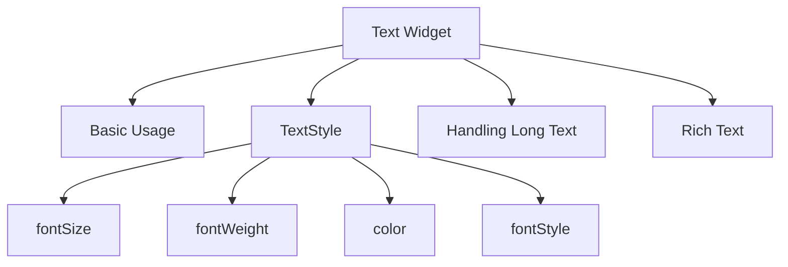

## 4.2.1 Text and TextStyle

In the world of mobile app development, text is a fundamental element of user interfaces. Whether you're displaying a simple label, a paragraph of information, or a complex piece of formatted text, Flutter provides powerful tools to handle text rendering with the `Text` and `TextStyle` widgets. This section will guide you through the essentials of using these widgets, customizing text appearance, handling long text, and implementing rich text styling.

### Introduction to Text Widget

The `Text` widget in Flutter is the primary tool for displaying string data on the screen. It is versatile and can be styled in various ways using the `TextStyle` class. Understanding how to effectively use the `Text` widget is crucial for creating visually appealing and readable user interfaces.

#### Basic Usage of Text Widget

The simplest way to use the `Text` widget is to pass a string to it. This string will be displayed on the screen with default styling.

```dart
Text('Hello, Flutter!');
```

This line of code creates a `Text` widget that displays the string "Hello, Flutter!" using the default text style provided by the Flutter framework.

### Customizing Text with TextStyle

To customize the appearance of text, you can use the `TextStyle` class. This class provides a wide range of properties to modify the look and feel of your text.

#### Properties of TextStyle

- **`fontSize`:** Sets the size of the text.
- **`fontWeight`:** Determines the thickness of the text. Common values include `FontWeight.bold` and `FontWeight.normal`.
- **`color`:** Changes the color of the text.
- **`fontStyle`:** Applies styles such as `FontStyle.italic`.
- **`letterSpacing`:** Adjusts the space between letters.
- **`wordSpacing`:** Modifies the space between words.
- **`decoration`:** Adds decorations like `TextDecoration.underline` or `TextDecoration.lineThrough`.

#### Code Example

Here's an example demonstrating how to apply various `TextStyle` properties to a `Text` widget:

```dart
Text(
  'Styled Text',
  style: TextStyle(
    fontSize: 24,
    fontWeight: FontWeight.bold,
    color: Colors.blue,
    fontStyle: FontStyle.italic,
    letterSpacing: 2.0,
    decoration: TextDecoration.underline,
  ),
);
```

In this example, the text "Styled Text" is displayed with a font size of 24, bold weight, blue color, italic style, increased letter spacing, and an underline decoration.

### Handling Long Text and Wrapping

When dealing with long text, it's essential to manage how it wraps or truncates within its container. The `Text` widget provides properties like `maxLines` and `overflow` to control this behavior.

#### Wrap Text

The `maxLines` property limits the number of lines the text can occupy, while the `overflow` property determines how the text should behave if it exceeds the available space.

```dart
Text(
  'This is a very long text that should wrap into multiple lines within the container.',
  maxLines: 2,
  overflow: TextOverflow.ellipsis,
);
```

In this example, the text is limited to two lines. If it exceeds this limit, it will be truncated with an ellipsis (`...`).

### Rich Text

For more complex text styling, where different parts of the text require different styles, the `RichText` widget is the solution. It allows you to apply multiple styles within a single block of text using `TextSpan`.

#### Code Example

Here's how you can use `RichText` to style parts of a text differently:

```dart
RichText(
  text: TextSpan(
    text: 'Hello ',
    style: DefaultTextStyle.of(context).style,
    children: <TextSpan>[
      TextSpan(text: 'bold', style: TextStyle(fontWeight: FontWeight.bold)),
      TextSpan(text: ' world!'),
    ],
  ),
);
```

In this example, the word "bold" is styled with a bold font weight, while the rest of the text uses the default style.

### Visualizing Text Widget Concepts

To better understand the relationships and components involved in using the `Text` widget, consider the following diagram:



This diagram illustrates the core concepts related to the `Text` widget, including basic usage, styling with `TextStyle`, handling long text, and using `RichText` for complex styling.

### Best Practices and Common Pitfalls

- **Consistency in Styling:** Maintain a consistent style throughout your app to enhance readability and user experience.
- **Performance Considerations:** Avoid excessive use of `RichText` for simple text styling, as it can impact performance.
- **Accessibility:** Ensure that text is legible and accessible by using appropriate font sizes and color contrasts.

### Conclusion

Mastering the `Text` and `TextStyle` widgets in Flutter is essential for creating engaging and user-friendly interfaces. By understanding how to customize text appearance, handle long text, and implement rich text styling, you can enhance the visual appeal and functionality of your apps.

### Further Exploration

For more in-depth information on text styling in Flutter, consider exploring the following resources:

- [Flutter Text Widget Documentation](https://api.flutter.dev/flutter/widgets/Text-class.html)
- [Flutter TextStyle Class Documentation](https://api.flutter.dev/flutter/painting/TextStyle-class.html)
- [Flutter RichText Widget Documentation](https://api.flutter.dev/flutter/widgets/RichText-class.html)

These resources provide comprehensive details and examples to further your understanding of text handling in Flutter.

## Quiz Time!



### What is the primary purpose of the `Text` widget in Flutter?

- [x] To display string data on the screen
- [ ] To handle user input
- [ ] To manage application state
- [ ] To create animations

> **Explanation:** The `Text` widget is used to display string data on the screen, making it a fundamental component for presenting textual information in Flutter apps.

### Which property of `TextStyle` is used to change the color of the text?

- [ ] fontSize
- [ ] fontWeight
- [x] color
- [ ] fontStyle

> **Explanation:** The `color` property of `TextStyle` is used to change the color of the text.

### How can you limit the number of lines a `Text` widget can display?

- [ ] By using the `fontSize` property
- [x] By using the `maxLines` property
- [ ] By using the `fontWeight` property
- [ ] By using the `letterSpacing` property

> **Explanation:** The `maxLines` property is used to limit the number of lines a `Text` widget can display.

### What does the `overflow` property of the `Text` widget control?

- [ ] The font size of the text
- [ ] The color of the text
- [x] How the text behaves when it exceeds the available space
- [ ] The style of the text

> **Explanation:** The `overflow` property controls how the text behaves when it exceeds the available space, such as truncating with an ellipsis.

### Which widget allows you to apply multiple styles within a single block of text?

- [ ] Text
- [ ] TextStyle
- [x] RichText
- [ ] Container

> **Explanation:** The `RichText` widget allows you to apply multiple styles within a single block of text using `TextSpan`.

### What is the default behavior of the `Text` widget when the text is too long to fit in its container?

- [ ] It wraps the text to the next line
- [x] It overflows and gets clipped
- [ ] It automatically shrinks the font size
- [ ] It displays an error

> **Explanation:** By default, the `Text` widget overflows and gets clipped if the text is too long to fit in its container.

### Which `TextStyle` property is used to make text italic?

- [ ] fontSize
- [ ] fontWeight
- [ ] color
- [x] fontStyle

> **Explanation:** The `fontStyle` property is used to make text italic by setting it to `FontStyle.italic`.

### What does the `letterSpacing` property of `TextStyle` control?

- [ ] The color of the text
- [ ] The weight of the text
- [x] The space between letters
- [ ] The decoration of the text

> **Explanation:** The `letterSpacing` property controls the space between letters in the text.

### Can the `Text` widget display styled text without using `TextStyle`?

- [ ] Yes, it can style text without `TextStyle`
- [x] No, `TextStyle` is needed for styling
- [ ] Yes, but only for color changes
- [ ] No, styling is not possible in `Text`

> **Explanation:** The `Text` widget requires `TextStyle` to apply any styling to the text.

### True or False: The `Text` widget can only display plain text without any formatting.

- [ ] True
- [x] False

> **Explanation:** False. The `Text` widget can display formatted text using the `TextStyle` class to apply various styles.


