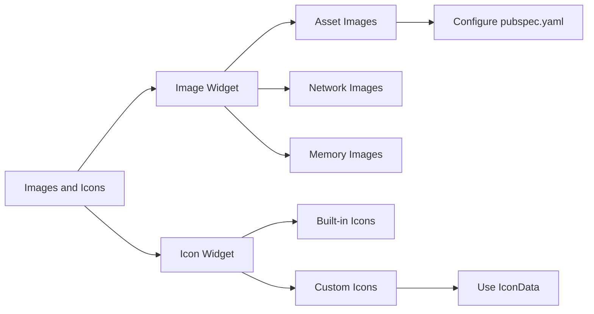

## 4.2.2 Images and Icons

In the world of mobile app development, visual elements play a crucial role in enhancing user experience and engagement. Flutter, with its rich set of widgets, provides powerful tools to incorporate images and icons seamlessly into your applications. This section delves into the `Image` and `Icon` widgets, exploring their capabilities, customization options, and best practices for efficient usage.

### Introduction to Image Widget

The `Image` widget in Flutter is a versatile tool for displaying images in your app. It supports various image sources, including assets, network, and memory, allowing developers to integrate images from different origins effortlessly.

#### Displaying Images

Images can be sourced from different locations, and Flutter provides straightforward methods to handle each case. Let's explore how to display images from assets, the network, and memory.

##### Asset Images

Asset images are static files bundled with your app. These images are stored in the `assets` directory and referenced in the `pubspec.yaml` file. This approach is ideal for images that are integral to your app's design and functionality.

- **Including Images in Assets Directory:**

  To include an image as an asset, place it in the `assets/images` directory of your project. Ensure that the directory structure is organized for easy maintenance.

  **Example Directory Structure:**
  ```
  assets/
    images/
      flutter_logo.png
  ```

- **Referencing Images in `pubspec.yaml`:**

  To make the asset images available to your app, you need to declare them in the `pubspec.yaml` file. This step is crucial for Flutter to recognize and bundle these assets during the build process.

  ```yaml
  flutter:
    assets:
      - assets/images/flutter_logo.png
  ```

- **Displaying Asset Images:**

  Once the assets are configured, you can display them using the `Image.asset` constructor.

  ```dart
  Image.asset('assets/images/flutter_logo.png');
  ```

  This code snippet loads the `flutter_logo.png` image from the assets directory and displays it within your app.

##### Network Images

Network images are fetched from the internet using URLs. This method is suitable for dynamic content that might change or update frequently.

- **Displaying Network Images:**

  To display an image from a URL, use the `Image.network` constructor. This approach requires an active internet connection to fetch and render the image.

  ```dart
  Image.network('https://flutter.dev/assets/homepage/carousel/slide_1-bg-4e2fcef6dfeec1f6a9cc0a33df0a1a7c.jpg');
  ```

  This snippet demonstrates how to load an image directly from a web address, making it ideal for content-driven applications.

##### Memory Images

Memory images are created from raw byte data, allowing for dynamic image generation or manipulation at runtime.

- **Loading Images from Memory:**

  Use the `Image.memory` constructor to display images stored in memory. This method is useful when dealing with image data that is generated or modified programmatically.

  ```dart
  Uint8List bytes = ...; // Byte data of the image
  Image.memory(bytes);
  ```

  This example shows how to render an image from byte data, providing flexibility for advanced image processing tasks.

### Introduction to Icon Widget

Icons are essential for conveying actions, statuses, or categories visually. Flutter's `Icon` widget allows you to display icons from its built-in library or custom icon sets.

- **Basic Usage of Icon Widget:**

  The `Icon` widget is straightforward to use, offering a wide range of built-in icons through the `Icons` class.

  ```dart
  Icon(Icons.flutter_dash, size: 50, color: Colors.blue);
  ```

  This code snippet displays the `flutter_dash` icon with a specified size and color, demonstrating the widget's simplicity and flexibility.

### Customizing Icons

Customization is key to ensuring that icons align with your app's design language. Flutter provides several options for tailoring icons to fit your needs.

#### Size and Color

Adjusting the size and color of icons is a common requirement to match the app's aesthetic.

- **Customizing Icon Size and Color:**

  ```dart
  Icon(
    Icons.favorite,
    size: 40,
    color: Colors.red,
  );
  ```

  This example illustrates how to modify the size and color of an icon, allowing for consistent styling across your app.

#### Using IconData

For custom icons, you can use the `IconData` class to define unique icons from custom fonts or icon sets.

- **Using Custom IconData:**

  ```dart
  Icon(
    IconData(0xe800, fontFamily: 'CustomIcons'),
    size: 30,
  );
  ```

  This snippet shows how to use `IconData` to display a custom icon, providing flexibility for incorporating unique visual elements.

### Handling Image Assets

Efficient management of image assets is crucial for maintaining a scalable and performant app. Here are some best practices for organizing and optimizing your image assets.

#### Organizing Assets

A well-structured asset directory simplifies asset management and enhances project maintainability.

- **Recommended Directory Structure:**

  ```
  assets/
    images/
      flutter_logo.png
      background.jpg
    icons/
      custom_icon.ttf
  ```

  Organizing assets into dedicated directories, such as `images` and `icons`, helps keep your project tidy and manageable.

#### Optimizing Images

Optimizing images is essential for improving app performance and reducing load times.

- **Tips for Image Optimization:**

  - **Reduce File Sizes:** Use tools to compress images without sacrificing quality.
  - **Choose Appropriate Formats:** Select formats like PNG for lossless quality or JPEG for smaller file sizes.
  - **Use Vector Graphics:** Where possible, use vector graphics for scalability and reduced file size.

### Visualizing Concepts with Mermaid.js

To better understand the relationships between images and icons in Flutter, consider the following Mermaid.js diagram:



This diagram visually represents the hierarchy and relationships between different types of images and icons, aiding in conceptual understanding.

### Conclusion

Incorporating images and icons effectively can significantly enhance the visual appeal and usability of your Flutter applications. By understanding the capabilities of the `Image` and `Icon` widgets, you can create visually engaging and responsive interfaces. Remember to organize and optimize your assets for better performance and maintainability.

### Further Reading and Resources

- [Flutter Documentation on Images](https://flutter.dev/docs/development/ui/assets-and-images)
- [Flutter Icons Class Reference](https://api.flutter.dev/flutter/material/Icons-class.html)
- [Image Optimization Tools](https://imageoptim.com/)

By mastering these concepts, you can elevate the visual design of your Flutter apps, creating a more engaging and polished user experience.

## Quiz Time!



### What is the primary purpose of the `Image` widget in Flutter?

- [x] To display images from various sources like assets, network, and memory.
- [ ] To create animations in the app.
- [ ] To handle user input.
- [ ] To manage app navigation.

> **Explanation:** The `Image` widget is used to display images from different sources such as assets, network, and memory, making it versatile for various use cases.

### How do you include an asset image in a Flutter project?

- [x] Place the image in the `assets` directory and reference it in `pubspec.yaml`.
- [ ] Upload the image to a server and use a URL.
- [ ] Encode the image in base64 and use it directly in the code.
- [ ] Store the image in a database and fetch it at runtime.

> **Explanation:** Asset images are included by placing them in the `assets` directory and declaring them in the `pubspec.yaml` file to make them available to the app.

### Which constructor is used to display an image from a URL?

- [x] `Image.network`
- [ ] `Image.asset`
- [ ] `Image.memory`
- [ ] `Image.file`

> **Explanation:** The `Image.network` constructor is used to display images from a URL, fetching them over the internet.

### What is the purpose of the `Icon` widget in Flutter?

- [x] To display icons from Flutter's built-in library or custom icons.
- [ ] To create complex animations.
- [ ] To manage state in the app.
- [ ] To handle network requests.

> **Explanation:** The `Icon` widget is used to display icons, either from Flutter's built-in library or custom icon sets, enhancing the app's visual elements.

### How can you customize the size and color of an icon in Flutter?

- [x] By setting the `size` and `color` properties of the `Icon` widget.
- [ ] By modifying the `pubspec.yaml` file.
- [ ] By using CSS styles.
- [ ] By editing the icon file directly.

> **Explanation:** The `Icon` widget allows customization of size and color through its `size` and `color` properties, enabling consistent styling.

### What is the `IconData` class used for?

- [x] To define custom icons from fonts or icon sets.
- [ ] To store image data in memory.
- [ ] To manage app state.
- [ ] To handle user input events.

> **Explanation:** The `IconData` class is used to define custom icons, allowing developers to use unique icons from custom fonts or icon sets.

### Which of the following is a best practice for organizing image assets?

- [x] Organizing assets into dedicated directories like `images` and `icons`.
- [ ] Storing all assets in the root directory.
- [ ] Using a single directory for all file types.
- [ ] Keeping assets in the same directory as source code.

> **Explanation:** Organizing assets into dedicated directories helps maintain a clean and manageable project structure, improving maintainability.

### What is a key benefit of optimizing images in a Flutter app?

- [x] Improved app performance and reduced load times.
- [ ] Increased app size and complexity.
- [ ] Enhanced security features.
- [ ] Simplified code structure.

> **Explanation:** Optimizing images reduces file sizes and load times, leading to improved app performance and a better user experience.

### Which method is used to display images stored in memory?

- [x] `Image.memory`
- [ ] `Image.asset`
- [ ] `Image.network`
- [ ] `Image.file`

> **Explanation:** The `Image.memory` constructor is used to display images from byte data stored in memory, allowing for dynamic image generation.

### True or False: The `Image` widget can only display images from local assets.

- [ ] True
- [x] False

> **Explanation:** The `Image` widget can display images from various sources, including local assets, network URLs, and memory, making it highly versatile.


