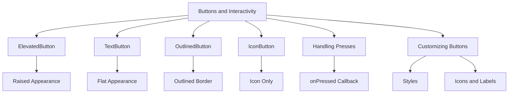

## 4.2.3 Buttons and Interactivity

In the world of mobile app development, buttons play a crucial role in facilitating user interaction. They are the primary means through which users engage with an application, triggering actions and events that drive the app's functionality. In Flutter, buttons are versatile widgets that can be customized to fit various design needs and user experiences. This section delves into the different types of buttons available in Flutter, how to handle interactions, and ways to customize buttons to enhance interactivity.

### Introduction to Buttons

Buttons are interactive widgets that respond to user taps or clicks, triggering actions or events. They are essential components in any user interface, providing a way for users to interact with the app. In Flutter, buttons are highly customizable, allowing developers to create a wide range of interactive experiences.

### Common Button Types

Flutter provides several button types, each suited for different use cases. Understanding these types and their characteristics is crucial for designing effective user interfaces.

#### ElevatedButton

The `ElevatedButton` is a raised button that adds a sense of depth to the UI, making it suitable for prominent actions that require user attention.

**Characteristics:**
- Raised appearance with elevation.
- Ideal for primary actions that need emphasis.

**Code Example:**

```dart
ElevatedButton(
  onPressed: () {
    print('Elevated Button Pressed');
  },
  child: Text('Elevate'),
);
```

In this example, the `ElevatedButton` is configured to print a message to the console when pressed. The button's elevated design makes it stand out, drawing the user's attention to the action it represents.

#### TextButton

The `TextButton` is a flat button with no elevation, making it ideal for less prominent actions where subtlety is preferred.

**Characteristics:**
- Flat appearance with no elevation.
- Suitable for secondary actions.

**Code Example:**

```dart
TextButton(
  onPressed: () {
    print('Text Button Pressed');
  },
  child: Text('Text'),
);
```

Here, the `TextButton` is used for actions that do not require as much emphasis as an `ElevatedButton`. Its flat design integrates seamlessly into the UI without drawing too much attention.

#### OutlinedButton

The `OutlinedButton` features an outlined border, providing a middle ground between the `ElevatedButton` and `TextButton`.

**Characteristics:**
- Outlined border with no fill.
- Useful for actions that require moderate emphasis.

**Code Example:**

```dart
OutlinedButton(
  onPressed: () {
    print('Outlined Button Pressed');
  },
  child: Text('Outlined'),
);
```

The `OutlinedButton` is perfect for actions that need to be visible but not overpowering. Its outlined design provides a clear boundary without the visual weight of a filled button.

#### IconButton

The `IconButton` displays an icon instead of text, making it ideal for toolbar actions or when space is limited.

**Characteristics:**
- Displays an icon instead of text.
- Commonly used in toolbars and action bars.

**Code Example:**

```dart
IconButton(
  icon: Icon(Icons.volume_up),
  onPressed: () {
    print('Icon Button Pressed');
  },
);
```

The `IconButton` is a compact way to represent actions, especially in toolbars or when using icons is more intuitive than text.

### Handling Button Presses

Handling button presses in Flutter involves defining the action to be performed when the button is tapped. This is done using the `onPressed` callback, which is a function that executes when the button is activated.

**Example with Function Call:**

```dart
void handlePress() {
  print('Button was pressed!');
}

ElevatedButton(
  onPressed: handlePress,
  child: Text('Press Me'),
);
```

In this example, the `handlePress` function is called when the `ElevatedButton` is pressed. This approach allows for more complex logic to be encapsulated within a function, making the code cleaner and more maintainable.

### Customizing Buttons

Flutter provides extensive customization options for buttons, allowing developers to tailor their appearance and behavior to fit the app's design and user experience.

#### Styling Buttons

The `style` property is used to customize the appearance of buttons, including their color, padding, and shape.

**Code Example:**

```dart
ElevatedButton(
  onPressed: () {},
  style: ElevatedButton.styleFrom(
    primary: Colors.green, // Background color
    onPrimary: Colors.white, // Text color
    padding: EdgeInsets.symmetric(horizontal: 30, vertical: 15),
  ),
  child: Text('Styled Button'),
);
```

This example demonstrates how to change the background color, text color, and padding of an `ElevatedButton`. Customizing button styles helps maintain consistency with the app's overall design language.

#### Adding Icons to Buttons

Combining text and icons within a button can enhance interactivity and provide additional context for the action.

**Code Example:**

```dart
ElevatedButton.icon(
  onPressed: () {},
  icon: Icon(Icons.send),
  label: Text('Send'),
);
```

The `ElevatedButton.icon` constructor allows for the inclusion of both an icon and a label, making the button more informative and visually appealing.

### Button States

Buttons in Flutter can be enabled or disabled based on the application's state. A button is disabled by setting its `onPressed` property to `null`.

**Enabled vs. Disabled:**

**Code Example:**

```dart
ElevatedButton(
  onPressed: null, // Button is disabled
  child: Text('Disabled'),
);
```

Disabling a button is useful for preventing user interaction when certain conditions are not met, such as form validation or loading states.

### Visualizing Button Types and Customizations

To better understand the relationships between different button types and their customizations, consider the following diagram:



This diagram categorizes the different button types and highlights their unique characteristics and customization options.

### Encouragement to Experiment

Experimenting with button styles and behaviors is an excellent way to understand interactivity in Flutter. Try modifying the examples provided, changing colors, adding icons, or implementing custom logic in the `onPressed` callback. This hands-on approach will deepen your understanding of how buttons work and how they can be tailored to fit your app's needs.

### Best Practices and Common Pitfalls

- **Consistency:** Maintain a consistent button style throughout your app to provide a cohesive user experience.
- **Accessibility:** Ensure buttons are accessible by providing sufficient contrast and using descriptive labels.
- **Feedback:** Provide visual feedback, such as color changes or animations, to indicate button presses.
- **Avoid Overuse:** Use buttons judiciously to prevent overwhelming users with too many options.

### Additional Resources

- [Flutter Official Documentation on Buttons](https://flutter.dev/docs/development/ui/widgets/material#buttons)
- [Material Design Guidelines for Buttons](https://material.io/components/buttons)
- [Flutter Cookbook: Button Recipes](https://flutter.dev/docs/cookbook#buttons)

By understanding and utilizing the various button types and customization options in Flutter, you can create interactive and engaging user interfaces that enhance the overall user experience.

## Quiz Time!



### What is the primary purpose of buttons in a Flutter app?

- [x] To trigger actions or events when tapped
- [ ] To display static information
- [ ] To navigate between screens
- [ ] To store user data

> **Explanation:** Buttons are interactive widgets designed to trigger actions or events when tapped by the user.

### Which button type is best suited for primary actions that need emphasis?

- [x] ElevatedButton
- [ ] TextButton
- [ ] OutlinedButton
- [ ] IconButton

> **Explanation:** The `ElevatedButton` has a raised appearance, making it ideal for primary actions that require emphasis.

### How can you disable a button in Flutter?

- [x] Set the `onPressed` property to `null`
- [ ] Remove the button from the widget tree
- [ ] Set the button's `enabled` property to `false`
- [ ] Use the `disable` method on the button

> **Explanation:** In Flutter, setting the `onPressed` property to `null` disables the button, preventing user interaction.

### What is the purpose of the `onPressed` callback in a button widget?

- [x] To define the action performed when the button is pressed
- [ ] To style the button
- [ ] To set the button's label
- [ ] To animate the button

> **Explanation:** The `onPressed` callback is used to define the action that occurs when the button is pressed.

### Which button type is commonly used in toolbars for actions represented by icons?

- [ ] ElevatedButton
- [ ] TextButton
- [ ] OutlinedButton
- [x] IconButton

> **Explanation:** The `IconButton` is commonly used in toolbars for actions that are best represented by icons.

### How can you customize the appearance of a button in Flutter?

- [x] Use the `style` property
- [ ] Change the button's `type` property
- [ ] Modify the button's `theme` property
- [ ] Use the `appearance` property

> **Explanation:** The `style` property allows you to customize the appearance of a button, including its color, padding, and shape.

### What is the benefit of combining text and icons in a button?

- [x] It enhances interactivity and provides additional context
- [ ] It reduces the button's size
- [ ] It simplifies the button's design
- [ ] It makes the button less noticeable

> **Explanation:** Combining text and icons in a button enhances interactivity and provides additional context for the action.

### Which button type features an outlined border and no fill?

- [ ] ElevatedButton
- [ ] TextButton
- [x] OutlinedButton
- [ ] IconButton

> **Explanation:** The `OutlinedButton` features an outlined border and no fill, making it suitable for actions that require moderate emphasis.

### What is a common pitfall to avoid when using buttons in a Flutter app?

- [x] Overusing buttons, which can overwhelm users
- [ ] Using too few buttons, which can confuse users
- [ ] Styling buttons inconsistently
- [ ] Placing buttons at the top of the screen

> **Explanation:** Overusing buttons can overwhelm users, so it's important to use them judiciously to maintain a clean and intuitive interface.

### True or False: The `TextButton` is ideal for primary actions that need emphasis.

- [ ] True
- [x] False

> **Explanation:** The `TextButton` is a flat button with no elevation, making it more suitable for secondary actions rather than primary actions that need emphasis.


