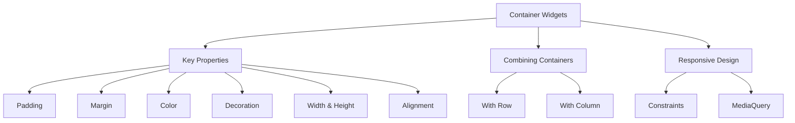

## 4.2.4 Containers and Styling

In the world of Flutter, the `Container` widget stands out as a fundamental building block for creating visually appealing and well-structured user interfaces. Its versatility in layout and styling makes it an indispensable tool for developers. This section delves into the various properties and uses of the `Container` widget, providing you with the knowledge to harness its full potential in your Flutter projects.

### Introduction to Container Widget

The `Container` widget in Flutter is akin to a Swiss Army knife for UI design. It serves as a flexible box model that can hold a single child widget and apply various styling and layout properties to it. Whether you're looking to add padding, set a background color, or create complex layouts, the `Container` widget is your go-to solution.

#### Why Use a Container?

- **Versatility:** The `Container` widget can be used for a wide range of purposes, from simple styling to complex layout management.
- **Customization:** It offers numerous properties that allow you to customize the appearance and behavior of its child widget.
- **Layout Control:** With properties like `padding`, `margin`, `alignment`, and `constraints`, you can control the layout precisely.
- **Styling Options:** The `Container` widget supports advanced styling through its `decoration` property, enabling you to add borders, shadows, and gradients.

### Key Properties of Container

Understanding the key properties of the `Container` widget is crucial for effective UI design. Let's explore these properties with practical examples.

#### Padding

Padding adds space inside the container around its child. This is useful for ensuring that the content within the container does not touch its edges.

```dart
Container(
  padding: EdgeInsets.all(16.0),
  child: Text('Padded Container'),
);
```

In this example, the `EdgeInsets.all(16.0)` adds 16 pixels of padding on all sides of the child widget, creating a buffer between the text and the container's edges.

#### Margin

Margin adds space outside the container, effectively separating it from other widgets. This is useful for spacing out elements in a layout.

```dart
Container(
  margin: EdgeInsets.symmetric(horizontal: 20.0),
  child: Text('Container with Margin'),
);
```

Here, `EdgeInsets.symmetric(horizontal: 20.0)` applies a horizontal margin of 20 pixels on both sides, pushing the container away from neighboring widgets.

#### Color

The `color` property sets the background color of the container. This is one of the simplest ways to style a container.

```dart
Container(
  color: Colors.blueAccent,
  child: Text('Colored Container'),
);
```

This example sets the container's background to a blue accent color, making it stand out visually.

#### Decoration

For more advanced styling, the `decoration` property allows you to apply borders, gradients, shadows, and more.

```dart
Container(
  decoration: BoxDecoration(
    color: Colors.white,
    border: Border.all(color: Colors.blue, width: 2.0),
    borderRadius: BorderRadius.circular(10.0),
    boxShadow: [
      BoxShadow(
        color: Colors.grey,
        blurRadius: 5.0,
        offset: Offset(2, 2),
      ),
    ],
  ),
  child: Text('Decorated Container'),
);
```

In this example, the `BoxDecoration` adds a blue border, rounded corners, and a shadow effect, enhancing the container's visual appeal.

#### Width and Height

The `width` and `height` properties specify the size of the container. These properties are essential for controlling the dimensions of your UI elements.

```dart
Container(
  width: 200,
  height: 100,
  color: Colors.green,
  child: Text('Sized Container'),
);
```

This container is explicitly set to be 200 pixels wide and 100 pixels tall, with a green background.

#### Alignment

The `alignment` property determines how the child widget is positioned within the container. This is useful for centering or aligning content in specific ways.

```dart
Container(
  width: 200,
  height: 100,
  color: Colors.yellow,
  alignment: Alignment.center,
  child: Text('Centered Text'),
);
```

Here, the text is centered within the container, thanks to the `Alignment.center` property.

### Combining Containers with Other Widgets

The true power of the `Container` widget is realized when combined with other layout widgets like `Row` and `Column`. This allows you to create complex and responsive UI structures.

#### Code Example: Using Container with Row

```dart
Row(
  mainAxisAlignment: MainAxisAlignment.center,
  children: <Widget>[
    Container(
      width: 50,
      height: 50,
      color: Colors.red,
    ),
    SizedBox(width: 20),
    Container(
      width: 50,
      height: 50,
      color: Colors.blue,
    ),
  ],
);
```

In this example, two containers are placed side by side within a `Row` widget, with a `SizedBox` providing spacing between them. This demonstrates how containers can be used to create structured layouts.

### Responsive Design with Containers

Responsive design is crucial for ensuring that your app looks great on devices of all sizes. The `Container` widget can adapt to different screen sizes using properties like `constraints` and `MediaQuery`.

#### Code Example: Responsive Container

```dart
Container(
  width: MediaQuery.of(context).size.width * 0.8,
  height: 100,
  color: Colors.purple,
  child: Center(child: Text('Responsive Container')),
);
```

This container's width is set to 80% of the screen's width, making it responsive to different device sizes. The `MediaQuery` class provides information about the device's screen size, allowing for dynamic adjustments.

### Visualizing Container Properties with Mermaid.js

To better understand the relationships and uses of the `Container` widget's properties, let's visualize them using a Mermaid.js diagram.



This diagram categorizes the different aspects and uses of the `Container` widget, providing a clear overview of its capabilities.

### Encouraging Hands-On Practice

To truly master the `Container` widget, it's essential to experiment with its properties and see the effects in real-time. Here are some exercises to try:

- **Modify Padding and Margin:** Change the padding and margin values in the examples above and observe how the layout changes.
- **Experiment with Decoration:** Try adding different border styles, gradients, and shadows to a container.
- **Create a Responsive Layout:** Use `MediaQuery` to make a container adapt to different screen sizes and orientations.

### Best Practices and Common Pitfalls

- **Avoid Over-Nesting:** While containers are versatile, avoid nesting too many containers within each other, as this can lead to complex and hard-to-maintain code.
- **Use Constraints Wisely:** When setting constraints, ensure they make sense for the layout and do not conflict with other properties.
- **Test on Multiple Devices:** Always test your layouts on various devices to ensure they are truly responsive.

### Further Exploration

For more in-depth knowledge and examples, consider exploring the following resources:

- **Flutter Documentation:** [Container Class](https://api.flutter.dev/flutter/widgets/Container-class.html)
- **Open-Source Projects:** Explore GitHub repositories that use Flutter for real-world applications.
- **Online Courses:** Platforms like Udemy and Coursera offer courses on Flutter development.

By understanding and utilizing the `Container` widget effectively, you can create visually stunning and responsive Flutter applications. Keep experimenting and refining your skills to become a proficient Flutter developer.

## Quiz Time!



### What is the primary purpose of the Container widget in Flutter?

- [x] To provide layout and styling capabilities for a single child widget.
- [ ] To manage state across multiple widgets.
- [ ] To handle user input and gestures.
- [ ] To perform network requests.

> **Explanation:** The `Container` widget is primarily used for layout and styling, allowing you to customize the appearance and positioning of a single child widget.

### Which property of the Container widget adds space inside the container around its child?

- [x] Padding
- [ ] Margin
- [ ] Alignment
- [ ] Decoration

> **Explanation:** The `padding` property adds space inside the container around its child, creating a buffer between the content and the container's edges.

### How can you set a background color for a Container?

- [x] Using the `color` property.
- [ ] Using the `alignment` property.
- [ ] Using the `padding` property.
- [ ] Using the `margin` property.

> **Explanation:** The `color` property of the `Container` widget is used to set its background color.

### What does the `decoration` property of a Container allow you to do?

- [x] Apply borders, gradients, and shadows.
- [ ] Set the width and height.
- [ ] Align the child widget.
- [ ] Add padding inside the container.

> **Explanation:** The `decoration` property allows for advanced styling, including borders, gradients, and shadows.

### Which property would you use to center a child widget within a Container?

- [x] Alignment
- [ ] Padding
- [ ] Margin
- [ ] Color

> **Explanation:** The `alignment` property is used to position the child widget within the container, such as centering it.

### How can you make a Container responsive to different screen sizes?

- [x] By using `MediaQuery` to adjust its width or height.
- [ ] By setting a fixed width and height.
- [ ] By using the `color` property.
- [ ] By nesting it within another container.

> **Explanation:** `MediaQuery` provides information about the device's screen size, allowing you to adjust the container's dimensions dynamically.

### What is a common pitfall when using Containers in Flutter?

- [x] Over-nesting containers, leading to complex code.
- [ ] Using the `color` property.
- [ ] Setting the `alignment` property.
- [ ] Applying padding and margin.

> **Explanation:** Over-nesting containers can make the code complex and hard to maintain. It's important to keep the layout simple and efficient.

### Which of the following is NOT a key property of the Container widget?

- [ ] Padding
- [ ] Margin
- [ ] Color
- [x] GestureDetector

> **Explanation:** `GestureDetector` is not a property of the `Container` widget; it's a separate widget used for detecting gestures.

### What does the `BoxDecoration` class allow you to do?

- [x] Style a container with borders, gradients, and shadows.
- [ ] Align the child widget within the container.
- [ ] Set the width and height of the container.
- [ ] Add padding inside the container.

> **Explanation:** `BoxDecoration` is used to style a container with borders, gradients, shadows, and more.

### True or False: The Container widget can hold multiple child widgets.

- [ ] True
- [x] False

> **Explanation:** The `Container` widget can hold only a single child widget. To hold multiple children, you would use a layout widget like `Column` or `Row`.


