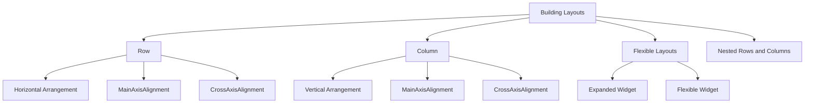

## 4.3.1 Row and Column

In the world of Flutter, building user interfaces is all about arranging widgets in a structured manner. Two of the most fundamental widgets for layout management are `Row` and `Column`. These widgets allow developers to arrange child widgets horizontally and vertically, respectively, providing the backbone for creating complex and responsive UI designs. In this section, we will delve into the intricacies of these widgets, exploring their properties, usage, and how they can be combined to create flexible layouts.

### Introduction to Row and Column

The `Row` and `Column` widgets are essential tools in Flutter's layout arsenal. They enable developers to organize widgets in a linear fashion, either horizontally or vertically. Understanding how to effectively use these widgets is crucial for creating intuitive and visually appealing interfaces.

- **Row**: Arranges child widgets in a horizontal line.
- **Column**: Stacks child widgets vertically.

These widgets are not only simple to use but also highly customizable, allowing for precise control over alignment, spacing, and distribution of child widgets.

### Row Widget

#### Usage

The `Row` widget is used to arrange child widgets side by side in a horizontal line. This is particularly useful when you want to display items like icons, buttons, or text in a single row.

**Code Example:**

```dart
Row(
  mainAxisAlignment: MainAxisAlignment.center,
  children: <Widget>[
    Icon(Icons.star, color: Colors.yellow),
    Icon(Icons.star, color: Colors.yellow),
    Icon(Icons.star, color: Colors.yellow),
  ],
);
```

In this example, three star icons are aligned horizontally in the center of the available space.

#### Properties

- **`mainAxisAlignment`**: Controls the alignment of children along the main axis (horizontal for `Row`). Options include `MainAxisAlignment.start`, `MainAxisAlignment.end`, `MainAxisAlignment.center`, `MainAxisAlignment.spaceBetween`, `MainAxisAlignment.spaceAround`, and `MainAxisAlignment.spaceEvenly`.

- **`crossAxisAlignment`**: Controls the alignment of children along the cross axis (vertical for `Row`). Options include `CrossAxisAlignment.start`, `CrossAxisAlignment.end`, `CrossAxisAlignment.center`, `CrossAxisAlignment.stretch`, and `CrossAxisAlignment.baseline`.

- **`children`**: A list of widgets to be arranged horizontally.

### Column Widget

#### Usage

The `Column` widget stacks child widgets vertically, making it ideal for creating lists, forms, or any vertical arrangement of widgets.

**Code Example:**

```dart
Column(
  mainAxisAlignment: MainAxisAlignment.center,
  children: <Widget>[
    Text('Line 1'),
    Text('Line 2'),
    Text('Line 3'),
  ],
);
```

Here, three lines of text are stacked vertically and centered within the available space.

#### Properties

- **`mainAxisAlignment`**: Controls the alignment of children along the main axis (vertical for `Column`). Similar options as `Row`.

- **`crossAxisAlignment`**: Controls the alignment of children along the cross axis (horizontal for `Column`). Similar options as `Row`.

- **`children`**: A list of widgets to be arranged vertically.

### Flexible Layouts

To create responsive layouts that adapt to different screen sizes, `Row` and `Column` can be combined with `Expanded` and `Flexible` widgets. These widgets allow child widgets to expand and contract based on available space.

**Code Example:**

```dart
Row(
  children: <Widget>[
    Expanded(
      flex: 2,
      child: Container(color: Colors.red, height: 50),
    ),
    Expanded(
      flex: 1,
      child: Container(color: Colors.green, height: 50),
    ),
  ],
);
```

In this example, two containers are placed in a `Row`. The first container takes up twice the space of the second container due to the `flex` property.

### Nested Rows and Columns

For more complex layouts, `Row` and `Column` widgets can be nested within each other. This allows for intricate designs and precise control over the arrangement of widgets.

**Code Example:**

```dart
Column(
  children: <Widget>[
    Row(
      mainAxisAlignment: MainAxisAlignment.spaceEvenly,
      children: <Widget>[
        Icon(Icons.home),
        Icon(Icons.settings),
        Icon(Icons.person),
      ],
    ),
    SizedBox(height: 20),
    Row(
      mainAxisAlignment: MainAxisAlignment.spaceAround,
      children: <Widget>[
        Text('Home'),
        Text('Settings'),
        Text('Profile'),
      ],
    ),
  ],
);
```

In this example, two `Row` widgets are nested within a `Column`, creating a structured layout with icons and text.

### Visualizing Layouts with Mermaid.js

To better understand the relationships and properties of `Row` and `Column`, let's visualize these concepts using a Mermaid.js diagram.



This diagram categorizes the layout concepts, showing how `Row` and `Column` relate to each other and their properties.

### Best Practices and Tips

- **Experiment with Alignment**: Use different `mainAxisAlignment` and `crossAxisAlignment` options to see how they affect the layout.
- **Combine with Other Widgets**: Use `Expanded`, `Flexible`, and `Spacer` to create dynamic and responsive designs.
- **Nested Layouts**: Don't hesitate to nest `Row` and `Column` widgets for more complex layouts, but keep an eye on performance and readability.
- **Consistent Spacing**: Use `SizedBox` or `Padding` to maintain consistent spacing between widgets.

### Common Pitfalls

- **Over-Nesting**: Excessive nesting of `Row` and `Column` can lead to complex and hard-to-maintain code. Aim for simplicity.
- **Misalignment**: Ensure that the alignment properties are set correctly to avoid unexpected widget placement.
- **Ignoring Flex**: Not using `Expanded` or `Flexible` can result in non-responsive layouts that don't adapt well to different screen sizes.

### Further Exploration

- **Official Documentation**: [Flutter Row Documentation](https://api.flutter.dev/flutter/widgets/Row-class.html), [Flutter Column Documentation](https://api.flutter.dev/flutter/widgets/Column-class.html)
- **Open-Source Projects**: Explore GitHub repositories that utilize `Row` and `Column` for real-world applications.
- **Online Courses**: Consider taking courses on platforms like Udemy or Coursera to deepen your understanding of Flutter layouts.

### Conclusion

Mastering the `Row` and `Column` widgets is a fundamental step in becoming proficient with Flutter. These widgets provide the foundation for creating structured, responsive, and visually appealing user interfaces. By understanding their properties and experimenting with different configurations, you can unlock the full potential of Flutter's layout capabilities.

## Quiz Time!



### What is the primary purpose of the `Row` widget in Flutter?

- [x] To arrange child widgets horizontally
- [ ] To arrange child widgets vertically
- [ ] To stack widgets on top of each other
- [ ] To create a grid layout

> **Explanation:** The `Row` widget is used to arrange child widgets side by side in a horizontal line.

### Which property of the `Row` widget controls the alignment of children along the horizontal axis?

- [ ] crossAxisAlignment
- [x] mainAxisAlignment
- [ ] alignment
- [ ] axisAlignment

> **Explanation:** The `mainAxisAlignment` property controls the alignment of children along the main axis, which is horizontal for a `Row`.

### How does the `Column` widget arrange its child widgets?

- [ ] Horizontally
- [x] Vertically
- [ ] In a grid
- [ ] In a circle

> **Explanation:** The `Column` widget stacks its child widgets vertically.

### What is the role of the `Expanded` widget in a `Row` or `Column`?

- [ ] To add padding around widgets
- [x] To make a child widget expand to fill available space
- [ ] To align widgets to the center
- [ ] To add a border around widgets

> **Explanation:** The `Expanded` widget allows a child widget to expand and fill the available space within a `Row` or `Column`.

### Which property of the `Column` widget controls the alignment of children along the vertical axis?

- [x] mainAxisAlignment
- [ ] crossAxisAlignment
- [ ] alignment
- [ ] axisAlignment

> **Explanation:** The `mainAxisAlignment` property controls the alignment of children along the main axis, which is vertical for a `Column`.

### What is a common use case for nesting `Row` and `Column` widgets?

- [x] Creating complex layouts with multiple levels of alignment
- [ ] Adding animations to widgets
- [ ] Handling user input
- [ ] Managing state

> **Explanation:** Nesting `Row` and `Column` widgets is useful for creating complex layouts with multiple levels of alignment and organization.

### What is the effect of setting `crossAxisAlignment` to `CrossAxisAlignment.stretch` in a `Row`?

- [x] It stretches the child widgets to fill the vertical space
- [ ] It centers the child widgets horizontally
- [ ] It aligns the child widgets to the start of the row
- [ ] It aligns the child widgets to the end of the row

> **Explanation:** Setting `crossAxisAlignment` to `CrossAxisAlignment.stretch` in a `Row` stretches the child widgets to fill the vertical space.

### What happens if you do not use `Expanded` or `Flexible` in a `Row` with multiple children?

- [ ] The children will overlap
- [x] The children may not fit within the available space
- [ ] The children will be evenly spaced
- [ ] The children will be centered

> **Explanation:** Without `Expanded` or `Flexible`, the children may not fit within the available space, especially if there are many or if they have large dimensions.

### Which of the following is a valid `mainAxisAlignment` option for both `Row` and `Column`?

- [x] MainAxisAlignment.spaceBetween
- [ ] MainAxisAlignment.stretch
- [ ] MainAxisAlignment.baseline
- [ ] MainAxisAlignment.fill

> **Explanation:** `MainAxisAlignment.spaceBetween` is a valid option for both `Row` and `Column`, distributing space evenly between children.

### True or False: The `Row` widget can only contain text widgets.

- [ ] True
- [x] False

> **Explanation:** False. The `Row` widget can contain any type of widgets, not just text widgets.


