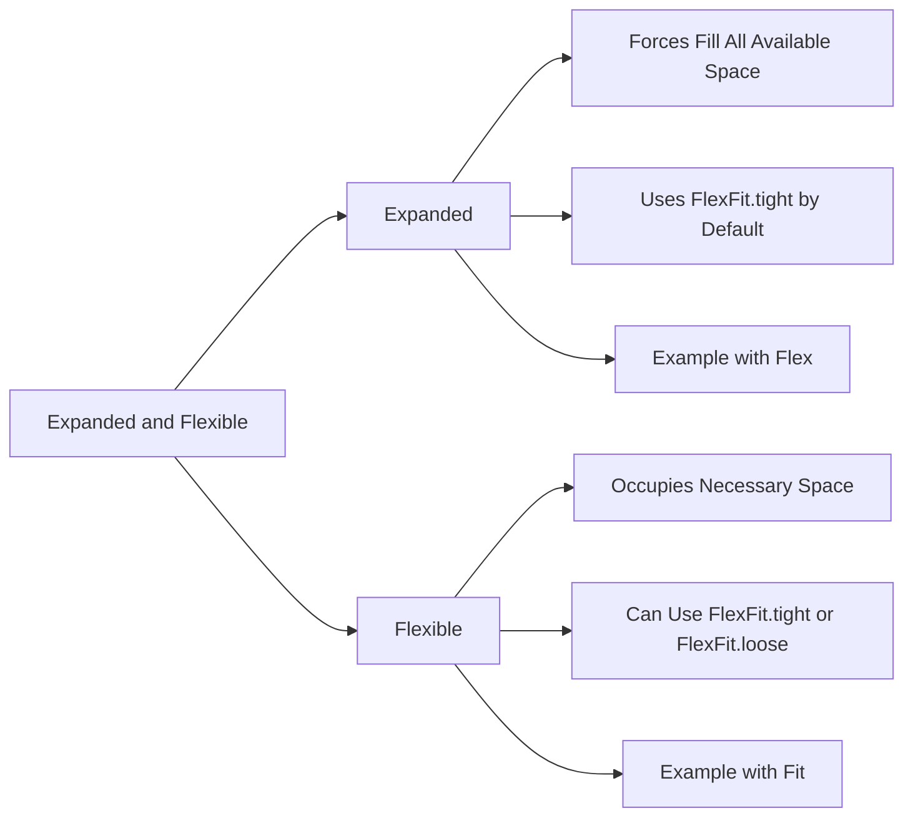

## 4.3.2 Expanded and Flex

In the world of Flutter, creating responsive and dynamic layouts is crucial for building applications that look great on any device. Two essential tools in your Flutter layout toolkit are the `Expanded` and `Flexible` widgets. These widgets allow you to control how child widgets expand and occupy available space within `Row`, `Column`, or `Flex` widgets. Understanding how to use these widgets effectively can significantly enhance your app's user interface.

### Introduction to Flexible Widgets

The `Expanded` and `Flexible` widgets are designed to manage the space distribution of child widgets within a parent widget, such as `Row`, `Column`, or `Flex`. They provide a way to allocate space proportionally or flexibly, ensuring that your UI components are arranged neatly and efficiently.

- **Expanded Widget:** Forces a child widget to fill the available space in the main axis, making it ideal for creating layouts where widgets need to grow proportionally.
- **Flexible Widget:** Similar to `Expanded`, but allows the child widget to occupy the necessary space up to the available space, offering more flexibility in layout design.

### Expanded Widget

#### Usage

The `Expanded` widget is a powerful tool for creating layouts where you want widgets to fill the available space. It is commonly used within `Row` or `Column` widgets to ensure that child widgets grow proportionally.

**Code Example:**

```dart
Row(
  children: <Widget>[
    Expanded(
      child: Container(
        color: Colors.red,
        height: 50,
        child: Center(child: Text('Expanded 1')),
      ),
    ),
    Expanded(
      child: Container(
        color: Colors.blue,
        height: 50,
        child: Center(child: Text('Expanded 2')),
      ),
    ),
  ],
);
```

In this example, two `Expanded` widgets are used within a `Row`. Each `Expanded` widget forces its child `Container` to fill half of the available horizontal space.

#### Properties

The `Expanded` widget has a key property called `flex`, which determines the proportion of space the widget should occupy relative to its siblings. By default, the `flex` value is `1`.

**Example with `flex`:**

```dart
Row(
  children: <Widget>[
    Expanded(
      flex: 2,
      child: Container(color: Colors.red, height: 50),
    ),
    Expanded(
      flex: 1,
      child: Container(color: Colors.green, height: 50),
    ),
  ],
);
```

In this example, the first `Expanded` widget has a `flex` value of `2`, while the second has a `flex` value of `1`. This means the first widget will occupy twice the space of the second widget.

### Flexible Widget

#### Usage

The `Flexible` widget provides a more nuanced approach to space allocation. It allows a child widget to occupy the necessary space up to the available space, without forcing it to fill all of it.

**Code Example:**

```dart
Row(
  children: <Widget>[
    Flexible(
      child: Container(
        color: Colors.orange,
        height: 50,
        child: Text('Flexible Widget'),
      ),
    ),
    Container(
      color: Colors.blue,
      width: 100,
      height: 50,
      child: Center(child: Text('Fixed Width')),
    ),
  ],
);
```

Here, the `Flexible` widget allows the `Container` to take up as much space as it needs, up to the available space, while the second `Container` has a fixed width.

#### Properties

The `Flexible` widget has a property called `fit`, which controls how the flexible widget should fit within the available space. The `fit` property can take values such as `FlexFit.tight` and `FlexFit.loose`.

**Example with `fit`:**

```dart
Row(
  children: <Widget>[
    Flexible(
      fit: FlexFit.tight,
      child: Container(color: Colors.purple, height: 50),
    ),
    Flexible(
      fit: FlexFit.loose,
      child: Container(color: Colors.yellow, height: 50),
    ),
  ],
);
```

In this example, the first `Flexible` widget uses `FlexFit.tight`, forcing it to fill the available space, while the second uses `FlexFit.loose`, allowing it to occupy only as much space as it needs.

### Differences Between Expanded and Flexible

Understanding the differences between `Expanded` and `Flexible` is crucial for effective layout design:

- **Expanded** is essentially a `Flexible` widget with `fit` set to `FlexFit.tight`. It forces the widget to occupy all available space.
- **Flexible** with `FlexFit.loose` allows the widget to size itself based on its content, providing more flexibility in layout design.

### Use Cases

- **Expanded:** Use when you want a widget to take up all available space or a specific proportion of it. Ideal for creating balanced layouts.
- **Flexible:** Use when you want a widget to size itself up to the available space without forcing it to fill. Perfect for dynamic content that may vary in size.

### Mermaid.js Diagram

To better understand the relationship and functionalities of `Expanded` and `Flexible`, consider the following diagram:



### Practical Experimentation

To truly grasp the power of `Expanded` and `Flexible`, it's essential to experiment with these widgets in your projects. Try modifying the `flex` values and `fit` properties to see how they affect the layout. Consider the following exercises:

- **Exercise 1:** Create a `Row` with three `Expanded` widgets, each with different `flex` values. Observe how the space is distributed.
- **Exercise 2:** Use a `Column` with a mix of `Expanded` and `Flexible` widgets. Experiment with `FlexFit.tight` and `FlexFit.loose` to see their effects.
- **Exercise 3:** Design a responsive layout that adapts to different screen sizes using `Expanded` and `Flexible` widgets.

### Best Practices and Common Pitfalls

- **Best Practices:**
  - Use `Expanded` for widgets that need to fill available space equally or proportionally.
  - Use `Flexible` for widgets that should adjust based on their content size.
  - Combine `Expanded` and `Flexible` strategically to create responsive and adaptive layouts.

- **Common Pitfalls:**
  - Avoid using `Expanded` or `Flexible` outside of `Row`, `Column`, or `Flex` widgets, as they rely on these parent widgets to function correctly.
  - Be cautious with `flex` values; ensure they add up to a logical distribution of space.
  - Remember that `Expanded` will force a widget to fill space, which may not always be desirable for dynamic content.

### Further Exploration

For those interested in diving deeper into Flutter layout design, consider exploring the following resources:

- **Official Flutter Documentation:** [Flutter Layouts](https://flutter.dev/docs/development/ui/layout)
- **Books:** "Flutter in Action" by Eric Windmill
- **Online Courses:** "Flutter & Dart - The Complete Guide" on Udemy

By mastering `Expanded` and `Flexible` widgets, you'll be well-equipped to create beautiful, responsive layouts in your Flutter applications. Keep experimenting, learning, and pushing the boundaries of what's possible with Flutter.

## Quiz Time!



### What is the primary purpose of the `Expanded` widget in Flutter?

- [x] To force a child widget to fill the available space in the main axis.
- [ ] To allow a child widget to occupy only the space it needs.
- [ ] To create a fixed-size widget.
- [ ] To add padding around a widget.

> **Explanation:** The `Expanded` widget is used to make a child widget fill the available space in the main axis, typically within a `Row` or `Column`.

### How does the `flex` property of the `Expanded` widget affect its behavior?

- [x] It determines the proportion of space the widget should occupy relative to its siblings.
- [ ] It sets the fixed size of the widget.
- [ ] It controls the padding around the widget.
- [ ] It specifies the alignment of the widget.

> **Explanation:** The `flex` property determines how much space an `Expanded` widget should take relative to its siblings, allowing for proportional space distribution.

### What is the default `flex` value for an `Expanded` widget?

- [x] 1
- [ ] 0
- [ ] 2
- [ ] 10

> **Explanation:** The default `flex` value for an `Expanded` widget is `1`, meaning it will take up equal space as other siblings with the same `flex` value.

### Which property of the `Flexible` widget controls how it fits within the available space?

- [x] fit
- [ ] flex
- [ ] alignment
- [ ] padding

> **Explanation:** The `fit` property of the `Flexible` widget controls how it fits within the available space, with options like `FlexFit.tight` and `FlexFit.loose`.

### What is the difference between `FlexFit.tight` and `FlexFit.loose`?

- [x] `FlexFit.tight` forces the widget to fill the available space, while `FlexFit.loose` allows it to occupy only the space it needs.
- [ ] `FlexFit.tight` adds padding, while `FlexFit.loose` removes padding.
- [ ] `FlexFit.tight` centers the widget, while `FlexFit.loose` aligns it to the start.
- [ ] `FlexFit.tight` makes the widget fixed-size, while `FlexFit.loose` makes it flexible.

> **Explanation:** `FlexFit.tight` forces the widget to fill the available space, whereas `FlexFit.loose` allows the widget to occupy only the space it needs.

### Can `Expanded` and `Flexible` widgets be used outside of `Row`, `Column`, or `Flex` widgets?

- [ ] True
- [x] False

> **Explanation:** `Expanded` and `Flexible` widgets are designed to be used within `Row`, `Column`, or `Flex` widgets, as they rely on these parent widgets to function correctly.

### Which widget would you use if you want a child widget to take up all available space in a `Row`?

- [x] Expanded
- [ ] Flexible
- [ ] Container
- [ ] Padding

> **Explanation:** The `Expanded` widget is used to make a child widget take up all available space in a `Row` or `Column`.

### What happens if you set different `flex` values for `Expanded` widgets within the same `Row`?

- [x] The widgets will occupy space proportionally based on their `flex` values.
- [ ] The widgets will overlap each other.
- [ ] The widgets will be centered.
- [ ] The widgets will be aligned to the start.

> **Explanation:** Different `flex` values for `Expanded` widgets within the same `Row` will cause them to occupy space proportionally based on their `flex` values.

### Which widget allows a child to occupy the necessary space up to the available space without forcing it to fill?

- [ ] Expanded
- [x] Flexible
- [ ] Container
- [ ] Align

> **Explanation:** The `Flexible` widget allows a child to occupy the necessary space up to the available space without forcing it to fill, providing more flexibility in layout design.

### Is it possible to use both `Expanded` and `Flexible` widgets in the same `Row` or `Column`?

- [x] True
- [ ] False

> **Explanation:** It is possible and often beneficial to use both `Expanded` and `Flexible` widgets in the same `Row` or `Column` to create dynamic and responsive layouts.


