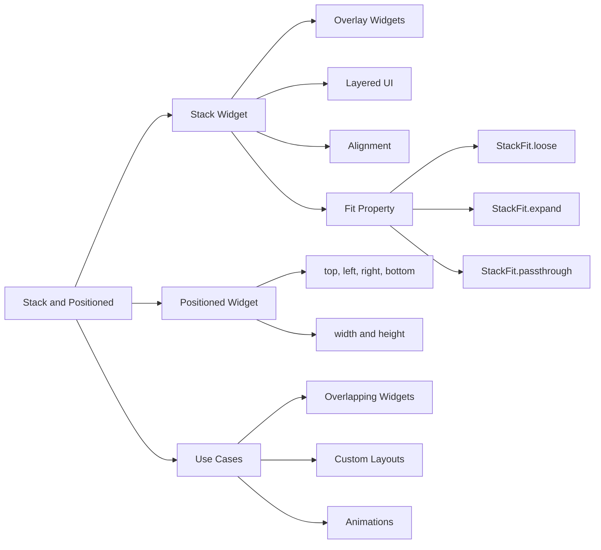

## 4.3.3 Stack and Positioned

In the world of mobile app development, creating dynamic and visually appealing user interfaces is crucial. Flutter, with its rich set of widgets, offers powerful tools to achieve this. Among these tools, the `Stack` and `Positioned` widgets stand out for their ability to overlay and precisely position widgets, enabling developers to craft complex and layered UI designs. This section delves into the intricacies of these widgets, providing you with the knowledge and skills to leverage them effectively in your projects.

### Introduction to Stack Widget

The `Stack` widget in Flutter is akin to a stack of cards where each card can be placed on top of another. This widget allows you to overlay multiple widgets on top of each other, creating a layered effect. It's particularly useful for scenarios where you need to display widgets that overlap, such as banners, badges, or custom UI components.

#### Use Cases for Stack

- **Overlapping Content:** Ideal for creating interfaces where elements need to overlap, such as images with text overlays.
- **Banners and Badges:** Useful for adding badges or banners on top of other widgets.
- **Complex UI Designs:** Enables the creation of intricate layouts that require elements to be stacked.

### Basic Usage of Stack

To understand the basic usage of the `Stack` widget, consider the following example:

```dart
Stack(
  children: <Widget>[
    Container(
      width: 200,
      height: 200,
      color: Colors.blue,
    ),
    Container(
      width: 150,
      height: 150,
      color: Colors.red.withOpacity(0.5),
    ),
    Positioned(
      top: 50,
      left: 50,
      child: Icon(Icons.star, size: 50, color: Colors.yellow),
    ),
  ],
);
```

#### Explanation

- **Blue Container:** This is the bottom layer of the stack, providing a base for other widgets.
- **Red Container:** Positioned above the blue container, it is semi-transparent, allowing the blue to show through.
- **Yellow Star Icon:** Positioned on top of both containers using the `Positioned` widget, demonstrating precise placement within the stack.

### Positioned Widget

The `Positioned` widget is a child of the `Stack` widget that allows for precise placement of its child widgets. It provides control over the position of widgets within the stack using properties like `top`, `right`, `bottom`, and `left`.

#### Properties of Positioned

- **`top`, `right`, `bottom`, `left`:** Specify the distance from the respective edges of the stack.
- **`width`, `height`:** Define the size of the positioned widget, allowing for flexible layout designs.

#### Code Example

```dart
Stack(
  children: <Widget>[
    Container(color: Colors.green, width: 100, height: 100),
    Positioned(
      top: 20,
      left: 20,
      child: Container(color: Colors.orange, width: 50, height: 50),
    ),
  ],
);
```

### Using Alignment with Stack

The `alignment` property of the `Stack` widget determines the default positioning of its children. By default, children are aligned to the top-left corner, but this can be changed to center or any other alignment.

#### Code Example

```dart
Stack(
  alignment: Alignment.center,
  children: <Widget>[
    Container(color: Colors.blue, width: 150, height: 150),
    Container(color: Colors.green, width: 100, height: 100),
    Container(color: Colors.red, width: 50, height: 50),
  ],
);
```

### Fit Property in Stack

The `fit` property controls how non-positioned children are sized within the stack. It offers three options:

- **`StackFit.loose`:** Allows children to maintain their own size.
- **`StackFit.expand`:** Forces children to fill the available space.
- **`StackFit.passthrough`:** Lets children determine their own size without constraints.

#### Code Example

```dart
Stack(
  fit: StackFit.expand,
  children: <Widget>[
    Image.network('https://example.com/background.jpg', fit: BoxFit.cover),
    Positioned(
      bottom: 10,
      right: 10,
      child: Icon(Icons.camera, size: 50, color: Colors.white),
    ),
  ],
);
```

### Use Cases for Stack and Positioned

- **Overlapping Widgets:** Perfect for creating layered UI elements like images with text overlays.
- **Custom Layouts:** Enables unique component arrangements that standard layout widgets cannot achieve.
- **Animations:** Facilitates moving widgets across the screen by adjusting their positions within a stack.

### Visualizing Stack and Positioned with Mermaid.js

To better understand the relationships and functionalities of `Stack` and `Positioned`, consider the following diagram:



### Encouraging Experimentation

The `Stack` and `Positioned` widgets are powerful tools in your Flutter toolkit. By experimenting with different configurations and properties, you can create dynamic and engaging user interfaces. Try adjusting the alignment, fit, and positioning properties to see how they affect your layout. Consider how these widgets can be used in your current projects to enhance the user experience.

### Best Practices and Common Pitfalls

- **Layer Management:** Be mindful of the order of widgets in the `children` list, as it determines the stacking order.
- **Performance Considerations:** Overusing `Stack` with complex layouts can impact performance. Optimize by minimizing the number of layers.
- **Responsive Design:** Ensure that your layouts are responsive by testing on different screen sizes and orientations.

### Further Exploration

For more in-depth knowledge, consider exploring the following resources:

- [Flutter Official Documentation](https://flutter.dev/docs)
- [Flutter Layout Cheat Sheet](https://medium.com/flutter-community/flutter-layout-cheat-sheet-5363348d037e)
- [Advanced Flutter Layouts](https://www.udemy.com/course/flutter-advanced-course/)

By mastering the `Stack` and `Positioned` widgets, you unlock the potential to create sophisticated and visually stunning applications. Keep experimenting, learning, and pushing the boundaries of what's possible with Flutter.

## Quiz Time!



### What is the primary purpose of the Stack widget in Flutter?

- [x] To overlay widgets on top of each other
- [ ] To arrange widgets in a linear fashion
- [ ] To create a grid layout
- [ ] To manage state across widgets

> **Explanation:** The `Stack` widget is used to overlay widgets on top of each other, allowing for complex and layered UI designs.

### Which property of the Positioned widget specifies the distance from the top edge of the Stack?

- [x] `top`
- [ ] `left`
- [ ] `right`
- [ ] `bottom`

> **Explanation:** The `top` property of the `Positioned` widget specifies the distance from the top edge of the `Stack`.

### What does the StackFit.expand property do?

- [x] Forces children to fill the available space
- [ ] Allows children to maintain their own size
- [ ] Lets children determine their own size without constraints
- [ ] Aligns children to the center

> **Explanation:** `StackFit.expand` forces children to fill the available space within the `Stack`.

### How does the alignment property affect the Stack widget?

- [x] It determines the default positioning of children within the Stack
- [ ] It sets the size of the Stack
- [ ] It controls the layering order of children
- [ ] It specifies the color of the Stack

> **Explanation:** The `alignment` property determines the default positioning of children within the `Stack`.

### Which of the following is a use case for the Stack widget?

- [x] Overlapping Widgets
- [x] Custom Layouts
- [ ] Linear Arrangements
- [ ] State Management

> **Explanation:** The `Stack` widget is used for creating overlapping widgets and custom layouts, not for linear arrangements or state management.

### What is the effect of using the Positioned widget within a Stack?

- [x] It allows precise placement of child widgets
- [ ] It changes the color of the Stack
- [ ] It arranges widgets in a grid
- [ ] It manages the state of widgets

> **Explanation:** The `Positioned` widget allows for precise placement of child widgets within a `Stack`.

### Which property of the Stack widget controls how non-positioned children are sized?

- [x] `fit`
- [ ] `alignment`
- [ ] `children`
- [ ] `overflow`

> **Explanation:** The `fit` property controls how non-positioned children are sized within the `Stack`.

### What is a common pitfall when using the Stack widget?

- [x] Overusing it with complex layouts can impact performance
- [ ] It cannot be used with Positioned widgets
- [ ] It does not support alignment
- [ ] It automatically manages state

> **Explanation:** Overusing the `Stack` widget with complex layouts can impact performance, so it's important to optimize the number of layers.

### Which property of the Positioned widget defines its size?

- [x] `width` and `height`
- [ ] `top` and `left`
- [ ] `alignment`
- [ ] `fit`

> **Explanation:** The `width` and `height` properties of the `Positioned` widget define its size.

### True or False: The Stack widget can be used to create animations by adjusting widget positions.

- [x] True
- [ ] False

> **Explanation:** True. The `Stack` widget can be used to create animations by adjusting the positions of widgets within it.


