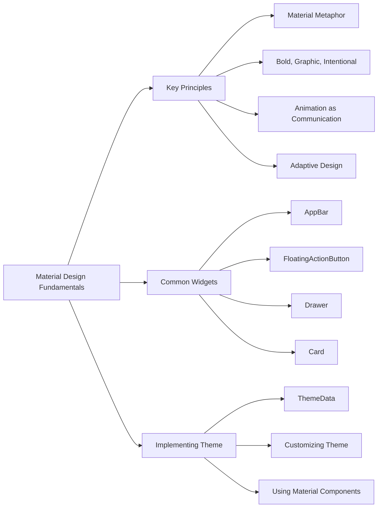

## 4.3.4 Material Design Fundamentals

Material Design is a comprehensive design language developed by Google, aimed at creating a unified experience across all platforms and devices. It provides guidelines for visual, motion, and interaction design, ensuring that apps are not only aesthetically pleasing but also intuitive and user-friendly. Flutter, as a UI toolkit, natively supports Material Design, making it easier for developers to create apps with a consistent and modern look and feel. In this section, we will delve into the fundamentals of Material Design, explore its key principles, and learn how to implement these concepts using Flutter's rich set of widgets and theming capabilities.

### Introduction to Material Design

Material Design is more than just a set of visual guidelines; it's a philosophy that combines classic design principles with the innovation of technology and science. It emphasizes the use of tactile surfaces, realistic lighting, and motion to create a sense of depth and hierarchy in the user interface. By adhering to Material Design principles, developers can create apps that are not only visually appealing but also provide a seamless and engaging user experience.

Flutter's native support for Material Design means that developers have access to a wide range of pre-designed components and tools that adhere to these principles. This support simplifies the process of building apps that are consistent with Google's design language, ensuring that your app looks and feels right at home on any Android or iOS device.

### Key Principles of Material Design

Understanding the key principles of Material Design is crucial for creating interfaces that are both functional and beautiful. Let's explore these principles in detail:

#### Material Metaphor

The material metaphor is a foundational concept in Material Design. It is based on the idea of using tactile surfaces and realistic lighting to create a sense of depth and hierarchy. This metaphor draws inspiration from the physical world, where objects have mass and occupy space. In the digital realm, this translates to the use of shadows, elevation, and surfaces to convey relationships and interactions between UI elements.

- **Tactile Surfaces:** Surfaces in Material Design are inspired by paper and ink, providing a familiar and tangible feel. These surfaces can be manipulated, stacked, and moved, creating a dynamic and interactive experience.
- **Realistic Lighting and Shadows:** Lighting and shadows are used to create a sense of depth and hierarchy. Shadows indicate the elevation of elements, helping users understand the structure and importance of different components.

#### Bold, Graphic, Intentional

Material Design encourages the use of bold colors, edge-to-edge imagery, large-scale typography, and intentional white space to create a visually striking and engaging interface. This principle emphasizes clarity and focus, ensuring that users can easily navigate and interact with the app.

- **Bold Colors:** Use vibrant and contrasting colors to draw attention to key elements and actions. Colors should be used intentionally to convey meaning and guide users through the interface.
- **Edge-to-Edge Imagery:** Full-bleed images create a sense of immersion and engagement. They can be used to highlight content and provide context.
- **Large-Scale Typography:** Typography in Material Design is used to create hierarchy and focus. Large, clear text ensures readability and accessibility.
- **Intentional White Space:** White space is not just empty space; it is a powerful tool for creating focus and clarity. It helps separate content and guide the user's eye through the interface.

#### Animation as a Communication Tool

Animations in Material Design are not just decorative; they serve as a communication tool to provide context and continuity. Flutter leverages smooth animations to enhance the user experience, making interactions feel natural and intuitive.

- **Smooth Transitions:** Use animations to transition between states and screens, providing a sense of continuity and flow.
- **Feedback and Response:** Animations can provide feedback to user actions, confirming interactions and guiding users through the app.
- **Hierarchy and Focus:** Use animations to draw attention to important elements and actions, helping users understand the structure and flow of the app.

#### Adaptive Design

Adaptive design is about creating interfaces that respond and adapt to different screen sizes and orientations. Material Design provides guidelines for creating responsive layouts that work seamlessly across a wide range of devices.

- **Responsive Layouts:** Design interfaces that adapt to different screen sizes, ensuring a consistent experience on both mobile and tablet devices.
- **Flexible Components:** Use flexible components that can adjust their size and position based on the available space.
- **Orientation Changes:** Ensure that your app can handle changes in orientation, providing a smooth transition between portrait and landscape modes.

### Common Material Design Widgets

Flutter provides a rich set of widgets that adhere to Material Design principles, making it easy to create modern and consistent UIs. Let's explore some of the most commonly used Material Design widgets:

#### AppBar

The `AppBar` widget is a top bar that provides navigation and action items for your app. It typically contains the app's title, navigation icons, and action buttons.

```dart
AppBar(
  title: Text('Material Design App'),
  actions: <Widget>[
    IconButton(
      icon: Icon(Icons.settings),
      onPressed: () {},
    ),
  ],
);
```

- **Title:** The title of the app is displayed prominently in the center of the `AppBar`.
- **Actions:** Action buttons, such as settings or search, can be added to the `AppBar` to provide quick access to common tasks.

#### FloatingActionButton

The `FloatingActionButton` is a circular button that represents the primary action of the app. It is typically used to initiate a new task or action.

```dart
FloatingActionButton(
  onPressed: () {},
  child: Icon(Icons.add),
);
```

- **Primary Action:** The `FloatingActionButton` is used to highlight the most important action in the app, such as adding a new item or composing a message.
- **Positioning:** It is usually positioned at the bottom right of the screen, floating above the content.

#### Drawer

The `Drawer` widget provides a side navigation panel that can be used to navigate between different sections of the app. It is typically accessed by swiping from the left edge of the screen or tapping a navigation icon in the `AppBar`.

```dart
Drawer(
  child: ListView(
    padding: EdgeInsets.zero,
    children: <Widget>[
      DrawerHeader(
        decoration: BoxDecoration(
          color: Colors.blue,
        ),
        child: Text(
          'Menu',
          style: TextStyle(
            color: Colors.white,
            fontSize: 24,
          ),
        ),
      ),
      ListTile(
        leading: Icon(Icons.home),
        title: Text('Home'),
        onTap: () {},
      ),
      ListTile(
        leading: Icon(Icons.settings),
        title: Text('Settings'),
        onTap: () {},
      ),
    ],
  ),
);
```

- **Navigation Items:** The `Drawer` contains a list of navigation items, each represented by a `ListTile`.
- **Header:** A `DrawerHeader` can be used to display a logo or user information at the top of the `Drawer`.

#### Card

The `Card` widget is used to present related information in a contained format. It is often used to display content such as articles, photos, or contact information.

```dart
Card(
  elevation: 4.0,
  margin: EdgeInsets.all(10.0),
  child: Padding(
    padding: EdgeInsets.all(16.0),
    child: Text('This is a Material Design Card'),
  ),
);
```

- **Elevation:** The `Card` widget uses elevation to create a sense of depth, making it appear as if it is floating above the background.
- **Content:** Cards can contain a variety of content, including text, images, and buttons, arranged in a structured layout.

### Implementing Theme in Flutter

Flutter's theming capabilities allow you to define a global theme for your app, ensuring a consistent look and feel across all screens and components. The `ThemeData` class is used to specify the colors, fonts, and other visual properties of your app.

#### ThemeData

The `ThemeData` class allows you to define a global theme for your app using the `MaterialApp` widget. This theme is applied to all Material Design widgets in the app, providing a cohesive appearance.

```dart
MaterialApp(
  theme: ThemeData(
    primarySwatch: Colors.blue,
    accentColor: Colors.orange,
    textTheme: TextTheme(
      bodyText2: TextStyle(fontSize: 18.0),
    ),
  ),
  home: MyHomePage(),
);
```

- **Primary Swatch:** The primary color of the app, used for the `AppBar`, buttons, and other prominent elements.
- **Accent Color:** A secondary color used for highlights and accents.
- **Text Theme:** Defines the default text styles for the app, ensuring consistent typography.

#### Customizing Theme

Flutter allows you to customize the theme to match your brand's identity and design preferences. You can modify colors, fonts, and other properties to create a unique look for your app.

```dart
ThemeData(
  primaryColor: Colors.teal,
  buttonTheme: ButtonThemeData(
    buttonColor: Colors.teal, // Background color for buttons
    textTheme: ButtonTextTheme.primary, // Text color for buttons
  ),
);
```

- **Primary Color:** Customize the primary color to match your brand's color scheme.
- **Button Theme:** Define the appearance of buttons, including background color and text color.

### Using Material Components

Flutter's built-in Material widgets provide a wide range of pre-designed components that adhere to Material Design principles. These components are designed to be consistent and user-friendly, ensuring a cohesive experience across your app.

- **Consistency:** Using Material components ensures that your app adheres to Google's design guidelines, providing a familiar and intuitive experience for users.
- **Customization:** While customization is possible, adhering to Material Design principles ensures that your app remains cohesive and user-friendly.

### Mermaid.js Diagram

To visually organize the key principles, common widgets, and theming concepts, we can use a Mermaid.js diagram:



### Conclusion

Material Design provides a comprehensive framework for creating modern, consistent, and user-friendly interfaces. By understanding and applying its key principles, you can create apps that are not only visually appealing but also intuitive and engaging. Flutter's native support for Material Design, along with its rich set of widgets and theming capabilities, makes it an ideal choice for building apps that adhere to these principles. As you continue to explore and experiment with Material Design components, remember to focus on creating a cohesive and user-friendly experience that enhances the overall usability and aesthetics of your app.

### Further Exploration

To deepen your understanding of Material Design and its implementation in Flutter, consider exploring the following resources:

- [Material Design Guidelines](https://material.io/design/)
- [Flutter Material Components](https://flutter.dev/docs/development/ui/widgets/material)
- [Flutter Theming Documentation](https://flutter.dev/docs/cookbook/design/themes)

These resources provide valuable insights and examples that can help you master Material Design and create stunning, user-friendly apps.

## Quiz Time!



### What is the primary purpose of Material Design?

- [x] To create a unified experience across all platforms and devices
- [ ] To focus solely on aesthetic appeal
- [ ] To replace all existing design languages
- [ ] To eliminate the need for animations

> **Explanation:** Material Design aims to create a unified experience across all platforms and devices by providing guidelines for visual, motion, and interaction design.

### Which principle of Material Design emphasizes the use of tactile surfaces and realistic lighting?

- [x] Material Metaphor
- [ ] Bold, Graphic, Intentional
- [ ] Animation as a Communication Tool
- [ ] Adaptive Design

> **Explanation:** The Material Metaphor principle emphasizes the use of tactile surfaces and realistic lighting to create a sense of depth and hierarchy.

### What is the role of animations in Material Design?

- [x] To provide context and continuity
- [ ] To serve as decorative elements only
- [ ] To replace static images
- [ ] To slow down user interactions

> **Explanation:** Animations in Material Design serve as a communication tool to provide context and continuity, enhancing the user experience.

### Which widget is typically used for the primary action in a Flutter app?

- [x] FloatingActionButton
- [ ] AppBar
- [ ] Drawer
- [ ] Card

> **Explanation:** The FloatingActionButton is used to represent the primary action of the app, typically positioned at the bottom right of the screen.

### How does the `AppBar` widget contribute to app navigation?

- [x] By providing a top bar with navigation and action items
- [ ] By displaying a list of all app screens
- [ ] By acting as a footer for the app
- [ ] By hiding navigation elements

> **Explanation:** The `AppBar` widget provides a top bar with navigation and action items, facilitating app navigation.

### What is the purpose of the `Drawer` widget in a Flutter app?

- [x] To provide a side navigation panel
- [ ] To display a floating button
- [ ] To contain the main content of the app
- [ ] To replace the `AppBar`

> **Explanation:** The `Drawer` widget provides a side navigation panel that can be used to navigate between different sections of the app.

### How can you define a global theme for your Flutter app?

- [x] By using the `ThemeData` class in the `MaterialApp` widget
- [ ] By modifying the `AppBar` widget
- [ ] By using the `Drawer` widget
- [ ] By setting colors directly in each widget

> **Explanation:** The `ThemeData` class is used to define a global theme for your app within the `MaterialApp` widget, ensuring a consistent look and feel.

### What is the significance of using bold colors in Material Design?

- [x] To draw attention to key elements and actions
- [ ] To make the app look more colorful
- [ ] To replace images
- [ ] To reduce the need for typography

> **Explanation:** Bold colors are used in Material Design to draw attention to key elements and actions, guiding users through the interface.

### Which principle of Material Design focuses on creating interfaces that adapt to different screen sizes?

- [x] Adaptive Design
- [ ] Material Metaphor
- [ ] Bold, Graphic, Intentional
- [ ] Animation as a Communication Tool

> **Explanation:** Adaptive Design focuses on creating interfaces that respond and adapt to different screen sizes and orientations.

### True or False: Customizing the theme in Flutter allows you to match your brand's identity.

- [x] True
- [ ] False

> **Explanation:** Customizing the theme in Flutter allows you to modify colors, fonts, and other properties to match your brand's identity and design preferences.


