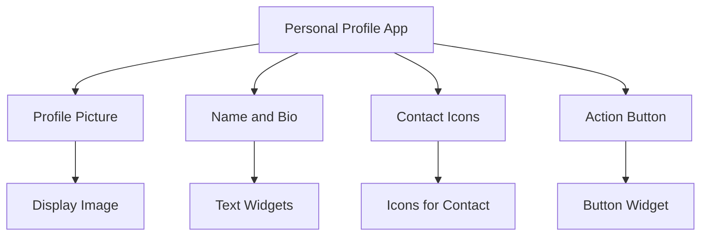

## 4.4.1 Project Overview

In this section, we embark on an exciting journey to create a **Personal Profile App** using Flutter. This project serves as a practical application of the concepts you've learned about Flutter widgets, layout structures, and basic interactivity. By the end of this project, you'll have a solid understanding of how to construct a visually appealing and functional user interface using Flutter's powerful widget system.

### Project Description

The Personal Profile App is designed to showcase user information in a clean and organized manner. It will display a user's profile picture, name, a brief bio, and contact details through icons. Additionally, the app will feature a button that allows users to edit their profile or view more details. This project is an excellent opportunity to apply your knowledge of Flutter widgets and layout techniques.

### Project Objectives

The primary objectives of this project are to:

- **Apply Knowledge of Common Widgets:** You'll use essential Flutter widgets such as `Text`, `Image`, `Icon`, and `Container` to build the app's interface.
- **Practice Building Layouts:** You'll arrange widgets using layout widgets like `Row`, `Column`, and `Expanded` to create a responsive and organized UI.
- **Utilize Styling Properties:** You'll enhance the app's appearance using `TextStyle` for text customization and `Container` decorations for styling.
- **Implement Interactivity:** You'll add basic interactivity with buttons or gesture detectors, allowing users to interact with the app.

### Expected Features

The Personal Profile App will include the following features:

- **Profile Picture Display:** A section to display the user's profile picture prominently.
- **User's Name and Bio:** Text widgets to present the user's name and a short biography.
- **Contact Information Icons:** Icons representing contact methods such as email and phone.
- **Action Button:** A button that allows users to edit their profile or access additional details.

### Visualizing the App Structure

To better understand the components of the Personal Profile App, let's visualize its structure using a Mermaid.js diagram:



This diagram illustrates the hierarchical structure of the app, highlighting the main components and their relationships. Each component plays a crucial role in delivering the app's functionality and user experience.

### Building the Personal Profile App

#### Step 1: Setting Up the Project

Begin by creating a new Flutter project. Open your preferred IDE, such as Visual Studio Code or Android Studio, and create a new Flutter application. Name it `personal_profile_app` or something similar.

```bash
flutter create personal_profile_app
cd personal_profile_app
```

#### Step 2: Designing the Layout

The layout of the Personal Profile App will be constructed using a combination of `Column` and `Row` widgets to organize the content vertically and horizontally. Here's a basic outline of the layout structure:

- **Column:** The main vertical layout that contains all other widgets.
  - **Row:** A horizontal layout for the profile picture and name.
  - **Text:** Widgets for the user's name and bio.
  - **Row:** A horizontal layout for contact icons.
  - **Button:** An action button for editing or viewing more details.

#### Step 3: Implementing the Profile Picture

The profile picture is a central element of the app. Use the `Image` widget to display the profile picture. You can use a placeholder image for now, which can be replaced with a real image later.

```dart
Image.asset(
  'assets/profile_picture.png',
  width: 100.0,
  height: 100.0,
  fit: BoxFit.cover,
)
```

#### Step 4: Adding Name and Bio

Use `Text` widgets to display the user's name and bio. Customize the text style using `TextStyle` to make it visually appealing.

```dart
Text(
  'John Doe',
  style: TextStyle(
    fontSize: 24.0,
    fontWeight: FontWeight.bold,
  ),
),
Text(
  'Flutter Developer | Tech Enthusiast',
  style: TextStyle(
    fontSize: 16.0,
    color: Colors.grey,
  ),
),
```

#### Step 5: Displaying Contact Icons

Use `Icon` widgets to represent contact information. Arrange them in a `Row` to display them horizontally.

```dart
Row(
  mainAxisAlignment: MainAxisAlignment.center,
  children: <Widget>[
    Icon(Icons.email, color: Colors.blue),
    SizedBox(width: 10.0),
    Icon(Icons.phone, color: Colors.green),
  ],
)
```

#### Step 6: Creating the Action Button

Add a `RaisedButton` or `FlatButton` to allow users to interact with the app. You can customize the button's appearance and functionality.

```dart
RaisedButton(
  onPressed: () {
    // Action to edit profile or view more details
  },
  child: Text('Edit Profile'),
  color: Colors.blue,
  textColor: Colors.white,
)
```

### Best Practices and Tips

- **Responsive Design:** Use `Expanded` and `Flexible` widgets to ensure the layout adapts to different screen sizes.
- **Consistent Styling:** Maintain a consistent style throughout the app using theme data or custom styles.
- **Accessibility:** Ensure that text is readable and icons are recognizable for all users.
- **Code Organization:** Keep your code organized by separating widgets into different files if necessary.

### Common Pitfalls and Challenges

- **Layout Overlaps:** Ensure that widgets do not overlap by using appropriate layout constraints.
- **Image Loading:** Handle image loading errors gracefully, especially if using network images.
- **Button Functionality:** Ensure that buttons perform the intended actions and provide feedback to users.

### Further Exploration

To deepen your understanding of Flutter and its capabilities, consider exploring the following resources:

- [Flutter Documentation](https://flutter.dev/docs): Official documentation for Flutter.
- [Flutter Widget Catalog](https://flutter.dev/docs/development/ui/widgets): Comprehensive guide to Flutter widgets.
- [Dart Language Tour](https://dart.dev/guides/language/language-tour): Learn more about the Dart programming language.

### Conclusion

The Personal Profile App project is an excellent way to apply your knowledge of Flutter widgets, layout techniques, and basic interactivity. By completing this project, you'll gain valuable experience in building a functional and visually appealing app. Remember to experiment with different styles and layouts to make the app your own.

## Quiz Time!



### What is the primary purpose of the Personal Profile App project?

- [x] To apply knowledge of Flutter widgets and layout techniques.
- [ ] To create a complex database-driven application.
- [ ] To learn advanced state management techniques.
- [ ] To implement machine learning algorithms.

> **Explanation:** The primary purpose of the Personal Profile App project is to apply knowledge of Flutter widgets and layout techniques, focusing on building a simple and functional user interface.

### Which widget is used to display the profile picture in the app?

- [x] Image
- [ ] Text
- [ ] Icon
- [ ] Container

> **Explanation:** The `Image` widget is used to display the profile picture in the app, allowing for various image sources and display options.

### What layout widget is used to arrange widgets vertically in the app?

- [x] Column
- [ ] Row
- [ ] Stack
- [ ] GridView

> **Explanation:** The `Column` widget is used to arrange widgets vertically in the app, providing a flexible layout structure.

### How can you customize the appearance of text in Flutter?

- [x] Using the TextStyle class
- [ ] Using the Image widget
- [ ] Using the Icon widget
- [ ] Using the Container widget

> **Explanation:** The `TextStyle` class is used to customize the appearance of text in Flutter, allowing for font size, weight, color, and more.

### Which widget is used to represent contact information in the app?

- [x] Icon
- [ ] Text
- [ ] Image
- [ ] Button

> **Explanation:** The `Icon` widget is used to represent contact information in the app, providing a visual representation of contact methods.

### What is the purpose of the action button in the app?

- [x] To allow users to edit their profile or view more details.
- [ ] To submit data to a server.
- [ ] To navigate to a different screen.
- [ ] To display a dialog box.

> **Explanation:** The action button in the app allows users to edit their profile or view more details, providing basic interactivity.

### Which layout widget is used to arrange widgets horizontally in the app?

- [x] Row
- [ ] Column
- [ ] Stack
- [ ] ListView

> **Explanation:** The `Row` widget is used to arrange widgets horizontally in the app, allowing for side-by-side placement.

### What is a common challenge when building layouts in Flutter?

- [x] Ensuring widgets do not overlap.
- [ ] Implementing complex algorithms.
- [ ] Managing large databases.
- [ ] Integrating third-party APIs.

> **Explanation:** A common challenge when building layouts in Flutter is ensuring widgets do not overlap, which requires careful use of layout constraints.

### How can you ensure the app's layout adapts to different screen sizes?

- [x] Using Expanded and Flexible widgets
- [ ] Using fixed pixel values
- [ ] Using only Container widgets
- [ ] Using hardcoded dimensions

> **Explanation:** Using `Expanded` and `Flexible` widgets helps ensure the app's layout adapts to different screen sizes, providing a responsive design.

### True or False: The Personal Profile App project includes advanced state management techniques.

- [ ] True
- [x] False

> **Explanation:** False. The Personal Profile App project focuses on applying basic Flutter widgets and layout techniques, not advanced state management.


