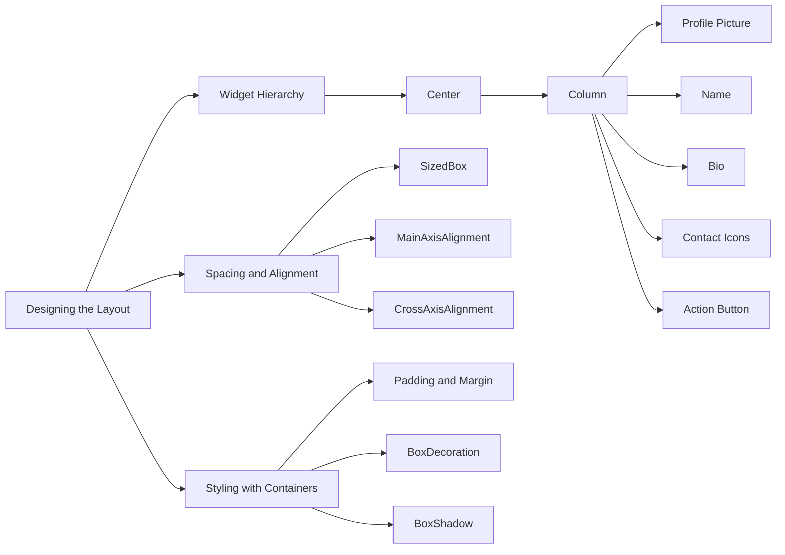

## 4.4.2 Designing the Layout for Your Flutter Profile App

Designing a layout is a crucial step in building any application, as it determines how users interact with your app and perceive its functionality. In this section, we'll explore how to design an effective and visually appealing layout for a personal profile app using Flutter. We'll cover planning the UI structure, understanding widget hierarchies, incorporating spacing and alignment, and using containers for styling. By the end of this section, you'll have a solid foundation to create a user-friendly interface for your app.

### Planning the UI Structure

Before diving into coding, it's essential to plan your UI layout. This planning phase helps you visualize the app's structure and ensures a smooth development process. Here are some steps and tools to help you plan effectively:

- **Sketch Your Layout:** Start by sketching your UI on paper or using digital tools. This step allows you to experiment with different designs and layouts without getting bogged down in code. Sketching helps you focus on the user experience and functionality rather than technical details.

- **Tools for Sketching:**
  - **Pen and Paper:** A simple and effective way to brainstorm ideas quickly.
  - **Digital Drawing Tools:** Use tools like Figma, Sketch, or Adobe XD for more detailed designs. These tools offer features like drag-and-drop components, alignment guides, and collaborative editing.

- **Define the User Flow:** Consider how users will navigate through your app. Identify the key screens and interactions, and ensure that the layout supports a seamless user experience.

- **Prioritize Content:** Determine which elements are most important and should be highlighted. For a profile app, this might include the profile picture, name, bio, and contact information.

### Widget Hierarchy for the Profile App

Understanding the widget hierarchy is crucial for organizing your app's UI components effectively. In Flutter, widgets are the building blocks of your app, and arranging them correctly ensures a clean and maintainable codebase.

#### High-Level Structure

For our profile app, we'll use a `Column` widget to arrange the UI elements vertically. Wrapping the `Column` in a `Center` widget will center the content on the screen, providing a balanced and aesthetically pleasing layout.

```dart
Center(
  child: Column(
    mainAxisAlignment: MainAxisAlignment.center,
    children: <Widget>[
      // Profile Picture
      // Name
      // Bio
      // Contact Icons
      // Action Button
    ],
  ),
);
```

#### Detailed Breakdown

Let's break down the components of our profile app:

- **Profile Picture:** Use a `CircleAvatar` widget to display a circular profile image.
- **Name:** Display the user's name using a `Text` widget with bold styling.
- **Bio:** Provide a brief description or bio using a `Text` widget with a lighter color.
- **Contact Icons:** Use a `Row` widget to display contact icons (e.g., email, phone) horizontally.
- **Action Button:** Add an `ElevatedButton` for actions like editing the profile.

### Incorporating Spacing and Alignment

Proper spacing and alignment are key to creating a visually appealing layout. Flutter provides several tools and properties to help you achieve this.

- **Using `SizedBox`:** Add vertical or horizontal spacing between widgets using `SizedBox`. This widget allows you to specify the exact amount of space needed.

- **Alignment Properties:** Use `mainAxisAlignment` and `crossAxisAlignment` in `Row` and `Column` widgets to position content appropriately.

#### Code Example

Here's a complete example of how to incorporate spacing and alignment in your profile app:

```dart
Column(
  mainAxisAlignment: MainAxisAlignment.center,
  children: <Widget>[
    CircleAvatar(
      radius: 50,
      backgroundImage: AssetImage('assets/images/profile.jpg'),
    ),
    SizedBox(height: 20),
    Text(
      'John Doe',
      style: TextStyle(fontSize: 24, fontWeight: FontWeight.bold),
    ),
    SizedBox(height: 10),
    Text(
      'A passionate Flutter developer.',
      style: TextStyle(fontSize: 16, color: Colors.grey),
    ),
    SizedBox(height: 20),
    Row(
      mainAxisAlignment: MainAxisAlignment.center,
      children: <Widget>[
        Icon(Icons.email, color: Colors.blue),
        SizedBox(width: 10),
        Icon(Icons.phone, color: Colors.green),
      ],
    ),
    SizedBox(height: 30),
    ElevatedButton(
      onPressed: () {},
      child: Text('Edit Profile'),
    ),
  ],
);
```

### Using Containers for Styling

Containers are versatile widgets that allow you to apply styling such as padding, margins, and background colors. They are essential for creating visually distinct sections in your app.

- **Padding and Margin:** Use `padding` and `margin` properties to control the spacing around your widgets.

- **BoxDecoration:** Apply styles like background color, border radius, and shadows using the `BoxDecoration` property.

#### Code Example

Here's how you can use a `Container` to style a text widget:

```dart
Container(
  margin: EdgeInsets.all(10.0),
  padding: EdgeInsets.symmetric(horizontal: 20.0, vertical: 10.0),
  decoration: BoxDecoration(
    color: Colors.white,
    borderRadius: BorderRadius.circular(10.0),
    boxShadow: [
      BoxShadow(
        color: Colors.grey.withOpacity(0.5),
        blurRadius: 5.0,
        spreadRadius: 2.0,
      ),
    ],
  ),
  child: Text('Hello, Flutter!'),
);
```

### Visualizing the Layout with Mermaid.js

To provide a visual representation of the layout structure and styling components, we can use a Mermaid.js diagram. This diagram illustrates the hierarchy and relationships between different widgets in our profile app.



### Guidelines for the Writer

As you guide readers through designing their layout, emphasize the importance of a clear UI structure. Explain the widget hierarchy and how to organize widgets within `Column` and `Row`. Show how to use `SizedBox` and alignment properties to space and position widgets effectively. Demonstrate styling techniques using `Container` and `BoxDecoration`. Encourage readers to visualize their app's UI before coding and to experiment with different layout configurations.

### Conclusion

Designing a layout is both an art and a science. By planning your UI structure, understanding widget hierarchies, and using Flutter's powerful layout tools, you can create a personal profile app that is both functional and visually appealing. Remember to experiment with different designs and layouts to find what works best for your app's needs.

## Quiz Time!



### What is the first step recommended before coding the UI layout?

- [x] Sketching the UI layout
- [ ] Writing the code directly
- [ ] Choosing a color scheme
- [ ] Testing the app on a device

> **Explanation:** Sketching the UI layout helps in visualizing the app's structure and planning the user experience before diving into coding.

### Which widget is used to arrange widgets vertically in Flutter?

- [x] Column
- [ ] Row
- [ ] Stack
- [ ] Container

> **Explanation:** The `Column` widget is used to arrange widgets vertically in Flutter.

### What is the purpose of the `Center` widget in the layout?

- [x] To center the content on the screen
- [ ] To align widgets to the left
- [ ] To add padding around widgets
- [ ] To create a horizontal layout

> **Explanation:** The `Center` widget centers its child widget on the screen, providing a balanced layout.

### How can you add vertical spacing between widgets in a `Column`?

- [x] Using `SizedBox`
- [ ] Using `Padding`
- [ ] Using `Row`
- [ ] Using `Container`

> **Explanation:** `SizedBox` is used to add vertical or horizontal spacing between widgets.

### Which property is used to apply a shadow effect to a `Container`?

- [x] BoxShadow
- [ ] BorderRadius
- [ ] Padding
- [ ] Margin

> **Explanation:** `BoxShadow` is used in the `BoxDecoration` property to apply shadow effects to a `Container`.

### What is the role of `mainAxisAlignment` in a `Column`?

- [x] To position children along the main axis
- [ ] To add padding around children
- [ ] To set the background color
- [ ] To create a border around children

> **Explanation:** `mainAxisAlignment` is used to position children along the main axis of a `Column`.

### Which widget is used to display a circular profile image?

- [x] CircleAvatar
- [ ] Image
- [ ] Icon
- [ ] Container

> **Explanation:** `CircleAvatar` is used to display circular images, often used for profile pictures.

### What is the benefit of using `Container` for styling widgets?

- [x] It allows applying padding, margins, and background colors
- [ ] It automatically centers the widget
- [ ] It adds animations to the widget
- [ ] It changes the widget's shape to a circle

> **Explanation:** `Container` is versatile for styling, allowing you to apply padding, margins, background colors, and more.

### Which tool is recommended for sketching UI layouts digitally?

- [x] Figma
- [ ] Microsoft Word
- [ ] Excel
- [ ] PowerPoint

> **Explanation:** Figma is a popular digital tool for designing and sketching UI layouts.

### True or False: The `Row` widget is used to arrange widgets vertically.

- [ ] True
- [x] False

> **Explanation:** The `Row` widget arranges widgets horizontally, not vertically.


