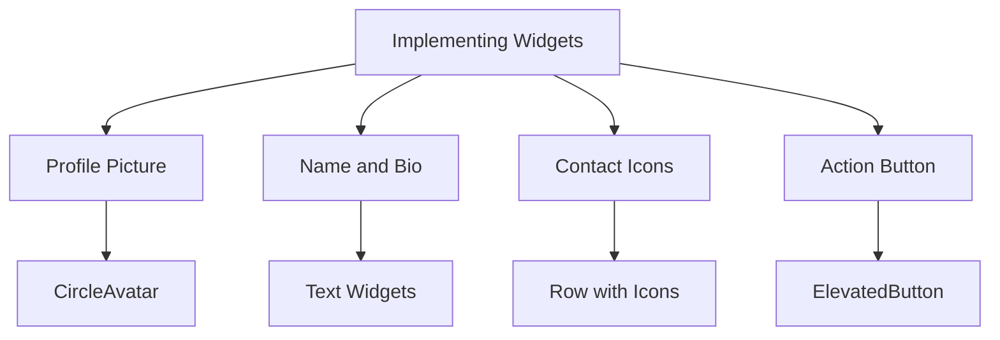

## 4.4.3 Implementing Widgets

In this section, we will delve into the practical implementation of widgets to create a Personal Profile App using Flutter. This hands-on project will guide you through adding a profile picture, displaying user information, incorporating contact icons, and implementing an action button. By the end of this section, you'll have a cohesive and visually appealing user interface that you can further customize and expand upon.

### Adding Profile Picture

The profile picture is often the focal point of a personal profile app. In Flutter, the `CircleAvatar` widget is a perfect choice for displaying circular images, which are commonly used for profile pictures.

#### Using `CircleAvatar` with Local Assets

To display a profile picture from local assets, you can use the `CircleAvatar` widget with the `AssetImage` class. Here's a simple example:

```dart
CircleAvatar(
  radius: 50,
  backgroundImage: AssetImage('assets/images/profile.jpg'),
);
```

- **Explanation:** The `radius` property defines the size of the circle, while `backgroundImage` specifies the image source. Ensure that the image path is correctly set in your `pubspec.yaml` file under the `assets` section.

#### Using `CircleAvatar` with Network Images

If your profile picture is hosted online, you can use the `NetworkImage` class:

```dart
CircleAvatar(
  radius: 50,
  backgroundImage: NetworkImage('https://example.com/profile.jpg'),
);
```

- **Explanation:** This approach is useful for dynamic content where images might change or be updated frequently.

### Displaying Name and Bio

Next, we'll add text widgets to display the user's name and a short bio. The `Text` widget in Flutter is versatile and allows for extensive customization through the `TextStyle` class.

#### Code Example for Name and Bio

```dart
Text(
  'John Doe',
  style: TextStyle(fontSize: 24, fontWeight: FontWeight.bold),
),
SizedBox(height: 10),
Text(
  'A passionate Flutter developer.',
  style: TextStyle(fontSize: 16, color: Colors.grey),
),
```

- **Explanation:** The `TextStyle` class is used to customize the font size, weight, and color. The `SizedBox` widget adds vertical spacing between the name and bio.

### Adding Contact Icons

Contact icons provide a way for users to interact with the profile, such as sending an email or making a phone call. We'll use a `Row` widget to arrange `Icon` widgets horizontally.

#### Code Example for Contact Icons

```dart
Row(
  mainAxisAlignment: MainAxisAlignment.center,
  children: <Widget>[
    Icon(Icons.email, color: Colors.blue),
    SizedBox(width: 10),
    Icon(Icons.phone, color: Colors.green),
  ],
);
```

- **Explanation:** The `mainAxisAlignment` property centers the icons within the row. The `SizedBox` widget adds horizontal spacing between icons.

#### Making Icons Interactive

To make the icons interactive, wrap them with `IconButton` or `GestureDetector`:

```dart
Row(
  mainAxisAlignment: MainAxisAlignment.center,
  children: <Widget>[
    IconButton(
      icon: Icon(Icons.email, color: Colors.blue),
      onPressed: () {
        // Handle email tap
      },
    ),
    IconButton(
      icon: Icon(Icons.phone, color: Colors.green),
      onPressed: () {
        // Handle phone tap
      },
    ),
  ],
);
```

- **Explanation:** The `onPressed` callback is used to define actions when the icons are tapped.

### Adding Action Button

An action button is essential for performing primary actions, such as editing the profile. The `ElevatedButton` widget is commonly used for this purpose.

#### Code Example for Action Button

```dart
ElevatedButton(
  onPressed: () {
    // Navigate to edit profile screen
  },
  child: Text('Edit Profile'),
);
```

- **Explanation:** The `onPressed` callback is where you define the action to be taken when the button is pressed.

#### Button Customization

Customize the button's appearance using the `style` property:

```dart
ElevatedButton(
  onPressed: () {},
  style: ElevatedButton.styleFrom(
    primary: Colors.teal,
    padding: EdgeInsets.symmetric(horizontal: 30, vertical: 15),
    textStyle: TextStyle(fontSize: 16, fontWeight: FontWeight.bold),
  ),
  child: Text('Edit Profile'),
);
```

- **Explanation:** The `styleFrom` method allows you to customize the button's color, padding, and text style.

### Combining Widgets for Cohesive UI

Now that we've explored individual widgets, let's integrate them into a cohesive layout using a `Column` widget. This will stack the widgets vertically, creating a structured and visually appealing profile page.

#### Complete Code Example

```dart
Column(
  mainAxisAlignment: MainAxisAlignment.center,
  children: <Widget>[
    CircleAvatar(
      radius: 50,
      backgroundImage: AssetImage('assets/images/profile.jpg'),
    ),
    SizedBox(height: 20),
    Text(
      'John Doe',
      style: TextStyle(fontSize: 24, fontWeight: FontWeight.bold),
    ),
    SizedBox(height: 10),
    Text(
      'A passionate Flutter developer.',
      style: TextStyle(fontSize: 16, color: Colors.grey),
    ),
    SizedBox(height: 20),
    Row(
      mainAxisAlignment: MainAxisAlignment.center,
      children: <Widget>[
        IconButton(
          icon: Icon(Icons.email, color: Colors.blue),
          onPressed: () {
            // Handle email tap
          },
        ),
        SizedBox(width: 10),
        IconButton(
          icon: Icon(Icons.phone, color: Colors.green),
          onPressed: () {
            // Handle phone tap
          },
        ),
      ],
    ),
    SizedBox(height: 30),
    ElevatedButton(
      onPressed: () {
        // Navigate to edit profile screen
      },
      style: ElevatedButton.styleFrom(
        primary: Colors.teal,
        padding: EdgeInsets.symmetric(horizontal: 30, vertical: 15),
        textStyle: TextStyle(fontSize: 16, fontWeight: FontWeight.bold),
      ),
      child: Text('Edit Profile'),
    ),
  ],
);
```

- **Explanation:** The `Column` widget organizes the profile picture, text, icons, and button into a single vertical layout. The use of `SizedBox` widgets ensures proper spacing between elements.

### Visualizing the Implementation

To better understand the structure and flow of the widget implementation, refer to the following Mermaid.js diagram:



- **Explanation:** This diagram illustrates the hierarchical relationship between the different components of the profile app, showing how each widget contributes to the overall layout.

### Encouraging Customization and Exploration

While the examples provided form a solid foundation for a personal profile app, you are encouraged to customize and expand upon them. Consider the following ideas:

- **Customize Colors and Styles:** Experiment with different color schemes and text styles to match your personal or brand identity.
- **Add More Information:** Include additional sections such as hobbies, skills, or a portfolio.
- **Enhance Interactivity:** Implement more interactive features, such as linking icons to actual email or phone applications.

### Best Practices and Common Pitfalls

- **Consistency:** Ensure that the design is consistent across different devices and screen sizes.
- **Accessibility:** Consider accessibility features, such as providing alternative text for images and ensuring sufficient contrast between text and background colors.
- **Performance:** Optimize image sizes and use efficient layouts to maintain app performance.

### Further Resources

- **Official Flutter Documentation:** [Flutter Widgets](https://flutter.dev/docs/development/ui/widgets)
- **Open-Source Projects:** Explore GitHub for open-source Flutter projects to see how others implement similar features.
- **Online Courses:** Platforms like Udemy and Coursera offer courses on Flutter development for deeper learning.

By following these guidelines and examples, you can create a personalized and functional profile app that showcases your skills and creativity. Keep experimenting and learning to enhance your Flutter development journey.

## Quiz Time!



### What widget is used to display a circular profile image in Flutter?

- [x] CircleAvatar
- [ ] Container
- [ ] Image
- [ ] BoxDecoration

> **Explanation:** The `CircleAvatar` widget is specifically designed to display circular images, making it ideal for profile pictures.

### How can you display a profile picture from the internet using Flutter?

- [x] Use NetworkImage with CircleAvatar
- [ ] Use AssetImage with CircleAvatar
- [ ] Use Image.network directly
- [ ] Use FileImage with CircleAvatar

> **Explanation:** `NetworkImage` is used with `CircleAvatar` to load images from the internet.

### Which widget is used to add vertical spacing between widgets?

- [x] SizedBox
- [ ] Padding
- [ ] Margin
- [ ] Spacer

> **Explanation:** `SizedBox` is commonly used to add fixed spacing between widgets.

### How do you make an icon interactive in Flutter?

- [x] Wrap it with IconButton
- [ ] Use GestureDetector only
- [ ] Use a Container
- [ ] Use a Row

> **Explanation:** Wrapping an icon with `IconButton` allows you to define an `onPressed` callback for interaction.

### What property of ElevatedButton is used to customize its appearance?

- [x] style
- [ ] decoration
- [ ] theme
- [ ] appearance

> **Explanation:** The `style` property is used to customize the appearance of an `ElevatedButton`.

### Which widget is used to arrange widgets horizontally in Flutter?

- [x] Row
- [ ] Column
- [ ] Stack
- [ ] ListView

> **Explanation:** The `Row` widget arranges its children horizontally.

### What is the purpose of the `mainAxisAlignment` property in a Row widget?

- [x] To align children along the main axis
- [ ] To align children along the cross axis
- [ ] To set the spacing between children
- [ ] To define the size of the Row

> **Explanation:** `mainAxisAlignment` aligns children along the main axis, which is horizontal for a `Row`.

### How can you ensure that a profile picture is loaded from local assets?

- [x] Use AssetImage with CircleAvatar
- [ ] Use NetworkImage with CircleAvatar
- [ ] Use FileImage with CircleAvatar
- [ ] Use Image.asset directly

> **Explanation:** `AssetImage` is used with `CircleAvatar` to load images from local assets.

### What is a common pitfall when using images in Flutter apps?

- [x] Not optimizing image sizes
- [ ] Using AssetImage
- [ ] Using CircleAvatar
- [ ] Using ElevatedButton

> **Explanation:** Not optimizing image sizes can lead to performance issues in Flutter apps.

### True or False: The `TextStyle` class is used to customize the appearance of text in Flutter.

- [x] True
- [ ] False

> **Explanation:** The `TextStyle` class provides properties to customize the appearance of text, such as font size, weight, and color.


