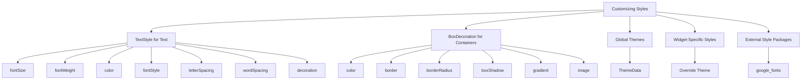

## 4.4.4 Customizing Styles

Creating a visually appealing and user-friendly app is crucial in today's competitive app market. Flutter, with its rich set of styling capabilities, allows developers to customize the appearance of widgets to match the desired aesthetics. In this section, we will delve into various styling techniques in Flutter, focusing on customizing text, decorating containers, applying themes, and utilizing external style packages. By the end of this section, you'll be equipped with the knowledge to create a beautifully styled personal profile app.

### Introduction to Styling in Flutter

Flutter's styling capabilities are extensive, offering developers the flexibility to tailor the appearance of widgets to suit their design vision. Whether you're aiming for a minimalist look or a vibrant, colorful interface, Flutter provides the tools to achieve your goals. Styling in Flutter is not just about aesthetics; it's about creating a cohesive and engaging user experience.

### Using TextStyle for Text Customization

Text is a fundamental component of any app, and customizing its appearance can significantly enhance the user interface. Flutter's `TextStyle` class offers a variety of properties to modify text appearance, allowing you to create text that aligns with your app's theme and branding.

#### Properties of TextStyle

- **`fontSize`**: Controls the size of the text. Larger values increase the text size, making it more prominent.
- **`fontWeight`**: Determines the thickness of the font. Options range from `FontWeight.w100` (thin) to `FontWeight.w900` (black).
- **`color`**: Sets the color of the text. Use predefined colors or define custom colors using `Color`.
- **`fontStyle`**: Specifies whether the text is italic or normal. Use `FontStyle.italic` for italicized text.
- **`letterSpacing`**: Adjusts the spacing between letters, useful for creating a more open or condensed look.
- **`wordSpacing`**: Modifies the spacing between words, enhancing readability.
- **`decoration`**: Adds visual effects like underlines, overlines, or line-throughs to text.

#### Code Example

Here's a practical example of customizing text using `TextStyle`:

```dart
Text(
  'Customized Text',
  style: TextStyle(
    fontSize: 20,
    fontWeight: FontWeight.w600,
    color: Colors.deepPurple,
    fontStyle: FontStyle.italic,
    letterSpacing: 1.5,
    decoration: TextDecoration.underline,
  ),
);
```

In this example, the text is styled with a font size of 20, a semi-bold weight, deep purple color, italic style, increased letter spacing, and an underline decoration.

### Decorating Containers

Containers are versatile widgets in Flutter that can be styled using the `BoxDecoration` class. This class provides numerous properties to enhance the visual appeal of containers, making them suitable for various design needs.

#### BoxDecoration Properties

- **`color`**: Sets the background color of the container.
- **`border`**: Adds a border around the container, customizable in terms of color, width, and style.
- **`borderRadius`**: Rounds the corners of the container, creating a softer look.
- **`boxShadow`**: Applies shadow effects, adding depth and dimension to the container.
- **`gradient`**: Creates a gradient background, offering a smooth transition between colors.
- **`image`**: Sets a background image for the container.

#### Code Example

Here's how you can style a container using `BoxDecoration`:

```dart
Container(
  width: 200,
  height: 200,
  decoration: BoxDecoration(
    color: Colors.orangeAccent,
    border: Border.all(color: Colors.black, width: 2.0),
    borderRadius: BorderRadius.circular(15.0),
    boxShadow: [
      BoxShadow(
        color: Colors.grey.withOpacity(0.5),
        spreadRadius: 5,
        blurRadius: 7,
        offset: Offset(0, 3), // changes position of shadow
      ),
    ],
    gradient: LinearGradient(
      colors: [Colors.orange, Colors.deepOrange],
      begin: Alignment.topLeft,
      end: Alignment.bottomRight,
    ),
  ),
);
```

This example demonstrates a container with an orange gradient background, a black border, rounded corners, and a subtle shadow effect.

### Applying Themes for Consistent Styling

Themes in Flutter allow you to define global styles that ensure consistency across your app. By using `ThemeData`, you can set default styles for various widgets, reducing the need for repetitive styling code.

#### Global Theme Customization

To apply a global theme, define a `ThemeData` object in the `MaterialApp` widget. This object can specify colors, text styles, button styles, and more.

#### Code Example

```dart
MaterialApp(
  theme: ThemeData(
    primaryColor: Colors.teal,
    accentColor: Colors.amber,
    textTheme: TextTheme(
      headline6: TextStyle(fontSize: 20.0, fontWeight: FontWeight.bold),
      bodyText2: TextStyle(fontSize: 16.0, color: Colors.black87),
    ),
    elevatedButtonTheme: ElevatedButtonThemeData(
      style: ElevatedButton.styleFrom(
        primary: Colors.teal,
        onPrimary: Colors.white,
        textStyle: TextStyle(fontSize: 16, fontWeight: FontWeight.bold),
      ),
    ),
  ),
  home: MyHomePage(),
);
```

In this example, the theme sets a teal primary color, an amber accent color, and defines text styles for headlines and body text. It also customizes the appearance of elevated buttons.

#### Widget-Specific Styles

While global themes provide consistency, there may be instances where you need to override these styles for specific widgets. This can be achieved by applying styles directly to the widget.

#### Code Example

```dart
Text(
  'Themed Text',
  style: Theme.of(context).textTheme.headline6?.copyWith(color: Colors.red),
);
```

Here, the text uses the headline6 style from the theme but overrides the color to red.

### Using External Style Packages

Flutter's styling capabilities can be extended with external packages like `google_fonts`, which allows you to use a wide range of custom fonts in your app.

#### Code Example with `google_fonts`

```dart
import 'package:google_fonts/google_fonts.dart';

Text(
  'Custom Font Text',
  style: GoogleFonts.lato(
    textStyle: TextStyle(color: Colors.blue, fontSize: 20),
  ),
);
```

This example demonstrates how to apply the Lato font from Google Fonts, with a blue color and a font size of 20.

### Mermaid.js Diagram

To visualize the different aspects of styling in Flutter, refer to the following diagram:



### Conclusion

Styling is a powerful tool in Flutter that allows you to create visually appealing and user-friendly apps. By mastering `TextStyle`, `BoxDecoration`, themes, and external packages, you can develop a unique design aesthetic that enhances the user experience. Experiment with different styles to understand their impact on the UI, and don't hesitate to explore additional resources to deepen your understanding of Flutter's styling capabilities.

### Additional Resources

- [Flutter Documentation on Styling](https://flutter.dev/docs/development/ui/widgets)
- [Google Fonts Package](https://pub.dev/packages/google_fonts)
- [Material Design Guidelines](https://material.io/design)

## Quiz Time!



### What property of TextStyle is used to make text italic?

- [ ] fontWeight
- [ ] color
- [x] fontStyle
- [ ] letterSpacing

> **Explanation:** The `fontStyle` property is used to make text italic by setting it to `FontStyle.italic`.

### Which BoxDecoration property is used to add a shadow effect to a container?

- [ ] border
- [ ] gradient
- [x] boxShadow
- [ ] borderRadius

> **Explanation:** The `boxShadow` property is used to add shadow effects to a container.

### How can you override a global theme style for a specific widget?

- [ ] By using a different MaterialApp
- [x] By applying a style directly to the widget
- [ ] By changing the ThemeData
- [ ] By using a different context

> **Explanation:** You can override a global theme style for a specific widget by applying a style directly to the widget.

### What package can be used to include custom fonts in a Flutter app?

- [ ] flutter_icons
- [x] google_fonts
- [ ] font_awesome_flutter
- [ ] custom_fonts

> **Explanation:** The `google_fonts` package allows you to include custom fonts in a Flutter app.

### Which property of TextStyle controls the thickness of the font?

- [x] fontWeight
- [ ] fontSize
- [ ] fontStyle
- [ ] decoration

> **Explanation:** The `fontWeight` property controls the thickness of the font.

### What is the purpose of the `ThemeData` class in Flutter?

- [ ] To create animations
- [x] To define global styles for the app
- [ ] To manage state
- [ ] To handle navigation

> **Explanation:** The `ThemeData` class is used to define global styles for the app, ensuring consistency across widgets.

### Which BoxDecoration property is used to create rounded corners?

- [ ] boxShadow
- [ ] gradient
- [x] borderRadius
- [ ] color

> **Explanation:** The `borderRadius` property is used to create rounded corners for a container.

### What does the `letterSpacing` property in TextStyle do?

- [ ] Changes the color of the text
- [ ] Adjusts the size of the text
- [x] Adjusts the spacing between letters
- [ ] Adds a shadow to the text

> **Explanation:** The `letterSpacing` property adjusts the spacing between letters in the text.

### Can you use multiple fonts in a single Flutter app?

- [x] True
- [ ] False

> **Explanation:** Yes, you can use multiple fonts in a single Flutter app by applying different `TextStyle` configurations or using packages like `google_fonts`.

### What is the benefit of using themes in Flutter?

- [ ] To make the app run faster
- [x] To ensure consistent styling across the app
- [ ] To reduce app size
- [ ] To improve security

> **Explanation:** Using themes in Flutter ensures consistent styling across the app, making it easier to maintain and update the design.


