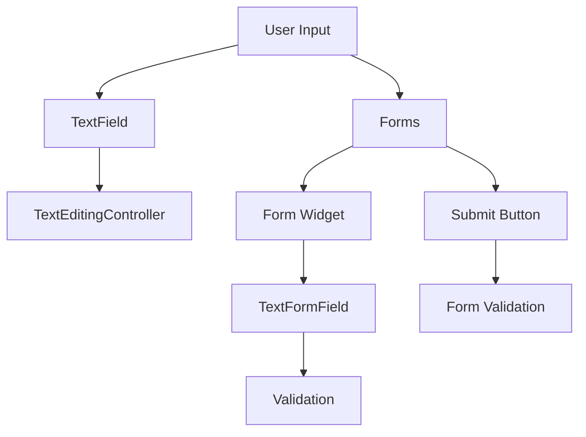

## 5.1.1 TextField and Forms

In the realm of mobile app development, capturing user input is a fundamental aspect that can significantly influence the user experience. Flutter, with its rich set of widgets, provides powerful tools to handle user input seamlessly. Among these, the `TextField` and `Form` widgets stand out as essential components for creating interactive and user-friendly applications. This section delves into the intricacies of these widgets, offering insights, practical examples, and best practices to help you master their usage in your Flutter projects.

### Introduction to TextField

The `TextField` widget in Flutter is a versatile and customizable tool designed to accept user input. Whether you're building a search bar, a login form, or a data entry field, `TextField` provides the flexibility and functionality needed to capture and manage text input effectively.

#### Key Features of TextField

- **Versatility**: `TextField` can be tailored to fit various input scenarios, from simple text entry to complex data forms.
- **Customization**: With numerous styling options, you can customize the appearance of `TextField` to match your app's design.
- **Interactivity**: `TextField` supports user interactions such as focus, selection, and cursor movement, enhancing the overall user experience.

### Basic Usage of TextField

To illustrate the basic usage of `TextField`, let's consider a simple example where we create a text input field with a label and border.

```dart
TextField(
  decoration: InputDecoration(
    border: OutlineInputBorder(),
    labelText: 'Enter your name',
  ),
);
```

#### Explanation

- **`decoration`**: This property allows you to add visual elements to the `TextField`, such as borders, labels, and icons.
- **`OutlineInputBorder`**: Creates a border around the `TextField`, providing a clear visual boundary for the input area.
- **`labelText`**: Displays a floating label inside the `TextField`, guiding users on what information to enter.

### Handling User Input

To effectively manage the text entered by users, Flutter provides the `TextEditingController`. This controller not only retrieves the input text but also allows you to manipulate it programmatically.

```dart
final TextEditingController _controller = TextEditingController();

@override
void dispose() {
  _controller.dispose();
  super.dispose();
}

TextField(
  controller: _controller,
  decoration: InputDecoration(
    border: OutlineInputBorder(),
    labelText: 'Enter your name',
  ),
);
```

#### Explanation

- **`TextEditingController`**: This controller is used to manage the text being edited. It provides methods to get and set the text, listen for changes, and clear the input.
- **`dispose()`**: It's crucial to dispose of the controller when it's no longer needed to free up resources and prevent memory leaks.

### Introduction to Forms

While `TextField` is excellent for individual input fields, managing multiple fields can become cumbersome. This is where the `Form` widget comes into play. `Form` widgets group multiple input fields together, providing a unified way to validate and manage form data.

### Creating a Form

Let's create a simple form with an email input field and a submit button. We'll also incorporate validation to ensure the entered email is valid.

```dart
final _formKey = GlobalKey<FormState>();

Form(
  key: _formKey,
  child: Column(
    children: <Widget>[
      TextFormField(
        decoration: InputDecoration(labelText: 'Email'),
        validator: (value) {
          if (value == null || value.isEmpty) {
            return 'Please enter your email';
          }
          if (!value.contains('@')) {
            return 'Please enter a valid email';
          }
          return null;
        },
      ),
      ElevatedButton(
        onPressed: () {
          if (_formKey.currentState!.validate()) {
            // Process data
          }
        },
        child: Text('Submit'),
      ),
    ],
  ),
);
```

#### Explanation

- **`GlobalKey<FormState>`**: This key uniquely identifies the form and allows you to perform operations such as validation and data retrieval.
- **`validator`**: A function that checks the input for validity. It returns an error message if the input is invalid or `null` if it's valid.
- **`validate()`**: This method checks all form fields for validation, returning `true` if all fields are valid.

### Visualizing the Flow with Mermaid.js

To better understand the flow from user input to form submission and validation, let's visualize it using a Mermaid.js diagram.



### Best Practices and Common Pitfalls

#### Best Practices

- **Consistent Styling**: Ensure that all `TextField` widgets in your app have a consistent style for a cohesive user experience.
- **Resource Management**: Always dispose of `TextEditingController` instances to prevent memory leaks.
- **User Feedback**: Provide immediate feedback for invalid input using the `validator` function.

#### Common Pitfalls

- **Ignoring Disposal**: Failing to dispose of controllers can lead to memory leaks and degraded app performance.
- **Overlooking Validation**: Skipping validation can result in incorrect or incomplete data being processed.

### Practical Example: Building a Login Form

Let's apply what we've learned by building a simple login form with email and password fields.

```dart
final _loginFormKey = GlobalKey<FormState>();
final TextEditingController _emailController = TextEditingController();
final TextEditingController _passwordController = TextEditingController();

@override
void dispose() {
  _emailController.dispose();
  _passwordController.dispose();
  super.dispose();
}

Form(
  key: _loginFormKey,
  child: Column(
    children: <Widget>[
      TextFormField(
        controller: _emailController,
        decoration: InputDecoration(labelText: 'Email'),
        validator: (value) {
          if (value == null || value.isEmpty) {
            return 'Please enter your email';
          }
          if (!value.contains('@')) {
            return 'Please enter a valid email';
          }
          return null;
        },
      ),
      TextFormField(
        controller: _passwordController,
        decoration: InputDecoration(labelText: 'Password'),
        obscureText: true,
        validator: (value) {
          if (value == null || value.isEmpty) {
            return 'Please enter your password';
          }
          if (value.length < 6) {
            return 'Password must be at least 6 characters long';
          }
          return null;
        },
      ),
      ElevatedButton(
        onPressed: () {
          if (_loginFormKey.currentState!.validate()) {
            // Process login
          }
        },
        child: Text('Login'),
      ),
    ],
  ),
);
```

### Encouraging Hands-On Practice

To solidify your understanding, try extending the login form example by adding a "Remember Me" checkbox and a "Forgot Password" link. Consider how you might handle these additional inputs and actions within the form.

### Conclusion

Mastering `TextField` and `Form` widgets in Flutter is crucial for creating interactive and user-friendly applications. By understanding their capabilities and best practices, you can build robust forms that enhance the user experience and ensure data integrity.

### Further Reading and Resources

- [Flutter Official Documentation](https://flutter.dev/docs)
- [Dart Language Tour](https://dart.dev/guides/language/language-tour)
- [Effective Dart: Style](https://dart.dev/guides/language/effective-dart/style)

## Quiz Time!



### What is the primary purpose of the `TextField` widget in Flutter?

- [x] To accept and manage user text input
- [ ] To display images
- [ ] To handle animations
- [ ] To create navigation bars

> **Explanation:** The `TextField` widget is primarily used to accept and manage user text input in Flutter applications.

### Which property of `TextField` is used to add visual elements like borders and labels?

- [x] `decoration`
- [ ] `controller`
- [ ] `style`
- [ ] `textAlign`

> **Explanation:** The `decoration` property is used to add visual elements such as borders and labels to a `TextField`.

### What is the role of `TextEditingController` in a `TextField`?

- [x] To manage the text being edited
- [ ] To style the text
- [ ] To handle form submission
- [ ] To validate input

> **Explanation:** `TextEditingController` is used to manage the text being edited in a `TextField`, allowing you to retrieve and manipulate the input.

### Why is it important to dispose of a `TextEditingController`?

- [x] To free resources and prevent memory leaks
- [ ] To change the text color
- [ ] To reset the form
- [ ] To validate the input

> **Explanation:** Disposing of a `TextEditingController` is important to free resources and prevent memory leaks in your application.

### What does the `validator` function in a `TextFormField` do?

- [x] Checks the input for validity
- [ ] Styles the input field
- [ ] Submits the form
- [ ] Changes the input type

> **Explanation:** The `validator` function checks the input for validity and returns an error message if the input is invalid.

### How do you trigger form validation in Flutter?

- [x] By calling the `validate()` method on the form's state
- [ ] By pressing the back button
- [ ] By changing the form's key
- [ ] By disposing of the form

> **Explanation:** Form validation is triggered by calling the `validate()` method on the form's state, which checks all fields for validity.

### What is the purpose of a `GlobalKey<FormState>` in a form?

- [x] To uniquely identify the form and allow validation
- [ ] To style the form
- [ ] To submit the form
- [ ] To change the form's layout

> **Explanation:** A `GlobalKey<FormState>` uniquely identifies the form and allows you to perform operations such as validation and data retrieval.

### Which widget is used to group multiple input fields together in Flutter?

- [x] `Form`
- [ ] `Column`
- [ ] `Row`
- [ ] `Container`

> **Explanation:** The `Form` widget is used to group multiple input fields together, providing a unified way to validate and manage form data.

### What is the benefit of using `TextFormField` over `TextField` in a form?

- [x] It provides built-in validation capabilities
- [ ] It automatically submits the form
- [ ] It changes the text color
- [ ] It handles animations

> **Explanation:** `TextFormField` provides built-in validation capabilities, making it more suitable for use within a form compared to `TextField`.

### True or False: The `TextField` widget can be used to handle complex data forms without any additional widgets.

- [ ] True
- [x] False

> **Explanation:** False. While `TextField` is useful for individual input fields, handling complex data forms typically requires additional widgets like `Form` and `TextFormField` for validation and management.


