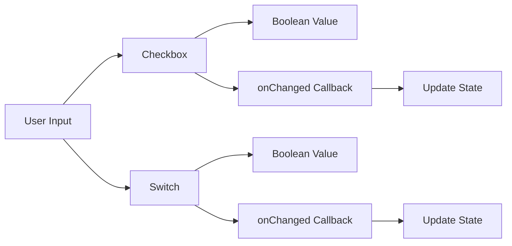

## 5.1.2 Checkboxes and Switches

In the realm of mobile app development, user interaction is a cornerstone of creating engaging and functional applications. Flutter, with its rich set of widgets, provides developers with powerful tools to capture user input effectively. Among these tools, `Checkbox` and `Switch` widgets stand out for their simplicity and versatility in handling binary choices. This section delves into the intricacies of these widgets, offering insights into their usage, customization, and implementation in real-world scenarios.

### Introduction to Checkboxes

Checkboxes are fundamental UI components that allow users to select one or more options from a set. They are particularly useful for binary choices or scenarios where multiple selections are permissible. In Flutter, the `Checkbox` widget is a straightforward way to implement this functionality, providing a familiar interface for users.

#### Basic Usage of Checkbox

The `Checkbox` widget in Flutter is designed to be simple yet effective. Here's a basic example to illustrate its usage:

```dart
bool _isChecked = false;

Checkbox(
  value: _isChecked,
  onChanged: (bool? newValue) {
    setState(() {
      _isChecked = newValue!;
    });
  },
);
```

**Explanation:**

- **`value`:** This property represents the current state of the checkbox, indicating whether it is checked (`true`) or unchecked (`false`).
- **`onChanged`:** This callback is triggered whenever the user toggles the checkbox. It receives the new value of the checkbox as a parameter.
- **`setState`:** This method is crucial for updating the UI in response to state changes. It ensures that the widget reflects the current state of the checkbox.

### Introduction to Switch

The `Switch` widget is akin to a `Checkbox` but offers a more intuitive toggle mechanism for switching between on and off states. It is often used in settings or preferences screens where users need to enable or disable features.

#### Basic Usage of Switch

Here's a simple example demonstrating the use of a `Switch` widget:

```dart
bool _isSwitched = false;

Switch(
  value: _isSwitched,
  onChanged: (bool newValue) {
    setState(() {
      _isSwitched = newValue;
    });
  },
);
```

**Explanation:**

- **`value`:** Similar to the `Checkbox`, this property indicates the current state of the switch.
- **`onChanged`:** This callback is invoked when the switch is toggled, allowing the state to be updated accordingly.

### Customization of Checkboxes and Switches

Flutter provides several properties to customize the appearance of `Checkbox` and `Switch` widgets, enabling developers to align them with the app's design language.

#### Checkbox Customization

- **Active Color:** You can change the color of the checkbox when it is checked using the `activeColor` property.

  ```dart
  Checkbox(
    value: _isChecked,
    onChanged: (bool? newValue) {
      setState(() {
        _isChecked = newValue!;
      });
    },
    activeColor: Colors.green,
  );
  ```

#### Switch Customization

- **Active Track Color and Thumb Color:** These properties allow you to customize the track and thumb colors of the switch when it is active.

  ```dart
  Switch(
    value: _isSwitched,
    onChanged: (bool newValue) {
      setState(() {
        _isSwitched = newValue;
      });
    },
    activeTrackColor: Colors.lightGreenAccent,
    activeColor: Colors.green,
  );
  ```

### Handling Multiple Checkboxes

In many applications, you may need to manage multiple checkboxes, such as in a list of selectable items. Flutter makes this task straightforward with its flexible widget system.

#### Code Example for Multiple Checkboxes

```dart
List<String> _fruits = ['Apple', 'Banana', 'Cherry'];
List<bool> _isCheckedList = [false, false, false];

Column(
  children: List.generate(_fruits.length, (index) {
    return Row(
      children: [
        Checkbox(
          value: _isCheckedList[index],
          onChanged: (bool? value) {
            setState(() {
              _isCheckedList[index] = value!;
            });
          },
        ),
        Text(_fruits[index]),
      ],
    );
  }),
);
```

**Explanation:**

- This example manages a list of checkboxes corresponding to a list of items (`_fruits`).
- The `List.generate` method is used to dynamically create a row for each item, containing a `Checkbox` and a `Text` widget.
- The state of each checkbox is stored in the `_isCheckedList`, which is updated whenever a checkbox is toggled.

### Visualizing the Flow with Mermaid.js

To better understand the flow from user interaction to state updates, consider the following diagram:



This diagram illustrates how user input through checkboxes and switches leads to state changes, which are then reflected in the UI.

### Best Practices and Common Pitfalls

- **State Management:** Always ensure that the state of your checkboxes and switches is managed efficiently. Use `setState` judiciously to avoid unnecessary rebuilds.
- **Accessibility:** Consider accessibility features, such as labels and semantics, to make your app usable for all users.
- **Consistency:** Maintain consistency in the appearance and behavior of checkboxes and switches across your app to provide a cohesive user experience.

### Practical Applications and Real-World Scenarios

Checkboxes and switches are ubiquitous in mobile applications. Here are some common use cases:

- **Settings Screens:** Use switches to enable or disable features, such as notifications or dark mode.
- **Forms:** Incorporate checkboxes for selecting multiple options, such as interests or preferences.
- **Task Lists:** Implement checkboxes to mark tasks as complete or incomplete.

### Encouragement for Experimentation

As you integrate checkboxes and switches into your Flutter applications, don't hesitate to experiment with different styles and configurations. Consider how these widgets can enhance user interaction and streamline workflows within your app.

### Further Exploration and Resources

For more information on Flutter widgets and best practices, consider exploring the following resources:

- [Flutter Official Documentation](https://flutter.dev/docs)
- [Dart Language Tour](https://dart.dev/guides/language/language-tour)
- [Flutter Widget of the Week](https://www.youtube.com/playlist?list=PLjxrf2q8roU3ahJVrSgAnPjzkpGmL9Czl)

These resources provide a wealth of information to deepen your understanding of Flutter and its capabilities.

## Quiz Time!



### What is the primary use of a Checkbox widget in Flutter?

- [x] To allow users to select one or more options from a set.
- [ ] To toggle between on and off states.
- [ ] To display a list of items.
- [ ] To input text data.

> **Explanation:** The Checkbox widget is used to allow users to select one or more options from a set, making it suitable for binary choices or multiple selections.

### How does the `onChanged` callback function in a Checkbox widget?

- [x] It is triggered when the user toggles the checkbox.
- [ ] It updates the UI automatically.
- [ ] It changes the color of the checkbox.
- [ ] It resets the checkbox to its default state.

> **Explanation:** The `onChanged` callback is triggered when the user toggles the checkbox, allowing the developer to update the state accordingly.

### What property of the Switch widget indicates its current state?

- [x] `value`
- [ ] `activeColor`
- [ ] `onChanged`
- [ ] `trackColor`

> **Explanation:** The `value` property of the Switch widget indicates its current state, whether it is on or off.

### How can you customize the active color of a Checkbox?

- [x] By using the `activeColor` property.
- [ ] By using the `trackColor` property.
- [ ] By using the `thumbColor` property.
- [ ] By using the `backgroundColor` property.

> **Explanation:** The `activeColor` property is used to customize the color of the Checkbox when it is checked.

### Which method is used to update the UI in response to state changes in Flutter?

- [x] `setState`
- [ ] `updateUI`
- [ ] `refresh`
- [ ] `rebuild`

> **Explanation:** The `setState` method is used in Flutter to update the UI in response to state changes.

### What is a common use case for the Switch widget in mobile applications?

- [x] Enabling or disabling features in settings screens.
- [ ] Selecting multiple options in a form.
- [ ] Displaying a list of items.
- [ ] Inputting text data.

> **Explanation:** The Switch widget is commonly used in settings screens to enable or disable features, such as notifications or dark mode.

### How can you manage multiple checkboxes in a Flutter application?

- [x] By using a list to store the state of each checkbox.
- [ ] By using a single boolean variable for all checkboxes.
- [ ] By using a map to store the state of each checkbox.
- [ ] By using a set to store the state of each checkbox.

> **Explanation:** Managing multiple checkboxes can be efficiently done by using a list to store the state of each checkbox, allowing for dynamic updates.

### What is the purpose of the `List.generate` method in the context of checkboxes?

- [x] To dynamically create a list of widgets based on a given length.
- [ ] To sort a list of checkboxes.
- [ ] To filter a list of checkboxes.
- [ ] To remove duplicates from a list of checkboxes.

> **Explanation:** The `List.generate` method is used to dynamically create a list of widgets, such as checkboxes, based on a specified length.

### Which property of the Switch widget allows customization of the track color when active?

- [x] `activeTrackColor`
- [ ] `activeColor`
- [ ] `thumbColor`
- [ ] `backgroundColor`

> **Explanation:** The `activeTrackColor` property allows customization of the track color of the Switch widget when it is active.

### True or False: The `Checkbox` widget can be used for both single and multiple selections.

- [x] True
- [ ] False

> **Explanation:** True. The `Checkbox` widget can be used for both single and multiple selections, depending on how it is implemented in the application.


