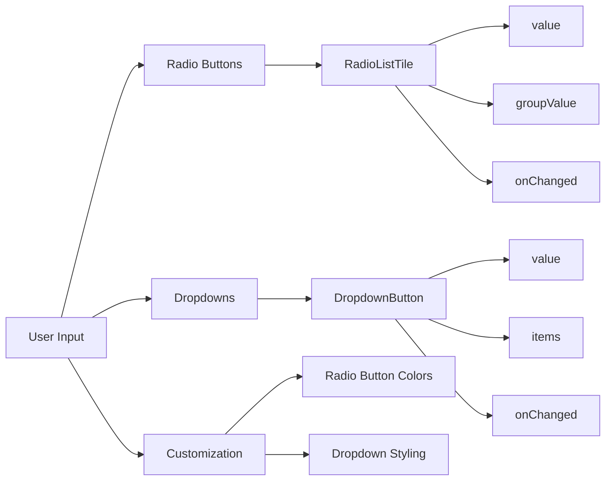

## 5.1.3 Radio Buttons and Dropdowns

In the world of mobile app development, user input is a critical component that can significantly influence the user experience. Flutter, with its rich set of widgets, provides developers with powerful tools to capture user input effectively. Among these tools, `Radio` buttons and `DropdownButton` widgets stand out for their ability to present a list of options from which users can select. This section will delve into the intricacies of these widgets, providing you with the knowledge to implement them in your Flutter applications confidently.

### Introduction to Radio Buttons

Radio buttons are a staple in user interface design, offering a simple way for users to select a single option from a predefined set. In Flutter, the `Radio` widget is used to create radio buttons, ensuring mutual exclusivity among options. This means that selecting one radio button automatically deselects any previously selected option within the same group.

#### Why Use Radio Buttons?

- **Mutual Exclusivity:** Radio buttons are ideal when you need to ensure that only one option can be selected at a time.
- **Clarity:** They provide a clear visual representation of available choices, making it easy for users to understand their options.
- **Simplicity:** Radio buttons are straightforward to implement and use, both for developers and end-users.

### Basic Usage of Radio Buttons

Let's explore how to implement radio buttons in Flutter with a practical example. Consider a scenario where you want to allow users to select between two options: "Option 1" and "Option 2".

```dart
String _selectedOption = 'Option 1';

Column(
  children: <Widget>[
    RadioListTile<String>(
      title: Text('Option 1'),
      value: 'Option 1',
      groupValue: _selectedOption,
      onChanged: (String? value) {
        setState(() {
          _selectedOption = value!;
        });
      },
    ),
    RadioListTile<String>(
      title: Text('Option 2'),
      value: 'Option 2',
      groupValue: _selectedOption,
      onChanged: (String? value) {
        setState(() {
          _selectedOption = value!;
        });
      },
    ),
  ],
);
```

#### Explanation:

- **`value`:** This represents the value associated with each radio button. It is used to identify which button is selected.
- **`groupValue`:** This is the currently selected value in the radio group. It ensures that only one radio button in the group can be selected at a time.
- **`onChanged`:** This callback is triggered when a radio button is selected. It updates the state to reflect the selected option.

### Introduction to Dropdowns

Dropdown menus are another essential UI component, providing a compact way to present a list of options. The `DropdownButton` widget in Flutter is perfect for scenarios where space is limited, such as forms and settings.

#### Why Use Dropdowns?

- **Space Efficiency:** Dropdowns save screen space by displaying options only when needed.
- **User-Friendly:** They are intuitive and familiar to users, making them a popular choice for input fields.
- **Versatility:** Dropdowns can handle a wide range of options, from simple lists to complex data sets.

### Basic Usage of DropdownButton

Here's a simple example of a dropdown menu that allows users to select a fruit from a list.

```dart
String _selectedFruit = 'Apple';

DropdownButton<String>(
  value: _selectedFruit,
  items: <String>['Apple', 'Banana', 'Cherry'].map((String value) {
    return DropdownMenuItem<String>(
      value: value,
      child: Text(value),
    );
  }).toList(),
  onChanged: (String? newValue) {
    setState(() {
      _selectedFruit = newValue!;
    });
  },
);
```

#### Explanation:

- **`value`:** This is the currently selected value in the dropdown.
- **`items`:** This is a list of `DropdownMenuItem` widgets, each representing an option in the dropdown.
- **`onChanged`:** This callback is triggered when a new item is selected, updating the state with the new selection.

### Customization of Radio Buttons and Dropdowns

Both radio buttons and dropdowns can be customized to match the design and functionality requirements of your app.

#### Customizing Radio Buttons

You can customize the appearance of radio buttons using properties like `activeColor` to change the color of the selected button.

```dart
RadioListTile<String>(
  title: Text('Option 1'),
  activeColor: Colors.red,
  value: 'Option 1',
  groupValue: _selectedOption,
  onChanged: (String? value) {
    setState(() {
      _selectedOption = value!;
    });
  },
);
```

#### Customizing DropdownButton

Dropdowns can be styled with icons, text styles, and more to enhance their appearance.

```dart
DropdownButton<String>(
  value: _selectedFruit,
  icon: Icon(Icons.arrow_downward),
  iconSize: 24,
  elevation: 16,
  style: TextStyle(color: Colors.deepPurple),
  underline: Container(
    height: 2,
    color: Colors.deepPurpleAccent,
  ),
  onChanged: (String? newValue) {
    setState(() {
      _selectedFruit = newValue!;
    });
  },
  items: <String>['Apple', 'Banana', 'Cherry'].map<DropdownMenuItem<String>>((String value) {
    return DropdownMenuItem<String>(
      value: value,
      child: Text(value),
    );
  }).toList(),
);
```

### Handling Grouped Radio Buttons

Radio buttons are grouped by sharing the same `groupValue`. This ensures that only one button in the group can be selected at a time.

#### Code Example

Consider a scenario where you want to allow users to select their gender.

```dart
String _gender = 'Male';

Column(
  children: <Widget>[
    RadioListTile<String>(
      title: const Text('Male'),
      value: 'Male',
      groupValue: _gender,
      onChanged: (String? value) {
        setState(() {
          _gender = value!;
        });
      },
    ),
    RadioListTile<String>(
      title: const Text('Female'),
      value: 'Female',
      groupValue: _gender,
      onChanged: (String? value) {
        setState(() {
          _gender = value!;
        });
      },
    ),
  ],
);
```

### Visualizing User Input Flow

To better understand the flow of user input through these widgets, let's visualize it using a Mermaid.js diagram.



### Best Practices and Common Pitfalls

- **State Management:** Ensure that the state is properly managed to reflect the current selection. Use `setState` judiciously to update the UI.
- **Accessibility:** Provide clear labels and descriptions for radio buttons and dropdown items to enhance accessibility.
- **Consistency:** Maintain a consistent design language across your app by customizing widgets to match your app's theme.
- **Testing:** Test the widgets on different devices and screen sizes to ensure they function correctly and look good.

### Conclusion

Radio buttons and dropdowns are powerful tools for capturing user input in Flutter applications. By understanding their basic usage, customization options, and best practices, you can create intuitive and efficient user interfaces. Experiment with these widgets in your projects, and consider how they can enhance the user experience.

### Further Reading and Resources

- [Flutter Official Documentation](https://flutter.dev/docs)
- [Dart Language Tour](https://dart.dev/guides/language/language-tour)
- [Flutter Widget Catalog](https://flutter.dev/docs/development/ui/widgets)
- [Effective Dart: Style](https://dart.dev/guides/language/effective-dart/style)

## Quiz Time!



### What is the primary purpose of radio buttons in a user interface?

- [x] To allow users to select a single option from a set
- [ ] To allow users to select multiple options from a set
- [ ] To display a list of options without selection
- [ ] To provide a text input field

> **Explanation:** Radio buttons are used to allow users to select a single option from a set, ensuring mutual exclusivity.

### In the provided radio button example, what does the `groupValue` property represent?

- [x] The currently selected value in the radio group
- [ ] The default value of the radio button
- [ ] The label of the radio button
- [ ] The callback function for the radio button

> **Explanation:** The `groupValue` property represents the currently selected value in the radio group, ensuring only one button is selected at a time.

### What is the role of the `onChanged` callback in a `DropdownButton` widget?

- [x] To update the state when a new item is selected
- [ ] To initialize the dropdown with default values
- [ ] To style the dropdown items
- [ ] To add icons to the dropdown

> **Explanation:** The `onChanged` callback is triggered when a new item is selected, allowing the state to be updated with the new selection.

### How can you customize the color of a selected radio button?

- [x] By using the `activeColor` property
- [ ] By using the `backgroundColor` property
- [ ] By using the `color` property
- [ ] By using the `style` property

> **Explanation:** The `activeColor` property is used to customize the color of a selected radio button.

### Which widget is used to create a dropdown menu in Flutter?

- [x] `DropdownButton`
- [ ] `DropdownMenu`
- [ ] `SelectBox`
- [ ] `OptionList`

> **Explanation:** The `DropdownButton` widget is used to create a dropdown menu in Flutter.

### What is the purpose of the `value` property in a `DropdownButton`?

- [x] To indicate the currently selected value
- [ ] To list all possible values
- [ ] To style the dropdown
- [ ] To add icons to the dropdown

> **Explanation:** The `value` property indicates the currently selected value in the dropdown.

### How do you ensure mutual exclusivity among radio buttons?

- [x] By sharing the same `groupValue`
- [ ] By using different `value` properties
- [ ] By setting `exclusive` to true
- [ ] By using a `RadioGroup` widget

> **Explanation:** Mutual exclusivity among radio buttons is ensured by sharing the same `groupValue`.

### What is a common use case for dropdown menus?

- [x] Presenting a list of options in a compact form
- [ ] Displaying a large amount of text
- [ ] Allowing multiple selections
- [ ] Providing a text input field

> **Explanation:** Dropdown menus are commonly used to present a list of options in a compact form, saving screen space.

### Which property of `DropdownButton` is used to add an icon?

- [x] `icon`
- [ ] `iconSize`
- [ ] `style`
- [ ] `underline`

> **Explanation:** The `icon` property is used to add an icon to a `DropdownButton`.

### True or False: Radio buttons can be used to select multiple options at once.

- [ ] True
- [x] False

> **Explanation:** False. Radio buttons are designed to allow only one option to be selected at a time, ensuring mutual exclusivity.


