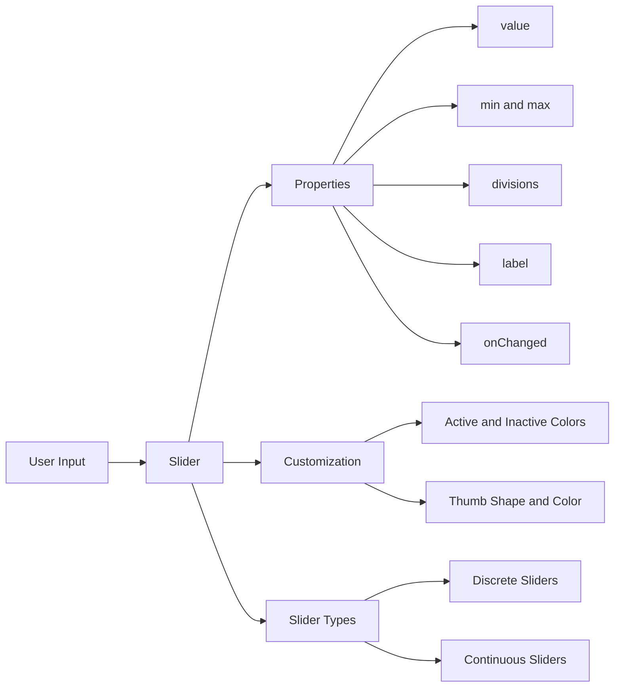

## 5.1.4 Sliders

In the world of mobile app development, providing intuitive and interactive user interfaces is crucial for enhancing user experience. One such interactive widget in Flutter is the `Slider`. Sliders are versatile UI components that allow users to select a value from a continuous or discrete range by dragging a thumb along a track. They are commonly used for adjusting settings like volume, brightness, or selecting a numerical value within a specified range. In this section, we will delve into the intricacies of using sliders in Flutter, covering everything from basic usage to advanced customization.

### Introduction to Sliders

Sliders are an essential part of many applications, providing a simple yet effective way for users to input data. They are particularly useful when you want to allow users to select a value from a range, such as adjusting the volume of a media player or setting the brightness of a display.

#### Key Features of Sliders:
- **Interactive Control:** Users can easily adjust the value by sliding a thumb along a track.
- **Visual Feedback:** The current value is often displayed as a label, providing immediate feedback to the user.
- **Customizable Appearance:** Sliders can be customized in terms of color, shape, and behavior to match the app's design.

### Basic Usage of Slider

Let's start with a simple example of implementing a `Slider` widget in Flutter. This example demonstrates the basic properties and how to handle state changes when the slider is moved.

```dart
import 'package:flutter/material.dart';

class BasicSliderExample extends StatefulWidget {
  @override
  _BasicSliderExampleState createState() => _BasicSliderExampleState();
}

class _BasicSliderExampleState extends State<BasicSliderExample> {
  double _currentValue = 0.5;

  @override
  Widget build(BuildContext context) {
    return Scaffold(
      appBar: AppBar(
        title: Text('Basic Slider Example'),
      ),
      body: Center(
        child: Slider(
          value: _currentValue,
          min: 0.0,
          max: 1.0,
          divisions: 10,
          label: (_currentValue * 100).round().toString(),
          onChanged: (double newValue) {
            setState(() {
              _currentValue = newValue;
            });
          },
        ),
      ),
    );
  }
}
```

#### Explanation:
- **`value`:** Represents the current value of the slider. It is a double and should be within the range defined by `min` and `max`.
- **`min` and `max`:** Define the range of the slider. In this example, the range is from 0.0 to 1.0.
- **`divisions`:** Specifies the number of discrete intervals within the range. Setting this to 10 divides the slider into 10 equal parts.
- **`label`:** Displays the current value as a label when the thumb is dragged. This provides visual feedback to the user.
- **`onChanged`:** A callback function that is triggered whenever the slider value changes. It updates the state with the new value.

### Customizing Sliders

Flutter provides extensive customization options for sliders, allowing you to tailor their appearance and behavior to fit your application's design.

#### Active and Inactive Colors

You can customize the colors of the active and inactive parts of the slider track to enhance the visual appeal of your app.

```dart
Slider(
  value: _currentValue,
  min: 0.0,
  max: 100.0,
  divisions: 20,
  label: _currentValue.round().toString(),
  activeColor: Colors.green,
  inactiveColor: Colors.grey,
  onChanged: (double newValue) {
    setState(() {
      _currentValue = newValue;
    });
  },
);
```

- **`activeColor`:** The color of the track between the minimum value and the current thumb position.
- **`inactiveColor`:** The color of the track between the current thumb position and the maximum value.

#### Changing the Thumb Shape and Color

Using the `SliderTheme` widget, you can customize the thumb's shape and color, providing a unique look to your slider.

```dart
SliderTheme(
  data: SliderTheme.of(context).copyWith(
    thumbColor: Colors.red,
    thumbShape: RoundSliderThumbShape(enabledThumbRadius: 12.0),
  ),
  child: Slider(
    value: _currentValue,
    min: 0.0,
    max: 100.0,
    divisions: 10,
    label: _currentValue.round().toString(),
    onChanged: (double newValue) {
      setState(() {
        _currentValue = newValue;
      });
    },
  ),
);
```

- **`thumbColor`:** Sets the color of the slider's thumb.
- **`thumbShape`:** Allows customization of the thumb's shape. `RoundSliderThumbShape` is used here to create a round thumb with a specified radius.

### Discrete vs. Continuous Sliders

Sliders can be either discrete or continuous, depending on whether they allow selection of specific intervals or any value within the range.

#### Discrete Sliders

Discrete sliders are divided into specific intervals using the `divisions` property. This prevents users from selecting values between these intervals.

```dart
Slider(
  value: _currentValue,
  min: 0,
  max: 10,
  divisions: 10,
  label: _currentValue.round().toString(),
  onChanged: (double value) {
    setState(() {
      _currentValue = value;
    });
  },
);
```

- **Use Case:** Ideal for scenarios where only specific values are meaningful, such as selecting a rating from 1 to 10.

#### Continuous Sliders

Continuous sliders allow selection of any value within the range when `divisions` is null.

```dart
Slider(
  value: _currentValue,
  min: 0.0,
  max: 100.0,
  onChanged: (double value) {
    setState(() {
      _currentValue = value;
    });
  },
);
```

- **Use Case:** Suitable for settings like volume or brightness, where any value within the range is valid.

### Visualizing Slider Structure with Mermaid.js

To better understand the structure and customization options of sliders, let's visualize it using a Mermaid.js diagram.



### Best Practices and Common Pitfalls

#### Best Practices:
- **Provide Visual Feedback:** Always use the `label` property to display the current value, enhancing user interaction.
- **Use Appropriate Ranges:** Ensure the `min` and `max` values are suitable for the context, providing meaningful user input.
- **Customize Thoughtfully:** While customization is powerful, ensure that the slider's appearance remains intuitive and accessible.

#### Common Pitfalls:
- **Ignoring State Management:** Always manage the slider's state using `setState` or a state management solution to ensure the UI updates correctly.
- **Over-customization:** Excessive customization can lead to a confusing UI. Maintain a balance between aesthetics and usability.

### Real-World Application and Use Cases

Sliders are widely used in various applications, from media players to settings panels. Here are a few real-world scenarios:

- **Volume Control:** Adjusting the audio level in a media player.
- **Brightness Adjustment:** Setting the screen brightness in a settings menu.
- **Price Range Selector:** Allowing users to filter products by price in an e-commerce app.

### Encouraging Hands-On Practice

To solidify your understanding of sliders, try implementing a custom slider in your project. Experiment with different colors, shapes, and behaviors to see how they affect user interaction. Consider extending the examples provided by adding additional features, such as displaying the selected value in a separate widget or integrating the slider with other input methods.

### Further Exploration and Resources

For more in-depth knowledge and advanced techniques, consider exploring the following resources:

- **Flutter Documentation:** [Slider Class](https://api.flutter.dev/flutter/material/Slider-class.html)
- **Flutter Widget of the Week:** [Slider Video](https://www.youtube.com/watch?v=ufb4gIPDmEs)
- **Online Courses:** Platforms like Udemy and Coursera offer courses on Flutter development that cover UI components in detail.

By mastering sliders, you can create more interactive and user-friendly applications, enhancing the overall user experience.

## Quiz Time!



### What is a primary use case for a slider in a mobile application?

- [x] Adjusting settings like volume or brightness
- [ ] Displaying static text
- [ ] Navigating between screens
- [ ] Submitting a form

> **Explanation:** Sliders are typically used for adjusting settings like volume or brightness, where a user needs to select a value from a range.

### Which property of the `Slider` widget defines the current value?

- [x] `value`
- [ ] `min`
- [ ] `max`
- [ ] `label`

> **Explanation:** The `value` property represents the current value of the slider.

### How can you divide a slider into specific intervals?

- [x] By setting the `divisions` property
- [ ] By setting the `label` property
- [ ] By setting the `activeColor` property
- [ ] By setting the `thumbColor` property

> **Explanation:** The `divisions` property divides the slider into specific intervals, making it discrete.

### What does the `onChanged` callback do in a `Slider` widget?

- [x] It updates the state when the slider value changes
- [ ] It sets the initial value of the slider
- [ ] It changes the slider's color
- [ ] It defines the slider's range

> **Explanation:** The `onChanged` callback is triggered whenever the slider value changes, allowing you to update the state.

### Which property would you use to customize the color of the slider's thumb?

- [x] `thumbColor`
- [ ] `activeColor`
- [ ] `inactiveColor`
- [ ] `label`

> **Explanation:** The `thumbColor` property is used to customize the color of the slider's thumb.

### What is the effect of setting the `divisions` property to null?

- [x] The slider becomes continuous
- [ ] The slider becomes discrete
- [ ] The slider's color changes
- [ ] The slider's label is hidden

> **Explanation:** Setting the `divisions` property to null makes the slider continuous, allowing selection of any value within the range.

### How can you customize the shape of the slider's thumb?

- [x] By using the `thumbShape` property in `SliderTheme`
- [ ] By using the `label` property
- [ ] By using the `value` property
- [ ] By using the `min` and `max` properties

> **Explanation:** The `thumbShape` property in `SliderTheme` allows you to customize the shape of the slider's thumb.

### What is a common pitfall when using sliders in Flutter?

- [x] Ignoring state management
- [ ] Using too many colors
- [ ] Setting the `value` property
- [ ] Using the `label` property

> **Explanation:** Ignoring state management can lead to issues where the UI does not update correctly when the slider value changes.

### Which widget is used to apply custom themes to sliders?

- [x] `SliderTheme`
- [ ] `Container`
- [ ] `Row`
- [ ] `Column`

> **Explanation:** `SliderTheme` is used to apply custom themes to sliders, allowing for extensive customization.

### True or False: A slider with `divisions` set to 10 will allow selection of any value within its range.

- [ ] True
- [x] False

> **Explanation:** False. A slider with `divisions` set to 10 will only allow selection of values at the specified intervals, making it discrete.


