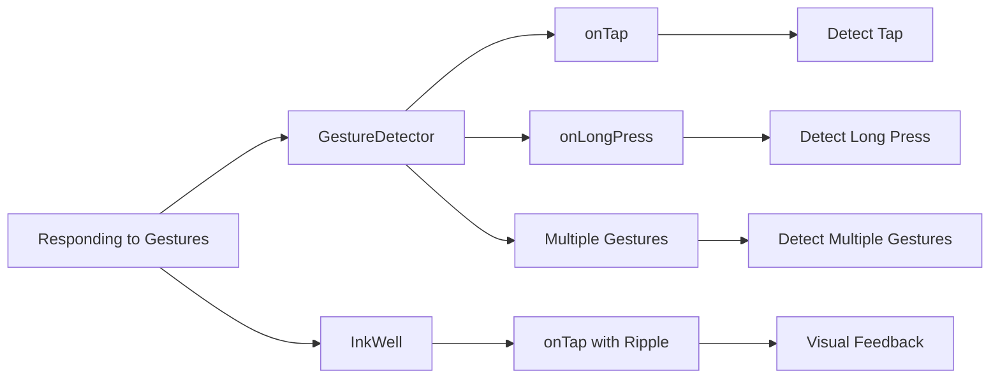

## 5.2.1 OnTap and OnLongPress

In the world of mobile app development, creating an interactive and engaging user experience is paramount. Flutter, with its rich set of widgets and gesture detection capabilities, allows developers to craft apps that respond intuitively to user interactions. This section delves into the essentials of gesture detection in Flutter, focusing on the `OnTap` and `OnLongPress` gestures. We'll explore how to implement these gestures using `GestureDetector` and `InkWell`, providing practical examples and insights to enhance your app's interactivity.

### Introduction to Gesture Detection

Gesture detection is a cornerstone of modern mobile applications, enabling users to interact with apps through touch. Flutter provides a robust framework for detecting gestures, allowing developers to respond to user actions such as taps, swipes, and long presses. By leveraging these capabilities, you can create apps that feel responsive and intuitive, enhancing the overall user experience.

In Flutter, gestures are detected using widgets like `GestureDetector` and `InkWell`, which wrap around other widgets to capture user interactions. These widgets provide callback functions that are triggered when specific gestures are detected, allowing you to define custom behavior in response to user input.

### Using GestureDetector for OnTap

The `GestureDetector` widget is a versatile tool for detecting various gestures, including taps. By wrapping a widget with `GestureDetector`, you can capture tap events and execute custom logic when the user interacts with the widget.

Here's a simple example of using `GestureDetector` to detect a tap on a `Container` widget:

```dart
GestureDetector(
  onTap: () {
    print('Container tapped');
  },
  child: Container(
    width: 100,
    height: 100,
    color: Colors.blue,
    child: Center(child: Text('Tap Me')),
  ),
);
```

**Explanation:**

- **`onTap`:** This is a callback function that is triggered when the user taps the widget. In this example, it prints a message to the console.
- **`GestureDetector`:** By wrapping the `Container` with `GestureDetector`, we make it responsive to tap gestures, transforming a static UI element into an interactive component.

### Handling OnLongPress

In addition to taps, `GestureDetector` can also detect long-press gestures. A long press occurs when the user presses and holds a widget for a certain duration. This gesture is often used to trigger secondary actions, such as displaying a context menu or initiating a drag-and-drop operation.

Here's how you can handle long-press gestures using `GestureDetector`:

```dart
GestureDetector(
  onLongPress: () {
    print('Container long-pressed');
  },
  child: Container(
    width: 100,
    height: 100,
    color: Colors.green,
    child: Center(child: Text('Long Press')),
  ),
);
```

**Explanation:**

- **`onLongPress`:** This callback is triggered when the user presses and holds the widget. It's useful for implementing actions that require a deliberate gesture, such as opening a detailed view or editing an item.

### Using InkWell for Ripple Effect

While `GestureDetector` is powerful, it doesn't provide any visual feedback by default. For a more interactive experience, especially in Material Design apps, you might want to use `InkWell`. This widget not only detects gestures but also provides a ripple effect, giving users visual feedback when they interact with the UI.

Here's an example of using `InkWell` to detect a tap with a ripple effect:

```dart
InkWell(
  onTap: () {
    print('InkWell tapped');
  },
  child: Container(
    width: 100,
    height: 100,
    color: Colors.red,
    child: Center(child: Text('Tap Me')),
  ),
);
```

**Explanation:**

- **`InkWell`:** This widget is part of the Material library and is designed to provide a ripple animation when tapped. It's ideal for buttons, list items, and other interactive elements where visual feedback is important.

### Handling Multiple Gestures Together

In many applications, a single widget may need to respond to multiple gestures. `GestureDetector` allows you to define multiple gesture callbacks, enabling rich interactivity within a single widget.

Here's an example of handling multiple gestures with `GestureDetector`:

```dart
GestureDetector(
  onTap: () {
    print('Tapped');
  },
  onDoubleTap: () {
    print('Double Tapped');
  },
  onLongPress: () {
    print('Long Pressed');
  },
  child: Container(
    width: 150,
    height: 150,
    color: Colors.purple,
    child: Center(child: Text('Gestures')),
  ),
);
```

**Explanation:**

- **Multiple Callbacks:** You can define multiple gesture callbacks such as `onTap`, `onDoubleTap`, and `onLongPress` within the same `GestureDetector`. This allows you to handle different types of interactions, providing a more dynamic user experience.

### Visualizing Gesture Detection with Mermaid.js

To better understand the flow of gesture detection and response, let's visualize the process using a Mermaid.js diagram:



**Diagram Explanation:**

- **GestureDetector and InkWell:** The diagram illustrates how `GestureDetector` and `InkWell` are used to detect gestures.
- **Callbacks:** It shows the different callbacks (`onTap`, `onLongPress`, etc.) and their corresponding actions.
- **Visual Feedback:** `InkWell` provides visual feedback, enhancing the user experience with a ripple effect.

### Best Practices and Considerations

- **Choose the Right Widget:** Use `GestureDetector` for custom gestures and `InkWell` for standard Material Design interactions with visual feedback.
- **Avoid Overlapping Gestures:** Ensure that gestures do not conflict with each other, especially when handling multiple gestures on the same widget.
- **Provide Feedback:** Always provide visual or auditory feedback for user interactions to enhance the user experience.
- **Test on Real Devices:** Gestures can behave differently on emulators and real devices, so always test your app on physical hardware.

### Conclusion

Gesture detection is a powerful feature in Flutter that allows you to create interactive and engaging applications. By understanding and implementing `OnTap` and `OnLongPress` gestures using `GestureDetector` and `InkWell`, you can enhance the interactivity of your apps, providing users with a more intuitive experience. Experiment with different gestures and explore how they can be combined to create rich, interactive UIs.

### Further Reading and Resources

- [Flutter GestureDetector Documentation](https://api.flutter.dev/flutter/widgets/GestureDetector-class.html)
- [InkWell Class Documentation](https://api.flutter.dev/flutter/material/InkWell-class.html)
- [Material Design Guidelines](https://material.io/design/)

By mastering gesture detection in Flutter, you open up a world of possibilities for creating dynamic and responsive applications. Continue exploring and experimenting with different gestures to see how they can transform your app's user experience.

## Quiz Time!



### What is the primary purpose of the GestureDetector widget in Flutter?

- [x] To detect and respond to user gestures such as taps and long presses.
- [ ] To provide visual feedback for user interactions.
- [ ] To manage state changes in a Flutter application.
- [ ] To handle network requests and responses.

> **Explanation:** The `GestureDetector` widget is used to detect and respond to user gestures, such as taps and long presses, by providing callback functions that execute custom logic.

### Which widget provides a ripple effect when tapped, offering visual feedback?

- [ ] GestureDetector
- [x] InkWell
- [ ] Container
- [ ] Text

> **Explanation:** The `InkWell` widget provides a ripple effect when tapped, offering visual feedback as part of the Material Design guidelines.

### How can you handle multiple gestures on a single widget in Flutter?

- [x] By defining multiple gesture callbacks within a single GestureDetector.
- [ ] By using multiple GestureDetector widgets for each gesture.
- [ ] By wrapping the widget with multiple InkWell widgets.
- [ ] By using a combination of GestureDetector and InkWell.

> **Explanation:** You can handle multiple gestures on a single widget by defining multiple gesture callbacks, such as `onTap`, `onDoubleTap`, and `onLongPress`, within a single `GestureDetector`.

### What is the purpose of the onLongPress callback in GestureDetector?

- [ ] To detect double-tap gestures.
- [x] To detect when a widget is pressed and held for a duration.
- [ ] To provide visual feedback for taps.
- [ ] To manage widget state changes.

> **Explanation:** The `onLongPress` callback is triggered when a widget is pressed and held for a duration, allowing for actions that require a deliberate gesture.

### Which of the following is a best practice when implementing gesture detection in Flutter?

- [x] Provide visual or auditory feedback for user interactions.
- [ ] Use multiple GestureDetector widgets for each gesture type.
- [ ] Avoid testing on real devices.
- [ ] Ignore overlapping gestures.

> **Explanation:** Providing visual or auditory feedback for user interactions is a best practice to enhance the user experience. It's important to ensure gestures do not conflict and to test on real devices.

### What is the main difference between GestureDetector and InkWell?

- [x] GestureDetector detects gestures without visual feedback, while InkWell provides a ripple effect.
- [ ] GestureDetector is used for network requests, while InkWell is for UI interactions.
- [ ] GestureDetector handles state management, while InkWell handles animations.
- [ ] GestureDetector is for Android, while InkWell is for iOS.

> **Explanation:** The main difference is that `GestureDetector` detects gestures without visual feedback, while `InkWell` provides a ripple effect, offering visual feedback as part of the Material Design.

### Which callback would you use to detect a double-tap gesture in Flutter?

- [ ] onTap
- [x] onDoubleTap
- [ ] onLongPress
- [ ] onSwipe

> **Explanation:** The `onDoubleTap` callback is used to detect double-tap gestures in Flutter.

### What should you consider when handling multiple gestures on a single widget?

- [x] Ensure gestures do not conflict with each other.
- [ ] Use only one gesture callback per widget.
- [ ] Avoid providing feedback for gestures.
- [ ] Implement gestures only on buttons.

> **Explanation:** When handling multiple gestures on a single widget, it's important to ensure that gestures do not conflict with each other to provide a smooth user experience.

### How does the InkWell widget enhance user interaction in a Flutter app?

- [x] By providing a ripple effect as visual feedback when tapped.
- [ ] By managing state changes in the app.
- [ ] By handling network requests and responses.
- [ ] By storing user preferences locally.

> **Explanation:** The `InkWell` widget enhances user interaction by providing a ripple effect as visual feedback when tapped, aligning with Material Design principles.

### True or False: GestureDetector can only detect tap gestures.

- [ ] True
- [x] False

> **Explanation:** False. `GestureDetector` can detect a variety of gestures, including taps, long presses, double taps, and more, by providing different callback functions.


