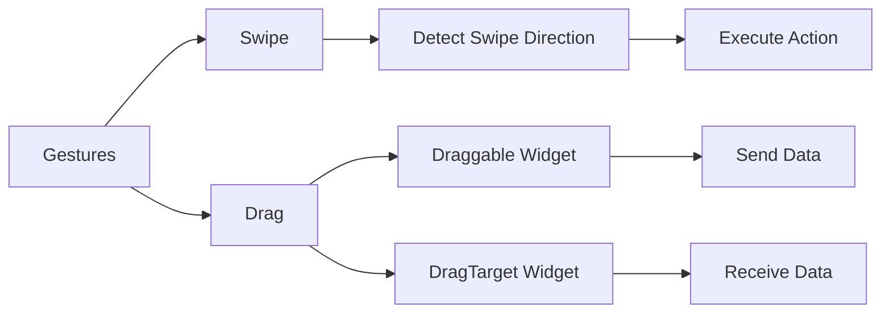

## 5.2.2 Swipes and Drags

In the realm of mobile app development, user interaction is paramount. Gestures such as swipes and drags are integral to creating intuitive and engaging user experiences. Flutter, with its rich set of widgets and gesture detection capabilities, allows developers to implement these interactions seamlessly. In this section, we'll delve into the mechanics of swipe and drag gestures, providing you with the tools and knowledge to enhance your Flutter applications.

### Introduction to Swipe and Drag Gestures

Swiping and dragging are fundamental gestures that enable users to interact with app elements by moving them across the screen. These gestures are commonly used for actions like dismissing items from a list, navigating between screens, or rearranging items within a UI. Understanding how to implement these gestures can significantly enhance the usability and interactivity of your app.

### Detecting Swipe Gestures with GestureDetector

Flutter's `GestureDetector` widget is a powerful tool for detecting various gestures, including swipes. By leveraging callbacks such as `onHorizontalDrag` and `onVerticalDrag`, you can determine the direction and velocity of a swipe, allowing you to trigger specific actions based on user input.

#### Code Example: Detecting Horizontal Swipes

```dart
GestureDetector(
  onHorizontalDragEnd: (DragEndDetails details) {
    if (details.primaryVelocity! < 0) {
      print('Swiped Left');
    } else if (details.primaryVelocity! > 0) {
      print('Swiped Right');
    }
  },
  child: Container(
    width: 200,
    height: 100,
    color: Colors.orange,
    child: Center(child: Text('Swipe Me')),
  ),
);
```

#### Explanation

- **`onHorizontalDragEnd`:** This callback is triggered when a horizontal drag gesture ends. It provides `DragEndDetails`, which includes information about the drag, such as velocity.
- **`primaryVelocity`:** This property indicates the direction of the swipe. A negative value signifies a left swipe, while a positive value indicates a right swipe.

### Implementing Drag and Drop

Drag-and-drop functionality allows users to move widgets around the screen, offering a dynamic and interactive experience. Flutter provides the `Draggable` and `DragTarget` widgets to facilitate this feature.

#### Code Example: Basic Drag and Drop

```dart
Draggable<String>(
  data: 'Flutter',
  child: Container(
    width: 100,
    height: 100,
    color: Colors.blue,
    child: Center(child: Text('Drag')),
  ),
  feedback: Material(
    color: Colors.transparent,
    child: Container(
      width: 100,
      height: 100,
      color: Colors.blue.withOpacity(0.5),
      child: Center(child: Text('Dragging')),
    ),
  ),
  childWhenDragging: Container(
    width: 100,
    height: 100,
    color: Colors.grey,
    child: Center(child: Text('Drag')),
  ),
);

DragTarget<String>(
  onAccept: (data) {
    print('Dropped: $data');
  },
  builder: (context, candidateData, rejectedData) {
    return Container(
      width: 150,
      height: 150,
      color: Colors.green,
      child: Center(child: Text('Drop Here')),
    );
  },
);
```

#### Explanation

- **`Draggable`:** This widget makes its child draggable. It carries data that can be used when the widget is dropped.
- **`DragTarget`:** This widget defines an area where draggable widgets can be dropped. It provides callbacks like `onAccept` to handle the dropped data.
- **`feedback`:** This is the widget displayed while dragging. It can be customized to provide visual feedback.
- **`childWhenDragging`:** This widget is shown in place of the draggable widget while it is being dragged.

### Customizing Swipe Actions

Customizing swipe actions allows you to perform specific tasks based on the swipe direction. For instance, you might want to delete an item when swiped left or mark it as a favorite when swiped right.

#### Code Example: Custom Swipe Actions

```dart
GestureDetector(
  onHorizontalDragUpdate: (DragUpdateDetails details) {
    // Handle swipe progress
  },
  onHorizontalDragEnd: (DragEndDetails details) {
    if (details.primaryVelocity! < 0) {
      // Swiped Left
      print('Delete Item');
    } else if (details.primaryVelocity! > 0) {
      // Swiped Right
      print('Mark as Favorite');
    }
  },
  child: Container(
    padding: EdgeInsets.all(16.0),
    child: Text('Swipe to Delete or Favorite'),
  ),
);
```

### Visualizing Gesture Handling with Mermaid.js

To better understand the relationship between swipe and drag gestures and their handling mechanisms, let's visualize it using a Mermaid.js diagram:



### Best Practices and Common Pitfalls

- **Smooth Interactions:** Ensure that swipe and drag interactions are smooth and responsive. Test on multiple devices to ensure consistent performance.
- **Feedback:** Provide visual feedback during drag-and-drop operations to guide users.
- **Direction Sensitivity:** Be mindful of the sensitivity of swipe detection to avoid accidental actions.
- **Accessibility:** Consider accessibility features and ensure that gesture-based interactions are accessible to all users.

### Further Exploration

For those looking to deepen their understanding of gestures in Flutter, consider exploring the following resources:

- [Flutter GestureDetector Documentation](https://api.flutter.dev/flutter/widgets/GestureDetector-class.html)
- [Flutter Draggable and DragTarget Documentation](https://api.flutter.dev/flutter/widgets/Draggable-class.html)
- [Flutter Cookbook: Gestures](https://flutter.dev/docs/cookbook/gestures)

### Conclusion

Mastering swipe and drag gestures in Flutter opens up a world of possibilities for creating interactive and engaging applications. By understanding the mechanics and best practices outlined in this section, you can enhance your app's user experience and provide intuitive interactions that delight users.

## Quiz Time!



### What is the primary use of swipe and drag gestures in Flutter apps?

- [x] To enhance user interaction by allowing movement of widgets across the screen.
- [ ] To improve app performance.
- [ ] To increase the app's security.
- [ ] To reduce the app's load time.

> **Explanation:** Swipe and drag gestures are primarily used to enhance user interaction by allowing users to move widgets across the screen, such as dismissing items or rearranging UI elements.

### Which widget is used to detect swipe gestures in Flutter?

- [x] GestureDetector
- [ ] Draggable
- [ ] DragTarget
- [ ] Container

> **Explanation:** The `GestureDetector` widget is used to detect various gestures, including swipes, in Flutter applications.

### What does the `primaryVelocity` property indicate in a swipe gesture?

- [x] The direction of the swipe.
- [ ] The color of the widget.
- [ ] The size of the widget.
- [ ] The position of the widget.

> **Explanation:** The `primaryVelocity` property indicates the direction of the swipe, with negative values for left swipes and positive values for right swipes.

### Which widget makes a child widget draggable in Flutter?

- [x] Draggable
- [ ] DragTarget
- [ ] GestureDetector
- [ ] Scaffold

> **Explanation:** The `Draggable` widget makes its child widget draggable, allowing it to be moved across the screen.

### What is the purpose of the `DragTarget` widget?

- [x] To define an area where draggable widgets can be dropped.
- [ ] To detect swipe gestures.
- [ ] To display a list of items.
- [ ] To manage app navigation.

> **Explanation:** The `DragTarget` widget defines an area where draggable widgets can be dropped and provides callbacks to handle the dropped data.

### How can you customize actions based on swipe direction?

- [x] By using `onHorizontalDragEnd` and checking the `primaryVelocity`.
- [ ] By changing the widget's color.
- [ ] By resizing the widget.
- [ ] By altering the widget's position.

> **Explanation:** You can customize actions based on swipe direction by using the `onHorizontalDragEnd` callback and checking the `primaryVelocity` to determine the swipe direction.

### What is the role of the `feedback` property in a `Draggable` widget?

- [x] To provide a visual representation of the widget while it is being dragged.
- [ ] To change the widget's color.
- [ ] To resize the widget.
- [ ] To alter the widget's position.

> **Explanation:** The `feedback` property provides a visual representation of the widget while it is being dragged, allowing for customization of the drag experience.

### Which of the following is a best practice when implementing swipe gestures?

- [x] Ensure smooth and responsive interactions.
- [ ] Use complex animations for every swipe.
- [ ] Ignore accessibility features.
- [ ] Avoid providing visual feedback.

> **Explanation:** It is a best practice to ensure smooth and responsive interactions when implementing swipe gestures, enhancing the user experience.

### What should you consider when implementing drag-and-drop functionality?

- [x] Providing visual feedback and ensuring accessibility.
- [ ] Using only default colors.
- [ ] Avoiding any animations.
- [ ] Ignoring user feedback.

> **Explanation:** When implementing drag-and-drop functionality, it's important to provide visual feedback and ensure accessibility to enhance the user experience.

### True or False: The `GestureDetector` widget can only detect swipe gestures.

- [ ] True
- [x] False

> **Explanation:** False. The `GestureDetector` widget can detect a variety of gestures, including taps, double taps, long presses, and more, in addition to swipe gestures.


