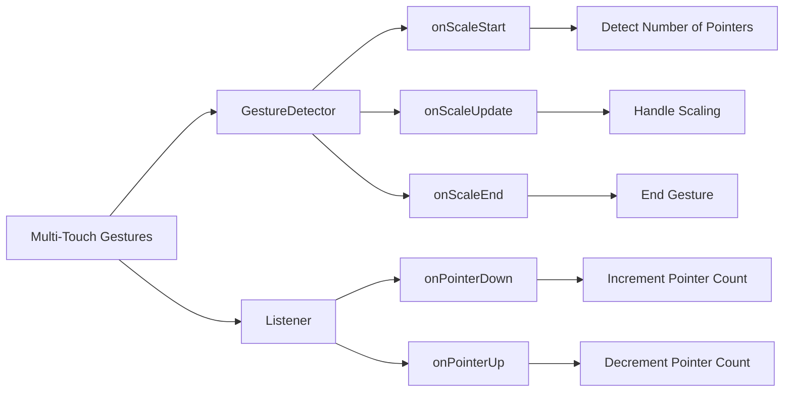

## 5.2.3 Handling Multi-Touch

In the world of mobile applications, user interaction is paramount. Multi-touch gestures, which involve multiple fingers interacting with the screen simultaneously, have become a staple in enhancing user experience. These gestures allow for complex interactions such as pinch-to-zoom, two-finger rotations, and more. In this section, we will delve into the intricacies of handling multi-touch gestures in Flutter, providing you with the tools and knowledge to implement these interactions effectively in your applications.

### Introduction to Multi-Touch Gestures

Multi-touch gestures are a powerful way to create intuitive and engaging user interfaces. They allow users to interact with applications in a more natural and fluid manner. Common multi-touch gestures include:

- **Pinch-to-Zoom:** A gesture where two fingers are used to zoom in or out on an element.
- **Two-Finger Rotation:** A gesture where two fingers are used to rotate an element.
- **Multi-Finger Swipes:** Gestures involving swiping with multiple fingers for navigation or other actions.

These gestures enhance the user experience by providing more control and flexibility in interacting with the app's content.

### Detecting Multi-Touch with GestureDetector

Flutter provides the `GestureDetector` widget, which is a versatile tool for detecting various types of gestures, including multi-touch. The `GestureDetector` can recognize gestures such as taps, double taps, long presses, and scaling gestures, which are essential for handling multi-touch interactions.

Here's a basic example of using `GestureDetector` to handle multi-touch events:

```dart
GestureDetector(
  onTap: () {
    print('Single Tap');
  },
  onDoubleTap: () {
    print('Double Tap');
  },
  onLongPress: () {
    print('Long Press');
  },
  onScaleStart: (ScaleStartDetails details) {
    print('Scale Start with ${details.pointerCount} pointers');
  },
  onScaleUpdate: (ScaleUpdateDetails details) {
    print('Scale Update with ${details.pointerCount} pointers - Scale: ${details.scale}');
  },
  onScaleEnd: (ScaleEndDetails details) {
    print('Scale End');
  },
  child: Container(
    width: 200,
    height: 200,
    color: Colors.pink,
    child: Center(child: Text('Multi-Touch')),
  ),
);
```

#### Explanation:

- **onScaleStart:** Triggered when a scaling gesture begins. The `ScaleStartDetails` provides information about the gesture, including the number of pointers (fingers) involved.
- **onScaleUpdate:** Triggered continuously as the gesture changes. The `ScaleUpdateDetails` provides the current scale factor and the number of pointers.
- **onScaleEnd:** Triggered when the scaling gesture ends.

The `details.pointerCount` property is particularly useful for determining how many fingers are involved in the gesture, allowing you to tailor the interaction based on the number of touch points.

### Implementing Pinch-to-Zoom

One of the most common multi-touch gestures is pinch-to-zoom, which allows users to zoom in and out of content using two fingers. This gesture is particularly useful in applications that display images, maps, or any content that benefits from zooming.

Here's how you can implement pinch-to-zoom in Flutter:

```dart
double _scale = 1.0;

GestureDetector(
  onScaleUpdate: (ScaleUpdateDetails details) {
    setState(() {
      _scale = details.scale;
    });
  },
  child: Transform.scale(
    scale: _scale,
    child: Image.asset('assets/images/flutter_logo.png'),
  ),
);
```

#### Explanation:

- **ScaleUpdateDetails.scale:** Provides the scale factor relative to the initial focal point of the gesture. This value is used to adjust the size of the widget dynamically.
- **Transform.scale:** A widget that applies a scaling transformation to its child. By updating the `scale` property, you can dynamically resize the child widget based on the user's pinch gesture.

### Handling Multiple Pointers

In some scenarios, you may need to track multiple pointers (fingers) for gestures that require concurrent interactions. Flutter's `Listener` widget can be used to detect low-level pointer events, allowing you to track the number of active pointers on the screen.

Here's an example of how to track multiple pointers:

```dart
int _pointerCounter = 0;

Listener(
  onPointerDown: (PointerDownEvent event) {
    setState(() {
      _pointerCounter++;
    });
  },
  onPointerUp: (PointerUpEvent event) {
    setState(() {
      _pointerCounter--;
    });
  },
  child: Container(
    width: 200,
    height: 200,
    color: Colors.teal,
    child: Center(child: Text('Pointers: $_pointerCounter')),
  ),
);
```

#### Explanation:

- **Listener:** A widget that detects low-level pointer events, such as when a finger touches the screen or lifts off.
- **onPointerDown:** Triggered when a finger touches the screen, incrementing the pointer count.
- **onPointerUp:** Triggered when a finger lifts off the screen, decrementing the pointer count.

This approach allows you to keep track of the number of active pointers, which can be useful for implementing custom multi-touch interactions.

### Visualizing Multi-Touch Gesture Handling

To better understand the flow of handling multi-touch gestures, let's visualize the process using a Mermaid.js diagram:



#### Diagram Explanation:

- **Multi-Touch Gestures:** The starting point for handling complex interactions involving multiple fingers.
- **GestureDetector:** Used for detecting high-level gestures like scaling.
  - **onScaleStart, onScaleUpdate, onScaleEnd:** Handle the lifecycle of a scaling gesture.
- **Listener:** Used for detecting low-level pointer events.
  - **onPointerDown, onPointerUp:** Track the number of active pointers.

### Best Practices and Common Pitfalls

When implementing multi-touch gestures, consider the following best practices and potential pitfalls:

- **Smooth Transitions:** Ensure that gestures result in smooth transitions to enhance user experience. Use animations where appropriate to provide visual feedback.
- **Responsive Design:** Test gestures on different screen sizes and orientations to ensure consistent behavior.
- **Avoid Overlapping Gestures:** Be cautious of overlapping gesture detectors, which can lead to unexpected behavior. Prioritize gestures to ensure the most important ones are recognized.
- **Performance Considerations:** Optimize gesture handling to minimize performance impact, especially in applications with complex UIs or animations.

### Conclusion

Handling multi-touch gestures in Flutter opens up a world of possibilities for creating rich and interactive user experiences. By leveraging widgets like `GestureDetector` and `Listener`, you can implement complex interactions such as pinch-to-zoom and multi-pointer tracking with ease. As you experiment with these techniques, consider how they can enhance the usability and engagement of your applications.

### Further Exploration

For those interested in diving deeper into gesture handling and user interaction in Flutter, consider exploring the following resources:

- **Official Flutter Documentation:** [Flutter GestureDetector](https://api.flutter.dev/flutter/widgets/GestureDetector-class.html)
- **Open-Source Projects:** Explore GitHub repositories that showcase advanced gesture handling techniques.
- **Online Courses:** Platforms like Udemy and Coursera offer courses on Flutter development that cover user interaction in depth.

By mastering multi-touch gestures, you can create applications that are not only functional but also delightful to use.

## Quiz Time!



### What is a common use case for multi-touch gestures in mobile apps?

- [x] Pinch-to-zoom
- [ ] Single tap
- [ ] Long press
- [ ] Double tap

> **Explanation:** Multi-touch gestures like pinch-to-zoom involve multiple fingers and are commonly used for zooming in and out on content.

### Which widget is primarily used to detect gestures in Flutter?

- [x] GestureDetector
- [ ] Listener
- [ ] Container
- [ ] Scaffold

> **Explanation:** The `GestureDetector` widget is used to detect various gestures, including multi-touch interactions.

### What property of `ScaleUpdateDetails` provides the scale factor during a pinch gesture?

- [x] scale
- [ ] pointerCount
- [ ] focalPoint
- [ ] localFocalPoint

> **Explanation:** The `scale` property of `ScaleUpdateDetails` provides the scale factor relative to the initial focal point.

### How can you track the number of active pointers on the screen?

- [x] Using the Listener widget with onPointerDown and onPointerUp
- [ ] Using the GestureDetector widget
- [ ] Using the Transform widget
- [ ] Using the Container widget

> **Explanation:** The `Listener` widget can detect low-level pointer events, allowing you to track the number of active pointers.

### What is the purpose of the `onScaleEnd` callback in a `GestureDetector`?

- [x] To trigger when a scaling gesture ends
- [ ] To trigger when a scaling gesture starts
- [ ] To update the scale factor
- [ ] To detect the number of pointers

> **Explanation:** The `onScaleEnd` callback is triggered when a scaling gesture ends, allowing you to finalize any changes.

### Which widget can apply a scaling transformation to its child?

- [x] Transform.scale
- [ ] GestureDetector
- [ ] Listener
- [ ] Scaffold

> **Explanation:** The `Transform.scale` widget applies a scaling transformation to its child based on the provided scale factor.

### What is a potential pitfall when implementing multi-touch gestures?

- [x] Overlapping gesture detectors
- [ ] Using animations
- [ ] Testing on different screen sizes
- [ ] Providing visual feedback

> **Explanation:** Overlapping gesture detectors can lead to unexpected behavior, so it's important to prioritize gestures.

### Why is it important to test gestures on different screen sizes?

- [x] To ensure consistent behavior
- [ ] To improve performance
- [ ] To reduce code complexity
- [ ] To avoid using animations

> **Explanation:** Testing on different screen sizes ensures that gestures behave consistently across devices.

### Which of the following is NOT a multi-touch gesture?

- [x] Single tap
- [ ] Pinch-to-zoom
- [ ] Two-finger rotation
- [ ] Multi-finger swipe

> **Explanation:** Single tap is a single-touch gesture, not a multi-touch gesture.

### True or False: The `GestureDetector` can only detect single-touch gestures.

- [ ] True
- [x] False

> **Explanation:** The `GestureDetector` can detect both single-touch and multi-touch gestures, such as pinch-to-zoom.


