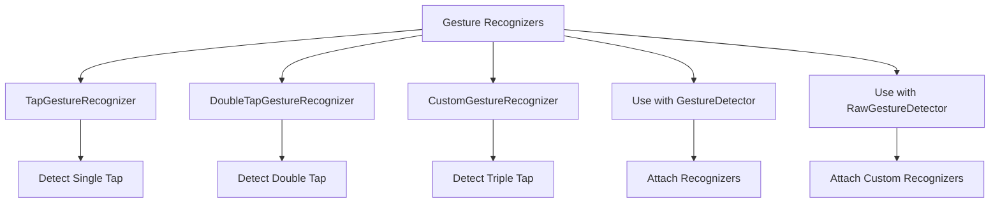

## 5.2.4 Gesture Recognizers

In the realm of mobile app development, user interaction is paramount. Flutter, with its rich set of widgets and tools, offers developers the ability to create highly interactive applications. One of the key components in achieving this interactivity is the use of gesture recognizers. Gesture recognizers provide developers with granular control over how gestures are detected and handled, offering advanced customization beyond what the basic `GestureDetector` widget provides. This section delves into the world of gesture recognizers, exploring their capabilities, usage, and how they can be extended to create custom gestures.

### Introduction to Gesture Recognizers

Gesture recognizers in Flutter are specialized objects that detect specific types of gestures. They are particularly useful when you need to implement complex gestures or recognize multiple gesture types simultaneously. Unlike the `GestureDetector`, which provides a straightforward way to handle common gestures like taps, swipes, and drags, gesture recognizers offer more flexibility and control.

#### Why Use Gesture Recognizers?

- **Advanced Customization:** Gesture recognizers allow you to define custom behavior for gestures, enabling more complex interactions.
- **Multiple Gesture Recognition:** They can recognize multiple gestures on a single widget, such as distinguishing between a single tap and a double tap.
- **Fine-Grained Control:** Gesture recognizers provide callbacks for different stages of a gesture, such as when it starts, updates, or ends, allowing for precise control over the interaction.

### Basic Usage of TapGestureRecognizer

The `TapGestureRecognizer` is one of the simplest gesture recognizers available in Flutter. It is used to detect tap gestures, which are among the most common interactions in mobile apps. Let's explore how to use `TapGestureRecognizer` with a `RichText` widget.

```dart
import 'package:flutter/gestures.dart';
import 'package:flutter/material.dart';

class TapRecognizerExample extends StatelessWidget {
  @override
  Widget build(BuildContext context) {
    return Center(
      child: RichText(
        text: TextSpan(
          text: 'Tap here',
          style: TextStyle(color: Colors.blue, fontSize: 20),
          recognizer: TapGestureRecognizer()
            ..onTap = () {
              print('Text tapped');
            },
        ),
      ),
    );
  }
}
```

#### Explanation:

- **`TapGestureRecognizer`:** This recognizer detects tap gestures. It is particularly useful when you want to make parts of a text interactive, such as links in a paragraph.
- **`..onTap`:** This is a cascade operator that assigns a callback function to be executed when the text is tapped. In this example, it simply prints a message to the console.

### Using GestureRecognizer with GestureDetector

While `GestureDetector` provides a straightforward way to handle gestures, combining it with gesture recognizers allows for more complex interactions. Here's how you can attach multiple gesture recognizers to a single widget.

```dart
import 'package:flutter/gestures.dart';
import 'package:flutter/material.dart';

class MyCustomWidget extends StatefulWidget {
  @override
  _MyCustomWidgetState createState() => _MyCustomWidgetState();
}

class _MyCustomWidgetState extends State<MyCustomWidget> {
  final TapGestureRecognizer _tapRecognizer = TapGestureRecognizer();
  final DoubleTapGestureRecognizer _doubleTapRecognizer = DoubleTapGestureRecognizer();

  @override
  void initState() {
    super.initState();
    _tapRecognizer.onTap = () {
      print('Single tap detected');
    };
    _doubleTapRecognizer.onDoubleTap = () {
      print('Double tap detected');
    };
  }

  @override
  void dispose() {
    _tapRecognizer.dispose();
    _doubleTapRecognizer.dispose();
    super.dispose();
  }

  @override
  Widget build(BuildContext context) {
    return GestureDetector(
      onTap: _tapRecognizer.onTap,
      onDoubleTap: _doubleTapRecognizer.onDoubleTap,
      child: Container(
        width: 150,
        height: 150,
        color: Colors.grey,
        child: Center(child: Text('Tap or Double Tap')),
      ),
    );
  }
}
```

#### Explanation:

- **Multiple Gesture Recognizers:** This example demonstrates how to use both `TapGestureRecognizer` and `DoubleTapGestureRecognizer` to handle single and double taps, respectively.
- **Resource Management:** It's crucial to dispose of gesture recognizers in the `dispose` method to prevent memory leaks.

### Custom Gesture Recognizers

Flutter allows developers to create custom gesture recognizers by extending base classes like `OneSequenceGestureRecognizer`. This is particularly useful when you need to detect gestures that are not covered by the built-in recognizers. Let's create a custom gesture recognizer to detect a triple tap.

```dart
import 'dart:async';
import 'package:flutter/gestures.dart';
import 'package:flutter/material.dart';

class TripleTapGestureRecognizer extends OneSequenceGestureRecognizer {
  int _tapCount = 0;
  Timer? _timer;

  TripleTapGestureRecognizer({required VoidCallback onTripleTap}) {
    _onTripleTap = onTripleTap;
  }

  late VoidCallback _onTripleTap;

  @override
  void addAllowedPointer(PointerDownEvent event) {
    startTrackingPointer(event.pointer);
  }

  @override
  void handleEvent(PointerEvent event) {
    if (event is PointerUpEvent) {
      _tapCount++;
      if (_tapCount == 3) {
        _onTripleTap();
        _tapCount = 0;
        _timer?.cancel();
      } else {
        _timer?.cancel();
        _timer = Timer(Duration(milliseconds: 500), () {
          _tapCount = 0;
        });
      }
    }
  }

  @override
  String get debugDescription => 'triple tap';

  @override
  void didStopTrackingLastPointer(int pointer) {}

  @override
  void dispose() {
    _timer?.cancel();
    super.dispose();
  }
}

// Usage in a widget
class TripleTapExample extends StatelessWidget {
  final TripleTapGestureRecognizer _tripleTapRecognizer = TripleTapGestureRecognizer(
    onTripleTap: () {
      print('Triple tap detected');
    },
  );

  @override
  Widget build(BuildContext context) {
    return RawGestureDetector(
      gestures: {
        TripleTapGestureRecognizer:
            GestureRecognizerFactoryWithHandlers<TripleTapGestureRecognizer>(
          () => TripleTapGestureRecognizer(onTripleTap: () {}),
          (TripleTapGestureRecognizer instance) {
            instance..onTripleTap = () => print('Triple tap recognized');
          },
        ),
      },
      child: Container(
        width: 150,
        height: 150,
        color: Colors.teal,
        child: Center(child: Text('Triple Tap Me')),
      ),
    );
  }
}
```

#### Explanation:

- **Custom Gesture Recognizers:** By extending `OneSequenceGestureRecognizer`, you can define custom logic for detecting specific gesture patterns, such as a triple tap.
- **`RawGestureDetector`:** This widget allows you to attach custom gesture recognizers to any widget, providing a flexible way to handle unique gestures.

### Visualizing Gesture Recognizers

To better understand the hierarchy and interaction of various gesture recognizers, let's use a Mermaid.js diagram:



### Best Practices and Considerations

- **Resource Management:** Always dispose of gesture recognizers in the `dispose` method to prevent memory leaks.
- **Performance:** Be mindful of performance when implementing complex gestures, as they can impact the responsiveness of your app.
- **User Experience:** Ensure that gestures are intuitive and enhance the user experience rather than complicate it.

### Further Exploration

For those interested in diving deeper into gesture recognition and handling in Flutter, consider exploring the following resources:

- [Flutter GestureDetector Documentation](https://api.flutter.dev/flutter/widgets/GestureDetector-class.html)
- [Flutter Gesture Recognizers](https://api.flutter.dev/flutter/gestures/GestureRecognizer-class.html)
- [Advanced Flutter: Beyond the Basics](https://www.udemy.com/course/advanced-flutter/)

These resources provide additional insights and examples to help you master gesture handling in Flutter.

## Quiz Time!



### What is the primary advantage of using gesture recognizers over the basic GestureDetector?

- [x] They provide more granular control over gesture detection.
- [ ] They are easier to implement than GestureDetector.
- [ ] They automatically handle all gestures without additional code.
- [ ] They are only used for detecting swipes.

> **Explanation:** Gesture recognizers offer advanced customization and control over how gestures are detected and handled, which is beyond the capabilities of the basic `GestureDetector`.

### Which gesture recognizer would you use to detect a single tap on a widget?

- [x] TapGestureRecognizer
- [ ] DoubleTapGestureRecognizer
- [ ] LongPressGestureRecognizer
- [ ] SwipeGestureRecognizer

> **Explanation:** `TapGestureRecognizer` is specifically designed to detect single tap gestures.

### How do you ensure that gesture recognizers do not cause memory leaks in your Flutter app?

- [x] Dispose of them in the dispose method.
- [ ] Use them only with stateless widgets.
- [ ] Avoid using them in your app.
- [ ] Use a global variable to manage them.

> **Explanation:** Disposing of gesture recognizers in the `dispose` method is crucial to prevent memory leaks.

### What is the purpose of the cascade operator (..) when using TapGestureRecognizer?

- [x] To assign a callback function to the recognizer.
- [ ] To create a new instance of the recognizer.
- [ ] To dispose of the recognizer.
- [ ] To reset the recognizer's state.

> **Explanation:** The cascade operator (..) is used to assign a callback function to the recognizer, allowing it to perform an action when the gesture is detected.

### Which widget allows you to attach custom gesture recognizers to any widget?

- [x] RawGestureDetector
- [ ] GestureDetector
- [ ] CustomGestureWidget
- [ ] GestureHandler

> **Explanation:** `RawGestureDetector` provides the flexibility to attach custom gesture recognizers to any widget.

### What is a common use case for creating a custom gesture recognizer?

- [x] Detecting gestures not covered by built-in recognizers.
- [ ] Simplifying the code for basic gestures.
- [ ] Automatically handling all user inputs.
- [ ] Replacing the need for GestureDetector.

> **Explanation:** Custom gesture recognizers are useful for detecting specific gesture patterns not covered by built-in recognizers.

### Which method in a custom gesture recognizer is responsible for handling pointer events?

- [x] handleEvent
- [ ] addAllowedPointer
- [ ] dispose
- [ ] startTrackingPointer

> **Explanation:** The `handleEvent` method is responsible for processing pointer events and determining when the gesture is recognized.

### What is the role of the Timer in the TripleTapGestureRecognizer example?

- [x] To reset the tap count if the taps are not completed in time.
- [ ] To delay the recognition of the gesture.
- [ ] To increase the tap count automatically.
- [ ] To dispose of the recognizer.

> **Explanation:** The Timer is used to reset the tap count if the taps are not completed within a specified time frame, ensuring accurate gesture detection.

### Which gesture recognizer would you use to detect a double tap on a widget?

- [x] DoubleTapGestureRecognizer
- [ ] TapGestureRecognizer
- [ ] LongPressGestureRecognizer
- [ ] SwipeGestureRecognizer

> **Explanation:** `DoubleTapGestureRecognizer` is specifically designed to detect double tap gestures.

### True or False: Gesture recognizers can only be used with GestureDetector.

- [ ] True
- [x] False

> **Explanation:** Gesture recognizers can be used with both `GestureDetector` and `RawGestureDetector`, allowing for flexible implementation of gesture handling.



By mastering gesture recognizers, you can create highly interactive and responsive Flutter applications that provide a seamless user experience. Whether you're using built-in recognizers or creating custom ones, the possibilities for enhancing user interaction are vast.
