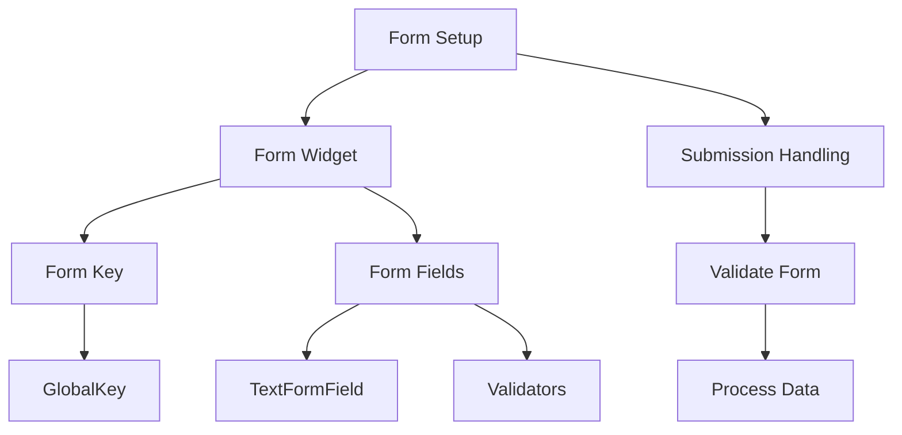

## 5.3.1 Setting Up Forms

Forms are an integral part of any application that requires user input. They provide a structured way to collect data, validate it, and process it efficiently. In Flutter, the `Form` widget is a powerful tool that helps developers manage multiple input fields collectively, ensuring a seamless user experience. This section will guide you through setting up forms in Flutter, organizing form fields, validating input, and handling form submissions.

### Introduction to Form Widgets

Forms in Flutter are collections of input fields and controls that allow users to enter and submit data. They are essential for grouping related data, managing validation, and handling submissions. By using forms, developers can ensure that the data collected is consistent and meets the application's requirements.

- **Purpose of Forms:**
  - Group related input fields for better data management.
  - Validate user input to ensure data integrity.
  - Provide a mechanism for data submission and processing.

### Using the Form Widget

The `Form` widget in Flutter is used to wrap input fields and manage their state collectively. It provides a convenient way to validate user input and handle form submissions.

#### Setting Up a Basic Form

To create a form in Flutter, you need to use the `Form` widget along with a `GlobalKey<FormState>` to manage the form's state. Here's a basic example:

```dart
final _formKey = GlobalKey<FormState>();

Form(
  key: _formKey,
  child: Column(
    children: <Widget>[
      TextFormField(
        decoration: InputDecoration(labelText: 'Username'),
        validator: (value) {
          if (value == null || value.isEmpty) {
            return 'Please enter a username';
          }
          return null;
        },
      ),
      TextFormField(
        decoration: InputDecoration(labelText: 'Password'),
        obscureText: true,
        validator: (value) {
          if (value == null || value.isEmpty) {
            return 'Please enter a password';
          }
          return null;
        },
      ),
      ElevatedButton(
        onPressed: () {
          if (_formKey.currentState!.validate()) {
            // Process data
          }
        },
        child: Text('Login'),
      ),
    ],
  ),
);
```

#### Explanation

- **`GlobalKey<FormState>`:** This key uniquely identifies the `Form` widget and allows access to its state. It is essential for validating the form and processing data.
- **`TextFormField`:** This widget combines a `TextField` with form validation capabilities. It is used to create input fields within a form.
- **`validator`:** A function that checks the validity of the input. If the input is invalid, it returns an error message; otherwise, it returns `null`.

### Organizing Form Fields

To create a user-friendly form, it's important to organize form fields neatly. Flutter provides layout widgets like `Column` and `Padding` to help with this.

#### Using Layout Widgets

You can use the `Column` widget to stack form fields vertically and the `Padding` widget to add space around them:

```dart
Padding(
  padding: const EdgeInsets.all(16.0),
  child: Form(
    key: _formKey,
    child: Column(
      children: <Widget>[
        TextFormField(
          decoration: InputDecoration(labelText: 'Email'),
          validator: (value) {
            if (value == null || value.isEmpty) {
              return 'Please enter your email';
            }
            return null;
          },
        ),
        TextFormField(
          decoration: InputDecoration(labelText: 'Password'),
          obscureText: true,
          validator: (value) {
            if (value == null || value.isEmpty) {
              return 'Please enter your password';
            }
            return null;
          },
        ),
        ElevatedButton(
          onPressed: () {
            if (_formKey.currentState!.validate()) {
              // Process data
            }
          },
          child: Text('Submit'),
        ),
      ],
    ),
  ),
);
```

### Handling Form Submission

Once the form is set up and organized, the next step is to handle form submission. This involves triggering validation and processing the data if the form is valid.

#### Triggering Validation and Submission

You can use the `validate` method of the `FormState` to check if all fields are valid. If they are, you can proceed with data processing:

```dart
ElevatedButton(
  onPressed: () {
    if (_formKey.currentState!.validate()) {
      // If the form is valid, display a success message or process data
      ScaffoldMessenger.of(context).showSnackBar(
        SnackBar(content: Text('Processing Data')),
      );
    }
  },
  child: Text('Submit'),
);
```

### Visualizing the Form Setup Process

To better understand the flow from form setup to data processing, let's use a Mermaid.js diagram:



### Best Practices for Setting Up Forms

- **Use Descriptive Labels:** Ensure that each form field has a clear and descriptive label to guide users.
- **Provide Feedback:** Use validators to provide immediate feedback on user input.
- **Organize Fields Neatly:** Use layout widgets like `Column` and `Padding` to create a clean and organized form layout.
- **Handle Errors Gracefully:** Display error messages in a user-friendly manner and guide users to correct their input.

### Common Pitfalls and Challenges

- **Forgetting to Assign a Key:** Always assign a `GlobalKey<FormState>` to your form to manage its state effectively.
- **Ignoring Validation:** Ensure that all input fields have appropriate validation to prevent incorrect data entry.
- **Poor Layout Design:** Avoid cluttered forms by organizing fields logically and using adequate spacing.

### Conclusion

Setting up forms in Flutter is a straightforward process that involves using the `Form` widget, managing state with a `GlobalKey<FormState>`, and organizing fields with layout widgets. By following best practices and handling form submissions effectively, you can create robust and user-friendly forms in your Flutter applications.

### Further Reading and Resources

- [Flutter Documentation on Forms](https://flutter.dev/docs/cookbook/forms/validation)
- [Dart Language Tour](https://dart.dev/guides/language/language-tour)
- [Effective Dart: Style Guide](https://dart.dev/guides/language/effective-dart/style)

## Quiz Time!



### What is the primary purpose of using a `Form` widget in Flutter?

- [x] To manage the state of multiple input fields collectively
- [ ] To create a single input field
- [ ] To style input fields
- [ ] To handle network requests

> **Explanation:** The `Form` widget is used to manage the state of multiple input fields collectively, allowing for validation and submission handling.

### What does the `GlobalKey<FormState>` do in a Flutter form?

- [x] It uniquely identifies the `Form` widget and allows access to its state
- [ ] It styles the form fields
- [ ] It handles network requests
- [ ] It provides default values for form fields

> **Explanation:** `GlobalKey<FormState>` is used to uniquely identify the `Form` widget and access its state for validation and data processing.

### Which widget is used to create input fields with validation in Flutter?

- [x] `TextFormField`
- [ ] `TextField`
- [ ] `Form`
- [ ] `Column`

> **Explanation:** `TextFormField` is used to create input fields with validation capabilities in Flutter.

### How can you organize form fields neatly in Flutter?

- [x] By using layout widgets like `Column` and `Padding`
- [ ] By using `TextField` only
- [ ] By using `Scaffold` only
- [ ] By using `Container` only

> **Explanation:** Layout widgets like `Column` and `Padding` help organize form fields neatly in Flutter.

### What function is used to validate input in a `TextFormField`?

- [x] `validator`
- [ ] `onChanged`
- [ ] `onSubmitted`
- [ ] `decoration`

> **Explanation:** The `validator` function is used to validate input in a `TextFormField`.

### What happens when the `validate` method of `FormState` returns `true`?

- [x] The form is considered valid, and data can be processed
- [ ] The form is reset
- [ ] An error message is displayed
- [ ] The form is submitted automatically

> **Explanation:** When `validate` returns `true`, it indicates that the form is valid, and data can be processed.

### Which widget is used to display a message after form submission?

- [x] `SnackBar`
- [ ] `AlertDialog`
- [ ] `Text`
- [ ] `Container`

> **Explanation:** `SnackBar` is used to display messages after form submission in Flutter.

### What is a common pitfall when setting up forms in Flutter?

- [x] Forgetting to assign a `GlobalKey<FormState>`
- [ ] Using too many `TextFields`
- [ ] Not using `Scaffold`
- [ ] Overusing `Padding`

> **Explanation:** A common pitfall is forgetting to assign a `GlobalKey<FormState>`, which is essential for managing the form's state.

### Why is it important to provide feedback on user input in forms?

- [x] To guide users and ensure data integrity
- [ ] To make the form look complex
- [ ] To increase app size
- [ ] To slow down the app

> **Explanation:** Providing feedback on user input helps guide users and ensures data integrity.

### True or False: The `Form` widget can be used without a `GlobalKey<FormState>`.

- [ ] True
- [x] False

> **Explanation:** False. A `GlobalKey<FormState>` is necessary to manage the form's state and perform validation.


