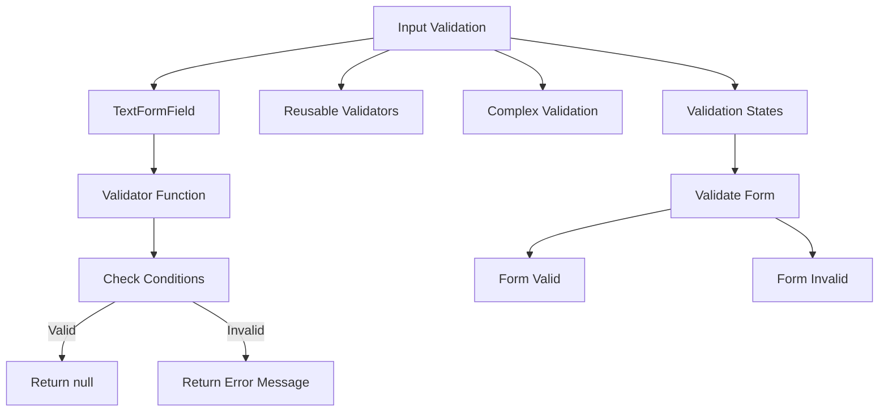

## 5.3.2 Validating Input

In the realm of mobile app development, ensuring that user input meets specific criteria is crucial for maintaining data integrity and enhancing user experience. Input validation is a fundamental aspect of form handling in Flutter, where developers can leverage the `TextFormField` widget's `validator` property to enforce rules and provide feedback. This section delves into the intricacies of input validation, offering practical examples, reusable validators, and strategies for handling complex validation scenarios.

### Introduction to Input Validation

Input validation is a process that ensures the data entered by users adheres to predefined rules and constraints. This not only prevents erroneous data from entering your system but also enhances the overall user experience by providing immediate feedback. For instance, validating an email field ensures that users enter a correctly formatted email address, reducing the likelihood of errors during data processing.

### Using Validators in TextFormField

The `TextFormField` widget in Flutter provides a convenient `validator` property, which allows developers to define custom validation logic. This property accepts a function that returns a string if the input is invalid or `null` if the input is valid. Let's explore a basic example of validating an email input:

```dart
TextFormField(
  decoration: InputDecoration(labelText: 'Email'),
  validator: (value) {
    if (value == null || value.isEmpty) {
      return 'Please enter your email';
    }
    if (!RegExp(r'^[^@]+@[^@]+\.[^@]+').hasMatch(value)) {
      return 'Please enter a valid email';
    }
    return null;
  },
);
```

#### Explanation:

- **Empty Check:** The validator first checks if the input is `null` or empty, returning an error message if true.
- **Pattern Matching:** It then uses a regular expression to verify the email format, ensuring it contains an '@' and a domain.
- **Return Value:** If the input passes all checks, the function returns `null`, indicating valid input.

### Creating Reusable Validators

To maintain consistency and reduce code duplication, it's beneficial to create reusable validator functions. These functions can be defined separately and applied across multiple form fields, streamlining your validation logic.

```dart
String? validateNotEmpty(String? value) {
  if (value == null || value.isEmpty) {
    return 'This field cannot be empty';
  }
  return null;
}

TextFormField(
  decoration: InputDecoration(labelText: 'Username'),
  validator: validateNotEmpty,
);
```

#### Explanation:

- **Function Definition:** `validateNotEmpty` is a simple function that checks for empty input.
- **Reusability:** This function can be reused for any field where non-empty input is required, promoting DRY (Don't Repeat Yourself) principles.

### Complex Validation Logic

For more advanced scenarios, such as validating password strength or ensuring password confirmation matches, you can implement complex validation logic within the `validator` function.

```dart
TextFormField(
  decoration: InputDecoration(labelText: 'Password'),
  obscureText: true,
  validator: (value) {
    if (value == null || value.isEmpty) {
      return 'Please enter a password';
    }
    if (value.length < 8) {
      return 'Password must be at least 8 characters long';
    }
    if (!RegExp(r'[A-Z]').hasMatch(value)) {
      return 'Password must contain at least one uppercase letter';
    }
    return null;
  },
);

TextFormField(
  decoration: InputDecoration(labelText: 'Confirm Password'),
  obscureText: true,
  validator: (value) {
    if (value != _passwordController.text) {
      return 'Passwords do not match';
    }
    return null;
  },
);
```

#### Explanation:

- **Password Complexity:** The password validator checks for minimum length and the presence of uppercase letters, ensuring strong passwords.
- **Password Confirmation:** The confirmation field validator compares its value with the original password, ensuring they match.

### Handling Validation States

The form's state can track whether inputs are valid or invalid, enabling conditional UI rendering based on validation results. This is typically managed using a `GlobalKey<FormState>` to access the form's state.

```dart
final _formKey = GlobalKey<FormState>();

ElevatedButton(
  onPressed: () {
    if (_formKey.currentState!.validate()) {
      // Proceed if all inputs are valid
    } else {
      // Show error messages
    }
  },
  child: Text('Register'),
);
```

#### Explanation:

- **Form Key:** A `GlobalKey` is used to uniquely identify the form and access its state.
- **Validation Check:** The `validate` method checks all form fields, returning `true` if all validators pass.

### Visualizing Input Validation Flow

To better understand the flow of input validation, consider the following Mermaid.js diagram:



### Conclusion

Input validation is a critical component of form handling in Flutter, ensuring that user data is both accurate and secure. By leveraging the `validator` property in `TextFormField`, developers can implement both basic and complex validation logic. Creating reusable validators promotes code efficiency, while handling validation states allows for dynamic UI updates based on user input. As you continue to build Flutter applications, consider these techniques to enhance your forms' robustness and user experience.

### Further Exploration

For those interested in diving deeper into input validation and form handling in Flutter, consider exploring the following resources:

- [Flutter Official Documentation on Forms](https://flutter.dev/docs/cookbook/forms/validation)
- [Dart Regular Expressions](https://dart.dev/guides/libraries/library-tour#regular-expressions)
- Online courses on Flutter development, such as those offered by [Udemy](https://www.udemy.com/) or [Coursera](https://www.coursera.org/).

By mastering input validation, you'll be well-equipped to create user-friendly and reliable applications that handle data with precision and care.

## Quiz Time!



### What is the primary purpose of input validation in Flutter forms?

- [x] To ensure data integrity and provide user feedback
- [ ] To enhance app performance
- [ ] To simplify UI design
- [ ] To reduce app size

> **Explanation:** Input validation ensures that the data entered by users meets specific criteria, enhancing data integrity and providing immediate feedback to users.

### How does the `validator` property in `TextFormField` work?

- [x] It returns a string if the input is invalid, or `null` if the input is valid.
- [ ] It automatically corrects invalid input.
- [ ] It disables the form field if the input is invalid.
- [ ] It logs errors to the console.

> **Explanation:** The `validator` function checks the input and returns a string error message if invalid, or `null` if valid.

### What is a benefit of creating reusable validator functions?

- [x] They promote code consistency and reduce duplication.
- [ ] They increase app loading time.
- [ ] They make the UI more colorful.
- [ ] They automatically fix invalid inputs.

> **Explanation:** Reusable validator functions help maintain consistency across form fields and reduce code duplication, adhering to the DRY principle.

### Which of the following is a complex validation scenario?

- [x] Ensuring password strength and matching confirmation
- [ ] Checking if a field is empty
- [ ] Validating a simple text input
- [ ] Displaying a label

> **Explanation:** Complex validation involves multiple criteria, such as password strength and matching confirmation fields.

### How can you track the validation state of a form?

- [x] By using a `GlobalKey<FormState>` to access the form's state
- [ ] By checking the console logs
- [ ] By using a `TextEditingController`
- [ ] By disabling the form fields

> **Explanation:** A `GlobalKey<FormState>` allows you to access the form's state and check if all fields are valid.

### What does the `validate` method of a form's state do?

- [x] It checks all form fields and returns `true` if all validators pass.
- [ ] It submits the form data to the server.
- [ ] It clears all form fields.
- [ ] It changes the form's background color.

> **Explanation:** The `validate` method checks all form fields and returns `true` if all validators pass, indicating valid input.

### Which regular expression pattern is used to validate an email address in the example?

- [x] `r'^[^@]+@[^@]+\.[^@]+'`
- [ ] `r'\d+'`
- [ ] `r'[A-Z]'`
- [ ] `r'\w+'`

> **Explanation:** The pattern `r'^[^@]+@[^@]+\.[^@]+'` is used to validate email addresses by checking for an '@' symbol and a domain.

### What happens if a `TextFormField` validator returns a non-null string?

- [x] The form field displays the string as an error message.
- [ ] The form field is automatically corrected.
- [ ] The form field is hidden.
- [ ] The form field is disabled.

> **Explanation:** If a validator returns a non-null string, it is displayed as an error message below the form field.

### Why is it important to validate user input?

- [x] To prevent erroneous data and enhance user experience
- [ ] To increase app size
- [ ] To make the app more colorful
- [ ] To slow down app performance

> **Explanation:** Validating user input prevents erroneous data from entering the system and enhances the user experience by providing immediate feedback.

### True or False: The `validator` property can only be used for simple validation checks.

- [ ] True
- [x] False

> **Explanation:** The `validator` property can be used for both simple and complex validation checks, including pattern matching and logical comparisons.


