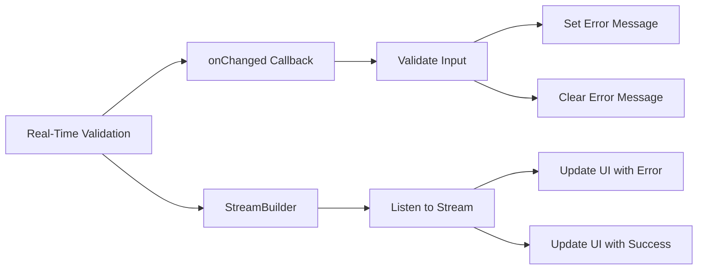
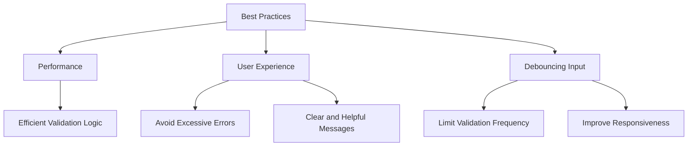

## 5.3.3 Real-Time Validation

In the realm of mobile app development, user experience is paramount. One of the key aspects that significantly enhances user experience is real-time validation. This technique provides immediate feedback to users as they input data, helping to prevent errors early and ensuring a smooth interaction with the application. In this section, we will explore how to implement real-time validation in Flutter, using techniques such as the `onChanged` callback and `StreamBuilder`, and discuss best practices to optimize performance and user experience.

### Introduction to Real-Time Validation

Real-time validation is a process where input data is checked for correctness as the user types, rather than waiting for form submission. This approach offers several benefits:

- **Immediate Feedback:** Users receive instant feedback on their input, allowing them to correct errors on the fly.
- **Enhanced User Experience:** By preventing errors early, users can complete forms more efficiently and with less frustration.
- **Reduced Error Rates:** Real-time validation helps ensure that data entered is correct and complete, reducing the likelihood of errors.

Consider a scenario where a user is entering their email address. With real-time validation, the app can immediately inform the user if the email format is incorrect, allowing them to correct it before moving on.

### Using onChanged for Real-Time Validation

The `onChanged` callback is a simple yet powerful tool for implementing real-time validation in Flutter. It is triggered every time the input text changes, allowing you to validate the input and update the UI accordingly.

Here's an example of using `onChanged` to validate an email input:

```dart
String _email = '';
String? _emailError;

TextField(
  decoration: InputDecoration(
    labelText: 'Email',
    errorText: _emailError,
  ),
  onChanged: (value) {
    setState(() {
      _email = value;
      if (_email.isEmpty) {
        _emailError = 'Email cannot be empty';
      } else if (!RegExp(r'^[^@]+@[^@]+\.[^@]+').hasMatch(_email)) {
        _emailError = 'Enter a valid email';
      } else {
        _emailError = null;
      }
    });
  },
);
```

**Explanation:**

- **`onChanged`:** This callback is invoked whenever the text field's value changes. It provides the current value of the text field as a parameter.
- **Validation Logic:** The input is checked for two conditions: whether it is empty and whether it matches a regular expression for valid email formats.
- **Error Message Update:** Based on the validation result, an error message is set, which is displayed using the `errorText` property of `InputDecoration`.

### Using StreamBuilders for Reactive Validation

For more complex validation scenarios, `StreamBuilder` can be used to manage real-time form validation. This approach is particularly useful when dealing with multiple input fields or when validation logic is more involved.

Here's how you can use `StreamBuilder` for email validation:

```dart
final StreamController<String> _emailController = StreamController<String>();
String? _emailError;

@override
void dispose() {
  _emailController.close();
  super.dispose();
}

@override
Widget build(BuildContext context) {
  return StreamBuilder<String>(
    stream: _emailController.stream,
    builder: (context, snapshot) {
      if (snapshot.hasError) {
        _emailError = snapshot.error as String?;
      } else {
        _emailError = null;
      }
      return TextField(
        decoration: InputDecoration(
          labelText: 'Email',
          errorText: _emailError,
        ),
        onChanged: (value) {
          if (value.isEmpty) {
            _emailController.addError('Email cannot be empty');
          } else if (!RegExp(r'^[^@]+@[^@]+\.[^@]+').hasMatch(value)) {
            _emailController.addError('Enter a valid email');
          } else {
            _emailController.add(value);
          }
        },
      );
    },
  );
}
```

**Explanation:**

- **`StreamController`:** Manages a stream of input data, allowing you to add data or errors to the stream.
- **`StreamBuilder`:** Listens to the stream and rebuilds the widget based on the latest data or error.
- **Error Handling:** Errors are added to the stream when validation fails, and the UI is updated accordingly.

### Displaying Validation Messages

Effective real-time validation involves not only checking input but also displaying helpful messages to guide the user. Here's an example of how to display validation messages for a password field:

```dart
String? _passwordError;

TextField(
  decoration: InputDecoration(
    labelText: 'Password',
    hintText: 'Enter your password',
    errorText: _passwordError,
  ),
  obscureText: true,
  onChanged: (value) {
    setState(() {
      if (value.length < 6) {
        _passwordError = 'Password must be at least 6 characters';
      } else {
        _passwordError = null;
      }
    });
  },
);
```

**Explanation:**

- **Immediate Feedback:** The user is informed if the password does not meet the minimum length requirement as they type.
- **User Guidance:** Clear and concise error messages help users understand what is required.

### Visualizing Real-Time Validation

To better understand the flow of real-time validation, consider the following Mermaid.js diagram:



This diagram illustrates the process of real-time validation using both `onChanged` and `StreamBuilder`, highlighting how input is validated and how the UI is updated based on the validation results.

### Best Practices for Real-Time Validation

Implementing real-time validation effectively requires attention to performance, user experience, and responsiveness. Here are some best practices to consider:

- **Performance Considerations:**
  - Ensure that validation logic is efficient to prevent lag during user input. Avoid complex computations or network requests in the `onChanged` callback.

- **User Experience:**
  - Avoid overwhelming users with too many error messages. Prioritize critical validations and provide clear, helpful messages.

- **Debouncing Input:**
  - Implement debouncing to limit how often validation runs, especially for expensive operations like API calls. This can be achieved using a `Timer` to delay validation until the user stops typing.

Here's an example of implementing debouncing:

```dart
Timer? _debounce;

TextField(
  decoration: InputDecoration(
    labelText: 'Search',
  ),
  onChanged: (value) {
    if (_debounce?.isActive ?? false) _debounce!.cancel();
    _debounce = Timer(Duration(milliseconds: 500), () {
      // Perform search or validation
      print('Search for: $value');
    });
  },
);
```

**Mermaid.js Diagram for Best Practices:**



### Conclusion

Real-time validation is a powerful technique for enhancing user experience in Flutter applications. By providing immediate feedback, users can correct errors early, leading to more efficient and error-free data entry. Whether using simple `onChanged` callbacks or more complex `StreamBuilder` setups, real-time validation should be implemented with performance and user experience in mind. By following best practices such as efficient validation logic, clear messaging, and debouncing, developers can create responsive and user-friendly applications.

## Quiz Time!



### What is the primary benefit of real-time validation in user input forms?

- [x] Provides immediate feedback to users
- [ ] Reduces the need for backend validation
- [ ] Increases application load time
- [ ] Eliminates the need for error messages

> **Explanation:** Real-time validation provides immediate feedback to users, allowing them to correct errors as they type, enhancing the overall user experience.

### Which Flutter callback is commonly used for real-time validation?

- [x] onChanged
- [ ] onSubmitted
- [ ] onTap
- [ ] onEditingComplete

> **Explanation:** The `onChanged` callback is triggered whenever the input text changes, making it ideal for real-time validation.

### What is the role of a StreamController in real-time validation?

- [x] Manages a stream of input data
- [ ] Displays error messages
- [ ] Handles network requests
- [ ] Formats input data

> **Explanation:** A `StreamController` manages a stream of input data, allowing you to add data or errors to the stream for real-time validation.

### How does the StreamBuilder widget assist in real-time validation?

- [x] Listens to a stream and rebuilds the widget based on the latest data
- [ ] Provides default error messages
- [ ] Automatically formats input data
- [ ] Handles form submission

> **Explanation:** `StreamBuilder` listens to a stream and rebuilds the widget based on the latest data or error, making it useful for real-time validation.

### What is a common use case for implementing debouncing in real-time validation?

- [x] Limiting how often validation runs
- [ ] Increasing the frequency of validation
- [ ] Automatically correcting user input
- [ ] Disabling validation temporarily

> **Explanation:** Debouncing is used to limit how often validation runs, especially for expensive operations like API calls, improving performance and responsiveness.

### Which of the following is a best practice for displaying validation messages?

- [x] Provide clear and helpful messages
- [ ] Display all possible errors at once
- [ ] Use technical jargon in messages
- [ ] Avoid displaying messages until form submission

> **Explanation:** Providing clear and helpful messages ensures that users understand what is required and can correct errors efficiently.

### What is the purpose of using a regular expression in real-time validation?

- [x] To check if the input matches a specific pattern
- [ ] To format the input data
- [ ] To automatically correct user input
- [ ] To handle network requests

> **Explanation:** Regular expressions are used to check if the input matches a specific pattern, such as a valid email format, during validation.

### How can you prevent performance issues during real-time validation?

- [x] Ensure validation logic is efficient
- [ ] Increase the frequency of validation
- [ ] Use complex computations in the onChanged callback
- [ ] Disable validation temporarily

> **Explanation:** Ensuring that validation logic is efficient helps prevent lag during user input, maintaining a smooth user experience.

### What is the effect of setting an errorText property in a TextField's InputDecoration?

- [x] Displays an error message below the TextField
- [ ] Changes the TextField's background color
- [ ] Disables the TextField
- [ ] Automatically submits the form

> **Explanation:** Setting the `errorText` property in a `TextField`'s `InputDecoration` displays an error message below the TextField, providing feedback to the user.

### True or False: Real-time validation can completely replace backend validation.

- [ ] True
- [x] False

> **Explanation:** Real-time validation enhances user experience by providing immediate feedback, but backend validation is still necessary for security and data integrity.


