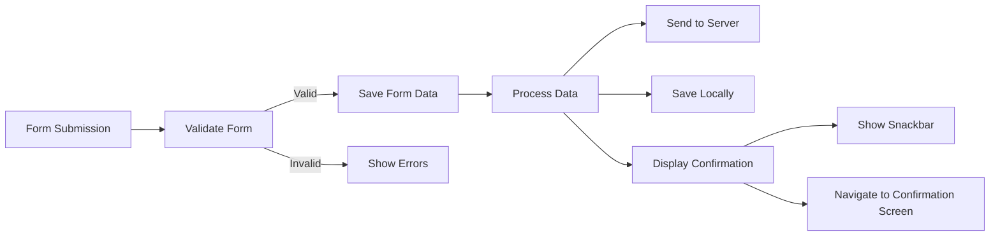
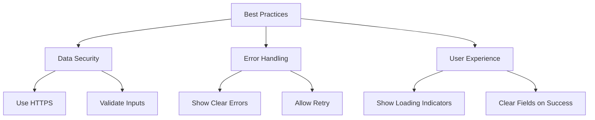

## 5.3.4 Submission and Processing

In the world of mobile app development, handling user input through forms is a fundamental aspect of creating interactive and dynamic applications. Whether you're building a simple contact form or a complex registration system, understanding how to effectively manage form submission and processing is crucial. This section will guide you through the intricacies of form submission in Flutter, covering everything from validation to data processing and user feedback.

### Introduction to Form Submission

Form submission is the process of collecting data entered by users and processing it for further use. This often involves sending the data to a backend server for storage or processing, but it can also include saving the data locally or displaying it within the app. The goal is to ensure that the data is handled securely and efficiently, providing a seamless experience for the user.

### Handling Submission in Forms

In Flutter, form submission is typically managed using a combination of form validation and data processing. Let's explore how to handle form submissions effectively.

#### Code Example: Basic Form Submission

```dart
ElevatedButton(
  onPressed: () {
    if (_formKey.currentState!.validate()) {
      // If the form is valid, process the data
      _formKey.currentState!.save();
      print('Form Submitted');
    }
  },
  child: Text('Submit'),
);
```

**Explanation:**

- **`validate()`**: This method runs all the validators associated with the form fields and returns `true` if all fields are valid. It's a crucial step to ensure that the data being submitted meets the required criteria.
- **`save()`**: Once the form is validated, the `save()` method is called to trigger the `onSaved` callbacks for each form field, allowing you to capture and store the data.

### Saving Form Data

The `onSaved` property of a form field is used to capture and store the validated input. This is essential for processing the data after submission.

#### Code Example: Using `onSaved` to Capture Data

```dart
String _username = '';
String _email = '';

TextFormField(
  decoration: InputDecoration(labelText: 'Username'),
  validator: validateNotEmpty,
  onSaved: (value) {
    _username = value!;
  },
);

TextFormField(
  decoration: InputDecoration(labelText: 'Email'),
  validator: validateEmail,
  onSaved: (value) {
    _email = value!;
  },
);
```

**Explanation:**

- **`onSaved`**: This callback is used to store the validated input into variables. It's called when the `save()` method is invoked on the form state, ensuring that only valid data is captured.

### Processing Data

Once the form data is captured, it can be processed in various ways, such as sending it to a server, saving it locally, or displaying it in the UI.

#### Code Example: Sending Data to a Server

```dart
Future<void> _submitData() async {
  final response = await http.post(
    Uri.parse('https://example.com/api/register'),
    headers: <String, String>{
      'Content-Type': 'application/json; charset=UTF-8',
    },
    body: jsonEncode(<String, String>{
      'username': _username,
      'email': _email,
    }),
  );

  if (response.statusCode == 200) {
    print('Data Successfully Submitted');
  } else {
    throw Exception('Failed to Submit Data');
  }
}

// Call _submitData() after form submission
ElevatedButton(
  onPressed: () {
    if (_formKey.currentState!.validate()) {
      _formKey.currentState!.save();
      _submitData();
    }
  },
  child: Text('Submit'),
);
```

**Explanation:**

- **HTTP POST Request**: The `http` package is used to send a POST request with the form data to a server. The response is checked to confirm successful submission.
- **Error Handling**: If the submission fails, an exception is thrown, which can be caught and handled appropriately.

### Showing Confirmation

Providing feedback to users after successful form submission is important for enhancing user experience. This can be done using a snackbar or by navigating to a confirmation screen.

#### Code Example: Displaying a Snackbar

```dart
ElevatedButton(
  onPressed: () {
    if (_formKey.currentState!.validate()) {
      _formKey.currentState!.save();
      ScaffoldMessenger.of(context).showSnackBar(
        SnackBar(content: Text('Processing Data')),
      );
      // Optionally navigate to another screen
    }
  },
  child: Text('Submit'),
);
```

### Visualizing the Form Submission Process

To better understand the flow of form submission, let's use a Mermaid.js diagram to visualize the process:



### Best Practices for Form Submission

When handling form submissions, it's important to follow best practices to ensure security, reliability, and a positive user experience.

#### Ensure Data Security

- **Use HTTPS**: Always send data over HTTPS to protect it from being intercepted.
- **Validate and Sanitize Inputs**: Ensure that all inputs are validated and sanitized to prevent security vulnerabilities such as SQL injection or cross-site scripting.

#### Handle Errors Gracefully

- **Provide Clear Error Messages**: If data submission fails, provide clear and informative error messages to the user.
- **Allow Retry**: Give users the option to retry submission if an error occurs.

#### Optimize User Experience

- **Use Loading Indicators**: Display loading indicators while processing data to inform users that an action is in progress.
- **Clear Form Fields on Success**: If appropriate, clear form fields upon successful submission to prepare for new input.

#### Visualizing Best Practices

Here's a Mermaid.js diagram to illustrate the best practices for form submission:



### Conclusion

Handling form submission and processing in Flutter involves a series of steps, from validation to data handling and user feedback. By following the best practices outlined in this section, you can ensure that your forms are secure, reliable, and user-friendly. Remember to validate inputs, handle errors gracefully, and provide clear feedback to users. With these techniques, you'll be well-equipped to manage form submissions in your Flutter applications.

## Quiz Time!



### What is the primary purpose of form submission in Flutter?

- [x] To collect and process user input data
- [ ] To display data on the screen
- [ ] To validate user input
- [ ] To navigate between screens

> **Explanation:** Form submission involves collecting and processing the data entered by the user, typically by sending it to a backend server or saving it locally.

### Which method is used to validate all form fields in Flutter?

- [ ] save()
- [x] validate()
- [ ] onSaved()
- [ ] submit()

> **Explanation:** The `validate()` method runs all validators associated with the form fields and returns `true` if all fields are valid.

### What does the `onSaved` property do in a form field?

- [ ] Displays an error message
- [ ] Validates the input
- [x] Captures and stores the validated input
- [ ] Submits the form

> **Explanation:** The `onSaved` property is a callback used to store the validated input into variables when the `save()` method is called.

### How can you provide feedback to users after form submission?

- [ ] By clearing the form fields
- [x] By displaying a snackbar
- [ ] By closing the app
- [ ] By logging out the user

> **Explanation:** A snackbar can be used to provide feedback to users after successful form submission, enhancing the user experience.

### Which package is commonly used to send HTTP requests in Flutter?

- [ ] dio
- [x] http
- [ ] url_launcher
- [ ] connectivity

> **Explanation:** The `http` package is commonly used to send HTTP requests in Flutter applications.

### What is a best practice for ensuring data security during form submission?

- [ ] Use HTTP
- [x] Use HTTPS
- [ ] Disable validation
- [ ] Allow all inputs

> **Explanation:** Using HTTPS ensures that data is sent securely over the network, protecting it from interception.

### What should you do if form submission fails?

- [ ] Ignore the error
- [x] Provide a clear error message
- [ ] Close the app
- [ ] Retry automatically without user consent

> **Explanation:** Providing a clear error message helps users understand what went wrong and how to fix it.

### Why is it important to use loading indicators during form submission?

- [ ] To confuse the user
- [x] To inform users that an action is in progress
- [ ] To slow down the app
- [ ] To prevent form submission

> **Explanation:** Loading indicators inform users that an action is in progress, improving the user experience by managing expectations.

### What is the purpose of the `save()` method in form submission?

- [ ] To validate the form
- [x] To call the `onSaved` callbacks for all form fields
- [ ] To submit the form to the server
- [ ] To clear the form fields

> **Explanation:** The `save()` method calls the `onSaved` callbacks for all form fields, capturing the validated input.

### True or False: It is a good practice to clear form fields upon successful submission.

- [x] True
- [ ] False

> **Explanation:** Clearing form fields upon successful submission prepares the form for new input and can improve user experience.


