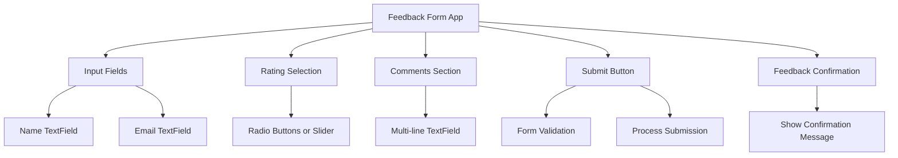

## 5.4.1 Project Overview

In this section, we delve into the creation of a **Feedback Form App** using Flutter, a project designed to consolidate your understanding of handling user input and form validation. This app will allow users to submit feedback by entering their name, email, rating, and comments. Through this project, you'll apply various user input widgets and validation techniques, enhancing your ability to create interactive and user-friendly applications.

### Project Description

The **Feedback Form App** is a practical application that captures user feedback through a structured form. This project will guide you through integrating multiple input widgets such as `TextField`, `Checkbox`, `Radio`, `Slider`, and `Form`, alongside implementing effective input validation. By the end of this project, you'll have a functional app that not only collects user data but also provides real-time validation feedback, ensuring a seamless user experience.

### Project Objectives

The primary objectives of this project are to:

- **Apply Knowledge of Input Widgets:** Utilize `TextField`, `Checkbox`, `Radio`, `Slider`, and `Form` widgets to create a comprehensive feedback form.
- **Implement Input Validation:** Ensure data integrity by validating user inputs such as email format and required fields.
- **Manage Form State Effectively:** Use state management techniques to handle form data and validation states.
- **Enhance User Experience:** Provide real-time validation feedback and interactive UI elements to improve user engagement.

### Expected Features

The Feedback Form App will include the following features:

- **Input Fields for Name and Email:** Collect basic user information with validation to ensure correct email format.
- **Rating Selection:** Allow users to rate their experience using radio buttons or a slider for a more interactive approach.
- **Comments Section:** Provide a multi-line `TextField` for users to enter detailed feedback.
- **Submission Button:** Validate the form and process the submission, displaying a confirmation message upon success.
- **Feedback Confirmation:** Notify users of successful submission with a confirmation message or dialog.

### Visualizing the Feedback Form App

To better understand the structure and flow of the Feedback Form App, refer to the following Mermaid.js diagram:



This diagram illustrates the components of the app and their interactions, providing a clear roadmap for the development process.

### Step-by-Step Implementation

#### 1. Setting Up the Form

Begin by setting up the basic structure of the form using Flutter's `Form` widget. This will serve as the container for all input fields and validation logic.

```dart
Form(
  key: _formKey,
  child: Column(
    children: <Widget>[
      // Add input fields here
    ],
  ),
)
```

**Key Points:**
- Use a `GlobalKey<FormState>` to manage the form's state.
- Organize input fields within a `Column` widget for a vertical layout.

#### 2. Implementing Input Fields

Add `TextField` widgets for name and email input. Ensure that each field includes validation logic to check for empty inputs and correct email format.

```dart
TextFormField(
  decoration: InputDecoration(labelText: 'Name'),
  validator: (value) {
    if (value == null || value.isEmpty) {
      return 'Please enter your name';
    }
    return null;
  },
),
TextFormField(
  decoration: InputDecoration(labelText: 'Email'),
  validator: (value) {
    if (value == null || value.isEmpty) {
      return 'Please enter your email';
    }
    if (!RegExp(r'^[^@]+@[^@]+\.[^@]+').hasMatch(value)) {
      return 'Please enter a valid email address';
    }
    return null;
  },
),
```

**Best Practices:**
- Use `TextFormField` for input fields to leverage built-in validation.
- Provide clear error messages to guide users.

#### 3. Adding Rating Selection

Incorporate radio buttons or a slider to allow users to rate their experience. This adds an interactive element to the form.

```dart
Row(
  children: <Widget>[
    Radio(
      value: 1,
      groupValue: _rating,
      onChanged: (int? value) {
        setState(() {
          _rating = value!;
        });
      },
    ),
    Text('1'),
    // Repeat for other ratings
  ],
)
```

**Considerations:**
- Use `setState` to update the UI when the rating changes.
- Ensure the rating selection is intuitive and accessible.

#### 4. Creating the Comments Section

Provide a multi-line `TextField` for users to enter detailed feedback. This field should be flexible to accommodate varying lengths of input.

```dart
TextFormField(
  decoration: InputDecoration(labelText: 'Comments'),
  maxLines: 4,
  validator: (value) {
    if (value == null || value.isEmpty) {
      return 'Please enter your comments';
    }
    return null;
  },
),
```

**Tips:**
- Set `maxLines` to allow for multi-line input.
- Validate to ensure comments are not left empty.

#### 5. Implementing the Submission Button

Add a button to submit the form. Implement validation checks and display a confirmation message upon successful submission.

```dart
ElevatedButton(
  onPressed: () {
    if (_formKey.currentState!.validate()) {
      // Process data
      ScaffoldMessenger.of(context).showSnackBar(
        SnackBar(content: Text('Feedback submitted successfully')),
      );
    }
  },
  child: Text('Submit'),
)
```

**Challenges:**
- Ensure all fields are validated before processing the submission.
- Use `ScaffoldMessenger` to provide feedback to the user.

### Encouraging Hands-On Practice

As you work through this project, take the time to experiment with different input widgets and validation techniques. Consider extending the app by adding features such as:

- **Additional Input Fields:** Capture more detailed user information.
- **Enhanced Validation:** Implement more complex validation rules.
- **UI Customization:** Style the form to match a specific theme or brand.

### Conclusion

The Feedback Form App project provides a comprehensive exercise in handling user input and form validation in Flutter. By following the step-by-step guide and utilizing the provided code snippets, you'll gain practical experience in creating interactive and user-friendly applications. Remember to refer to the official Flutter documentation and explore additional resources to deepen your understanding and expand your skill set.

## Quiz Time!



### What is the primary purpose of the Feedback Form App project?

- [x] To practice handling user input and form validation in Flutter.
- [ ] To create a complex database application.
- [ ] To implement advanced animations.
- [ ] To learn about network requests.

> **Explanation:** The Feedback Form App project focuses on handling user input and form validation, which are essential skills in Flutter development.

### Which widget is used to manage the state of a form in Flutter?

- [x] Form
- [ ] Container
- [ ] Column
- [ ] Row

> **Explanation:** The `Form` widget in Flutter is used to manage the state of a form, allowing for validation and submission handling.

### What is the purpose of using a `GlobalKey<FormState>` in a Flutter form?

- [x] To manage the form's state and validation.
- [ ] To style the form.
- [ ] To handle animations.
- [ ] To manage network requests.

> **Explanation:** A `GlobalKey<FormState>` is used to manage the state and validation of a form in Flutter.

### How can you provide real-time validation feedback in a Flutter form?

- [x] By using the `validator` property of `TextFormField`.
- [ ] By using a `Container` widget.
- [ ] By implementing a custom animation.
- [ ] By using a `ListView`.

> **Explanation:** The `validator` property of `TextFormField` allows for real-time validation feedback by checking input as the user types.

### What is the role of `setState` in handling user input?

- [x] To update the UI when the input changes.
- [ ] To initialize the app.
- [ ] To handle network requests.
- [ ] To manage database operations.

> **Explanation:** `setState` is used to update the UI in response to changes in user input or other state changes.

### Which widget is suitable for capturing multi-line text input?

- [x] TextFormField with `maxLines` set.
- [ ] Radio
- [ ] Slider
- [ ] Checkbox

> **Explanation:** A `TextFormField` with `maxLines` set allows for capturing multi-line text input.

### What is the purpose of the `ScaffoldMessenger` in Flutter?

- [x] To display snack bars and other temporary messages.
- [ ] To manage form state.
- [ ] To handle animations.
- [ ] To manage network requests.

> **Explanation:** `ScaffoldMessenger` is used to display snack bars and other temporary messages to the user.

### How can you ensure that an email input is valid in a Flutter form?

- [x] By using a regular expression in the `validator` property.
- [ ] By using a `Container` widget.
- [ ] By implementing a custom animation.
- [ ] By using a `ListView`.

> **Explanation:** A regular expression in the `validator` property can be used to ensure that an email input is valid.

### What should be done before processing the form submission?

- [x] Validate all input fields.
- [ ] Initialize the app.
- [ ] Handle network requests.
- [ ] Manage database operations.

> **Explanation:** All input fields should be validated to ensure data integrity before processing the form submission.

### True or False: The Feedback Form App project includes implementing network requests.

- [ ] True
- [x] False

> **Explanation:** The Feedback Form App project focuses on user input and form validation, not on implementing network requests.


