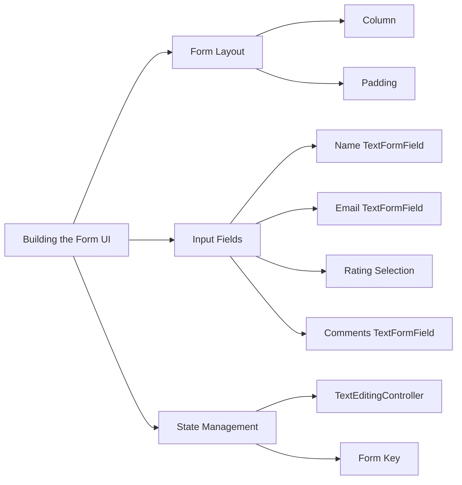

## 5.4.2 Building the Form UI

Creating an intuitive and functional user interface for forms is a crucial aspect of app development. In this section, we will guide you through the process of building a feedback form using Flutter. This involves designing the form layout, adding various input fields, and managing the form's state effectively. By the end of this section, you will have a comprehensive understanding of how to construct a user-friendly form interface in Flutter.

### Designing the Form Layout

The layout of a form is essential for ensuring that users can easily navigate and complete it. In Flutter, we use layout widgets such as `Column`, `Row`, and `Padding` to organize input fields and provide appropriate spacing. Let's start by structuring our form using these widgets.

#### Structuring the Form with Layout Widgets

To create a well-organized form, we will use a `Column` widget to stack our input fields vertically. We will also use `Padding` to add space around the form, making it visually appealing and user-friendly.

```dart
Padding(
  padding: const EdgeInsets.all(16.0),
  child: Form(
    key: _formKey,
    child: Column(
      children: <Widget>[
        TextFormField(
          decoration: InputDecoration(labelText: 'Name'),
          validator: validateNotEmpty,
          onSaved: (value) {
            _name = value!;
          },
        ),
        TextFormField(
          decoration: InputDecoration(labelText: 'Email'),
          validator: validateEmail,
          onSaved: (value) {
            _email = value!;
          },
        ),
        // Additional form fields will be added here
      ],
    ),
  ),
);
```

**Explanation:**
- **Padding:** We use the `Padding` widget to add a uniform margin around the form, enhancing its appearance and usability.
- **Form:** The `Form` widget is a container for form fields. It uses a `GlobalKey` to manage the form's state, allowing us to validate and save the form data.
- **Column:** This widget stacks its children vertically, making it ideal for organizing form fields.
- **TextFormField:** These are the input fields for the form. We will add more fields as we progress.

### Adding Input Fields

Input fields are the core components of any form. In our feedback form, we will include fields for the user's name, email, a rating selection, and a comments section.

#### Name and Email Fields

The `TextFormField` widget is perfect for capturing text input. We will use it to create fields for the user's name and email, complete with validation logic to ensure data integrity.

```dart
TextFormField(
  decoration: InputDecoration(labelText: 'Name'),
  validator: validateNotEmpty,
  onSaved: (value) {
    _name = value!;
  },
);

TextFormField(
  decoration: InputDecoration(labelText: 'Email'),
  validator: validateEmail,
  onSaved: (value) {
    _email = value!;
  },
);
```

**Explanation:**
- **InputDecoration:** Provides a label for the input field, guiding the user on what to enter.
- **Validator:** A function that checks the input's validity. `validateNotEmpty` ensures the field is not empty, while `validateEmail` checks for a valid email format.
- **onSaved:** A callback that saves the input value when the form is submitted.

#### Rating Selection

For the rating input, we can choose between radio buttons or a slider. Each method has its advantages, and the choice depends on the desired user experience.

**Radio Buttons Example:**

```dart
Column(
  crossAxisAlignment: CrossAxisAlignment.start,
  children: <Widget>[
    Text('Rate our service:', style: TextStyle(fontSize: 16)),
    Row(
      children: <Widget>[
        Radio<int>(
          value: 1,
          groupValue: _rating,
          onChanged: (int? value) {
            setState(() {
              _rating = value!;
            });
          },
        ),
        Text('1'),
        Radio<int>(
          value: 2,
          groupValue: _rating,
          onChanged: (int? value) {
            setState(() {
              _rating = value!;
            });
          },
        ),
        Text('2'),
        // Continue for ratings 3 to 5
      ],
    ),
  ],
);
```

**Slider Example:**

```dart
Column(
  crossAxisAlignment: CrossAxisAlignment.start,
  children: <Widget>[
    Text('Rate our service:', style: TextStyle(fontSize: 16)),
    Slider(
      value: _rating.toDouble(),
      min: 1.0,
      max: 5.0,
      divisions: 4,
      label: '$_rating',
      onChanged: (double newValue) {
        setState(() {
          _rating = newValue.round();
        });
      },
    ),
  ],
);
```

**Explanation:**
- **Radio Buttons:** Allow users to select a discrete value. Each `Radio` widget represents a choice, and the `groupValue` links them together.
- **Slider:** Provides a continuous range of values. The `divisions` property specifies the number of discrete intervals.

#### Comments Section

To capture user comments, we will use a multi-line `TextFormField`. This allows users to provide detailed feedback.

```dart
TextFormField(
  decoration: InputDecoration(
    labelText: 'Comments',
    alignLabelWithHint: true,
    border: OutlineInputBorder(),
  ),
  maxLines: 4,
  onSaved: (value) {
    _comments = value!;
  },
);
```

**Explanation:**
- **Multi-line Input:** The `maxLines` property allows the field to expand, accommodating longer text.
- **OutlineInputBorder:** Enhances the field's appearance with a border.

### Implementing Controlled Input Widgets

For greater control over input fields, we can use `TextEditingController`. This allows us to programmatically manipulate the text within the fields.

```dart
final TextEditingController _nameController = TextEditingController();
final TextEditingController _emailController = TextEditingController();

@override
void dispose() {
  _nameController.dispose();
  _emailController.dispose();
  super.dispose();
}

TextFormField(
  controller: _nameController,
  decoration: InputDecoration(labelText: 'Name'),
  validator: validateNotEmpty,
);
```

**Explanation:**
- **TextEditingController:** Manages the text being edited. It can be used to set initial values, clear the field, or retrieve the current text.
- **dispose:** It's crucial to dispose of controllers to free up resources when they are no longer needed.

### Visualizing the Form Structure

To better understand the form's structure, let's use a Mermaid.js diagram to visualize the components and their relationships.



**Diagram Explanation:**
- **Form Layout:** Shows the use of `Column` and `Padding` to organize the form.
- **Input Fields:** Illustrates the different types of input fields used in the form.
- **State Management:** Highlights the use of `TextEditingController` and `Form Key` for managing form state.

### Best Practices and Common Pitfalls

- **Consistent Spacing:** Use `Padding` and `SizedBox` to ensure consistent spacing between form elements.
- **Validation:** Always validate user input to prevent errors and ensure data integrity.
- **State Management:** Use `setState` judiciously to update the UI only when necessary, avoiding unnecessary rebuilds.
- **Accessibility:** Ensure that all form elements are accessible, with appropriate labels and hints.

### Further Exploration

- **Official Documentation:** Refer to the [Flutter documentation](https://flutter.dev/docs) for more details on form widgets and state management.
- **Open-Source Projects:** Explore open-source Flutter projects on GitHub to see how others implement forms.
- **Online Courses:** Consider taking courses on platforms like Udemy or Coursera to deepen your understanding of Flutter development.

### Conclusion

Building a form UI in Flutter involves a combination of layout design, input field configuration, and state management. By following the steps outlined in this section, you can create a functional and user-friendly feedback form. Remember to validate input, manage state effectively, and ensure accessibility for all users.

## Quiz Time!



### What is the primary widget used to stack form fields vertically in Flutter?

- [x] Column
- [ ] Row
- [ ] Stack
- [ ] ListView

> **Explanation:** The `Column` widget is used to stack its children vertically, making it ideal for organizing form fields.

### Which widget is used to add space around a form in Flutter?

- [x] Padding
- [ ] Margin
- [ ] Spacer
- [ ] Align

> **Explanation:** The `Padding` widget is used to add space around its child, enhancing the form's appearance and usability.

### What property of `TextFormField` is used to validate user input?

- [x] validator
- [ ] onSaved
- [ ] decoration
- [ ] controller

> **Explanation:** The `validator` property is a function that checks the input's validity and returns an error message if the input is invalid.

### How can you manage the text within a `TextFormField` programmatically?

- [x] Using TextEditingController
- [ ] Using FormKey
- [ ] Using GlobalKey
- [ ] Using State

> **Explanation:** `TextEditingController` allows you to programmatically manipulate the text within a `TextFormField`.

### What is the purpose of the `dispose` method in Flutter?

- [x] To free up resources when they are no longer needed
- [ ] To initialize state variables
- [ ] To build the widget tree
- [ ] To validate form input

> **Explanation:** The `dispose` method is used to clean up resources, such as controllers, when they are no longer needed.

### Which widget is used to create a multi-line input field in Flutter?

- [x] TextFormField with maxLines property
- [ ] TextField
- [ ] TextArea
- [ ] MultiLineInput

> **Explanation:** A `TextFormField` with the `maxLines` property set allows for multi-line input.

### What is the role of the `onSaved` property in a `TextFormField`?

- [x] To save the input value when the form is submitted
- [ ] To validate the input
- [ ] To decorate the input field
- [ ] To control the input text

> **Explanation:** The `onSaved` property is a callback that saves the input value when the form is submitted.

### Which widget would you use to allow users to select a discrete value from a set of options?

- [x] Radio
- [ ] Slider
- [ ] Checkbox
- [ ] Switch

> **Explanation:** The `Radio` widget allows users to select a discrete value from a set of options.

### What is the purpose of the `Form` widget in Flutter?

- [x] To manage the state of form fields
- [ ] To layout form fields
- [ ] To validate form input
- [ ] To decorate form fields

> **Explanation:** The `Form` widget is a container for form fields and manages their state, allowing for validation and saving of input data.

### True or False: The `Slider` widget can only be used for continuous values.

- [ ] True
- [x] False

> **Explanation:** The `Slider` widget can be configured with the `divisions` property to allow for discrete values.


