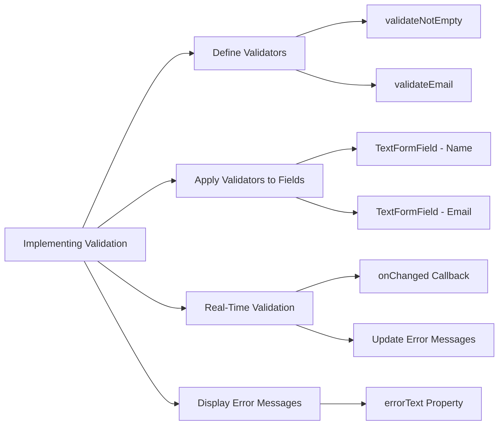

## 5.4.3 Implementing Validation

In the world of app development, ensuring that user input is valid and meets the expected criteria is crucial for maintaining data integrity and providing a seamless user experience. This section delves into the intricacies of implementing form validation in Flutter, offering a comprehensive guide to defining, applying, and managing validators effectively. By the end of this section, you'll be equipped with the knowledge to create robust forms that guide users in providing accurate and complete information.

### Introduction to Form Validation

Form validation is a critical aspect of app development that ensures the data collected from users is both accurate and useful. Without proper validation, apps can suffer from data inconsistencies, security vulnerabilities, and poor user experiences. Validation serves multiple purposes:

- **Data Integrity:** Ensures that the data entered by users is in the correct format and meets the application's requirements.
- **User Feedback:** Provides immediate feedback to users, helping them correct errors before submitting the form.
- **Security:** Prevents malicious input that could lead to security breaches or application crashes.

In Flutter, form validation is typically handled using the `Form` widget, which provides a convenient way to manage multiple input fields and their validation states. Let's explore how to set up and implement validation in your Flutter applications.

### Setting Up Validators

Validators are functions that check whether the input meets certain criteria. If the input is valid, the validator returns `null`; otherwise, it returns an error message. This simple mechanism allows you to enforce rules on user input effectively.

#### Defining Validator Functions

To start, you'll need to define validator functions that encapsulate the logic for checking input validity. Here are two common validators: one for checking if a field is not empty and another for validating email addresses.

```dart
String? validateNotEmpty(String? value) {
  if (value == null || value.isEmpty) {
    return 'This field cannot be empty';
  }
  return null;
}

String? validateEmail(String? value) {
  if (value == null || value.isEmpty) {
    return 'Please enter your email';
  }
  if (!RegExp(r'^[^@]+@[^@]+\.[^@]+').hasMatch(value)) {
    return 'Enter a valid email';
  }
  return null;
}
```

- **`validateNotEmpty`:** Ensures that the input is not empty. This is a basic check that can be applied to most fields.
- **`validateEmail`:** Checks that the input is a valid email format using a regular expression. This is crucial for fields where email addresses are required.

### Applying Validators to Form Fields

Once you've defined your validators, the next step is to apply them to the form fields within the `Form` widget. This is done by assigning the validator function to the `validator` property of each `TextFormField`.

#### Example: Applying Validators

```dart
Form(
  key: _formKey,
  child: Column(
    children: <Widget>[
      TextFormField(
        decoration: InputDecoration(labelText: 'Name'),
        validator: validateNotEmpty,
        onSaved: (value) {
          _name = value!;
        },
      ),
      TextFormField(
        decoration: InputDecoration(labelText: 'Email'),
        validator: validateEmail,
        onSaved: (value) {
          _email = value!;
        },
      ),
      // Additional form fields with validators
    ],
  ),
);
```

- **`_formKey`:** A `GlobalKey` that uniquely identifies the `Form` widget and allows validation and saving of form fields.
- **`validator`:** The property where you assign your validator function. It will be called when the form is validated.
- **`onSaved`:** A callback that saves the input value when the form is successfully validated.

### Real-Time Validation Integration

Real-time validation provides immediate feedback to users as they fill out the form. This enhances the user experience by allowing users to correct errors on the fly, rather than waiting until form submission.

#### Implementing Real-Time Validation

To implement real-time validation, you can use the `onChanged` callback of `TextFormField` to update the state and display error messages dynamically.

```dart
TextFormField(
  decoration: InputDecoration(labelText: 'Name'),
  controller: _nameController,
  onChanged: (value) {
    setState(() {
      if (value.isEmpty) {
        _nameError = 'Name cannot be empty';
      } else {
        _nameError = null;
      }
    });
  },
  validator: validateNotEmpty,
);
```

- **`_nameController`:** A `TextEditingController` that controls the text being edited.
- **`onChanged`:** A callback that is triggered whenever the text changes, allowing you to update the error message in real-time.
- **`setState`:** Used to update the UI with the new error message.

### Handling Validation Errors

Displaying error messages effectively is key to guiding users in correcting their input. Error messages should be clear, concise, and placed in a way that users can easily associate them with the corresponding input field.

#### Displaying Error Messages

The `errorText` property of `InputDecoration` is used to display error messages below the input field.

```dart
TextFormField(
  decoration: InputDecoration(
    labelText: 'Email',
    errorText: _emailError,
  ),
  controller: _emailController,
  onChanged: (value) {
    setState(() {
      if (value.isEmpty) {
        _emailError = 'Email cannot be empty';
      } else if (!RegExp(r'^[^@]+@[^@]+\.[^@]+').hasMatch(value)) {
        _emailError = 'Enter a valid email';
      } else {
        _emailError = null;
      }
    });
  },
  validator: validateEmail,
);
```

- **`errorText`:** Displays the error message below the input field. It is updated dynamically based on the input validation.

### Conditional Validation Based on Input

In some cases, you may need to perform additional validation checks based on previous inputs or certain conditions. This is often necessary for fields like passwords, where complexity requirements might depend on user roles or other factors.

#### Example: Conditional Validation

```dart
TextFormField(
  decoration: InputDecoration(labelText: 'Password'),
  obscureText: true,
  validator: (value) {
    if (value == null || value.isEmpty) {
      return 'Please enter your password';
    }
    if (value.length < 8) {
      return 'Password must be at least 8 characters long';
    }
    return null;
  },
  onSaved: (value) {
    _password = value!;
  },
);
```

- **`obscureText`:** Hides the text being entered, useful for password fields.
- **Conditional Checks:** The validator checks for both the presence of input and its length, ensuring that passwords meet minimum security requirements.

### Visualizing the Validation Flow

To better understand the flow of implementing validation, let's visualize the process using a Mermaid.js diagram.



- **Define Validators:** Start by defining the validation logic.
- **Apply Validators:** Assign these validators to the corresponding form fields.
- **Real-Time Validation:** Use callbacks to provide immediate feedback.
- **Display Error Messages:** Guide users with clear error messages.

### Conclusion

Implementing validation in your Flutter forms is essential for ensuring data integrity and enhancing user experience. By defining robust validators, applying them to form fields, and integrating real-time feedback, you can create forms that are both user-friendly and secure. Remember to keep error messages clear and concise, and consider conditional validation for more complex scenarios.

By following these guidelines, you'll be well-equipped to handle user input effectively in your Flutter applications, providing a seamless and intuitive experience for your users.

## Quiz Time!



### What is the primary purpose of form validation in Flutter?

- [x] To ensure data integrity and provide immediate feedback to users.
- [ ] To enhance the visual appearance of the form.
- [ ] To increase the app's performance.
- [ ] To reduce the app's file size.

> **Explanation:** Form validation ensures that user input is accurate and meets the application's requirements, providing immediate feedback to users to correct errors.

### Which property of `TextFormField` is used to assign a validator function?

- [x] `validator`
- [ ] `onChanged`
- [ ] `onSaved`
- [ ] `decoration`

> **Explanation:** The `validator` property is used to assign a function that checks the validity of the input and returns an error message if the input is invalid.

### How can you provide real-time validation feedback in a Flutter form?

- [x] By using the `onChanged` callback to update the state and display error messages dynamically.
- [ ] By using the `validator` property alone.
- [ ] By using the `onSaved` callback.
- [ ] By using the `decoration` property.

> **Explanation:** The `onChanged` callback allows you to update the state and display error messages as the user types, providing real-time feedback.

### What does the `errorText` property of `InputDecoration` do?

- [x] Displays an error message below the input field.
- [ ] Changes the color of the input field.
- [ ] Hides the input field.
- [ ] Disables the input field.

> **Explanation:** The `errorText` property is used to display an error message below the input field, guiding users in correcting their input.

### Which of the following is a valid email validator function?

- [x] `validateEmail`
- [ ] `validatePassword`
- [ ] `validateNotEmpty`
- [ ] `validateLength`

> **Explanation:** `validateEmail` is a function designed to check if the input is a valid email format.

### What is the purpose of the `obscureText` property in `TextFormField`?

- [x] To hide the text being entered, useful for password fields.
- [ ] To change the font style of the text.
- [ ] To disable the text field.
- [ ] To make the text field read-only.

> **Explanation:** The `obscureText` property hides the text being entered, which is useful for password fields to ensure privacy.

### How can you perform conditional validation based on previous inputs?

- [x] By using additional checks within the validator function.
- [ ] By using the `onSaved` callback.
- [ ] By using the `decoration` property.
- [ ] By using the `controller` property.

> **Explanation:** Conditional validation can be implemented by adding additional checks within the validator function to ensure the input meets specific criteria.

### What is the role of the `GlobalKey` in a Flutter form?

- [x] It uniquely identifies the `Form` widget and allows validation and saving of form fields.
- [ ] It changes the theme of the form.
- [ ] It disables all form fields.
- [ ] It makes the form read-only.

> **Explanation:** A `GlobalKey` uniquely identifies the `Form` widget, enabling validation and saving operations across multiple form fields.

### Which method is used to update the UI with new error messages in real-time validation?

- [x] `setState`
- [ ] `onSaved`
- [ ] `validator`
- [ ] `decoration`

> **Explanation:** `setState` is used to update the UI with new error messages, allowing for real-time validation feedback.

### True or False: Validators in Flutter return `null` if the input is valid.

- [x] True
- [ ] False

> **Explanation:** Validators return `null` when the input is valid, indicating no error message is needed.


