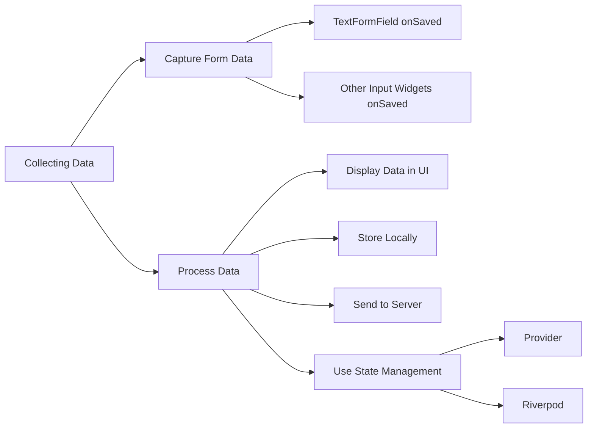

## 5.4.4 Collecting and Displaying Data

In this section, we delve into the essential process of collecting and displaying data within a Flutter application. This involves capturing user input from form fields, processing it, and then either displaying it within the app, storing it locally, or sending it to a server for further use. Understanding these concepts is crucial for building interactive and data-driven applications.

### Introduction to Data Collection

Data collection in mobile applications is a fundamental task that involves capturing user input through various form fields. This data can be used for numerous purposes, such as personalizing user experiences, storing preferences, or sending feedback to a server. In Flutter, data collection is typically achieved through form widgets, which allow developers to gather and validate user input efficiently.

#### Why Collect Data?

- **User Interaction:** Collecting data allows apps to interact with users, providing personalized experiences.
- **Feedback and Improvement:** User feedback can be collected to improve app features and functionality.
- **Data Analysis:** Collected data can be analyzed to understand user behavior and preferences.
- **Persistent Storage:** Data can be stored locally or remotely for future use, ensuring continuity across sessions.

### Capturing Form Data

Capturing form data in Flutter involves using form widgets like `TextFormField`, `Slider`, and others. These widgets provide `onSaved` callbacks, which are used to store user input into variables when the form is submitted.

#### Code Example: Capturing User Input

```dart
String _name = '';
String _email = '';
int _rating = 3;
String _comments = '';

TextFormField(
  decoration: InputDecoration(labelText: 'Name'),
  validator: validateNotEmpty,
  onSaved: (value) {
    _name = value!;
  },
);

TextFormField(
  decoration: InputDecoration(labelText: 'Email'),
  validator: validateEmail,
  onSaved: (value) {
    _email = value!;
  },
);

Slider(
  value: _rating.toDouble(),
  min: 1.0,
  max: 5.0,
  divisions: 4,
  label: '$_rating',
  onChanged: (double newValue) {
    setState(() {
      _rating = newValue.round();
    });
  },
);

TextFormField(
  decoration: InputDecoration(
    labelText: 'Comments',
    alignLabelWithHint: true,
    border: OutlineInputBorder(),
  ),
  maxLines: 4,
  onSaved: (value) {
    _comments = value!;
  },
);
```

**Explanation:**

- **TextFormField:** Used for capturing text input. The `onSaved` callback stores the input into a variable.
- **Slider:** Captures numerical input. The `onChanged` callback updates the state variable.
- **Validation:** Each field includes a validator to ensure the input meets specific criteria before saving.

### Displaying Collected Data

Once data is collected, it can be displayed within the app to provide feedback to the user or for further interaction. This is typically done after form submission and validation.

#### Code Example: Displaying Data

```dart
ElevatedButton(
  onPressed: () {
    if (_formKey.currentState!.validate()) {
      _formKey.currentState!.save();
      setState(() {
        // Display the collected data
        _displayData = true;
      });
    }
  },
  child: Text('Submit'),
);

if (_displayData) {
  Column(
    crossAxisAlignment: CrossAxisAlignment.start,
    children: <Widget>[
      Text('Name: $_name'),
      Text('Email: $_email'),
      Text('Rating: $_rating'),
      Text('Comments: $_comments'),
    ],
  );
}
```

**Explanation:**

- **Form Submission:** The `ElevatedButton` triggers form validation and data saving.
- **Conditional Rendering:** A state variable (`_displayData`) is used to conditionally render the collected data.
- **Text Widgets:** Display the stored data using `Text` widgets, providing a simple way to show information.

### Storing Data Locally

Local data storage is essential for persisting user data across app sessions. Flutter provides several packages for local storage, such as `shared_preferences` and `sqflite`.

#### Using Shared Preferences

`shared_preferences` is a lightweight solution for storing simple key-value pairs.

##### Code Example: Saving Data Locally

```dart
import 'package:shared_preferences/shared_preferences.dart';

Future<void> _saveData() async {
  final prefs = await SharedPreferences.getInstance();
  await prefs.setString('name', _name);
  await prefs.setString('email', _email);
  await prefs.setInt('rating', _rating);
  await prefs.setString('comments', _comments);
  print('Data Saved Locally');
}

ElevatedButton(
  onPressed: () {
    if (_formKey.currentState!.validate()) {
      _formKey.currentState!.save();
      _saveData();
      setState(() {
        _displayData = true;
      });
    }
  },
  child: Text('Submit'),
);
```

**Explanation:**

- **SharedPreferences:** Provides a simple API for storing and retrieving key-value pairs.
- **Asynchronous Operations:** Use `async` and `await` to handle asynchronous data storage operations.

### Sending Data to a Server

Sending data to a server is crucial for applications that require backend processing or storage. This can be achieved using HTTP requests.

#### Code Example: Submitting Feedback to a Server

```dart
import 'dart:convert';
import 'package:http/http.dart' as http;

Future<void> _submitFeedback() async {
  final response = await http.post(
    Uri.parse('https://example.com/api/feedback'),
    headers: <String, String>{
      'Content-Type': 'application/json; charset=UTF-8',
    },
    body: jsonEncode(<String, dynamic>{
      'name': _name,
      'email': _email,
      'rating': _rating,
      'comments': _comments,
    }),
  );

  if (response.statusCode == 200) {
    print('Feedback Submitted Successfully');
  } else {
    throw Exception('Failed to Submit Feedback');
  }
}

ElevatedButton(
  onPressed: () {
    if (_formKey.currentState!.validate()) {
      _formKey.currentState!.save();
      _submitFeedback();
      setState(() {
        _displayData = true;
      });
    }
  },
  child: Text('Submit'),
);
```

**Explanation:**

- **HTTP POST Request:** Sends data to a server endpoint using the `http` package.
- **JSON Encoding:** Converts Dart objects to JSON format for transmission.
- **Error Handling:** Checks the response status code to ensure successful submission.

### Advanced Data Handling

For more complex applications, managing form data across different parts of the app can be challenging. State management solutions like Provider or Riverpod can help.

#### Using Provider for State Management

Provider is a popular state management solution that allows for efficient data handling and UI updates.

##### Code Example: Managing Form Data with Provider

```dart
import 'package:flutter/material.dart';
import 'package:provider/provider.dart';

// Define a FeedbackModel
class FeedbackModel with ChangeNotifier {
  String name = '';
  String email = '';
  int rating = 3;
  String comments = '';

  void updateName(String newName) {
    name = newName;
    notifyListeners();
  }

  void updateEmail(String newEmail) {
    email = newEmail;
    notifyListeners();
  }

  void updateRating(int newRating) {
    rating = newRating;
    notifyListeners();
  }

  void updateComments(String newComments) {
    comments = newComments;
    notifyListeners();
  }
}

// Provide the FeedbackModel
void main() {
  runApp(
    ChangeNotifierProvider(
      create: (context) => FeedbackModel(),
      child: MyApp(),
    ),
  );
}

// Usage in the form
Consumer<FeedbackModel>(
  builder: (context, feedback, child) {
    return TextFormField(
      decoration: InputDecoration(labelText: 'Name'),
      onChanged: (value) {
        feedback.updateName(value);
      },
      validator: validateNotEmpty,
    );
  },
);
```

**Explanation:**

- **ChangeNotifier:** A simple class that provides change notifications to listeners.
- **Provider:** Supplies the `FeedbackModel` to the widget tree, allowing for reactive UI updates.
- **Consumer Widget:** Accesses the model and updates the UI based on changes.

### Visualizing the Data Flow

To better understand the flow of data from collection to processing and storage, consider the following diagram:



**Diagram Explanation:**

- **Data Collection:** Begins with capturing user input through form fields.
- **Data Processing:** Involves displaying data, storing it locally, or sending it to a server.
- **State Management:** Utilizes solutions like Provider or Riverpod for managing data across the app.

### Conclusion

Collecting and displaying data in Flutter is a multi-step process that involves capturing user input, processing it, and then utilizing it within the app or sending it to a server. By understanding these concepts and utilizing the tools and techniques discussed, you can build robust, data-driven applications that provide rich user experiences.

### Further Exploration

- **Official Documentation:** Explore the [Flutter documentation](https://flutter.dev/docs) for more insights into form handling and data management.
- **State Management:** Learn more about [Provider](https://pub.dev/packages/provider) and [Riverpod](https://pub.dev/packages/riverpod) for advanced state management techniques.
- **Local Storage:** Check out the [shared_preferences](https://pub.dev/packages/shared_preferences) and [sqflite](https://pub.dev/packages/sqflite) packages for local data storage solutions.

## Quiz Time!



### What is the primary purpose of collecting data in a Flutter app?

- [x] To capture user input for processing or display
- [ ] To increase app size
- [ ] To make the app slower
- [ ] To reduce user interaction

> **Explanation:** Collecting data allows the app to capture user input, which can be processed or displayed for various purposes, enhancing user interaction and experience.

### Which widget is commonly used to capture text input in Flutter?

- [x] TextFormField
- [ ] Slider
- [ ] Container
- [ ] Column

> **Explanation:** `TextFormField` is used to capture text input from users, providing features like validation and saving input.

### How can you store simple key-value pairs locally in Flutter?

- [x] Using shared_preferences
- [ ] Using HTTP requests
- [ ] Using a ListView
- [ ] Using a GridView

> **Explanation:** `shared_preferences` is a package that allows storing simple key-value pairs locally in Flutter applications.

### What is the purpose of the `onSaved` callback in a `TextFormField`?

- [x] To store the user input into a variable
- [ ] To validate the input
- [ ] To style the input field
- [ ] To display an error message

> **Explanation:** The `onSaved` callback is used to store the user input into a variable when the form is submitted.

### Which package is used for making HTTP requests in Flutter?

- [x] http
- [ ] provider
- [ ] shared_preferences
- [ ] sqflite

> **Explanation:** The `http` package is used for making HTTP requests in Flutter, allowing communication with a server.

### What does the `setState` method do in Flutter?

- [x] It updates the UI by changing the state of the widget
- [ ] It saves data to a server
- [ ] It initializes the app
- [ ] It deletes user data

> **Explanation:** `setState` is used to update the UI by changing the state of the widget, triggering a rebuild.

### Which state management solution is mentioned for handling form data?

- [x] Provider
- [ ] Redux
- [ ] Bloc
- [ ] MobX

> **Explanation:** Provider is mentioned as a state management solution for handling form data in Flutter applications.

### What is the role of the `ChangeNotifier` class in Flutter?

- [x] It provides change notifications to listeners
- [ ] It handles HTTP requests
- [ ] It styles widgets
- [ ] It manages animations

> **Explanation:** `ChangeNotifier` is a class that provides change notifications to listeners, commonly used in state management.

### What is the purpose of the `jsonEncode` function in the HTTP request example?

- [x] To convert Dart objects to JSON format
- [ ] To decode JSON data
- [ ] To validate user input
- [ ] To style the UI

> **Explanation:** `jsonEncode` is used to convert Dart objects to JSON format, which is necessary for sending data in HTTP requests.

### True or False: The `shared_preferences` package can store complex data structures like lists and maps.

- [ ] True
- [x] False

> **Explanation:** `shared_preferences` is designed for storing simple key-value pairs and does not support complex data structures like lists and maps.


