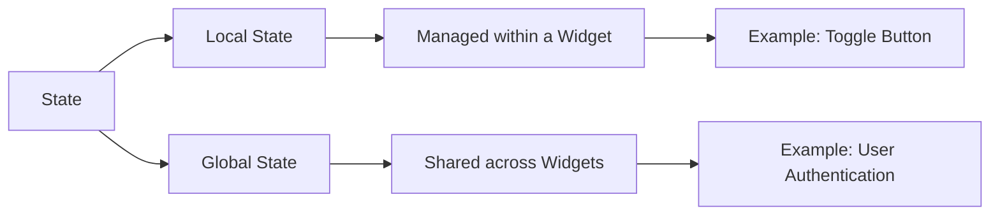

## 6.1.1 What Is State?

In the realm of Flutter development, understanding the concept of **state** is crucial for building dynamic and responsive applications. State in Flutter refers to the mutable data that can change over the lifetime of a widget, influencing how the widget behaves and appears on the screen. This section delves into the intricacies of state, its types, and its significance in app development.

### Definition of State

At its core, state is the information that a widget holds, which can change during the widget's lifecycle. This mutable data determines the widget's appearance and behavior. For instance, a button's color might change when pressed, or a text field might display different text based on user input. These changes are driven by the widget's state.

In Flutter, widgets are immutable, meaning once they are created, they cannot change. However, the state associated with these widgets can change, allowing the UI to update dynamically. This separation of state from the widget itself is a fundamental aspect of Flutter's architecture.

### Types of State

Understanding the types of state is essential for effective state management. In Flutter, state can be categorized into two main types: **Local State** and **Global State**.

#### Local State

Local state is confined to a single widget and its descendants. It is managed internally within the widget and is not shared across different parts of the app. This type of state is ideal for managing simple, isolated data that does not need to be accessed by other widgets.

**Example of Local State:**

Consider a toggle button that switches between "ON" and "OFF" states. The state of this button is local because it only affects the button itself and does not need to be shared with other widgets.

```dart
class ToggleWidget extends StatefulWidget {
  @override
  _ToggleWidgetState createState() => _ToggleWidgetState();
}

class _ToggleWidgetState extends State<ToggleWidget> {
  bool _isOn = false;

  void _toggle() {
    setState(() {
      _isOn = !_isOn;
    });
  }

  @override
  Widget build(BuildContext context) {
    return ElevatedButton(
      onPressed: _toggle,
      child: Text(_isOn ? 'ON' : 'OFF'),
    );
  }
}
```

In this example, the `_isOn` variable represents the local state of the `ToggleWidget`. The `setState` method is used to update the state and rebuild the widget with the new state.

#### Global State

Global state, on the other hand, is shared across multiple widgets and parts of the app. It is used when data needs to be accessed and modified by different components within the application. Managing global state requires a more sophisticated approach to ensure consistency and performance.

**Example of Global State:**

User authentication status is a common example of global state. Whether a user is logged in or out affects multiple parts of the app, such as navigation, access to certain screens, and personalized content.

### Importance of State Management

Effective state management is vital for ensuring that the UI accurately reflects the current state of the application. It enhances performance by minimizing unnecessary rebuilds and maintains code organization by separating concerns. Proper state management leads to a more maintainable and scalable codebase.

#### Key Benefits of State Management:

- **UI Consistency:** Ensures that the UI is always in sync with the underlying data.
- **Performance Optimization:** Reduces unnecessary widget rebuilds, improving app performance.
- **Code Maintainability:** Encourages a clean separation of concerns, making the code easier to manage and extend.

### Visualizing State with Mermaid.js

To better understand the relationship between local and global state, consider the following diagram:



This diagram illustrates how state can be categorized and managed within a Flutter application. Local state is confined to individual widgets, while global state is shared across the app.

### Practical Code Example

Let's explore a practical example of managing state in a Flutter application. We'll build a simple counter app that demonstrates both local and global state management.

#### Local State Example: Counter App

```dart
class CounterWidget extends StatefulWidget {
  @override
  _CounterWidgetState createState() => _CounterWidgetState();
}

class _CounterWidgetState extends State<CounterWidget> {
  int _counter = 0;

  void _incrementCounter() {
    setState(() {
      _counter++;
    });
  }

  @override
  Widget build(BuildContext context) {
    return Column(
      mainAxisAlignment: MainAxisAlignment.center,
      children: <Widget>[
        Text('Counter: $_counter'),
        ElevatedButton(
          onPressed: _incrementCounter,
          child: Text('Increment'),
        ),
      ],
    );
  }
}
```

In this example, the `_counter` variable represents the local state of the `CounterWidget`. The `setState` method is used to update the counter and rebuild the widget with the new value.

#### Global State Example: Shared Counter

To manage global state, we can use a state management solution like the `Provider` package. This allows us to share the counter value across multiple widgets.

```dart
import 'package:flutter/material.dart';
import 'package:provider/provider.dart';

void main() {
  runApp(
    ChangeNotifierProvider(
      create: (context) => CounterModel(),
      child: MyApp(),
    ),
  );
}

class CounterModel extends ChangeNotifier {
  int _counter = 0;

  int get counter => _counter;

  void increment() {
    _counter++;
    notifyListeners();
  }
}

class MyApp extends StatelessWidget {
  @override
  Widget build(BuildContext context) {
    return MaterialApp(
      home: Scaffold(
        appBar: AppBar(title: Text('Global State Counter')),
        body: Center(
          child: Column(
            mainAxisAlignment: MainAxisAlignment.center,
            children: <Widget>[
              Consumer<CounterModel>(
                builder: (context, counterModel, child) {
                  return Text('Counter: ${counterModel.counter}');
                },
              ),
              ElevatedButton(
                onPressed: () => context.read<CounterModel>().increment(),
                child: Text('Increment'),
              ),
            ],
          ),
        ),
      ),
    );
  }
}
```

In this example, the `CounterModel` class manages the global state. The `ChangeNotifierProvider` and `Consumer` widgets from the `Provider` package are used to share and access the counter value across the app.

### Best Practices for State Management

- **Choose the Right State Management Solution:** Depending on the complexity of your app, choose a state management solution that fits your needs. For simple apps, local state management might suffice. For more complex apps, consider using packages like `Provider`, `Bloc`, or `Riverpod`.
- **Keep State Immutable:** Whenever possible, keep state immutable to prevent unintended side effects and make debugging easier.
- **Minimize State:** Only store the necessary state to reduce complexity and improve performance.
- **Separate UI and Business Logic:** Keep your UI code separate from business logic to enhance maintainability and testability.

### Common Pitfalls and Challenges

- **Overusing Global State:** Avoid using global state for data that only affects a small part of the app. This can lead to unnecessary complexity and performance issues.
- **Not Using `setState` Correctly:** Ensure that `setState` is used to update the state and trigger a rebuild. Failing to do so can lead to UI inconsistencies.
- **Ignoring Performance Implications:** Be mindful of the performance implications of state management. Excessive rebuilds can degrade app performance.

### Further Exploration

For those interested in diving deeper into state management in Flutter, consider exploring the following resources:

- **Flutter Documentation:** [State Management](https://flutter.dev/docs/development/data-and-backend/state-mgmt)
- **Provider Package:** [Provider Documentation](https://pub.dev/packages/provider)
- **Bloc Library:** [Bloc Documentation](https://bloclibrary.dev/)
- **Riverpod Package:** [Riverpod Documentation](https://riverpod.dev/)

### Conclusion

Understanding and managing state is a fundamental aspect of Flutter development. By grasping the concept of state and implementing effective state management strategies, you can build responsive and maintainable applications. Remember to choose the right state management solution for your app's needs and follow best practices to ensure optimal performance and code organization.

## Quiz Time!



### What is state in Flutter?

- [x] Information that can change over the lifetime of a widget
- [ ] A static property of a widget
- [ ] The layout structure of a widget
- [ ] The color scheme of an app

> **Explanation:** State in Flutter refers to the mutable data that can change over the lifetime of a widget, affecting its behavior and appearance.

### Which type of state is managed within a single widget?

- [x] Local State
- [ ] Global State
- [ ] Shared State
- [ ] Persistent State

> **Explanation:** Local state is managed within a single widget and its descendants, not shared across the app.

### What is an example of global state?

- [ ] A toggle button's status
- [x] User authentication status
- [ ] A text field's input
- [ ] A widget's color

> **Explanation:** Global state is shared across multiple widgets, such as user authentication status, which affects various parts of the app.

### Why is state management important?

- [x] Ensures UI reflects the current state accurately
- [ ] Increases app size
- [ ] Reduces code readability
- [ ] Limits app functionality

> **Explanation:** Proper state management ensures that the UI accurately reflects the current state, enhancing performance and maintainability.

### What does the `setState` method do?

- [x] Updates the state and triggers a widget rebuild
- [ ] Deletes the current state
- [ ] Changes the widget's layout
- [ ] Modifies the app's theme

> **Explanation:** The `setState` method updates the state and triggers a rebuild of the widget to reflect changes.

### Which package is commonly used for global state management in Flutter?

- [x] Provider
- [ ] Material
- [ ] Cupertino
- [ ] Widgets

> **Explanation:** The `Provider` package is commonly used for managing global state in Flutter applications.

### What is a common pitfall in state management?

- [x] Overusing global state
- [ ] Using too many widgets
- [ ] Avoiding animations
- [ ] Ignoring UI design

> **Explanation:** Overusing global state can lead to unnecessary complexity and performance issues.

### How can you minimize state in your app?

- [x] Only store necessary state
- [ ] Store all data in global state
- [ ] Use complex data structures
- [ ] Avoid using `setState`

> **Explanation:** Minimizing state involves only storing the necessary state to reduce complexity and improve performance.

### What is a benefit of keeping state immutable?

- [x] Prevents unintended side effects
- [ ] Increases app size
- [ ] Reduces code readability
- [ ] Limits app functionality

> **Explanation:** Keeping state immutable prevents unintended side effects and makes debugging easier.

### True or False: Local state can be shared across multiple widgets.

- [ ] True
- [x] False

> **Explanation:** Local state is confined to a single widget and its descendants, not shared across multiple widgets.


