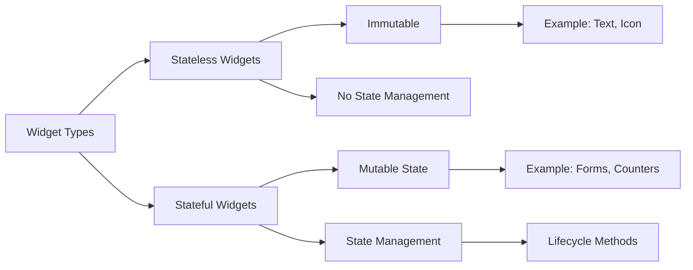

## 6.1.2 Stateful vs. Stateless Widgets Revisited

In the world of Flutter, understanding the distinction between stateful and stateless widgets is crucial for building responsive and efficient applications. This section revisits these two fundamental concepts, providing a deeper insight into their characteristics, use cases, and how they fit into the broader context of state management in Flutter.

### Recap of Stateless Widgets

#### Definition

Stateless widgets are the simplest form of widgets in Flutter. They are immutable, meaning their properties cannot change once they are set. A stateless widget is defined by a single build method that describes how to display the widget in terms of other lower-level widgets.

#### Use Cases

Stateless widgets are ideal for static UI elements that do not require any form of interaction or change. Common examples include:

- **Icons:** Displaying static icons that do not change.
- **Images:** Showing images that remain constant.
- **Text:** Rendering text that does not need to update dynamically.

These widgets are efficient because they do not need to manage any state, making them lightweight and fast to render.

#### Code Example

Here is a simple example of a stateless widget:

```dart
// Stateless Widget Example
class Greeting extends StatelessWidget {
  final String name;

  Greeting({required this.name});

  @override
  Widget build(BuildContext context) {
    return Text('Hello, $name!');
  }
}
```

In this example, the `Greeting` widget takes a `name` as a parameter and displays a simple greeting message. Since the text does not change, it is a perfect candidate for a stateless widget.

### Recap of Stateful Widgets

#### Definition

Stateful widgets, unlike stateless widgets, can maintain mutable state that can change over time. This means that the widget can rebuild itself in response to state changes, allowing for dynamic and interactive user interfaces.

#### Use Cases

Stateful widgets are used for components that require interaction or need to update dynamically. Examples include:

- **Forms:** Collecting user input that can change.
- **Counters:** Displaying a count that can increment or decrement.
- **Toggles:** Switches or buttons that change state.

These widgets are essential for creating interactive applications where user input or other events can alter the UI.

#### Code Example

Below is an example of a stateful widget:

```dart
// Stateful Widget Example
class Counter extends StatefulWidget {
  @override
  _CounterState createState() => _CounterState();
}

class _CounterState extends State<Counter> {
  int _count = 0;

  void _increment() {
    setState(() {
      _count++;
    });
  }

  @override
  Widget build(BuildContext context) {
    return Column(
      children: <Widget>[
        Text('Count: $_count'),
        ElevatedButton(
          onPressed: _increment,
          child: Text('Increment'),
        ),
      ],
    );
  }
}
```

In this example, the `Counter` widget maintains an internal state `_count`, which can be incremented by pressing a button. The `setState` method is used to update the state and trigger a rebuild of the widget.

### Key Differences

#### State Management

- **Stateless Widgets:** These widgets do not manage any state. They are immutable, meaning their properties are final and cannot change after they are set.
- **Stateful Widgets:** These widgets manage mutable state. They can change their appearance in response to user interactions or other events.

#### Lifecycle Methods

Stateful widgets have a more complex lifecycle compared to stateless widgets. Key lifecycle methods include:

- **`initState`:** Called when the widget is first created. It is used to initialize any state or resources.
- **`dispose`:** Called when the widget is removed from the widget tree. It is used to clean up resources.
- **`didUpdateWidget`:** Called whenever the widget configuration changes.

These lifecycle methods provide hooks to manage resources and respond to changes, making stateful widgets more versatile for dynamic applications.

### Visualizing the Differences

To better understand the differences between stateless and stateful widgets, consider the following diagram:



This diagram illustrates the fundamental differences between the two types of widgets, highlighting their characteristics and typical use cases.

### Practical Considerations

When deciding between stateless and stateful widgets, consider the following:

- **Performance:** Stateless widgets are generally more performant due to their immutability. Use them whenever possible for static content.
- **Complexity:** Stateful widgets introduce complexity due to state management and lifecycle methods. Use them when interaction or dynamic content is required.
- **Maintainability:** Stateless widgets are easier to maintain due to their simplicity. Stateful widgets require careful management of state and resources.

### Best Practices

- **Use Stateless Widgets for Static Content:** Whenever possible, use stateless widgets for parts of your UI that do not change.
- **Minimize State in Stateful Widgets:** Keep the state as minimal as possible to reduce complexity and improve performance.
- **Leverage Lifecycle Methods Wisely:** Use lifecycle methods to manage resources efficiently, ensuring that you clean up any resources in `dispose`.

### Common Pitfalls

- **Overusing Stateful Widgets:** Avoid using stateful widgets for static content, as this can lead to unnecessary complexity and performance overhead.
- **Neglecting Resource Cleanup:** Always ensure that resources are properly cleaned up in the `dispose` method to prevent memory leaks.
- **Mismanaging State:** Improper state management can lead to bugs and unpredictable behavior. Use `setState` judiciously and ensure that state changes are necessary.

### Conclusion

Understanding the differences between stateful and stateless widgets is fundamental to mastering Flutter development. By choosing the right type of widget for each part of your application, you can create efficient, responsive, and maintainable user interfaces. As you continue to explore Flutter, consider how these concepts apply to your projects and experiment with different approaches to state management.

### Further Reading and Resources

- [Flutter Documentation on Widgets](https://flutter.dev/docs/development/ui/widgets)
- [State Management in Flutter](https://flutter.dev/docs/development/data-and-backend/state-mgmt/intro)
- [Effective Dart: Style](https://dart.dev/guides/language/effective-dart/style)

These resources provide additional insights into widget usage and state management, helping you deepen your understanding and refine your skills.

## Quiz Time!



### What is a key characteristic of a stateless widget?

- [x] It is immutable and does not manage state.
- [ ] It can change its state over time.
- [ ] It has lifecycle methods like `initState`.
- [ ] It is used for interactive elements.

> **Explanation:** Stateless widgets are immutable and do not manage state, making them suitable for static UI elements.

### Which widget type should you use for a counter that increments?

- [ ] Stateless widget
- [x] Stateful widget
- [ ] Inherited widget
- [ ] Contextual widget

> **Explanation:** A stateful widget is needed for a counter because it requires managing a changing state.

### What method is used to update the state in a stateful widget?

- [ ] build
- [x] setState
- [ ] initState
- [ ] dispose

> **Explanation:** The `setState` method is used to update the state and trigger a rebuild of the widget.

### Which lifecycle method is called when a stateful widget is first created?

- [x] initState
- [ ] dispose
- [ ] didUpdateWidget
- [ ] build

> **Explanation:** `initState` is called when the widget is first created, used for initializing state.

### What is a common use case for stateless widgets?

- [x] Displaying static text
- [ ] Interactive forms
- [ ] Dynamic counters
- [ ] Toggle switches

> **Explanation:** Stateless widgets are ideal for static content like text that does not change.

### What is a potential pitfall of overusing stateful widgets?

- [x] Increased complexity and performance overhead
- [ ] Lack of interactivity
- [ ] Difficulty in displaying static content
- [ ] Limited lifecycle methods

> **Explanation:** Overusing stateful widgets can lead to unnecessary complexity and performance issues.

### Which method should be used to clean up resources in a stateful widget?

- [ ] initState
- [x] dispose
- [ ] setState
- [ ] build

> **Explanation:** The `dispose` method is used to clean up resources when the widget is removed from the tree.

### What is a benefit of using stateless widgets?

- [x] They are more performant due to immutability.
- [ ] They can manage complex state.
- [ ] They have extensive lifecycle methods.
- [ ] They are ideal for interactive elements.

> **Explanation:** Stateless widgets are more performant because they do not manage state and are immutable.

### How does a stateful widget differ from a stateless widget?

- [x] It can manage mutable state.
- [ ] It is immutable.
- [ ] It is used for static content.
- [ ] It lacks lifecycle methods.

> **Explanation:** A stateful widget can manage mutable state, allowing it to change over time.

### True or False: Stateless widgets have lifecycle methods like `initState` and `dispose`.

- [ ] True
- [x] False

> **Explanation:** Stateless widgets do not have lifecycle methods like `initState` and `dispose`; these are specific to stateful widgets.


