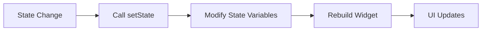

## 6.1.4 setState Method

In the world of Flutter development, managing the state of your application is crucial for creating dynamic and responsive user interfaces. One of the fundamental tools for state management in Flutter is the `setState` method. This method is integral to updating the UI in response to changes in the internal state of a widget. In this section, we will delve into the `setState` method, exploring its purpose, usage, best practices, and potential pitfalls.

### Introduction to setState

The `setState` method is a cornerstone of state management in Flutter, particularly for stateful widgets. It serves as a mechanism to notify the Flutter framework that the internal state of a widget has changed. When `setState` is called, Flutter schedules a rebuild of the widget and its descendants, ensuring that the UI reflects the latest state changes.

#### Key Points:
- **Purpose:** `setState` is used to trigger a UI update when the state of a widget changes.
- **Mechanism:** It marks the widget as needing to be rebuilt, prompting Flutter to refresh the UI.

### When to Use setState

Understanding when to use `setState` is crucial for efficient state management. Here are some scenarios where `setState` is appropriate:

- **Updating UI-Relevant Variables:** Use `setState` when you need to update variables that directly affect the UI. For example, changing a counter value displayed on the screen.
- **Triggering UI Refreshes:** Whenever a change in state should result in a visual update, `setState` should be called to ensure the UI reflects the new state.

### Understanding setState Callback

The `setState` method takes a callback function as an argument. This callback is where you modify the state variables. The changes made within this callback are what trigger the UI update.

#### Code Example:

```dart
void _updateTitle() {
  setState(() {
    _title = 'New Title';
  });
}
```

In this example, `_updateTitle` is a method that updates the `_title` variable. By wrapping the state change in `setState`, we ensure that the UI is rebuilt to reflect the new title.

### Best Practices

Using `setState` effectively requires adhering to certain best practices to maintain performance and readability:

- **Minimize setState Calls:** Only call `setState` when necessary. Unnecessary calls can lead to performance issues due to excessive rebuilds.
- **Avoid Long Operations in setState:** Keep the `setState` callback focused on state modifications. Avoid performing long-running operations within it, as this can delay UI updates.
- **Immutable State:** Treat state as immutable. Always create new instances when updating state variables to prevent unintended side effects.

### Code Example with Counter

Let's look at a practical example of using `setState` in a simple counter application:

```dart
class Counter extends StatefulWidget {
  @override
  _CounterState createState() => _CounterState();
}

class _CounterState extends State<Counter> {
  int _count = 0;

  void _increment() {
    setState(() {
      _count++;
    });
  }

  @override
  Widget build(BuildContext context) {
    return Column(
      children: <Widget>[
        Text('Count: $_count'),
        ElevatedButton(
          onPressed: _increment,
          child: Text('Increment'),
        ),
      ],
    );
  }
}
```

In this example, the `_increment` method updates the `_count` variable using `setState`. Each time the button is pressed, the counter increases, and the UI is updated to display the new count.

### Visualizing setState with Mermaid.js Diagram

To better understand the flow of operations when `setState` is called, let's look at a visual representation using a Mermaid.js diagram:



#### Diagram Explanation:
- **State Change:** Represents the initial change in the widget's state.
- **Call setState:** The `setState` method is invoked.
- **Modify State Variables:** State variables are updated within the `setState` callback.
- **Rebuild Widget:** Flutter schedules a rebuild of the widget.
- **UI Updates:** The UI is refreshed to reflect the new state.

### Common Pitfalls and Challenges

While `setState` is a powerful tool, it can lead to issues if not used correctly. Here are some common pitfalls and strategies to avoid them:

- **Overusing setState:** Frequent and unnecessary calls to `setState` can degrade performance. Always evaluate whether a state change truly requires a UI update.
- **Complex State Logic:** Avoid placing complex logic within the `setState` callback. Keep it simple and focused on state changes.
- **State Synchronization:** Ensure that state changes are synchronized with the UI. Inconsistent states can lead to unexpected behavior.

### Real-World Scenario: Updating a Shopping Cart

Consider a shopping cart application where users can add items to their cart. Each time an item is added, the cart's total should update. Here's how `setState` can be used:

```dart
class ShoppingCart extends StatefulWidget {
  @override
  _ShoppingCartState createState() => _ShoppingCartState();
}

class _ShoppingCartState extends State<ShoppingCart> {
  List<String> _cartItems = [];
  double _totalPrice = 0.0;

  void _addItem(String item, double price) {
    setState(() {
      _cartItems.add(item);
      _totalPrice += price;
    });
  }

  @override
  Widget build(BuildContext context) {
    return Column(
      children: <Widget>[
        Text('Total: \$$_totalPrice'),
        ElevatedButton(
          onPressed: () => _addItem('New Item', 10.0),
          child: Text('Add Item'),
        ),
      ],
    );
  }
}
```

In this example, `_addItem` updates both the list of items and the total price. By using `setState`, the UI is updated to reflect the new total each time an item is added.

### Conclusion

The `setState` method is an essential tool for managing state in Flutter applications. By understanding its purpose, usage, and best practices, you can effectively update your UI in response to state changes. Remember to use `setState` judiciously, keeping your applications efficient and responsive.

### Further Reading and Resources

- [Flutter Official Documentation on setState](https://flutter.dev/docs/development/ui/interactive)
- [State Management in Flutter](https://flutter.dev/docs/development/data-and-backend/state-mgmt)
- [Effective Dart: Style](https://dart.dev/guides/language/effective-dart/style)

By mastering `setState`, you'll be well-equipped to handle dynamic UI updates in your Flutter applications, paving the way for more complex state management techniques.

## Quiz Time!



### What is the primary purpose of the `setState` method in Flutter?

- [x] To notify Flutter that the internal state of a widget has changed, prompting a rebuild.
- [ ] To directly update the UI without rebuilding the widget.
- [ ] To initialize state variables in a widget.
- [ ] To handle user input events.

> **Explanation:** The `setState` method is used to notify Flutter that the internal state of a widget has changed, which prompts the framework to rebuild the widget and its descendants.

### When should you call `setState` in a Flutter application?

- [x] When updating variables that affect the UI.
- [ ] When performing long-running operations.
- [ ] When initializing state variables.
- [ ] When handling network requests.

> **Explanation:** `setState` should be called when you need to update variables that directly affect the UI, ensuring that the UI reflects the latest state changes.

### What should you avoid doing within the `setState` callback?

- [x] Performing long operations.
- [ ] Modifying state variables.
- [ ] Calling other methods.
- [ ] Updating UI components.

> **Explanation:** Long operations should be avoided within the `setState` callback to keep rebuilds efficient and responsive.

### How should state be treated in a Flutter application?

- [x] As immutable, creating new instances when updating state variables.
- [ ] As mutable, modifying existing instances directly.
- [ ] As static, shared across all widgets.
- [ ] As temporary, not persisted between rebuilds.

> **Explanation:** State should be treated as immutable, meaning new instances should be created when updating state variables to prevent unintended side effects.

### What happens when `setState` is called in a Flutter widget?

- [x] The widget and its descendants are marked for rebuild.
- [ ] The widget is removed from the widget tree.
- [ ] The widget's state is reset to its initial values.
- [ ] The widget's UI is updated without rebuilding.

> **Explanation:** When `setState` is called, the widget and its descendants are marked for rebuild, ensuring the UI reflects the new state.

### Which of the following is a best practice when using `setState`?

- [x] Minimize calls to `setState` to avoid unnecessary rebuilds.
- [ ] Use `setState` for all state changes, regardless of their impact on the UI.
- [ ] Perform complex calculations within the `setState` callback.
- [ ] Use `setState` to initialize state variables.

> **Explanation:** Minimizing calls to `setState` helps avoid unnecessary rebuilds, improving performance.

### What is the role of the callback function passed to `setState`?

- [x] To modify state variables before the UI is updated.
- [ ] To directly update the UI components.
- [ ] To initialize the widget's state.
- [ ] To handle user input events.

> **Explanation:** The callback function passed to `setState` is used to modify state variables before the UI is updated.

### What is a potential pitfall of overusing `setState`?

- [x] Degraded performance due to excessive rebuilds.
- [ ] Increased memory usage.
- [ ] Loss of state between rebuilds.
- [ ] Inconsistent UI updates.

> **Explanation:** Overusing `setState` can lead to degraded performance due to excessive rebuilds, as the UI is updated more often than necessary.

### In the provided counter example, what does the `_increment` method do?

- [x] Increases the `_count` variable and triggers a UI update.
- [ ] Decreases the `_count` variable and triggers a UI update.
- [ ] Resets the `_count` variable to zero.
- [ ] Displays the current value of `_count`.

> **Explanation:** The `_increment` method increases the `_count` variable and triggers a UI update by calling `setState`.

### True or False: The `setState` method can be used to directly update the UI components without rebuilding the widget.

- [ ] True
- [x] False

> **Explanation:** False. The `setState` method does not directly update UI components; it marks the widget for rebuild, allowing Flutter to update the UI based on the new state.


