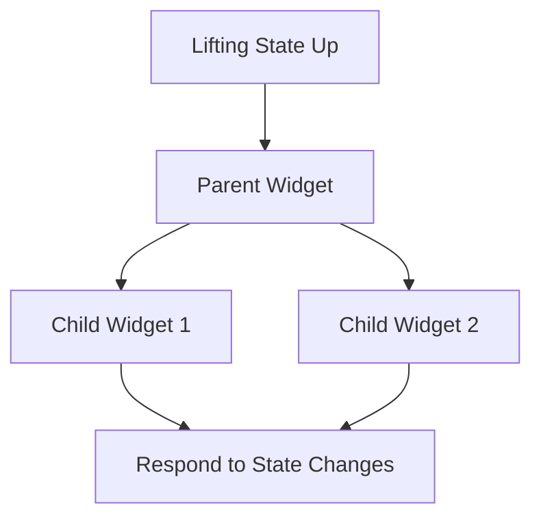

## 6.2.1 Propagating State Changes

In the world of Flutter development, managing state effectively is crucial for building responsive and interactive applications. One of the key concepts in state management is **propagating state changes**, which involves updating state in one part of the widget tree and ensuring that those changes are reflected in other relevant parts. This section will delve into the importance of propagating state changes, how to handle state in parent widgets, and provide practical examples to illustrate these concepts.

### Introduction to Propagating State

Propagating state changes is a fundamental aspect of building dynamic applications. It allows different parts of your application to react to changes in state, ensuring that your UI remains consistent and up-to-date. In Flutter, this often involves **lifting state up** to a common ancestor widget, where it can be shared among multiple child widgets.

When you lift state up, you move the state to a higher level in the widget hierarchy, typically to a parent widget that can manage the state and pass it down to its children. This approach is essential for maintaining a single source of truth for your application's state, which helps prevent inconsistencies and makes your code easier to manage and debug.

### Why Propagate State?

Propagating state changes is crucial for several reasons:

- **Synchronized UI Updates:** By sharing state across multiple widgets, you ensure that all relevant parts of your UI update in response to state changes. This synchronization is vital for providing a seamless user experience.
- **Centralized State Management:** Lifting state up to a common ancestor allows you to manage state in a single location, reducing redundancy and making your codebase more maintainable.
- **Improved Code Reusability:** When state is managed centrally, child widgets can be more focused on presentation and behavior, making them easier to reuse across different parts of your application.

### Handling State in Parent Widgets

To propagate state changes effectively, you need to handle state in parent widgets. This involves:

1. **Defining State in the Parent Widget:** The parent widget should hold the state that needs to be shared among its children. This state can be managed using a `StatefulWidget`.

2. **Passing State to Child Widgets:** The parent widget passes the state and any necessary callbacks to its child widgets through constructor parameters. This allows child widgets to access and modify the state as needed.

3. **Updating State in the Parent Widget:** When a child widget needs to update the state, it can call a callback function provided by the parent widget. The parent widget then updates the state and triggers a rebuild of the widget tree.

Let's visualize this concept with a Mermaid.js diagram:



### Code Example

To illustrate how to propagate state changes by lifting state up, let's consider a simple example involving a parent widget and two child widgets. The parent widget manages a boolean state, `_isOn`, which determines whether a button is "ON" or "OFF". The first child widget can toggle this state, while the second child widget displays the current state.

```dart
class ParentWidget extends StatefulWidget {
  @override
  _ParentWidgetState createState() => _ParentWidgetState();
}

class _ParentWidgetState extends State<ParentWidget> {
  bool _isOn = false;

  void _toggle() {
    setState(() {
      _isOn = !_isOn;
    });
  }

  @override
  Widget build(BuildContext context) {
    return Column(
      children: <Widget>[
        ChildWidget1(isOn: _isOn, toggle: _toggle),
        ChildWidget2(isOn: _isOn),
      ],
    );
  }
}

class ChildWidget1 extends StatelessWidget {
  final bool isOn;
  final VoidCallback toggle;

  ChildWidget1({required this.isOn, required this.toggle});

  @override
  Widget build(BuildContext context) {
    return ElevatedButton(
      onPressed: toggle,
      child: Text(isOn ? 'ON' : 'OFF'),
    );
  }
}

class ChildWidget2 extends StatelessWidget {
  final bool isOn;

  ChildWidget2({required this.isOn});

  @override
  Widget build(BuildContext context) {
    return Text('The button is ${isOn ? 'ON' : 'OFF'}');
  }
}
```

### Explanation

- **ParentWidget:** This widget is a `StatefulWidget` that manages the `_isOn` state. It provides a `_toggle` method to change the state and rebuild the widget tree.
- **ChildWidget1:** This widget receives the current state and a callback to toggle the state. It displays a button that, when pressed, calls the `toggle` callback to change the state.
- **ChildWidget2:** This widget receives the current state and displays a text indicating whether the button is "ON" or "OFF".

### Step-by-Step Instructions

1. **Define the State in the Parent Widget:** Start by creating a `StatefulWidget` for the parent widget. Define the state variable (`_isOn`) and a method (`_toggle`) to update the state.

2. **Pass State and Callbacks to Child Widgets:** In the `build` method of the parent widget, pass the state and any necessary callbacks to the child widgets through their constructors.

3. **Update State in the Parent Widget:** When a child widget needs to update the state, it calls the provided callback. The parent widget updates the state using `setState`, which triggers a rebuild of the widget tree.

4. **Reflect State Changes in Child Widgets:** The child widgets use the passed state to determine their behavior and appearance. When the state changes, the widgets rebuild and reflect the new state.

### Best Practices

- **Keep State Management Simple:** Start with lifting state up for simple scenarios. As your application grows, consider more advanced state management solutions like Provider or Riverpod.
- **Minimize Rebuilds:** Use `const` constructors and `const` widgets where possible to minimize unnecessary rebuilds and improve performance.
- **Use Descriptive Names:** Name your state variables and methods clearly to indicate their purpose and behavior.

### Common Pitfalls

- **Overcomplicating State Management:** Avoid introducing complex state management solutions prematurely. Start with simple techniques and evolve as needed.
- **Unnecessary Rebuilds:** Be mindful of how state changes trigger rebuilds. Use `const` widgets and optimize your widget tree to minimize performance overhead.

### Further Exploration

- **Provider Package:** Explore the Provider package for more advanced state management. It offers a simple and efficient way to manage state across your application.
- **State Management Patterns:** Investigate other state management patterns like BLoC and Redux for more complex applications.

By understanding and implementing state propagation through lifting state up, you can build more responsive and maintainable Flutter applications. This approach lays the foundation for more advanced state management techniques, enabling you to create sophisticated and dynamic user interfaces.

## Quiz Time!



### What is the primary purpose of propagating state changes in Flutter?

- [x] To ensure synchronized UI updates across multiple widgets
- [ ] To reduce the number of widgets in the widget tree
- [ ] To simplify the widget hierarchy
- [ ] To improve the performance of the app

> **Explanation:** Propagating state changes ensures that multiple widgets can react to the same state changes, enabling synchronized UI updates.

### What does "lifting state up" mean in the context of Flutter?

- [x] Moving state to a common ancestor widget to share it with child widgets
- [ ] Creating a new widget to manage state
- [ ] Removing state from the widget tree
- [ ] Using a third-party package for state management

> **Explanation:** Lifting state up involves moving state to a common ancestor widget where it can be shared among child widgets.

### In the provided code example, which widget manages the `_isOn` state?

- [x] ParentWidget
- [ ] ChildWidget1
- [ ] ChildWidget2
- [ ] All of the above

> **Explanation:** The `ParentWidget` manages the `_isOn` state and provides it to the child widgets.

### How does `ChildWidget1` in the code example affect the state?

- [x] It toggles the state by calling the `toggle` callback
- [ ] It directly modifies the `_isOn` state
- [ ] It does not affect the state
- [ ] It creates a new state variable

> **Explanation:** `ChildWidget1` affects the state by calling the `toggle` callback provided by the parent widget.

### What is the role of `ChildWidget2` in the code example?

- [x] To display the current state of the button
- [ ] To toggle the state
- [ ] To manage its own state
- [ ] To create a new widget tree

> **Explanation:** `ChildWidget2` displays the current state of the button by using the state passed from the parent widget.

### Why is it important to pass callbacks to child widgets?

- [x] To allow child widgets to update the state in the parent widget
- [ ] To reduce the number of widgets in the widget tree
- [ ] To simplify the widget hierarchy
- [ ] To improve the performance of the app

> **Explanation:** Passing callbacks to child widgets allows them to update the state in the parent widget, enabling interaction and state changes.

### What is a common pitfall when managing state in Flutter?

- [x] Overcomplicating state management with unnecessary solutions
- [ ] Using too few widgets in the widget tree
- [ ] Not using enough third-party packages
- [ ] Ignoring the widget lifecycle

> **Explanation:** A common pitfall is overcomplicating state management by introducing unnecessary solutions prematurely.

### Which of the following is a best practice for managing state in Flutter?

- [x] Start with simple state management techniques and evolve as needed
- [ ] Always use the most complex state management solution available
- [ ] Avoid using state management altogether
- [ ] Use only third-party packages for state management

> **Explanation:** It's best to start with simple state management techniques and evolve as needed, rather than introducing complexity prematurely.

### What is the benefit of using `const` constructors in Flutter?

- [x] To minimize unnecessary rebuilds and improve performance
- [ ] To increase the number of widgets in the widget tree
- [ ] To simplify the widget hierarchy
- [ ] To improve the app's visual appearance

> **Explanation:** Using `const` constructors helps minimize unnecessary rebuilds, improving performance.

### True or False: Propagating state changes is only necessary for complex applications.

- [ ] True
- [x] False

> **Explanation:** Propagating state changes is important for both simple and complex applications to ensure synchronized UI updates and maintainability.


