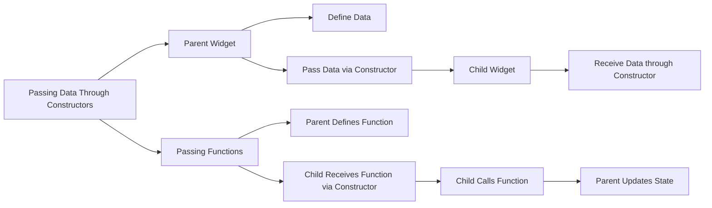

## 6.2.2 Passing Data Through Constructors

In Flutter, widgets are the fundamental building blocks of the user interface. As you build more complex applications, you'll often need to share data between different parts of your widget tree. One of the most straightforward and effective ways to achieve this is by passing data through constructors. This method allows parent widgets to communicate with their child widgets by providing them with the necessary data or functions they need to operate. In this section, we'll explore how to pass data and functions through constructors, discuss best practices, and provide practical examples to solidify your understanding.

### Introduction to Passing Data

Passing data through constructors is a common method to share data between parent and child widgets in Flutter. This approach leverages Dart's object-oriented capabilities, allowing you to define constructors in your child widgets that accept data from their parent widgets. This method is particularly useful for maintaining a clean and organized codebase, as it keeps the data flow explicit and manageable.

### Using Constructors to Pass Data

When you pass data through constructors, you essentially define parameters in your child widget's constructor that the parent widget can supply. This allows the child widget to access the data it needs to render its UI or perform its logic.

#### Code Example: Passing Data

Let's look at a simple example where a parent widget passes a string message to a child widget:

```dart
class ParentWidget extends StatelessWidget {
  final String message = 'Hello from Parent';

  @override
  Widget build(BuildContext context) {
    return ChildWidget(message: message);
  }
}

class ChildWidget extends StatelessWidget {
  final String message;

  ChildWidget({required this.message});

  @override
  Widget build(BuildContext context) {
    return Text(message);
  }
}
```

In this example, the `ParentWidget` defines a `message` variable and passes it to the `ChildWidget` through its constructor. The `ChildWidget` then uses this message to display a `Text` widget. This pattern is simple yet powerful, allowing for clear and direct data flow from parent to child.

### Passing Functions Through Constructors

In addition to data, you can also pass functions through constructors. This is particularly useful for callbacks, where a child widget needs to notify its parent of certain events or actions.

#### Code Example: Passing Functions

Here's an example where a parent widget passes a function to update a message back to the parent:

```dart
class ParentWidget extends StatefulWidget {
  @override
  _ParentWidgetState createState() => _ParentWidgetState();
}

class _ParentWidgetState extends State<ParentWidget> {
  String _message = 'Initial Message';

  void _updateMessage(String newMessage) {
    setState(() {
      _message = newMessage;
    });
  }

  @override
  Widget build(BuildContext context) {
    return Column(
      children: <Widget>[
        ChildWidget(
          message: _message,
          updateMessage: _updateMessage,
        ),
        ChildWidget(
          message: _message,
          updateMessage: _updateMessage,
        ),
      ],
    );
  }
}

class ChildWidget extends StatelessWidget {
  final String message;
  final Function(String) updateMessage;

  ChildWidget({required this.message, required this.updateMessage});

  @override
  Widget build(BuildContext context) {
    return Column(
      children: <Widget>[
        Text(message),
        ElevatedButton(
          onPressed: () {
            updateMessage('Message Updated by Child');
          },
          child: Text('Update Message'),
        ),
      ],
    );
  }
}
```

In this example, the `ParentWidget` passes a function `_updateMessage` to the `ChildWidget`. The `ChildWidget` can then call this function to update the parent's state, demonstrating how functions can be used to facilitate two-way communication between widgets.

### Visualizing Data Flow with Mermaid.js

To better understand the flow of data and functions between parent and child widgets, let's visualize it using a Mermaid.js diagram:



This diagram illustrates the process of passing data and functions from a parent widget to a child widget, highlighting the key steps involved in this communication pattern.

### Best Practices

When passing data and functions through constructors, it's important to follow best practices to ensure your code remains clean and maintainable:

- **Immutability:** Pass data as `final` properties to ensure they are immutable within child widgets. This prevents accidental modifications and promotes a predictable data flow.
- **Clear Naming:** Use descriptive parameter names to enhance code readability. This makes it easier for others (and yourself) to understand the purpose of each parameter.
- **Avoid Deep Nesting:** Avoid passing data through multiple layers if unnecessary. For complex data sharing, consider using state management solutions like Provider or Riverpod.
- **Consistency:** Maintain consistency in how you pass data and functions across your application to reduce cognitive load and potential errors.

### Conclusion

Passing data and functions through constructors is a fundamental technique in Flutter development, enabling effective communication between parent and child widgets. By understanding and applying this method, you can build more dynamic and responsive applications. Remember to adhere to best practices to maintain a clean and efficient codebase.

### Further Reading and Resources

- [Flutter Documentation: Introduction to Widgets](https://flutter.dev/docs/development/ui/widgets-intro)
- [Dart Language Tour: Constructors](https://dart.dev/guides/language/language-tour#constructors)
- [State Management in Flutter](https://flutter.dev/docs/development/data-and-backend/state-mgmt/intro)

By mastering the art of passing data through constructors, you'll be well-equipped to tackle more complex state management challenges in your Flutter applications.

## Quiz Time!



### What is the primary purpose of passing data through constructors in Flutter?

- [x] To share data between parent and child widgets.
- [ ] To create new instances of widgets.
- [ ] To manage state within a widget.
- [ ] To define the layout of a widget.

> **Explanation:** Passing data through constructors allows parent widgets to share data with their child widgets, facilitating communication and data flow.

### How do you define a constructor in a Flutter widget to accept data?

- [x] By defining parameters in the widget's constructor.
- [ ] By using global variables.
- [ ] By creating a separate function to pass data.
- [ ] By using the `initState` method.

> **Explanation:** Constructors in Flutter widgets are defined with parameters that allow data to be passed from parent widgets.

### In the provided code example, what does the `ChildWidget` constructor require?

- [x] A `String` message and a `Function(String)` updateMessage.
- [ ] Only a `String` message.
- [ ] Only a `Function(String)` updateMessage.
- [ ] No parameters are required.

> **Explanation:** The `ChildWidget` constructor requires both a `String` message and a `Function(String)` updateMessage to function correctly.

### What is a common use case for passing functions through constructors?

- [x] To enable callbacks from child to parent widgets.
- [ ] To initialize widget properties.
- [ ] To define widget styles.
- [ ] To manage widget lifecycle.

> **Explanation:** Passing functions through constructors is commonly used for callbacks, allowing child widgets to notify parent widgets of events or actions.

### Why should data passed through constructors be marked as `final`?

- [x] To ensure immutability within child widgets.
- [ ] To allow data to be modified.
- [ ] To enable dynamic updates.
- [ ] To improve performance.

> **Explanation:** Marking data as `final` ensures it remains immutable within child widgets, promoting a predictable and stable data flow.

### What is a potential drawback of passing data through multiple layers of widgets?

- [x] It can lead to deep nesting and complexity.
- [ ] It simplifies state management.
- [ ] It enhances performance.
- [ ] It reduces code readability.

> **Explanation:** Passing data through multiple layers can lead to deep nesting, making the code more complex and harder to manage.

### Which of the following is a best practice when passing data through constructors?

- [x] Use descriptive parameter names.
- [ ] Use global variables for data sharing.
- [ ] Avoid using constructors for data passing.
- [ ] Pass data as mutable properties.

> **Explanation:** Using descriptive parameter names enhances code readability and understanding, making it easier to maintain.

### What does the `setState` method do in the context of the provided code example?

- [x] It updates the state of the parent widget.
- [ ] It initializes the widget.
- [ ] It defines the widget's layout.
- [ ] It passes data to child widgets.

> **Explanation:** The `setState` method is used to update the state of the parent widget, triggering a rebuild with the new data.

### How can you visualize the flow of data and functions between widgets?

- [x] Using diagrams like Mermaid.js.
- [ ] By writing detailed comments.
- [ ] By using global variables.
- [ ] By creating separate classes for data flow.

> **Explanation:** Diagrams like Mermaid.js can effectively visualize the flow of data and functions between widgets, enhancing understanding.

### True or False: Passing data through constructors is the only way to share data between widgets in Flutter.

- [ ] True
- [x] False

> **Explanation:** While passing data through constructors is a common method, there are other ways to share data between widgets, such as using state management solutions.


