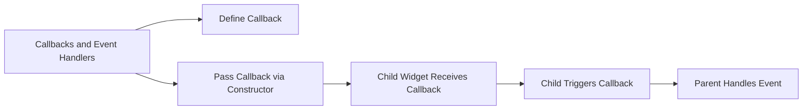

## 6.2.3 Callbacks and Event Handlers

In the world of Flutter development, creating interactive and responsive applications is paramount. Callbacks and event handlers play a crucial role in achieving this by enabling communication between widgets and managing user interactions effectively. This section delves into the concept of callbacks, how they are used in Flutter, and best practices for implementing them in your applications.

### Introduction to Callbacks

Callbacks are functions that you pass as arguments to other functions or widgets. They are a fundamental concept in Flutter, allowing child widgets to communicate with their parent widgets. This communication is essential for handling user interactions, such as button presses, form submissions, and other events that require a response from the application.

In Flutter, callbacks are often used to trigger actions in parent widgets when a user interacts with a child widget. This mechanism is crucial for maintaining a clean separation of concerns, where the child widget is responsible for the user interface, and the parent widget handles the logic and state changes.

### Using Callbacks for Interactivity

To illustrate how callbacks work in Flutter, let's consider a simple example where a button press updates a text label in the parent widget. This example demonstrates how to define and use callbacks to respond to user actions.

#### Code Example: Basic Callback Implementation

```dart
class ParentWidget extends StatefulWidget {
  @override
  _ParentWidgetState createState() => _ParentWidgetState();
}

class _ParentWidgetState extends State<ParentWidget> {
  String _status = 'Not Pressed';

  void _updateStatus() {
    setState(() {
      _status = 'Button Pressed';
    });
  }

  @override
  Widget build(BuildContext context) {
    return Column(
      children: <Widget>[
        MyButton(onPressed: _updateStatus),
        Text(_status),
      ],
    );
  }
}

class MyButton extends StatelessWidget {
  final VoidCallback onPressed;

  MyButton({required this.onPressed});

  @override
  Widget build(BuildContext context) {
    return ElevatedButton(
      onPressed: onPressed,
      child: Text('Press Me'),
    );
  }
}
```

In this example, the `ParentWidget` contains a button and a text label. The button is a custom widget, `MyButton`, which takes a `VoidCallback` as a parameter. When the button is pressed, the `_updateStatus` method in the parent widget is called, updating the text label.

### Defining Custom Callbacks

In some cases, you may need to pass additional data when a callback is triggered. This is where custom callbacks with parameters come into play. By defining callbacks that accept parameters, you can pass specific information from the child widget to the parent widget.

#### Code Example: Custom Callback with Parameters

```dart
class ParentWidget extends StatefulWidget {
  @override
  _ParentWidgetState createState() => _ParentWidgetState();
}

class _ParentWidgetState extends State<ParentWidget> {
  String _selectedOption = 'None';

  void _handleSelection(String option) {
    setState(() {
      _selectedOption = option;
    });
  }

  @override
  Widget build(BuildContext context) {
    return Column(
      children: <Widget>[
        OptionSelector(onSelected: _handleSelection),
        Text('Selected: $_selectedOption'),
      ],
    );
  }
}

class OptionSelector extends StatelessWidget {
  final Function(String) onSelected;

  OptionSelector({required this.onSelected});

  @override
  Widget build(BuildContext context) {
    return Row(
      children: <Widget>[
        ElevatedButton(
          onPressed: () => onSelected('Option A'),
          child: Text('Option A'),
        ),
        ElevatedButton(
          onPressed: () => onSelected('Option B'),
          child: Text('Option B'),
        ),
      ],
    );
  }
}
```

In this example, the `OptionSelector` widget allows the user to select between two options. The `onSelected` callback is defined to accept a `String` parameter, which represents the selected option. When a button is pressed, the corresponding option is passed to the parent widget, updating the displayed text.

### Visualizing Callbacks with Mermaid.js

To better understand the flow of callbacks from definition to event handling, let's visualize the process using a Mermaid.js diagram.



This diagram illustrates the lifecycle of a callback in Flutter:

- **Define Callback:** The parent widget defines a callback function.
- **Pass Callback via Constructor:** The callback is passed to the child widget through its constructor.
- **Child Widget Receives Callback:** The child widget receives the callback and stores it for later use.
- **Child Triggers Callback:** When a user interaction occurs, the child widget triggers the callback.
- **Parent Handles Event:** The parent widget handles the event, updating its state or performing other actions.

### Best Practices for Using Callbacks

When implementing callbacks in Flutter, consider the following best practices to ensure your code is efficient, maintainable, and easy to understand:

- **Type Safety:** Use appropriate function types, such as `VoidCallback` or `Function`, to ensure type safety. This practice helps prevent runtime errors and makes your code more robust.
  
- **Descriptive Names:** Name your callbacks clearly to indicate their purpose. For example, use names like `onPressed`, `onSelected`, or `onSubmitted` to convey the action being performed.

- **Avoid Overcomplicating:** Keep callback signatures simple to maintain readability. Avoid passing too many parameters or complex data structures unless necessary.

- **Separation of Concerns:** Ensure that the child widget is responsible for the user interface, while the parent widget handles the logic and state changes. This separation makes your code more modular and easier to maintain.

- **Documentation:** Document your callbacks and their expected behavior to make your codebase more understandable to other developers.

### Practical Example: Building a Simple Voting App

To put these concepts into practice, let's build a simple voting app where users can vote for their favorite option. This example will demonstrate how to use callbacks to handle user interactions and update the application state.

#### Step-by-Step Implementation

1. **Define the Parent Widget:**

   Create a stateful widget that will manage the voting state and display the results.

   ```dart
   class VotingApp extends StatefulWidget {
     @override
     _VotingAppState createState() => _VotingAppState();
   }

   class _VotingAppState extends State<VotingApp> {
     Map<String, int> _votes = {'Option A': 0, 'Option B': 0};

     void _vote(String option) {
       setState(() {
         _votes[option] = (_votes[option] ?? 0) + 1;
       });
     }

     @override
     Widget build(BuildContext context) {
       return Column(
         children: <Widget>[
           VoteButtons(onVote: _vote),
           Text('Option A: ${_votes['Option A']} votes'),
           Text('Option B: ${_votes['Option B']} votes'),
         ],
       );
     }
   }
   ```

2. **Create the Child Widget:**

   Define a stateless widget that will render the voting buttons and trigger the callback when a button is pressed.

   ```dart
   class VoteButtons extends StatelessWidget {
     final Function(String) onVote;

     VoteButtons({required this.onVote});

     @override
     Widget build(BuildContext context) {
       return Row(
         children: <Widget>[
           ElevatedButton(
             onPressed: () => onVote('Option A'),
             child: Text('Vote for Option A'),
           ),
           ElevatedButton(
             onPressed: () => onVote('Option B'),
             child: Text('Vote for Option B'),
           ),
         ],
       );
     }
   }
   ```

3. **Run the Application:**

   Integrate the `VotingApp` widget into your main application and run it to see the voting functionality in action.

   ```dart
   void main() {
     runApp(MaterialApp(
       home: Scaffold(
         appBar: AppBar(title: Text('Voting App')),
         body: VotingApp(),
       ),
     ));
   }
   ```

### Conclusion

Callbacks and event handlers are powerful tools in Flutter that enable inter-widget communication and enhance interactivity. By understanding how to define, pass, and trigger callbacks, you can create responsive applications that handle user interactions effectively. Remember to follow best practices, such as ensuring type safety and maintaining a clear separation of concerns, to keep your codebase clean and maintainable.

As you continue your journey in Flutter development, experiment with different callback patterns and explore how they can be used to build more complex and interactive applications. The skills you develop in managing callbacks will be invaluable as you tackle more advanced topics in Flutter.

## Quiz Time!



### What is a callback in Flutter?

- [x] A function passed into a widget to handle user interactions or events.
- [ ] A widget that displays a list of items.
- [ ] A method to style text in Flutter.
- [ ] A way to animate widgets.

> **Explanation:** A callback is a function passed into a widget to handle user interactions or events, enabling communication between child and parent widgets.

### How do you pass a callback to a child widget?

- [x] Through the widget's constructor.
- [ ] By using a global variable.
- [ ] By defining it inside the child widget.
- [ ] By using a static method.

> **Explanation:** Callbacks are passed to child widgets through their constructors, allowing the child to trigger actions in the parent.

### What is the purpose of using `VoidCallback`?

- [x] To ensure type safety for callbacks that do not return a value.
- [ ] To create a new widget.
- [ ] To define a new class.
- [ ] To handle exceptions.

> **Explanation:** `VoidCallback` is used to ensure type safety for callbacks that do not return a value, preventing runtime errors.

### Why should callback names be descriptive?

- [x] To clearly indicate their purpose and improve code readability.
- [ ] To make the code longer.
- [ ] To confuse other developers.
- [ ] To avoid using comments.

> **Explanation:** Descriptive callback names help indicate their purpose, improving code readability and maintainability.

### What is a common use case for callbacks in Flutter?

- [x] Handling button presses and form submissions.
- [ ] Styling text.
- [ ] Creating animations.
- [ ] Managing app themes.

> **Explanation:** Callbacks are commonly used to handle user interactions like button presses and form submissions, triggering actions in parent widgets.

### How can you pass additional data with a callback?

- [x] By defining a callback with parameters.
- [ ] By using global variables.
- [ ] By creating a new class.
- [ ] By using a static method.

> **Explanation:** You can pass additional data with a callback by defining it with parameters, allowing specific information to be communicated.

### What is the role of the parent widget in a callback mechanism?

- [x] To handle the logic and state changes triggered by the callback.
- [ ] To display the user interface.
- [ ] To manage animations.
- [ ] To handle network requests.

> **Explanation:** The parent widget handles the logic and state changes triggered by the callback, maintaining a separation of concerns.

### What does the `setState` method do in the context of callbacks?

- [x] It updates the UI to reflect changes in the state.
- [ ] It creates a new widget.
- [ ] It initializes a variable.
- [ ] It handles exceptions.

> **Explanation:** The `setState` method updates the UI to reflect changes in the state, ensuring the application responds to user interactions.

### Why is it important to keep callback signatures simple?

- [x] To maintain readability and prevent complexity.
- [ ] To make the code longer.
- [ ] To confuse other developers.
- [ ] To avoid using comments.

> **Explanation:** Keeping callback signatures simple helps maintain readability and prevents unnecessary complexity in the codebase.

### True or False: Callbacks can only be used with buttons in Flutter.

- [ ] True
- [x] False

> **Explanation:** False. Callbacks can be used with various widgets in Flutter, not just buttons, to handle different types of user interactions.


