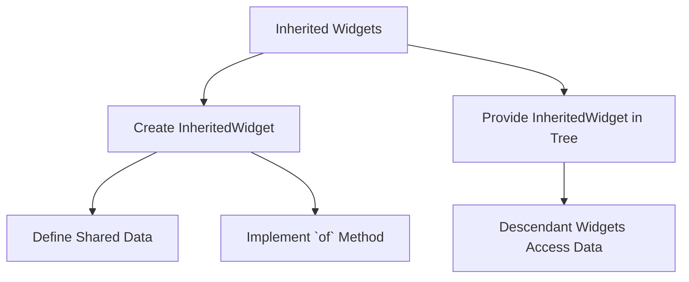

## 6.2.4 Inherited Widgets (Introduction)

In the world of Flutter development, managing state efficiently is crucial, especially as applications grow in complexity. One of the foundational tools Flutter provides for this purpose is the **Inherited Widget**. This article introduces you to Inherited Widgets, explaining their role in data propagation, their usage, and their limitations. By the end, you'll have a solid understanding of how to implement and utilize Inherited Widgets in your Flutter applications.

### Introduction to Inherited Widgets

Inherited Widgets are a powerful feature in Flutter that allows data to be efficiently propagated down the widget tree. This mechanism enables descendant widgets to access shared data without the need for explicitly passing it through constructors, a process often referred to as "props drilling." This capability is particularly beneficial in larger applications where managing state across multiple layers of widgets can become cumbersome.

### Why Use Inherited Widgets?

Inherited Widgets facilitate the sharing of data across multiple widgets in a way that is both efficient and scalable. Here are some key reasons to use Inherited Widgets:

- **Avoid Props Drilling:** Inherited Widgets eliminate the need to pass data through multiple layers of widgets, simplifying the widget tree and reducing boilerplate code.
- **Efficient Rebuilds:** Widgets that depend on inherited data will only rebuild when necessary, optimizing performance.
- **Centralized Data Management:** Inherited Widgets provide a centralized way to manage and access shared data, making your codebase cleaner and more maintainable.

### Basic Usage of InheritedWidget

To understand how Inherited Widgets work, let's walk through the process of creating a custom `InheritedWidget` and accessing its data from descendant widgets.

#### Creating a Custom InheritedWidget

Below is a simple example of how to create a custom `InheritedWidget`:

```dart
class MyInheritedWidget extends InheritedWidget {
  final String data;

  MyInheritedWidget({
    required this.data,
    required Widget child,
  }) : super(child: child);

  static MyInheritedWidget? of(BuildContext context) {
    return context.dependOnInheritedWidgetOfExactType<MyInheritedWidget>();
  }

  @override
  bool updateShouldNotify(MyInheritedWidget oldWidget) {
    return data != oldWidget.data;
  }
}

class ParentWidget extends StatelessWidget {
  @override
  Widget build(BuildContext context) {
    return MyInheritedWidget(
      data: 'Shared Data',
      child: ChildWidget(),
    );
  }
}

class ChildWidget extends StatelessWidget {
  @override
  Widget build(BuildContext context) {
    final inherited = MyInheritedWidget.of(context);
    return Text(inherited?.data ?? 'No Data');
  }
}
```

#### Explanation

- **`MyInheritedWidget` Class:** This class extends `InheritedWidget` and holds the shared data (`data` in this case). It overrides the `updateShouldNotify` method to determine when dependent widgets should rebuild.
- **`of` Method:** This static method allows descendant widgets to access the inherited data by calling `MyInheritedWidget.of(context)`.
- **`updateShouldNotify` Method:** This method returns `true` if the data has changed, signaling dependent widgets to rebuild.

### Visualizing Inherited Widgets

To better understand the flow of data and the relationship between the `InheritedWidget`, parent, and child widgets, consider the following diagram:



### Limitations and Considerations

While Inherited Widgets are a powerful tool, they come with certain limitations and considerations:

- **Rebuilds:** Widgets that depend on the inherited data will rebuild when `updateShouldNotify` returns true. This can lead to performance issues if not managed carefully.
- **Not Ideal for All Scenarios:** Inherited Widgets are best suited for scenarios where data needs to be shared across a wide range of widgets. For more complex state management needs, consider using dedicated solutions like Provider or Bloc.

### Conclusion

Inherited Widgets provide a robust mechanism for managing shared data in Flutter applications, especially when dealing with complex widget trees. By understanding how to implement and use Inherited Widgets, you can create more efficient and maintainable Flutter applications. As you continue your journey in Flutter development, consider exploring more advanced state management techniques that build upon the concepts introduced here.

### Further Reading and Resources

- [Flutter Documentation on InheritedWidget](https://api.flutter.dev/flutter/widgets/InheritedWidget-class.html)
- [State Management in Flutter](https://flutter.dev/docs/development/data-and-backend/state-mgmt/intro)
- [Provider Package](https://pub.dev/packages/provider)

## Quiz Time!



### What is the primary purpose of Inherited Widgets in Flutter?

- [x] To efficiently propagate data down the widget tree
- [ ] To manage animations
- [ ] To handle network requests
- [ ] To style widgets

> **Explanation:** Inherited Widgets are designed to efficiently propagate data down the widget tree, making it accessible to descendant widgets without explicit passing through constructors.

### Which method in an InheritedWidget determines if dependent widgets should rebuild?

- [ ] build
- [ ] createState
- [x] updateShouldNotify
- [ ] initState

> **Explanation:** The `updateShouldNotify` method determines whether dependent widgets should rebuild when the data changes.

### How do descendant widgets access data from an InheritedWidget?

- [ ] By using a global variable
- [x] By calling the static `of` method
- [ ] By passing data through constructors
- [ ] By using a callback function

> **Explanation:** Descendant widgets access data from an InheritedWidget by calling its static `of` method with the current context.

### What is a common limitation of using Inherited Widgets?

- [x] Widgets rebuild when `updateShouldNotify` returns true
- [ ] They cannot hold any data
- [ ] They are not compatible with StatelessWidgets
- [ ] They require a database connection

> **Explanation:** A common limitation is that widgets depending on the inherited data will rebuild when `updateShouldNotify` returns true, which can affect performance.

### Inherited Widgets are best suited for which type of data sharing?

- [x] Data that needs to be shared across a wide range of widgets
- [ ] Data that changes frequently
- [ ] Data that is only used by a single widget
- [ ] Data that requires encryption

> **Explanation:** Inherited Widgets are best suited for scenarios where data needs to be shared across a wide range of widgets.

### What is the role of the `of` method in an InheritedWidget?

- [ ] To initialize the widget
- [x] To provide access to the inherited data
- [ ] To update the widget's state
- [ ] To render the widget

> **Explanation:** The `of` method provides descendant widgets access to the inherited data.

### Which of the following is NOT a benefit of using Inherited Widgets?

- [ ] Avoiding props drilling
- [ ] Efficient rebuilds
- [x] Managing complex animations
- [ ] Centralized data management

> **Explanation:** Managing complex animations is not a benefit of using Inherited Widgets; they are primarily used for data propagation.

### What should you consider when using Inherited Widgets in large applications?

- [ ] They are the only state management solution needed
- [x] They may not be ideal for all scenarios
- [ ] They require extensive configuration
- [ ] They automatically handle all state changes

> **Explanation:** Inherited Widgets may not be ideal for all scenarios, especially in large applications where more complex state management solutions might be needed.

### True or False: Inherited Widgets can be used to manage network requests.

- [ ] True
- [x] False

> **Explanation:** False. Inherited Widgets are not designed to manage network requests; they are used for data propagation within the widget tree.

### Which Flutter package is often recommended for more complex state management than Inherited Widgets?

- [ ] http
- [x] provider
- [ ] sqflite
- [ ] path_provider

> **Explanation:** The `provider` package is often recommended for more complex state management needs beyond what Inherited Widgets can handle.


