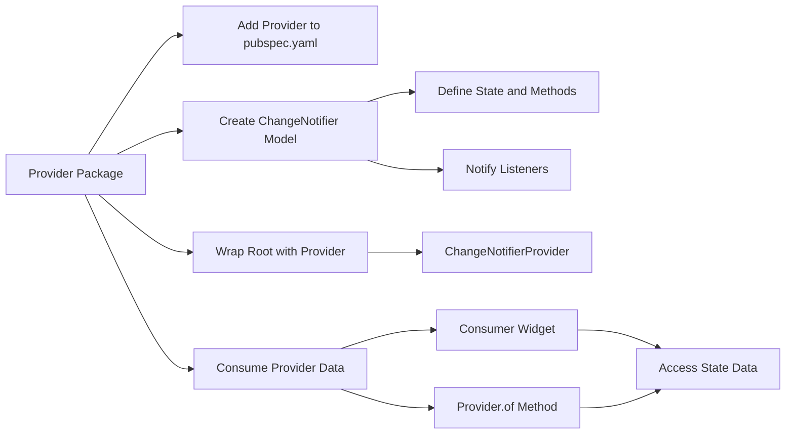

## 6.3.1 Using Provider Package

State management is a crucial aspect of building robust and scalable Flutter applications. Among the various state management solutions available, the **Provider** package stands out for its simplicity, efficiency, and seamless integration with Flutter's reactive framework. In this section, we will delve into the Provider package, exploring its installation, setup, and usage through practical examples and best practices.

### Introduction to Provider

The **Provider** package is a popular state management solution in Flutter, built on top of InheritedWidgets. It offers a simple and scalable way to manage state across your application, making it easier to maintain and extend. Provider leverages Flutter's reactive paradigm, allowing your UI to automatically update in response to state changes.

#### Why Choose Provider?

- **Ease of Use:** Provider abstracts the complexity of managing state, making it accessible even for beginners.
- **Scalability:** As your application grows, Provider can easily scale to manage complex state interactions.
- **Integration:** Provider integrates seamlessly with Flutter's widget tree, ensuring efficient updates and rendering.

### Installing Provider

To get started with Provider, you need to add it to your Flutter project. Follow these steps to install and configure the Provider package:

#### Add Provider to `pubspec.yaml`

First, open your project's `pubspec.yaml` file and add the Provider package under dependencies:

```yaml
dependencies:
  flutter:
    sdk: flutter
  provider: ^6.0.5
```

#### Fetch the Package

After updating `pubspec.yaml`, run the following command in your terminal to fetch the package:

```bash
flutter pub get
```

This command downloads the Provider package and makes it available for use in your project.

### Setting Up Provider

With Provider installed, the next step is to set it up in your Flutter application. This involves wrapping your root widget with a `ChangeNotifierProvider` to make the state accessible throughout the app.

#### Wrap the Root Widget

In your `main.dart` file, wrap the root widget with `ChangeNotifierProvider`. This setup provides the state to the entire widget tree:

```dart
void main() {
  runApp(
    ChangeNotifierProvider(
      create: (context) => CounterModel(),
      child: MyApp(),
    ),
  );
}
```

### Creating a ChangeNotifier Model

The core of the Provider pattern is the `ChangeNotifier` model, which holds and manages the state. Let's create a simple model to demonstrate this:

```dart
class CounterModel extends ChangeNotifier {
  int _count = 0;

  int get count => _count;

  void increment() {
    _count++;
    notifyListeners();
  }
}
```

#### Key Components:

- **State Variables:** `_count` is a private variable holding the state.
- **Getters:** `count` provides read access to the state.
- **Methods:** `increment()` modifies the state and calls `notifyListeners()` to update the UI.

### Consuming Provider Data

Once the state is set up, you can consume it in your widgets using the `Consumer` widget or `Provider.of` method.

#### Using the Consumer Widget

The `Consumer` widget listens for changes in the state and rebuilds the UI accordingly:

```dart
class MyHomePage extends StatelessWidget {
  @override
  Widget build(BuildContext context) {
    return Scaffold(
      appBar: AppBar(title: Text('Provider Example')),
      body: Center(
        child: Consumer<CounterModel>(
          builder: (context, counter, child) => Text(
            'Count: ${counter.count}',
            style: TextStyle(fontSize: 24),
          ),
        ),
      ),
      floatingActionButton: FloatingActionButton(
        onPressed: () => Provider.of<CounterModel>(context, listen: false).increment(),
        child: Icon(Icons.add),
      ),
    );
  }
}
```

#### Using Provider.of

`Provider.of` is another way to access the state. Use it when you don't need to rebuild the widget on state changes:

```dart
Provider.of<CounterModel>(context, listen: false).increment();
```

### Visualizing State Management with Provider

To better understand the flow of state management using Provider, let's visualize it with a Mermaid.js diagram:



### Best Practices

To ensure efficient and maintainable state management with Provider, consider the following best practices:

- **Keep Models Simple:** Models should focus solely on state and logic related to that state. Avoid adding UI-related code.
- **Avoid Overusing Providers:** Use providers judiciously to prevent performance issues. Only provide state where necessary.
- **Use `listen: false` When Not Listening:** Optimize widget rebuilds by setting `listen: false` when accessing providers without needing to listen for changes.

### Conclusion

The Provider package offers a powerful yet simple solution for state management in Flutter applications. By following the steps outlined in this section, you can effectively manage state across your app, ensuring a responsive and scalable user experience. Remember to adhere to best practices to maintain clean and efficient code.

### Further Reading and Resources

- [Flutter Provider Documentation](https://pub.dev/packages/provider)
- [Flutter State Management Guide](https://flutter.dev/docs/development/data-and-backend/state-mgmt/intro)
- [Provider Package Source Code](https://github.com/rrousselGit/provider)

By mastering the Provider package, you equip yourself with a robust tool for managing state in your Flutter applications, paving the way for more complex and feature-rich apps.

## Quiz Time!



### What is the primary purpose of the Provider package in Flutter?

- [x] To manage state efficiently across the application
- [ ] To handle network requests
- [ ] To style widgets
- [ ] To manage animations

> **Explanation:** The Provider package is primarily used for state management in Flutter applications, allowing efficient sharing and updating of state across the widget tree.

### How do you add the Provider package to a Flutter project?

- [x] By adding it to the `pubspec.yaml` file and running `flutter pub get`
- [ ] By downloading it from the Flutter website
- [ ] By importing it directly into the Dart file
- [ ] By using the Flutter CLI command `flutter add provider`

> **Explanation:** To add the Provider package, you must specify it in the `pubspec.yaml` file and run `flutter pub get` to fetch the package.

### What is the role of `ChangeNotifier` in the Provider pattern?

- [x] It holds and manages state, notifying listeners of changes
- [ ] It styles widgets
- [ ] It handles network requests
- [ ] It manages animations

> **Explanation:** `ChangeNotifier` is a class that holds and manages state in the Provider pattern, using `notifyListeners()` to update any listeners when the state changes.

### Which widget is commonly used to consume Provider data?

- [x] Consumer
- [ ] Scaffold
- [ ] AppBar
- [ ] ListView

> **Explanation:** The `Consumer` widget is used to listen to changes in the provided state and rebuild the UI accordingly.

### What does the `notifyListeners()` method do in a `ChangeNotifier` model?

- [x] It notifies all listeners to rebuild their widgets
- [ ] It fetches data from the server
- [ ] It logs messages to the console
- [ ] It updates the app's theme

> **Explanation:** `notifyListeners()` is called within a `ChangeNotifier` model to notify all registered listeners that they should rebuild their widgets due to a change in state.

### How can you prevent a widget from rebuilding when accessing provider data?

- [x] Use `Provider.of(context, listen: false)`
- [ ] Use `Consumer` widget
- [ ] Use `setState()`
- [ ] Use `notifyListeners()`

> **Explanation:** By setting `listen: false` in `Provider.of`, you can access provider data without triggering a rebuild of the widget.

### What is a key benefit of using the Provider package?

- [x] It simplifies state management and integrates well with Flutter's widget tree
- [ ] It provides advanced animation capabilities
- [ ] It enhances network performance
- [ ] It automatically generates UI components

> **Explanation:** Provider simplifies state management by integrating seamlessly with Flutter's widget tree, making it easier to manage and update state across the app.

### Which method is used to fetch the Provider package after adding it to `pubspec.yaml`?

- [x] `flutter pub get`
- [ ] `flutter fetch`
- [ ] `flutter install`
- [ ] `flutter update`

> **Explanation:** After adding the Provider package to `pubspec.yaml`, you run `flutter pub get` to fetch and install the package.

### What is the purpose of wrapping the root widget with `ChangeNotifierProvider`?

- [x] To provide state to the entire widget tree
- [ ] To style the root widget
- [ ] To handle network requests
- [ ] To manage animations

> **Explanation:** Wrapping the root widget with `ChangeNotifierProvider` allows the state to be accessible throughout the entire widget tree.

### True or False: The Provider package can only be used for small applications.

- [ ] True
- [x] False

> **Explanation:** False. The Provider package is scalable and can be used for both small and large applications, making it a versatile choice for state management.


