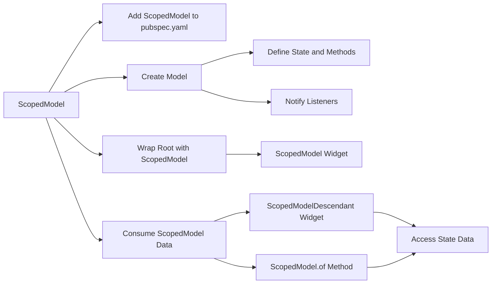

## 6.3.2 ScopedModel (Overview)

State management is a crucial aspect of building dynamic and responsive applications in Flutter. Among the various state management solutions available, **ScopedModel** stands out as an early approach inspired by the Model-View-ViewModel (MVVM) architecture. Although it has been largely superseded by more advanced solutions like Provider, understanding ScopedModel provides a solid foundation for grasping the principles of state management in Flutter.

### Introduction to ScopedModel

**ScopedModel** is a lightweight state management library for Flutter that allows you to manage and share state across your application. It is particularly useful for smaller projects or for developers who are just beginning to explore state management concepts. ScopedModel simplifies the process of propagating state changes throughout the widget tree, ensuring that your UI remains in sync with your application's data.

#### Key Concepts of ScopedModel

- **Model-View-ViewModel (MVVM) Architecture:** ScopedModel draws inspiration from MVVM, where the Model represents the data and business logic, the View is the UI, and the ViewModel acts as an intermediary that holds the state and exposes it to the View.
- **Centralized State Management:** ScopedModel allows you to centralize your application's state in a single model, making it easier to manage and update.
- **Listener Notification:** When the state changes, ScopedModel notifies all registered listeners, ensuring that the UI updates automatically.

### Installing ScopedModel

To get started with ScopedModel, you need to add it to your Flutter project. This involves updating your `pubspec.yaml` file and fetching the package.

#### Add ScopedModel to `pubspec.yaml`

```yaml
dependencies:
  flutter:
    sdk: flutter
  scoped_model: ^1.1.0
```

#### Fetch the Package

Run the following command in your terminal to download and install the ScopedModel package:

```bash
flutter pub get
```

### Setting Up ScopedModel

Once ScopedModel is installed, you can set it up in your Flutter application by wrapping your root widget with a `ScopedModel` widget. This provides the model to the entire widget tree, allowing any descendant widget to access and react to state changes.

```dart
void main() {
  runApp(
    ScopedModel<CounterModel>(
      model: CounterModel(),
      child: MyApp(),
    ),
  );
}
```

### Creating a Model

In ScopedModel, a model is a class that extends `Model`. This class holds the state and provides methods to modify it. When the state changes, the model notifies all listeners, prompting the UI to update.

```dart
class CounterModel extends Model {
  int _count = 0;

  int get count => _count;

  void increment() {
    _count++;
    notifyListeners();
  }
}
```

#### Explanation

- **State Variables:** The `_count` variable holds the state. It is private to prevent direct modification from outside the model.
- **Getters:** The `count` getter provides read-only access to the state.
- **State Modification Methods:** The `increment` method modifies the state and calls `notifyListeners()` to update the UI.

### Consuming ScopedModel Data

To access and react to state changes, use the `ScopedModelDescendant` widget. This widget listens for changes in the model and rebuilds its subtree when the state updates.

```dart
class MyHomePage extends StatelessWidget {
  @override
  Widget build(BuildContext context) {
    return Scaffold(
      appBar: AppBar(title: Text('ScopedModel Example')),
      body: Center(
        child: ScopedModelDescendant<CounterModel>(
          builder: (context, child, model) => Text(
            'Count: ${model.count}',
            style: TextStyle(fontSize: 24),
          ),
        ),
      ),
      floatingActionButton: FloatingActionButton(
        onPressed: () => ScopedModel.of<CounterModel>(context).increment(),
        child: Icon(Icons.add),
      ),
    );
  }
}
```

#### Explanation

- **ScopedModelDescendant:** This widget rebuilds its subtree whenever the model notifies listeners of a state change.
- **Builder Function:** The builder function provides access to the model, allowing you to read the state and update the UI accordingly.
- **State Modification:** The `FloatingActionButton` uses `ScopedModel.of<CounterModel>(context)` to access the model and call the `increment` method.

### Visualizing ScopedModel with Mermaid.js

To better understand the flow of ScopedModel, consider the following diagram:



### Limitations of ScopedModel

While ScopedModel provides a straightforward approach to state management, it has several limitations that have led to its decline in popularity:

- **Less Flexible:** ScopedModel lacks the flexibility and features of more modern solutions like Provider, which offers better support for complex use cases.
- **Obsolete for New Projects:** Due to its limited capabilities and the broader adoption of Provider, ScopedModel is not recommended for new projects. However, it remains a valuable learning tool for understanding the basics of state management.

### Conclusion

ScopedModel serves as an excellent introduction to state management in Flutter, offering a simple yet effective way to manage and share state across your application. While it may not be suitable for larger or more complex projects, it provides foundational knowledge that can be applied to more advanced state management solutions.

By understanding ScopedModel, you gain insight into the principles of state management, preparing you to explore more sophisticated patterns and libraries like Provider. As you continue your journey in Flutter development, consider experimenting with different state management techniques to find the one that best suits your project's needs.

### Further Reading and Resources

- [Flutter ScopedModel Documentation](https://pub.dev/packages/scoped_model)
- [Provider Package](https://pub.dev/packages/provider)
- [Model-View-ViewModel (MVVM) Architecture](https://en.wikipedia.org/wiki/Model%E2%80%93view%E2%80%93viewmodel)
- [Flutter State Management](https://flutter.dev/docs/development/data-and-backend/state-mgmt/intro)

## Quiz Time!



### What is ScopedModel in Flutter?

- [x] A state management solution inspired by the MVVM architecture.
- [ ] A UI framework for building Flutter apps.
- [ ] A database management tool.
- [ ] A network request library.

> **Explanation:** ScopedModel is a state management solution in Flutter, inspired by the Model-View-ViewModel (MVVM) architecture.

### How do you add ScopedModel to a Flutter project?

- [x] By adding it to the `pubspec.yaml` file and running `flutter pub get`.
- [ ] By installing it through the Android SDK Manager.
- [ ] By downloading it from the Flutter website.
- [ ] By writing custom code to implement it.

> **Explanation:** ScopedModel is added to a Flutter project by including it in the `pubspec.yaml` file and running `flutter pub get` to fetch the package.

### What is the purpose of the `notifyListeners()` method in ScopedModel?

- [x] To notify all registered listeners of a state change.
- [ ] To reset the state to its initial value.
- [ ] To log state changes to the console.
- [ ] To remove all listeners from the model.

> **Explanation:** The `notifyListeners()` method is used to notify all registered listeners that the state has changed, prompting the UI to update.

### Which widget is used to access and react to state changes in ScopedModel?

- [x] ScopedModelDescendant
- [ ] ScopedModelProvider
- [ ] ScopedModelListener
- [ ] ScopedModelConsumer

> **Explanation:** The `ScopedModelDescendant` widget is used to access and react to state changes in ScopedModel.

### What is a limitation of ScopedModel compared to Provider?

- [x] It offers fewer features and lacks support for some advanced use cases.
- [ ] It is more complex to implement.
- [ ] It requires more boilerplate code.
- [ ] It is not compatible with Flutter.

> **Explanation:** ScopedModel offers fewer features and lacks support for some advanced use cases compared to Provider, which is why it is less commonly used in modern Flutter applications.

### What architecture does ScopedModel draw inspiration from?

- [x] Model-View-ViewModel (MVVM)
- [ ] Model-View-Controller (MVC)
- [ ] Model-View-Presenter (MVP)
- [ ] Flux

> **Explanation:** ScopedModel is inspired by the Model-View-ViewModel (MVVM) architecture.

### Why is ScopedModel not recommended for new projects?

- [x] It has been largely superseded by Provider, which offers more features and community support.
- [ ] It is too complex for most developers.
- [ ] It is not compatible with the latest version of Flutter.
- [ ] It requires a paid license to use.

> **Explanation:** ScopedModel is not recommended for new projects because it has been largely superseded by Provider, which offers more features and community support.

### What is the role of the `ScopedModel` widget in a Flutter app?

- [x] To provide the model to the widget tree, allowing descendant widgets to access the state.
- [ ] To render the UI components of the app.
- [ ] To manage network requests and responses.
- [ ] To handle user input and gestures.

> **Explanation:** The `ScopedModel` widget provides the model to the widget tree, allowing descendant widgets to access and react to state changes.

### How does ScopedModel notify the UI of state changes?

- [x] By calling the `notifyListeners()` method, which updates all registered listeners.
- [ ] By sending a network request to the server.
- [ ] By logging a message to the console.
- [ ] By resetting the app's state.

> **Explanation:** ScopedModel notifies the UI of state changes by calling the `notifyListeners()` method, which updates all registered listeners.

### True or False: ScopedModel is the most advanced state management solution available in Flutter.

- [ ] True
- [x] False

> **Explanation:** False. ScopedModel is not the most advanced state management solution available in Flutter. It is a simpler solution that has been largely superseded by more advanced options like Provider.


