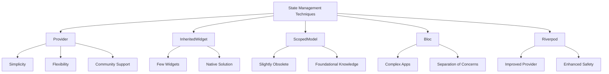

## 6.3.3 When to Use Which Technique

In the world of Flutter development, managing state efficiently is crucial for building responsive and scalable applications. The choice of state management technique can significantly impact your app's architecture, performance, and maintainability. This section delves into the various state management solutions available in Flutter, providing insights into when and why you might choose one over the others.

### Choosing the Right State Management Solution

Selecting a state management technique is not a one-size-fits-all decision. It depends on several factors, including the complexity of your application, scalability requirements, and personal or team preferences. Understanding these factors will help you make an informed decision that aligns with your project's needs.

#### Key Considerations:

- **Complexity of the App:** Simple apps might not require sophisticated state management, while complex apps with multiple interacting components might benefit from more robust solutions.
- **Scalability Requirements:** Consider how your app might grow over time. A scalable solution can accommodate future features and increased data flow.
- **Developer Preference and Familiarity:** The team's experience with certain techniques can influence the choice. Familiarity can lead to faster development and fewer errors.

### Comparison of Techniques

Let's explore some popular state management techniques in Flutter, highlighting their best use cases and advantages.

#### Provider

**Best For:** Most Flutter applications due to its simplicity and flexibility.

**Advantages:**

- **Lightweight:** Provider is a minimalistic solution that integrates seamlessly with Flutter's widget tree.
- **Easy to Integrate:** It requires minimal setup and is straightforward to use, making it ideal for beginners and small to medium-sized apps.
- **Community Support:** As a widely adopted solution, Provider has extensive community support and documentation.

**Example Usage:**

```dart
import 'package:flutter/material.dart';
import 'package:provider/provider.dart';

void main() {
  runApp(
    ChangeNotifierProvider(
      create: (context) => CounterModel(),
      child: MyApp(),
    ),
  );
}

class CounterModel extends ChangeNotifier {
  int _count = 0;

  int get count => _count;

  void increment() {
    _count++;
    notifyListeners();
  }
}

class MyApp extends StatelessWidget {
  @override
  Widget build(BuildContext context) {
    return MaterialApp(
      home: Scaffold(
        appBar: AppBar(title: Text('Provider Example')),
        body: Center(
          child: Consumer<CounterModel>(
            builder: (context, counter, child) {
              return Text('Count: ${counter.count}');
            },
          ),
        ),
        floatingActionButton: FloatingActionButton(
          onPressed: () => context.read<CounterModel>().increment(),
          child: Icon(Icons.add),
        ),
      ),
    );
  }
}
```

#### InheritedWidget

**Best For:** Scenarios where only a few widgets need access to shared data.

**Advantages:**

- **Native Solution:** InheritedWidget is a built-in Flutter mechanism, meaning no external dependencies are required.
- **Fine-Grained Control:** It allows precise control over which parts of the widget tree are rebuilt when the state changes.

**Example Usage:**

```dart
import 'package:flutter/material.dart';

void main() {
  runApp(MyApp());
}

class MyApp extends StatelessWidget {
  @override
  Widget build(BuildContext context) {
    return MaterialApp(
      home: CounterProvider(
        counter: Counter(),
        child: CounterScreen(),
      ),
    );
  }
}

class Counter {
  int value = 0;
}

class CounterProvider extends InheritedWidget {
  final Counter counter;

  CounterProvider({Key? key, required this.counter, required Widget child})
      : super(key: key, child: child);

  static CounterProvider? of(BuildContext context) {
    return context.dependOnInheritedWidgetOfExactType<CounterProvider>();
  }

  @override
  bool updateShouldNotify(CounterProvider oldWidget) {
    return oldWidget.counter.value != counter.value;
  }
}

class CounterScreen extends StatelessWidget {
  @override
  Widget build(BuildContext context) {
    final counter = CounterProvider.of(context)!.counter;

    return Scaffold(
      appBar: AppBar(title: Text('InheritedWidget Example')),
      body: Center(
        child: Text('Count: ${counter.value}'),
      ),
      floatingActionButton: FloatingActionButton(
        onPressed: () {
          counter.value++;
          (context as Element).markNeedsBuild();
        },
        child: Icon(Icons.add),
      ),
    );
  }
}
```

#### ScopedModel

**Best For:** Legacy projects or understanding foundational state management patterns.

**Advantages:**

- **Simplicity:** ScopedModel is easy to understand and implement, making it a good starting point for beginners.
- **Legacy Support:** While largely superseded by Provider, it remains useful for maintaining older projects.

**Example Usage:**

```dart
import 'package:flutter/material.dart';
import 'package:scoped_model/scoped_model.dart';

void main() {
  runApp(MyApp());
}

class CounterModel extends Model {
  int _count = 0;

  int get count => _count;

  void increment() {
    _count++;
    notifyListeners();
  }
}

class MyApp extends StatelessWidget {
  @override
  Widget build(BuildContext context) {
    return ScopedModel<CounterModel>(
      model: CounterModel(),
      child: MaterialApp(
        home: CounterScreen(),
      ),
    );
  }
}

class CounterScreen extends StatelessWidget {
  @override
  Widget build(BuildContext context) {
    return Scaffold(
      appBar: AppBar(title: Text('ScopedModel Example')),
      body: Center(
        child: ScopedModelDescendant<CounterModel>(
          builder: (context, child, model) {
            return Text('Count: ${model.count}');
          },
        ),
      ),
      floatingActionButton: FloatingActionButton(
        onPressed: () => ScopedModel.of<CounterModel>(context).increment(),
        child: Icon(Icons.add),
      ),
    );
  }
}
```

#### Other Techniques (Briefly Mentioned)

- **Bloc:** Best for complex applications requiring robust state management and separation of concerns. It uses streams to manage state, providing a clear separation between business logic and UI.
  
  **Example Usage:**

  ```dart
  import 'package:flutter/material.dart';
  import 'package:flutter_bloc/flutter_bloc.dart';

  void main() {
    runApp(
      BlocProvider(
        create: (context) => CounterBloc(),
        child: MyApp(),
      ),
    );
  }

  class CounterBloc extends Bloc<CounterEvent, int> {
    CounterBloc() : super(0);

    @override
    Stream<int> mapEventToState(CounterEvent event) async* {
      if (event is IncrementEvent) {
        yield state + 1;
      }
    }
  }

  class IncrementEvent extends CounterEvent {}

  class CounterEvent {}

  class MyApp extends StatelessWidget {
    @override
    Widget build(BuildContext context) {
      return MaterialApp(
        home: CounterScreen(),
      );
    }
  }

  class CounterScreen extends StatelessWidget {
    @override
    Widget build(BuildContext context) {
      return Scaffold(
        appBar: AppBar(title: Text('Bloc Example')),
        body: Center(
          child: BlocBuilder<CounterBloc, int>(
            builder: (context, count) {
              return Text('Count: $count');
            },
          ),
        ),
        floatingActionButton: FloatingActionButton(
          onPressed: () => context.read<CounterBloc>().add(IncrementEvent()),
          child: Icon(Icons.add),
        ),
      );
    }
  }
  ```

- **Riverpod:** An evolution of Provider with improvements in safety and flexibility. It offers a more robust and error-resistant approach to state management.

### Mermaid.js Diagram

To better understand the relationships and characteristics of these state management techniques, refer to the following diagram:



### Guidelines for Selecting Techniques

Choosing the right state management technique involves considering several factors. Here are some guidelines to help you decide:

- **Scale of the App:**
  - **Small to Medium Apps:** Provider or InheritedWidget are often sufficient due to their simplicity and ease of use.
  - **Large Apps:** Consider Bloc or Riverpod for their ability to handle complex state interactions and maintain separation of concerns.

- **Developer Familiarity:**
  - Choose solutions that align with the team's expertise. Familiarity can lead to more efficient development and fewer errors.

- **Project Requirements:**
  - Consider specific needs like asynchronous data handling, form management, or persistent state. Some techniques are better suited for handling these requirements.

### Practical Code Examples

Here are practical examples of setting up different state management techniques in Flutter applications:

- **Provider for a Simple App:**

  ```dart
  void main() {
    runApp(
      ChangeNotifierProvider(
        create: (context) => CounterModel(),
        child: MyApp(),
      ),
    );
  }
  ```

- **Bloc for a Complex App:**

  ```dart
  void main() {
    runApp(
      BlocProvider(
        create: (context) => CounterBloc(),
        child: MyApp(),
      ),
    );
  }
  ```

### Conclusion

Selecting the right state management technique is crucial for building efficient and maintainable Flutter applications. By understanding the strengths and ideal use cases of each technique, you can make informed decisions that align with your project's needs. Whether you're building a simple app or a complex, scalable application, there's a state management solution that fits your requirements.

### Additional Resources

For further exploration, consider the following resources:

- [Flutter Documentation on State Management](https://flutter.dev/docs/development/data-and-backend/state-mgmt)
- [Provider Package Documentation](https://pub.dev/packages/provider)
- [Bloc Package Documentation](https://pub.dev/packages/flutter_bloc)
- [Riverpod Package Documentation](https://pub.dev/packages/riverpod)
- [InheritedWidget Documentation](https://api.flutter.dev/flutter/widgets/InheritedWidget-class.html)

These resources provide deeper insights into the various state management techniques and their implementations in Flutter.

## Quiz Time!



### Which state management technique is best suited for most Flutter applications due to its simplicity and flexibility?

- [x] Provider
- [ ] InheritedWidget
- [ ] ScopedModel
- [ ] Bloc

> **Explanation:** Provider is widely used for its simplicity and flexibility, making it suitable for most Flutter applications.

### What is an advantage of using InheritedWidget?

- [x] Native Flutter solution without external dependencies
- [ ] Best for complex applications
- [ ] Improved safety over Provider
- [ ] Requires minimal setup

> **Explanation:** InheritedWidget is a native Flutter solution that does not require external dependencies, making it ideal for scenarios where only a few widgets need access to shared data.

### Which state management technique is largely superseded by Provider but still useful for maintaining older projects?

- [ ] Provider
- [ ] InheritedWidget
- [x] ScopedModel
- [ ] Bloc

> **Explanation:** ScopedModel has been largely superseded by Provider but remains useful for maintaining legacy projects.

### Which technique is best for complex applications requiring robust state management and separation of concerns?

- [ ] Provider
- [ ] InheritedWidget
- [ ] ScopedModel
- [x] Bloc

> **Explanation:** Bloc is best suited for complex applications due to its robust state management capabilities and clear separation of concerns.

### What is a key advantage of using Riverpod over Provider?

- [x] Improved safety and flexibility
- [ ] Simplicity
- [ ] Native solution
- [ ] Legacy support

> **Explanation:** Riverpod offers improved safety and flexibility over Provider, making it a more robust state management solution.

### Which factor should be considered when choosing a state management technique for a large app?

- [x] Scalability requirements
- [ ] Minimal setup
- [ ] Legacy support
- [ ] Native solution

> **Explanation:** Scalability requirements are crucial when choosing a state management technique for a large app, as the solution should accommodate future growth.

### What is a common use case for using InheritedWidget?

- [x] When only a few widgets need access to shared data
- [ ] For complex state interactions
- [ ] To handle asynchronous data
- [ ] For persistent state management

> **Explanation:** InheritedWidget is commonly used when only a few widgets need access to shared data, providing a native solution without external dependencies.

### Which state management technique uses streams to manage state?

- [ ] Provider
- [ ] InheritedWidget
- [ ] ScopedModel
- [x] Bloc

> **Explanation:** Bloc uses streams to manage state, providing a clear separation between business logic and UI.

### What is a key consideration when selecting a state management technique?

- [x] Complexity of the app
- [ ] Minimal setup
- [ ] Legacy support
- [ ] Native solution

> **Explanation:** The complexity of the app is a key consideration when selecting a state management technique, as it influences the choice of solution.

### True or False: Riverpod is an evolution of Provider with improvements in safety and flexibility.

- [x] True
- [ ] False

> **Explanation:** True. Riverpod is an evolution of Provider, offering improvements in safety and flexibility.


