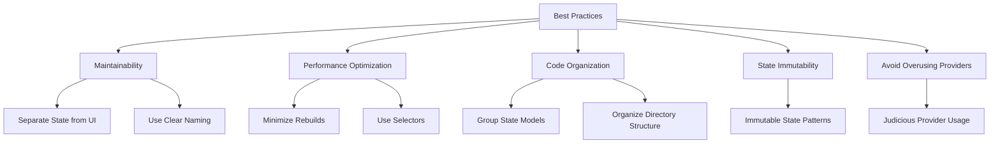

## 6.3.4 Best Practices

State management is a crucial aspect of Flutter development, impacting both the performance and maintainability of your applications. By adopting best practices, you can ensure that your app remains efficient, scalable, and easy to maintain. This section will guide you through essential best practices for state management in Flutter, providing practical examples and insights to help you implement these strategies in your projects.

### Maintainability

Maintaining a clean separation between state management logic and UI code is vital for enhancing code readability and maintainability. By isolating state logic, you can simplify the process of updating and debugging your app, making it easier to manage as it grows in complexity.

#### Separation of State from UI

One effective way to separate state from UI is by using the Provider package, which allows you to manage state outside of your widget tree. This separation not only improves maintainability but also makes your code more modular and testable.

**Code Example:**

```dart
// Using Provider to separate state from UI
class CounterModel extends ChangeNotifier {
  int _count = 0;

  int get count => _count;

  void increment() {
    _count++;
    notifyListeners();
  }
}

class CounterWidget extends StatelessWidget {
  @override
  Widget build(BuildContext context) {
    return Consumer<CounterModel>(
      builder: (context, counter, child) => Column(
        children: <Widget>[
          Text('Count: ${counter.count}'),
          ElevatedButton(
            onPressed: counter.increment,
            child: Text('Increment'),
          ),
        ],
      ),
    );
  }
}
```

In this example, `CounterModel` handles the state logic, while `CounterWidget` focuses solely on the UI, consuming the state provided by `CounterModel`.

### Performance Optimization

Optimizing performance is crucial for delivering a smooth user experience. By minimizing unnecessary widget rebuilds and efficiently managing state updates, you can significantly enhance your app's responsiveness.

#### Minimize Rebuilds

To minimize rebuilds, ensure that only the widgets dependent on the changed state are rebuilt. Use `listen: false` when accessing providers if you don't need to listen for changes.

**Code Example:**

```dart
// Accessing provider without listening
ElevatedButton(
  onPressed: () {
    Provider.of<CounterModel>(context, listen: false).increment();
  },
  child: Text('Increment'),
);
```

#### Use Selectors

Selectors allow you to extract only the necessary parts of the state, preventing unnecessary rebuilds of widgets that do not depend on the entire state object.

**Code Example with Provider's Selector:**

```dart
Selector<CounterModel, int>(
  selector: (context, counter) => counter.count,
  builder: (context, count, child) => Text('Count: $count'),
);
```

### Code Organization

Organizing your code effectively is essential for maintaining a scalable and manageable codebase. Group related state models and use meaningful names to enhance code clarity.

#### Group Related State Models

Organize state models based on feature domains to improve code structure and readability. This approach helps in managing large codebases by keeping related logic together.

**Example Directory Structure:**

```
lib/
  models/
    counter_model.dart
    user_model.dart
  widgets/
    counter_widget.dart
    user_widget.dart
  screens/
    home_screen.dart
    profile_screen.dart
```

#### Use Meaningful Names

Naming state models and providers clearly to reflect their responsibilities is crucial for understanding and maintaining your code. Avoid ambiguous names that do not convey the purpose of the class or function.

### State Immutability

Treating state as immutable ensures consistency and predictability in your app's behavior. Always create new instances when updating state variables.

**Example:**

```dart
class UserModel extends ChangeNotifier {
  String _name = '';

  String get name => _name;

  void updateName(String newName) {
    _name = newName;
    notifyListeners();
  }
}
```

By creating a new instance of the state when updating, you maintain a clear and predictable state flow, reducing the risk of unintended side effects.

### Avoid Overusing Providers

While providers are powerful tools for managing state, overusing them can clutter your widget tree and make your code harder to manage. Use multiple providers judiciously to manage different parts of the state without overwhelming your codebase.

### Visualizing Best Practices

To better understand the relationships between these best practices, consider the following Mermaid.js diagram:



### Conclusion

By following these best practices, you can create Flutter applications that are not only efficient and performant but also maintainable and scalable. These strategies will help you manage state effectively, ensuring a smooth user experience and a robust codebase.

### Further Reading and Resources

- [Flutter Documentation](https://flutter.dev/docs)
- [Provider Package Documentation](https://pub.dev/packages/provider)
- [Effective Dart: Style](https://dart.dev/guides/language/effective-dart/style)
- [State Management in Flutter](https://flutter.dev/docs/development/data-and-backend/state-mgmt)

These resources provide additional insights and examples to deepen your understanding of state management in Flutter.

## Quiz Time!



### What is the primary benefit of separating state management logic from UI code?

- [x] Enhances code readability and maintainability
- [ ] Increases app performance
- [ ] Reduces app size
- [ ] Simplifies UI design

> **Explanation:** Separating state management logic from UI code enhances code readability and maintainability by making the code more modular and easier to manage.

### How can you minimize unnecessary widget rebuilds in Flutter?

- [x] Use `listen: false` when accessing providers without needing to listen for changes
- [ ] Always use `Consumer` widgets
- [ ] Avoid using providers
- [ ] Use `setState` frequently

> **Explanation:** Using `listen: false` when accessing providers without needing to listen for changes helps minimize unnecessary widget rebuilds.

### What is the purpose of using selectors in state management?

- [x] To extract only necessary parts of the state and prevent unnecessary widget rebuilds
- [ ] To increase the complexity of the code
- [ ] To simplify the UI design
- [ ] To manage multiple providers

> **Explanation:** Selectors are used to extract only necessary parts of the state, preventing unnecessary widget rebuilds and optimizing performance.

### Why is state immutability important in Flutter?

- [x] It ensures consistency and predictability in the app's behavior
- [ ] It makes the app run faster
- [ ] It reduces the app's memory usage
- [ ] It simplifies the UI design

> **Explanation:** State immutability ensures consistency and predictability in the app's behavior by maintaining a clear and predictable state flow.

### What is a potential downside of overusing providers in a Flutter app?

- [x] It can clutter the widget tree and make the code harder to manage
- [ ] It increases app performance
- [ ] It simplifies state management
- [ ] It reduces app size

> **Explanation:** Overusing providers can clutter the widget tree and make the code harder to manage, leading to a less maintainable codebase.

### Which of the following is a best practice for organizing state models?

- [x] Group related state models based on feature domains
- [ ] Place all state models in a single file
- [ ] Use random naming conventions
- [ ] Avoid using directories

> **Explanation:** Grouping related state models based on feature domains improves code structure and readability, making the codebase easier to manage.

### What is the benefit of using meaningful names for state models and providers?

- [x] It enhances code clarity and understanding
- [ ] It increases app performance
- [ ] It reduces app size
- [ ] It simplifies UI design

> **Explanation:** Using meaningful names for state models and providers enhances code clarity and understanding, making it easier to maintain and manage the code.

### How does using `Provider` help in separating state from UI?

- [x] It allows state to be managed outside of the widget tree
- [ ] It combines state and UI into a single component
- [ ] It eliminates the need for state management
- [ ] It simplifies UI design

> **Explanation:** Using `Provider` allows state to be managed outside of the widget tree, separating state logic from UI code and enhancing maintainability.

### What is the role of `ChangeNotifier` in state management?

- [x] It notifies listeners about changes in the state
- [ ] It eliminates the need for state management
- [ ] It simplifies UI design
- [ ] It increases app performance

> **Explanation:** `ChangeNotifier` is used to notify listeners about changes in the state, allowing the UI to update accordingly.

### True or False: Treating state as immutable means always modifying the existing state instance.

- [ ] True
- [x] False

> **Explanation:** Treating state as immutable means creating new instances when updating state variables, rather than modifying the existing state instance.


