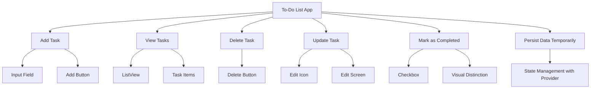

## 6.4.1 Project Overview

In this section, we delve into the creation of a **To-Do List App**, a practical project designed to solidify your understanding of state management in Flutter using the Provider package. This app will allow users to manage their tasks effectively, providing a hands-on experience with CRUD (Create, Read, Update, Delete) operations and enhancing user interaction through real-time updates and a responsive UI.

### Project Description

The **To-Do List App** serves as a quintessential example of how state management can be applied in a Flutter application. By building this app, you will learn to manage a list of tasks where users can add new tasks, view existing ones, update details, delete tasks, and mark tasks as completed. This project will not only reinforce your understanding of state management but also introduce you to practical UI design and user experience enhancements.

### Project Objectives

- **Apply State Management Principles:** Utilize the Provider package to manage the state of the task list efficiently. This involves understanding how to propagate state changes throughout the widget tree and ensure that UI components react to these changes.
  
- **Implement CRUD Operations:** Develop the functionality to create, read, update, and delete tasks. This will involve setting up the necessary UI components and connecting them to the underlying data model.

- **Enhance User Experience:** Design interactive UI elements that provide real-time feedback to the user. This includes updating the task list dynamically as changes occur and ensuring a smooth user experience.

### Expected Features

- **Add Task:** Users can input a task description and add it to the list. This feature will involve creating an input field and a button to submit the task.

- **View Tasks:** Display a list of all added tasks using a `ListView` widget. Each task will be represented as a list item, showing the task description and its status.

- **Delete Task:** Allow users to remove tasks from the list. This will require adding a delete button to each task item and handling the removal logic.

- **Update Task:** Enable users to edit existing tasks. This feature will involve navigating to an edit screen where users can modify task details.

- **Mark as Completed:** Users can mark tasks as completed, which will visually distinguish them from incomplete tasks. This can be achieved using a checkbox or a similar UI element.

- **Persist Data Temporarily:** While this project will not focus on permanent data storage, it will maintain the task list within the app session using state management techniques.

### Visualizing the App Structure

To better understand the structure and functionalities of the To-Do List App, refer to the following Mermaid.js diagram:

### Instructions for Implementation

#### Setting Up the Project

1. **Initialize a New Flutter Project:** Start by creating a new Flutter project using your preferred IDE. Ensure that the Provider package is added to your `pubspec.yaml` file.

2. **Design the UI Layout:** Plan the layout of your app, focusing on the main screen where tasks will be displayed. Use a `ListView` to list tasks and design input fields for adding new tasks.

3. **Implement State Management:** Set up a `ChangeNotifier` class to manage the state of the task list. This class will handle adding, updating, and deleting tasks, and notify listeners of any changes.

4. **Create Task Model:** Define a `Task` model class that represents each task. This class should include properties such as `id`, `description`, and `isCompleted`.

5. **Build CRUD Operations:**
   - **Add Task:** Implement a method in your state management class to add a new task to the list.
   - **View Tasks:** Bind the `ListView` to the task list from your state management class.
   - **Delete Task:** Add functionality to remove a task from the list.
   - **Update Task:** Implement a method to update task details and reflect changes in the UI.
   - **Mark as Completed:** Allow tasks to be marked as completed and update their visual representation.

6. **Enhance User Experience:** Use Flutter's built-in widgets and animations to provide a smooth and interactive user experience. Consider using `AnimatedList` for dynamic updates and transitions.

7. **Test Your App:** Regularly test your app to ensure all features work as expected. Use Flutter's hot reload feature to quickly see changes.

### Best Practices and Challenges

- **State Management:** Ensure that your state management logic is efficient and does not lead to unnecessary rebuilds of the UI. Use `Provider` effectively to propagate changes only where needed.

- **User Experience:** Focus on creating a seamless user experience by providing immediate feedback for user actions. Consider edge cases such as empty task descriptions or duplicate tasks.

- **Code Organization:** Keep your code organized by separating UI components, state management logic, and data models into different files. This will make your codebase easier to maintain and extend.

- **Testing and Debugging:** Use Flutter's debugging tools to identify and fix issues. Write unit tests for your state management logic to ensure it behaves correctly.

### Further Exploration

- **Persisting Data:** While this project focuses on temporary data persistence, consider exploring packages like `shared_preferences` or `sqflite` for storing data permanently.

- **Advanced State Management:** Once comfortable with Provider, explore other state management solutions like Riverpod or Bloc for more complex applications.

- **UI Enhancements:** Experiment with custom animations and transitions to make your app more engaging.

### Conclusion

The To-Do List App project is an excellent opportunity to apply state management principles in a real-world scenario. By completing this project, you will gain a deeper understanding of how to manage state in Flutter applications, implement CRUD operations, and create an interactive user experience. As you work through this project, remember to experiment with different approaches and explore additional features that can enhance your app.

## Quiz Time!



### What is the primary purpose of the To-Do List App project?

- [x] To practice state management using Provider in Flutter.
- [ ] To learn about advanced animations in Flutter.
- [ ] To implement complex networking features.
- [ ] To explore database integration with Firebase.

> **Explanation:** The To-Do List App project is designed to help you practice state management using the Provider package in Flutter, focusing on managing a list of tasks.

### Which state management technique is used in the To-Do List App project?

- [x] Provider
- [ ] Bloc
- [ ] Redux
- [ ] Riverpod

> **Explanation:** The project utilizes the Provider package for state management, as discussed in the chapter.

### What are the CRUD operations implemented in the To-Do List App?

- [x] Create, Read, Update, Delete
- [ ] Connect, Retrieve, Update, Delete
- [ ] Create, Remove, Update, Display
- [ ] Copy, Read, Update, Delete

> **Explanation:** CRUD stands for Create, Read, Update, and Delete, which are the operations implemented in the app to manage tasks.

### How are tasks visually distinguished when marked as completed?

- [x] By using a checkbox and visual distinction
- [ ] By changing the task color to red
- [ ] By moving the task to a separate list
- [ ] By deleting the task automatically

> **Explanation:** Tasks are marked as completed using a checkbox, and a visual distinction is applied to differentiate them from incomplete tasks.

### What is the role of the ChangeNotifier class in the project?

- [x] To manage the state of the task list and notify listeners of changes
- [ ] To handle network requests and responses
- [ ] To provide authentication services
- [ ] To manage app navigation and routing

> **Explanation:** The ChangeNotifier class is used to manage the state of the task list and notify listeners of any changes, allowing the UI to update accordingly.

### Which widget is primarily used to display the list of tasks?

- [x] ListView
- [ ] GridView
- [ ] Stack
- [ ] Column

> **Explanation:** A ListView widget is used to display the list of tasks, allowing for a scrollable list of items.

### What should be considered when implementing the Delete Task feature?

- [x] Handling the removal logic and updating the UI
- [ ] Ensuring tasks are permanently deleted from a database
- [ ] Automatically archiving deleted tasks
- [ ] Sending a confirmation email to the user

> **Explanation:** When implementing the Delete Task feature, it's important to handle the removal logic and update the UI to reflect the changes.

### What is a potential challenge when managing state in the To-Do List App?

- [x] Ensuring efficient state propagation without unnecessary UI rebuilds
- [ ] Integrating third-party APIs for task management
- [ ] Implementing complex animations for task transitions
- [ ] Designing a multi-screen navigation flow

> **Explanation:** A key challenge is ensuring that state changes are propagated efficiently without causing unnecessary UI rebuilds, which can affect performance.

### What is the benefit of using Flutter's hot reload feature during development?

- [x] It allows developers to see changes instantly without restarting the app.
- [ ] It automatically optimizes the app for better performance.
- [ ] It provides real-time analytics on user interactions.
- [ ] It generates detailed reports on code quality.

> **Explanation:** Flutter's hot reload feature allows developers to see changes instantly without restarting the app, speeding up the development process.

### True or False: The To-Do List App project includes permanent data storage.

- [ ] True
- [x] False

> **Explanation:** The project focuses on temporary data persistence within the app session, not permanent data storage.


