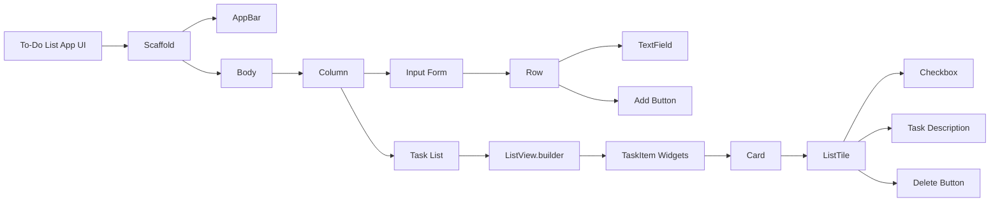

## 6.4.2 Designing the UI for a Flutter To-Do List App

Designing a user interface (UI) for a Flutter To-Do List App involves thoughtful planning and execution to ensure a seamless user experience. This section will guide you through the process of designing the UI, focusing on the layout, widget hierarchy, and styling to create an intuitive and visually appealing application.

### Planning the User Interface

Before diving into code, it's crucial to visualize the app's structure. Sketching the UI layout can help you conceptualize how different components will fit together. Consider dividing the app into distinct sections:

- **Input Area:** Where users can add new tasks.
- **Task List:** Displays the list of tasks.
- **Interaction Controls:** Buttons and other controls for task management.

By planning these sections, you can ensure a logical flow and intuitive navigation within the app.

### Widget Hierarchy for To-Do List App

Understanding the widget hierarchy is essential for building a structured and maintainable UI. Here's a high-level overview of the widget structure for our To-Do List App:

#### High-Level Structure

We'll use a `Scaffold` widget to provide the basic app structure, including an `AppBar` and a `body`. The `body` will consist of a `Column` widget containing the input form and the list of tasks.

```dart
Scaffold(
  appBar: AppBar(title: Text('To-Do List App')),
  body: Column(
    children: <Widget>[
      // Input Form
      // Task List
    ],
  ),
);
```

#### Detailed Breakdown

The `Scaffold` widget serves as the foundation of the app, providing a consistent layout structure. Within the `body`, a `Column` widget organizes the input form and task list vertically.

### Input Form Design

The input form allows users to enter new tasks. It consists of a `TextField` for task descriptions and an `ElevatedButton` to add tasks.

#### TextField for Task Description

The `TextField` widget enables users to input text. We'll use a `TextEditingController` to manage the input data.

**Code Example:**

```dart
Padding(
  padding: const EdgeInsets.all(16.0),
  child: Row(
    children: <Widget>[
      Expanded(
        child: TextField(
          controller: _taskController,
          decoration: InputDecoration(
            labelText: 'New Task',
            border: OutlineInputBorder(),
          ),
        ),
      ),
      SizedBox(width: 10),
      ElevatedButton(
        onPressed: _addTask,
        child: Text('Add'),
      ),
    ],
  ),
);
```

#### Styling Input Form

Styling is crucial for a polished UI. Use `Padding` for spacing around the form and `SizedBox` for spacing between the `TextField` and the button. Consistent colors and fonts enhance visual appeal.

### Task List Design

The task list displays all tasks using a `ListView.builder`, which dynamically builds the list based on the number of tasks.

#### ListView for Displaying Tasks

`ListView.builder` is ideal for displaying a dynamic list of items. It efficiently creates widgets on demand, improving performance for large lists.

**Code Example:**

```dart
Expanded(
  child: ListView.builder(
    itemCount: _tasks.length,
    itemBuilder: (context, index) {
      return TaskItem(
        task: _tasks[index],
        onDelete: () => _deleteTask(index),
        onUpdate: (newTask) => _updateTask(index, newTask),
      );
    },
  ),
);
```

#### Styling Task Items

Each task is displayed using a `Card` widget, which provides a shadow effect for depth. The `ListTile` widget within the `Card` displays task details and interaction controls.

**Code Example:**

```dart
class TaskItem extends StatelessWidget {
  final Task task;
  final VoidCallback onDelete;
  final Function(String) onUpdate;

  TaskItem({required this.task, required this.onDelete, required this.onUpdate});

  @override
  Widget build(BuildContext context) {
    return Card(
      margin: EdgeInsets.symmetric(horizontal: 16.0, vertical: 8.0),
      child: ListTile(
        leading: Checkbox(
          value: task.isCompleted,
          onChanged: (bool? value) {
            onUpdate(task.description);
          },
        ),
        title: Text(
          task.description,
          style: TextStyle(
            decoration: task.isCompleted ? TextDecoration.lineThrough : null,
          ),
        ),
        trailing: IconButton(
          icon: Icon(Icons.delete, color: Colors.red),
          onPressed: onDelete,
        ),
      ),
    );
  }
}
```

### Visualizing the Widget Hierarchy

To better understand the layout, let's visualize the widget hierarchy using a Mermaid.js diagram:



### Encouraging Customization

While the provided design serves as a solid foundation, encourage readers to customize the UI to enhance the app's look and feel. Experiment with different colors, fonts, and layouts to create a unique user experience.

### Conclusion

Designing the UI for a Flutter To-Do List App involves careful planning and execution. By understanding the widget hierarchy and utilizing Flutter's powerful layout widgets, you can create an intuitive and visually appealing application. Use the provided code examples and styling tips as a starting point, and don't hesitate to experiment and customize the UI to suit your preferences.

### Additional Resources

For further exploration, consider the following resources:

- [Flutter Documentation](https://flutter.dev/docs): Official documentation for Flutter.
- [Dart Language Tour](https://dart.dev/guides/language/language-tour): Comprehensive guide to the Dart programming language.
- [Flutter Layout Cheat Sheet](https://medium.com/flutter-community/flutter-layout-cheat-sheet-5363348d037e): A handy reference for Flutter layout widgets.

By applying these concepts and techniques, you'll be well-equipped to design effective UIs for your Flutter applications.

## Quiz Time!



### What is the primary purpose of sketching the UI layout before coding?

- [x] To visualize the app's structure and plan the layout.
- [ ] To write the code more quickly.
- [ ] To avoid using any widgets.
- [ ] To ensure the app runs faster.

> **Explanation:** Sketching the UI layout helps visualize the app's structure, allowing for better planning and organization of the layout before coding begins.

### Which widget provides the basic structure for a Flutter app, including an AppBar and body?

- [x] Scaffold
- [ ] Container
- [ ] Column
- [ ] Row

> **Explanation:** The `Scaffold` widget provides the basic structure for a Flutter app, including an `AppBar` and a `body`.

### What is the role of the `Column` widget in the To-Do List App?

- [x] To organize the input form and task list vertically.
- [ ] To display a horizontal list of tasks.
- [ ] To create a grid layout.
- [ ] To manage animations.

> **Explanation:** The `Column` widget organizes the input form and task list vertically within the app's body.

### How does the `TextField` widget contribute to the input form design?

- [x] It allows users to enter the description of a task.
- [ ] It displays a list of tasks.
- [ ] It adds a button to the form.
- [ ] It manages the app's state.

> **Explanation:** The `TextField` widget allows users to enter the description of a task in the input form.

### What is the purpose of using `ListView.builder` in the task list design?

- [x] To dynamically build the list of tasks based on the number of tasks.
- [ ] To create a static list of tasks.
- [ ] To manage the app's state.
- [ ] To display a grid of tasks.

> **Explanation:** `ListView.builder` dynamically builds the list of tasks based on the number of tasks, improving performance for large lists.

### Which widget is used to display individual tasks with shadow effects?

- [x] Card
- [ ] Container
- [ ] Row
- [ ] Scaffold

> **Explanation:** The `Card` widget is used to display individual tasks with shadow effects, providing depth to the UI.

### What styling element is used to add spacing between the `TextField` and the button in the input form?

- [x] SizedBox
- [ ] Padding
- [ ] Margin
- [ ] Border

> **Explanation:** `SizedBox` is used to add spacing between the `TextField` and the button in the input form.

### How can you customize the UI to enhance the app's look and feel?

- [x] By experimenting with different colors, fonts, and layouts.
- [ ] By removing all widgets.
- [ ] By using only default settings.
- [ ] By avoiding any customization.

> **Explanation:** Customizing the UI by experimenting with different colors, fonts, and layouts can enhance the app's look and feel.

### What is the purpose of the `Checkbox` widget in the task item design?

- [x] To allow users to mark tasks as completed.
- [ ] To delete tasks.
- [ ] To add new tasks.
- [ ] To navigate between screens.

> **Explanation:** The `Checkbox` widget allows users to mark tasks as completed in the task item design.

### True or False: The `Scaffold` widget is used to manage animations in a Flutter app.

- [ ] True
- [x] False

> **Explanation:** False. The `Scaffold` widget provides the basic structure for a Flutter app, including an `AppBar` and a `body`, but it is not used to manage animations.


