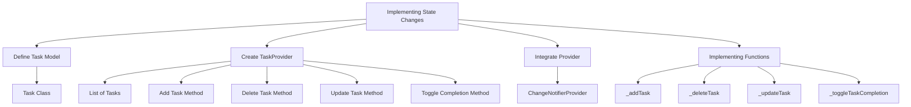

## 6.4.3 Implementing State Changes

In this section, we will explore how to implement state changes in a Flutter To-Do List app. This involves updating the task list based on user interactions, such as adding, deleting, or updating tasks. By the end of this guide, you will have a solid understanding of how to manage state changes using the Provider package, ensuring that your app's UI reflects the current state of the task list.

### Introduction to State Changes

State changes are fundamental to creating interactive applications. In the context of our To-Do List app, state changes occur when users interact with the app to modify the list of tasks. This could involve adding a new task, deleting an existing one, or updating the details of a task. Each of these actions requires the app to update its internal state and refresh the UI to reflect these changes.

### Setting Up the Task Model

To manage tasks effectively, we need a simple data structure to represent each task. We'll define a `Task` class that includes properties for the task description and its completion status.

```dart
class Task {
  String description;
  bool isCompleted;

  Task({required this.description, this.isCompleted = false});
}
```

- **Description**: A `String` that holds the task's description.
- **isCompleted**: A `bool` that indicates whether the task is completed. By default, it's set to `false`.

### Creating the Task Provider

Next, we'll create a `TaskProvider` class that extends `ChangeNotifier`. This class will manage the list of tasks and notify listeners whenever the state changes.

```dart
import 'package:flutter/material.dart';

class TaskProvider extends ChangeNotifier {
  List<Task> _tasks = [];

  List<Task> get tasks => _tasks;

  void addTask(String description) {
    _tasks.add(Task(description: description));
    notifyListeners();
  }

  void deleteTask(int index) {
    _tasks.removeAt(index);
    notifyListeners();
  }

  void updateTask(int index, String newDescription) {
    _tasks[index].description = newDescription;
    notifyListeners();
  }

  void toggleTaskCompletion(int index) {
    _tasks[index].isCompleted = !_tasks[index].isCompleted;
    notifyListeners();
  }
}
```

- **_tasks**: A private list that holds all the tasks.
- **addTask**: Adds a new task to the list and calls `notifyListeners()` to update the UI.
- **deleteTask**: Removes a task at a specified index and updates the UI.
- **updateTask**: Updates the description of a task at a given index.
- **toggleTaskCompletion**: Toggles the completion status of a task.

### Integrating Provider into the App

To make the `TaskProvider` available throughout the app, we need to wrap the root widget with `ChangeNotifierProvider`.

```dart
import 'package:flutter/material.dart';
import 'package:provider/provider.dart';

void main() {
  runApp(
    ChangeNotifierProvider(
      create: (context) => TaskProvider(),
      child: MyApp(),
    ),
  );
}
```

- **ChangeNotifierProvider**: Provides an instance of `TaskProvider` to the widget tree, allowing any widget to access the task list and listen for changes.

### Implementing Add Task Functionality

To add a new task, we'll define the `_addTask` method. This method will be triggered by a button press or a form submission.

```dart
void _addTask() {
  if (_taskController.text.isNotEmpty) {
    Provider.of<TaskProvider>(context, listen: false).addTask(_taskController.text);
    _taskController.clear();
  }
}
```

- **_taskController**: A `TextEditingController` used to retrieve the text input from the user.
- **addTask**: Adds the task to the provider and clears the input field.

### Implementing Delete Task Functionality

To remove a task, we'll define the `_deleteTask` method. This method will be linked to a delete button or swipe action.

```dart
void _deleteTask(int index) {
  Provider.of<TaskProvider>(context, listen: false).deleteTask(index);
}
```

- **deleteTask**: Removes the task at the specified index from the provider.

### Implementing Update Task Functionality

To modify a task's description, we'll define the `_updateTask` method. This could be triggered by an edit button or a form submission.

```dart
void _updateTask(int index, String newDescription) {
  Provider.of<TaskProvider>(context, listen: false).updateTask(index, newDescription);
}
```

- **updateTask**: Updates the task's description in the provider.

### Implementing Toggle Completion

To mark tasks as completed or not, we'll define the `_toggleTaskCompletion` method. This could be linked to a checkbox or toggle button.

```dart
void _toggleTaskCompletion(int index) {
  Provider.of<TaskProvider>(context, listen: false).toggleTaskCompletion(index);
}
```

- **toggleTaskCompletion**: Toggles the completion status of the task at the specified index.

### Visualizing State Changes with Mermaid.js

To better understand the flow of state changes, let's visualize the process using a Mermaid.js diagram.



This diagram illustrates the relationship between different components involved in implementing state changes, from defining the task model to integrating the provider and implementing various task-related functions.

### Encouraging Experimentation

Now that you have a working understanding of how to implement state changes in a Flutter app, it's time to experiment. Try adding additional features, such as:

- **Task Prioritization**: Add a priority level to each task and sort the list accordingly.
- **Due Dates**: Allow users to set due dates for tasks and highlight overdue tasks.
- **Search and Filter**: Implement search and filter functionality to help users find specific tasks quickly.

### Best Practices and Common Pitfalls

- **Keep State Management Simple**: Avoid overcomplicating state management logic. Use simple and clear methods to handle state changes.
- **Avoid Direct State Modification**: Always use provider methods to modify the state. Directly changing the state without notifying listeners can lead to inconsistent UI updates.
- **Optimize Performance**: Use `Provider.of(context, listen: false)` when you don't need to rebuild the widget on state changes, improving performance.

### Further Exploration

To deepen your understanding of state management in Flutter, consider exploring the following resources:

- **Official Flutter Documentation**: [State Management](https://flutter.dev/docs/development/data-and-backend/state-mgmt)
- **Provider Package Documentation**: [Provider](https://pub.dev/packages/provider)
- **Books**: "Flutter in Action" by Eric Windmill provides a comprehensive guide to Flutter development, including state management.

By following this guide, you should now have a solid foundation for implementing state changes in a Flutter app using the Provider package. This knowledge will be invaluable as you continue to build more complex and interactive applications.

## Quiz Time!



### What is the primary purpose of implementing state changes in a Flutter app?

- [x] To update the UI based on user interactions
- [ ] To improve app performance
- [ ] To enhance app security
- [ ] To reduce code complexity

> **Explanation:** Implementing state changes allows the app to update its UI in response to user interactions, ensuring that the displayed information is current and accurate.

### Which class is used to represent individual tasks in the To-Do List app?

- [x] Task
- [ ] TaskProvider
- [ ] ChangeNotifier
- [ ] TaskManager

> **Explanation:** The `Task` class is used to represent individual tasks, containing properties such as description and completion status.

### What method in the TaskProvider class is used to notify listeners of state changes?

- [x] notifyListeners()
- [ ] updateListeners()
- [ ] refreshUI()
- [ ] stateChanged()

> **Explanation:** The `notifyListeners()` method is used to inform all listeners that the state has changed, prompting a UI update.

### How do you integrate the TaskProvider into the app?

- [x] By wrapping the root widget with ChangeNotifierProvider
- [ ] By creating a new instance of TaskProvider in each widget
- [ ] By using a global variable
- [ ] By extending the main widget with TaskProvider

> **Explanation:** The `ChangeNotifierProvider` is used to wrap the root widget, making the `TaskProvider` available throughout the widget tree.

### What is the purpose of the _addTask method?

- [x] To add a new task to the task list
- [ ] To delete a task from the task list
- [ ] To update a task's description
- [ ] To toggle a task's completion status

> **Explanation:** The `_addTask` method is responsible for adding a new task to the task list and notifying the provider of the change.

### Which method is used to remove a task from the task list?

- [x] deleteTask
- [ ] removeTask
- [ ] clearTask
- [ ] discardTask

> **Explanation:** The `deleteTask` method is used to remove a task from the task list at a specified index.

### What does the _toggleTaskCompletion method do?

- [x] It toggles the completion status of a task
- [ ] It adds a new task
- [ ] It deletes a task
- [ ] It updates a task's description

> **Explanation:** The `_toggleTaskCompletion` method changes the completion status of a task, marking it as completed or not.

### What is the role of the ChangeNotifierProvider in the app?

- [x] To provide the TaskProvider to the widget tree
- [ ] To manage network requests
- [ ] To handle user authentication
- [ ] To store app settings

> **Explanation:** The `ChangeNotifierProvider` provides the `TaskProvider` to the widget tree, allowing widgets to access and listen for state changes.

### What is a common pitfall when managing state in Flutter apps?

- [x] Directly modifying state without notifying listeners
- [ ] Using too many widgets
- [ ] Overusing animations
- [ ] Not using enough colors

> **Explanation:** Directly modifying state without notifying listeners can lead to inconsistent UI updates, as the app won't know when to refresh the UI.

### True or False: The Provider package is the only way to manage state in Flutter apps.

- [ ] True
- [x] False

> **Explanation:** False. While the Provider package is a popular choice for state management, there are other options available, such as BLoC, Redux, and Riverpod.


